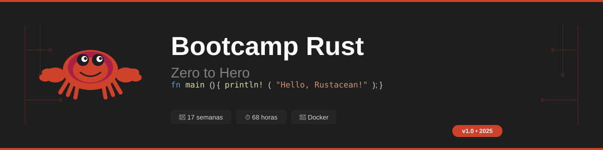

# 🦀 Rust Bootcamp: Zero to Hero




> 🎓 Intensive **25-week (100 hours)** bootcamp to master Rust from zero to advanced level.  
> 🐳 Containerized environment with Docker for consistent development.

<p align="center">
  <a href="README.md">
    
  </a>
</p>

---

## 📋 Description

This bootcamp is designed to take students from Rust fundamentals to advanced concepts like concurrency, async/await, and smart pointers. We use Docker to ensure an identical development environment for all participants.

### Why Rust?

- 🚀 **Performance** - Speed comparable to C/C++
- 🔒 **Safety** - Memory error prevention at compile time
- 🧵 **Concurrency** - Fearless concurrency without data races
- 🛠️ **Tooling** - Cargo, rustfmt, clippy, excellent documentation
- 💼 **Demand** - Most loved language for 8 consecutive years (Stack Overflow)

---

## 🗓️ Bootcamp Structure

| Week   | Main Topic                                   | Level | Duration |
| ------ | -------------------------------------------- | ----- | -------- |
| **1**  | [Setup & Hello World](bootcamp/week-01-introduccion_y_setup)      | 🟢    | 4 hours  |
| **2**  | [Variables & Types](bootcamp/week-02-variables_y_tipos_de_datos)        | 🟢    | 4 hours  |
| **3**  | [Structs & Methods](bootcamp/week-03-structs_y_metodos)    | 🟡    | 4 hours  |
| **4**  | [Ownership & Borrowing](bootcamp/week-04-ownership_y_borrowing)        | 🟢    | 4 hours  |
| **5**  | [Enums & Pattern Matching](bootcamp/week-05-enums_y_pattern_matching) | 🟡    | 4 hours  |
| **6**  | [Error Handling](bootcamp/week-06-manejo_de_errores)           | 🟡    | 4 hours  |
| **7**  | [Modules & Crates](bootcamp/week-07-modulos_y_crates)         | 🟢    | 4 hours  |
| **8**  | [Collections](bootcamp/week-08-colecciones)              | 🟡    | 4 hours  |
| **9**  | [Basic Traits](bootcamp/week-09-traits_basicos)             | 🟡    | 4 hours  |
| **10** | [Generics](bootcamp/week-10-generics)                 | 🟡    | 4 hours  |
| **11** | [Lifetimes](bootcamp/week-11-lifetimes)                | 🔴    | 4 hours  |
| **12** | [Closures & Iterators](bootcamp/week-12-closures_e_iteradores)     | 🟡    | 4 hours  |
| **13** | [Smart Pointers](bootcamp/week-13-smart_pointers)           | 🔴    | 4 hours  |
| **14** | [Concurrency](bootcamp/week-14-concurrencia)              | 🔴    | 4 hours  |
| **15** | [Async/Await](bootcamp/week-15-async_await)              | 🔴    | 4 hours  |
| **16** | [Testing & Documentation](bootcamp/week-16-testing_y_documentacion)  | 🟡    | 4 hours  |
| **17** | [REST API with Axum](bootcamp/week-17-api_rest_con_axum)       | 🔴    | 4 hours  |
| **18** | [Macros: declarative & proc](bootcamp/week-18-macros)              | 🔴    | 4 hours  |
| **19** | [`unsafe` Rust & raw pointers](bootcamp/week-19-unsafe_rust)           | 🔴    | 4 hours  |
| **20** | [FFI & Language Bindings](bootcamp/week-20-ffi_y_bindings)                 | 🔴    | 4 hours  |
| **21** | [API Design + `crates.io`](bootcamp/week-21-api_design_y_crates)                | 🔴    | 4 hours  |
| **22** | [WebAssembly](bootcamp/week-22-webassembly)                             | 🔴    | 4 hours  |
| **23** | [Benchmarking & Profiling](bootcamp/week-23-benchmarking_y_profiling)               | 🔴    | 4 hours  |
| **24** | [`no_std` & Intro to Embedded](bootcamp/week-24-no_std_y_embedded)            | 🔴    | 4 hours  |
| **25** | [Capstone — Rewrite It In Rust (RIIR)](bootcamp/week-25-capstone_riir)    | 🔴    | 4 hours  |

**Total**: 100 hours of intensive training

**Legend**: 🟢 Beginner | 🟡 Intermediate | 🔴 Advanced

---

## 🚀 Quick Start

### Prerequisites

- [Docker](https://docs.docker.com/get-docker/) installed
- [VS Code](https://code.visualstudio.com/) with [Dev Containers](https://marketplace.visualstudio.com/items?itemName=ms-vscode-remote.remote-containers) extension
- Git

### Option 1: Dev Container (Recommended)

```bash
# Clone repository
git clone https://github.com/ergrato-dev/bc-rust.git
cd bc-rust

# Open in VS Code
code .

# VS Code will detect the Dev Container automatically
# Click "Reopen in Container"
```

### Option 2: Docker Compose

```bash
# Clone repository
git clone https://github.com/ergrato-dev/bc-rust.git
cd bc-rust

# Build image
docker compose build

# Start interactive container
docker compose run --rm rust-dev

# Inside the container
cargo --version
rustc --version
```

### Option 3: Docker Direct

```bash
# Build image
docker build -t bc-rust .

# Run container
docker run -it --rm -v $(pwd):/workspace bc-rust

# Run a specific exercise
docker run --rm -v $(pwd):/workspace bc-rust cargo run -p practice-01-hello-axum
```

---

## 📁 Repository Structure

```
bc-rust/
├── .devcontainer/           # Dev Container configuration
├── .github/
│   └── copilot-instructions.md
├── assets/                  # Visual resources
├── scripts/                 # Utility scripts
├── bootcamp/
│   ├── week-01-introduccion_y_setup/
│   ├── week-02-variables_y_tipos_de_datos/
│   ├── ...                  # Weeks 03-17: Fundamentals → REST API
│   ├── week-18-macros/
│   ├── week-19-unsafe_rust/
│   ├── week-20-ffi_y_bindings/
│   ├── week-21-api_design_y_crates/
│   ├── week-22-webassembly/
│   ├── week-23-benchmarking_y_profiling/
│   ├── week-24-no_std_y_embedded/
│   └── week-25-capstone_riir/
├── Cargo.toml               # Workspace configuration
├── docker-compose.yml
├── Dockerfile
└── README.md
```

Each week contains:

```
week-XX-tema_principal/
├── README.md                # Main guide
├── RUBRICA_EVALUACION.md    # Evaluation criteria
├── 0-assets/                # SVG diagrams (dark mode)
├── 1-theory/                # Theory material (~180-250 lines)
├── 2-practice/              # Exercises
│   ├── practice-01-xxx/
│   │   ├── Cargo.toml
│   │   ├── src/main.rs
│   │   └── README.md
│   └── project-xxx/         # Integration project
├── 4-resources/             # External links and references
└── 5-glossary/              # Key terms glossary
```

---

## 📈 Project Statistics

<table>
<tr>
<td align="center"><b>✅ Compiles</b></td>
<td align="center"><b>📝 Tests</b></td>
<td align="center"><b>📁 Exercises</b></td>
<td align="center"><b>🎯 Projects</b></td>
</tr>
<tr>
<td align="center"><code>cargo check</code><br/>✔️ Passes</td>
<td align="center"><b>866+</b><br/>unit tests</td>
<td align="center"><b>68</b><br/>practices</td>
<td align="center"><b>17</b><br/>weekly projects</td>
</tr>
</table>

```bash
# Verify compilation
docker compose run --rm rust-dev cargo check --workspace

# Run tests
docker compose run --rm rust-dev cargo test --workspace

# Linting
docker compose run --rm rust-dev cargo clippy --workspace
```

---

## 🛠️ Useful Commands

### Docker

```bash
# Interactive development
docker compose run --rm rust-dev

# Run code
docker compose run --rm rust-run

# Run tests
docker compose run --rm rust-test

# Watch mode (hot reload)
docker compose run --rm rust-watch

# Linting (clippy + fmt)
docker compose run --rm rust-lint
```

### Cargo (inside container)

```bash
cargo build          # Compile
cargo run            # Execute
cargo test           # Tests
cargo clippy         # Linter
cargo fmt            # Format
cargo doc --open     # Documentation
```

---

## 📊 Learning Methodology

Each 4-hour session follows this structure:

| Time        | Activity            | Type          |
| ----------- | ------------------- | ------------- |
| 0:00 - 0:45 | Theory & concepts   | 📖 Lecture    |
| 0:45 - 1:15 | Live demo           | 💻 Code       |
| 1:15 - 1:30 | **Break**           | ☕            |
| 1:30 - 2:30 | Guided exercises    | 🛠️ Practice   |
| 2:30 - 3:30 | Individual project  | 🎯 Application|
| 3:30 - 4:00 | Review & wrap-up    | 📝 Evaluation |

---

## 🎓 Evaluation

| Type           | Weight | Description          |
| -------------- | ------ | -------------------- |
| **Knowledge**  | 30%    | Theoretical quizzes  |
| **Performance**| 40%    | In-class exercises   |
| **Product**    | 30%    | Functional code      |

### Code Criteria

- ✅ Compiles without warnings (`cargo clippy`)
- ✅ Passes all tests (`cargo test`)
- ✅ Formatted code (`cargo fmt --check`)
- ✅ Proper error handling (no `unwrap()` in production)

---

## 📚 Additional Resources

### Official Documentation

- [The Rust Book](https://doc.rust-lang.org/book/) - Official book
- [Rust by Example](https://doc.rust-lang.org/rust-by-example/) - Practical examples
- [Rust Reference](https://doc.rust-lang.org/reference/) - Language reference
- [Standard Library](https://doc.rust-lang.org/std/) - std documentation

### Practice

- [Rustlings](https://github.com/rust-lang/rustlings) - Interactive exercises
- [Exercism Rust](https://exercism.org/tracks/rust) - Mentored exercises
- [Advent of Code](https://adventofcode.com/) - Programming challenges

### Community

- [Rust Users Forum](https://users.rust-lang.org/)
- [Rust Discord](https://discord.gg/rust-lang)
- [r/rust](https://reddit.com/r/rust)

---

## 🤝 Contributing

Contributions are welcome! This is an **open source** project and we value your participation.

### Ways to Contribute

- 📚 **Content**: Improve explanations, add examples
- 💻 **Code**: New exercises, improvements, tests
- 🐛 **Bugs**: Report content or code errors
- 🎨 **Design**: Create educational SVG diagrams
- 🌐 **Translations**: Translate content to other languages

### Getting Started

1. Read our [Contributing Guide](CONTRIBUTING.md)
2. Review the [Code of Conduct](CODE_OF_CONDUCT.md)
3. Look for issues labeled `good first issue`
4. Make your first PR!

---

## 🔒 Security

To report security vulnerabilities, see our [Security Policy](SECURITY.md).

---

## 📄 License

This project is under the **MIT** license. See [LICENSE](LICENSE) for details.

This means you can:
- ✅ Use the material freely
- ✅ Modify and adapt
- ✅ Distribute copies
- ✅ Commercial use

---

## 🙏 Acknowledgments

- 🦀 [Rust Community](https://www.rust-lang.org/community) for the amazing language
- 📚 [The Rust Book](https://doc.rust-lang.org/book/) as main reference
- 🐳 [Docker](https://www.docker.com/) for containerized environment
- 💜 All project contributors

---

## ⭐ Support the Project

If this bootcamp is useful to you:

- ⭐ Star the repository
- 🔀 Share it with others
- 🤝 Contribute improvements
- 📢 Mention it on social media

---

**Last updated**: May 2026  
**Version**: 2.0  
**Author**: [ergrato-dev](https://github.com/ergrato-dev)  
**License**: MIT
