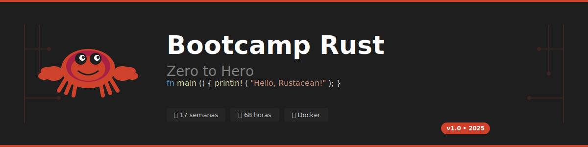

# 🦀 Bootcamp Rust: Zero to Hero




> 🎓 Bootcamp intensivo de **16 semanas (64 horas)** para dominar Rust desde cero hasta un nivel avanzado.  
> 🐳 Entorno containerizado con Docker para desarrollo consistente.

---

## 📋 Descripción

Este bootcamp está diseñado para llevar a los estudiantes desde los fundamentos de Rust hasta conceptos avanzados como concurrencia, async/await y smart pointers. Utilizamos Docker para garantizar un entorno de desarrollo idéntico para todos los participantes.

### ¿Por qué Rust?

- 🚀 **Rendimiento** - Velocidad comparable a C/C++
- 🔒 **Seguridad** - Prevención de errores de memoria en tiempo de compilación
- 🧵 **Concurrencia** - Fearless concurrency sin data races
- 🛠️ **Herramientas** - Cargo, rustfmt, clippy, excelente documentación
- 💼 **Demanda** - Lenguaje más amado por 8 años consecutivos (Stack Overflow)

---

## 🗓️ Estructura del Bootcamp

| Semana | Tema Principal                                 | Nivel | Duración |
| ------ | ---------------------------------------------- | ----- | -------- |
| **0**  | [Setup y Hello World](bootcamp/semana-00)      | 🟢    | 4 horas  |
| **1**  | [Variables y Tipos](bootcamp/semana-01)        | 🟢    | 4 horas  |
| **2**  | [Ownership y Borrowing](bootcamp/semana-02)    | 🟡    | 4 horas  |
| **3**  | [Structs y Métodos](bootcamp/semana-03)        | 🟢    | 4 horas  |
| **4**  | [Enums y Pattern Matching](bootcamp/semana-04) | 🟡    | 4 horas  |
| **5**  | [Error Handling](bootcamp/semana-05)           | 🟡    | 4 horas  |
| **6**  | [Módulos y Crates](bootcamp/semana-06)         | 🟢    | 4 horas  |
| **7**  | [Colecciones](bootcamp/semana-07)              | 🟡    | 4 horas  |
| **8**  | [Traits Básicos](bootcamp/semana-08)           | 🟡    | 4 horas  |
| **9**  | [Generics](bootcamp/semana-09)                 | 🟡    | 4 horas  |
| **10** | [Lifetimes](bootcamp/semana-10)                | 🔴    | 4 horas  |
| **11** | [Closures e Iteradores](bootcamp/semana-11)    | 🟡    | 4 horas  |
| **12** | [Smart Pointers](bootcamp/semana-12)           | 🔴    | 4 horas  |
| **13** | [Concurrencia](bootcamp/semana-13)             | 🔴    | 4 horas  |
| **14** | [Async/Await](bootcamp/semana-14)              | 🔴    | 4 horas  |
| **15** | [Testing y Documentación](bootcamp/semana-15)  | 🟢    | 4 horas  |

**Total**: 64 horas de formación intensiva

**Leyenda**: 🟢 Básico | 🟡 Intermedio | 🔴 Avanzado

---

## 🚀 Inicio Rápido

### Prerrequisitos

- [Docker](https://docs.docker.com/get-docker/) instalado
- [VS Code](https://code.visualstudio.com/) con extensión [Dev Containers](https://marketplace.visualstudio.com/items?itemName=ms-vscode-remote.remote-containers)
- Git

### Opción 1: Dev Container (Recomendado)

```bash
# Clonar repositorio
git clone https://github.com/ergrato-dev/bc-rust.git
cd bc-rust

# Abrir en VS Code
code .

# VS Code detectará el Dev Container automáticamente
# Click en "Reopen in Container"
```

### Opción 2: Docker Compose

```bash
# Clonar repositorio
git clone https://github.com/ergrato-dev/bc-rust.git
cd bc-rust

# Construir imagen
docker compose build

# Iniciar contenedor interactivo
docker compose run --rm rust-dev

# Dentro del contenedor
cargo --version
rustc --version
```

### Opción 3: Docker directo

```bash
# Construir imagen
docker build -t bc-rust .

# Ejecutar contenedor
docker run -it --rm -v $(pwd):/workspace bc-rust

# Ejecutar un ejercicio específico
docker run --rm -v $(pwd):/workspace bc-rust cargo run -p ejercicio-01
```

---

## 📁 Estructura del Repositorio

```
bc-rust/
├── .devcontainer/           # Configuración Dev Container
├── .github/
│   └── copilot-instructions.md
├── _assets/                 # Recursos visuales
├── _docs/                   # Documentación adicional
├── _scripts/                # Scripts de utilidad
├── bootcamp/
│   ├── semana-00/           # Setup y Hello World
│   ├── semana-01/           # Variables y Tipos
│   ├── ...
│   └── semana-15/           # Testing y Docs
├── Cargo.toml               # Workspace configuration
├── docker-compose.yml
├── Dockerfile
└── README.md
```

Cada semana contiene:

```
semana-XX/
├── README.md                # Guía principal
├── RUBRICA_EVALUACION.md    # Criterios de evaluación
├── 0-assets/                # Diagramas SVG
├── 1-teoria/                # Material teórico
├── 2-practica/              # Ejercicios
│   └── ejercicio-01-nombre/
│       ├── Cargo.toml
│       ├── src/main.rs
│       └── README.md
└── 3-recursos/              # Glosario, referencias
```

---

## 🛠️ Comandos Útiles

### Docker

```bash
# Desarrollo interactivo
docker compose run --rm rust-dev

# Ejecutar código
docker compose run --rm rust-run

# Ejecutar tests
docker compose run --rm rust-test

# Watch mode (hot reload)
docker compose run --rm rust-watch

# Linting (clippy + fmt)
docker compose run --rm rust-lint
```

### Cargo (dentro del contenedor)

```bash
cargo build          # Compilar
cargo run            # Ejecutar
cargo test           # Tests
cargo clippy         # Linter
cargo fmt            # Formatear
cargo doc --open     # Documentación
```

---

## 📊 Metodología de Aprendizaje

Cada sesión de 4 horas sigue esta estructura:

| Tiempo      | Actividad           | Tipo          |
| ----------- | ------------------- | ------------- |
| 0:00 - 0:45 | Teoría y conceptos  | 📖 Exposición |
| 0:45 - 1:15 | Demo en vivo        | 💻 Código     |
| 1:15 - 1:30 | **Descanso**        | ☕            |
| 1:30 - 2:30 | Ejercicios guiados  | 🛠️ Práctica   |
| 2:30 - 3:30 | Proyecto individual | 🎯 Aplicación |
| 3:30 - 4:00 | Revisión y cierre   | 📝 Evaluación |

---

## 🎓 Evaluación

| Tipo             | Peso | Descripción            |
| ---------------- | ---- | ---------------------- |
| **Conocimiento** | 30%  | Cuestionarios teóricos |
| **Desempeño**    | 40%  | Ejercicios en clase    |
| **Producto**     | 30%  | Código funcional       |

### Criterios de Código

- ✅ Compila sin warnings (`cargo clippy`)
- ✅ Pasa todos los tests (`cargo test`)
- ✅ Código formateado (`cargo fmt --check`)
- ✅ Manejo correcto de errores (no `unwrap()` en producción)

---

## 📚 Recursos Adicionales

### Documentación Oficial

- [The Rust Book](https://doc.rust-lang.org/book/) - Libro oficial
- [Rust by Example](https://doc.rust-lang.org/rust-by-example/) - Ejemplos prácticos
- [Rust Reference](https://doc.rust-lang.org/reference/) - Referencia del lenguaje
- [Standard Library](https://doc.rust-lang.org/std/) - Documentación std

### Práctica

- [Rustlings](https://github.com/rust-lang/rustlings) - Ejercicios interactivos
- [Exercism Rust](https://exercism.org/tracks/rust) - Mentored exercises
- [Advent of Code](https://adventofcode.com/) - Desafíos de programación

### Comunidad

- [Rust Users Forum](https://users.rust-lang.org/)
- [Rust Discord](https://discord.gg/rust-lang)
- [r/rust](https://reddit.com/r/rust)

---

## 🤝 Contribuir

¡Las contribuciones son bienvenidas! Este es un proyecto **open source** y valoramos tu participación.

### Formas de Contribuir

- 📚 **Contenido**: Mejorar explicaciones, agregar ejemplos
- 💻 **Código**: Nuevos ejercicios, mejoras, tests
- 🐛 **Bugs**: Reportar errores en contenido o código
- 🎨 **Diseño**: Crear diagramas SVG educativos
- 🌐 **Traducciones**: Traducir contenido a otros idiomas

### Primeros Pasos

1. Lee nuestra [Guía de Contribución](CONTRIBUTING.md)
2. Revisa el [Código de Conducta](CODE_OF_CONDUCT.md)
3. Busca issues con etiqueta `good first issue`
4. ¡Haz tu primer PR!

---

## 🔒 Seguridad

Para reportar vulnerabilidades de seguridad, consulta nuestra [Política de Seguridad](SECURITY.md).

---

## 📄 Licencia

Este proyecto está bajo la licencia **MIT**. Ver [LICENSE](LICENSE) para más detalles.

Esto significa que puedes:
- ✅ Usar el material libremente
- ✅ Modificar y adaptar
- ✅ Distribuir copias
- ✅ Uso comercial

---

## 🙏 Agradecimientos

- 🦀 [Rust Community](https://www.rust-lang.org/community) por el increíble lenguaje
- 📚 [The Rust Book](https://doc.rust-lang.org/book/) como referencia principal
- 🐳 [Docker](https://www.docker.com/) por el entorno containerizado
- 💜 Todos los contribuidores del proyecto

---

## ⭐ Apoya el Proyecto

Si este bootcamp te es útil:

- ⭐ Dale una estrella al repositorio
- 🔀 Compártelo con otros
- 🤝 Contribuye con mejoras
- 📢 Menciónalo en redes sociales

---

**Última actualización**: Diciembre 2025  
**Versión**: 1.0  
**Autor**: [ergrato-dev](https://github.com/ergrato-dev)  
**Licencia**: MIT
