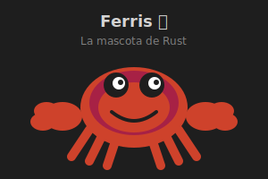

# 🦀 ¿Qué es Rust?

## Introducción

**Rust** es un lenguaje de programación de sistemas desarrollado por Mozilla, diseñado para ser seguro, concurrente y práctico. Su primera versión estable (1.0) fue lanzada en **mayo de 2015**.


---

## 🎯 Definición

> **Rust** es un lenguaje de programación compilado, multiparadigma, que combina la velocidad y control de bajo nivel de lenguajes como C/C++ con las garantías de seguridad de memoria de lenguajes de alto nivel.

---

## 📜 Historia

| Año | Evento |
|-----|--------|
| **2006** | Graydon Hoare inicia Rust como proyecto personal |
| **2009** | Mozilla comienza a patrocinar el desarrollo |
| **2010** | Primera mención pública de Rust |
| **2012** | Primera versión alpha |
| **2015** | Rust 1.0 - Primera versión estable |
| **2021** | Fundación Rust creada (independiente de Mozilla) |
| **2024** | Rust incluido en el kernel de Linux |
| **2025** | Rust 1.92+ - Versión actual del bootcamp |

---

## 🏛️ Filosofía de Rust

Rust se basa en tres pilares fundamentales:

### 1. Seguridad (Safety)

```rust
// Rust previene errores comunes en tiempo de compilación
let nombre = String::from("Rust");
// El compilador garantiza que 'nombre' no será usado después de ser movido
```

### 2. Velocidad (Speed)

- Sin garbage collector
- Abstracciones de costo cero
- Control directo sobre la memoria

### 3. Concurrencia (Concurrency)

- "Fearless concurrency"
- El compilador previene data races
- Threads seguros por diseño

---

## 🔧 Características Principales

| Característica | Descripción |
|----------------|-------------|
| **Tipado estático** | Los tipos se verifican en compilación |
| **Inferencia de tipos** | El compilador deduce tipos cuando es posible |
| **Ownership** | Sistema único de gestión de memoria |
| **Pattern matching** | Coincidencia de patrones poderosa |
| **Macros** | Metaprogramación en tiempo de compilación |
| **Traits** | Sistema de abstracción similar a interfaces |
| **Cargo** | Gestor de paquetes integrado |

---

## 🎭 Mascota: Ferris



Ferris es un cangrejo naranja, la mascota no oficial de Rust. Representa:
- 🦀 La comunidad acogedora de Rust
- 🧡 El color característico del lenguaje
- 💪 La robustez del sistema

Los programadores de Rust se llaman **Rustaceans** (un juego de palabras con "crustaceans" - crustáceos).

---

## 🌍 ¿Quién usa Rust?

### Empresas que usan Rust en producción:

| Empresa | Uso |
|---------|-----|
| **Mozilla** | Firefox (motor Servo) |
| **Amazon** | AWS (Firecracker, Lambda) |
| **Google** | Android, Fuchsia OS |
| **Microsoft** | Windows, Azure |
| **Meta** | Infraestructura backend |
| **Discord** | Servicios de alta concurrencia |
| **Cloudflare** | Workers, edge computing |
| **Dropbox** | Componentes de sincronización |

---

## 🆚 Rust vs Otros Lenguajes

| Aspecto | Rust | C/C++ | Go | Python |
|---------|------|-------|-----|--------|
| **Seguridad de memoria** | ✅ Compilador | ❌ Manual | ✅ GC | ✅ GC |
| **Velocidad** | ⚡ Muy alta | ⚡ Muy alta | 🚀 Alta | 🐢 Baja |
| **Garbage Collector** | ❌ No | ❌ No | ✅ Sí | ✅ Sí |
| **Concurrencia segura** | ✅ Sí | ❌ No | ✅ Sí | ⚠️ GIL |
| **Curva de aprendizaje** | 📈 Alta | 📈 Alta | 📉 Baja | 📉 Baja |

---

## 📝 Resumen

- Rust es un lenguaje de **sistemas moderno** y **seguro**
- Creado por Mozilla, ahora gestionado por la Fundación Rust
- Combina **velocidad de C** con **seguridad de memoria**
- Usado por empresas líderes en tecnología
- Comunidad activa y acogedora (**Rustaceans**)

---

## 🔗 Enlaces

- [Sitio oficial de Rust](https://www.rust-lang.org/)
- [The Rust Book](https://doc.rust-lang.org/book/)
- [Rust Playground](https://play.rust-lang.org/)

---

**Siguiente**: [¿Por qué aprender Rust?](02-porque-rust.md)
