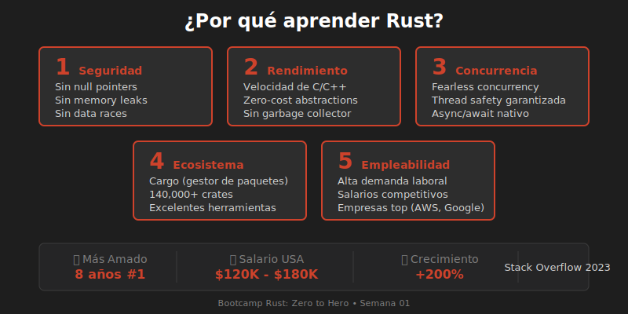

# 💡 ¿Por qué aprender Rust?

## Introducción

En un mundo con cientos de lenguajes de programación, ¿por qué dedicar tiempo a aprender Rust? Esta sección explora las razones convincentes.



---

## 🏆 El Lenguaje Más Amado

Rust ha sido votado como el **lenguaje de programación más amado** en la encuesta de Stack Overflow durante **8 años consecutivos** (2016-2023).

> "El 87% de los desarrolladores que usan Rust quieren seguir usándolo"
> — Stack Overflow Survey 2023

---

## 🎯 Razones para Aprender Rust

### 1. 🔒 Seguridad de Memoria Sin Costo

```rust
// El compilador previene errores comunes
fn ejemplo() {
    let datos = vec![1, 2, 3];
    
    // Esto NO compila - Rust previene el uso después de mover
    // let copia = datos;
    // println!("{:?}", datos); // Error: value borrowed after move
}
```

**Beneficios:**
- No más segmentation faults
- No más null pointer exceptions
- No más buffer overflows
- No más data races

### 2. ⚡ Rendimiento de Bajo Nivel

Rust compite directamente con C/C++ en rendimiento:

| Benchmark | Rust | C | Go | Python |
|-----------|------|---|-----|--------|
| Fibonacci (n=40) | 0.5s | 0.5s | 1.2s | 45s |
| HTTP Server (req/s) | 180k | 185k | 120k | 15k |
| Memory usage | Bajo | Bajo | Medio | Alto |

### 3. 🧵 Concurrencia Sin Miedo

```rust
use std::thread;

fn main() {
    let handles: Vec<_> = (0..10)
        .map(|i| {
            thread::spawn(move || {
                println!("Hilo {} ejecutándose", i);
            })
        })
        .collect();
    
    for handle in handles {
        handle.join().unwrap();
    }
}
```

El compilador **garantiza** que no hay data races.

### 4. 📦 Ecosistema Moderno

- **Cargo**: Gestor de paquetes integrado
- **crates.io**: +140,000 librerías disponibles
- **rustfmt**: Formateo automático
- **clippy**: Linter inteligente
- **rust-analyzer**: Soporte IDE excelente

### 5. 💼 Demanda Laboral Creciente


| Métrica | Valor |
|---------|-------|
| Crecimiento de ofertas (2023-2025) | +200% |
| Salario promedio (USA) | $120,000 - $180,000 |
| Empresas contratando | Amazon, Google, Microsoft, Meta |

---

## 🎓 Casos de Uso de Rust

### Desarrollo de Sistemas

```
┌─────────────────────────────────────────┐
│  • Sistemas operativos (Linux kernel)   │
│  • Drivers y firmware                   │
│  • Máquinas virtuales                   │
│  • Contenedores (Firecracker)           │
└─────────────────────────────────────────┘
```

### Desarrollo Web (Backend)

```
┌─────────────────────────────────────────┐
│  • APIs REST con Actix-web, Axum        │
│  • GraphQL con async-graphql            │
│  • Microservicios de alto rendimiento   │
│  • WebAssembly (WASM)                   │
└─────────────────────────────────────────┘
```

### CLI y Herramientas

```
┌─────────────────────────────────────────┐
│  • ripgrep (búsqueda ultra-rápida)      │
│  • bat (cat mejorado)                   │
│  • exa/eza (ls mejorado)                │
│  • starship (prompt de terminal)        │
└─────────────────────────────────────────┘
```

### Blockchain y Criptografía

```
┌─────────────────────────────────────────┐
│  • Solana (blockchain)                  │
│  • Polkadot/Substrate                   │
│  • Implementaciones criptográficas      │
└─────────────────────────────────────────┘
```

---

## ⚠️ Desafíos de Rust

Ser honestos: Rust tiene una curva de aprendizaje:

| Desafío | Solución |
|---------|----------|
| **Ownership complejo** | Práctica y tiempo |
| **Lifetimes confusos** | Entender el modelo mental |
| **Compilación lenta** | Compilación incremental |
| **Mensajes de error largos** | ¡Son muy útiles! |

> "El compilador de Rust es como un mentor estricto pero justo"

---

## 🚀 ¿Qué Puedes Construir?

Después de este bootcamp podrás crear:

1. **CLIs profesionales** - Herramientas de línea de comandos
2. **APIs REST** - Servicios web de alto rendimiento
3. **Procesadores de datos** - ETL y análisis
4. **Servicios concurrentes** - Aplicaciones multi-hilo
5. **WASM** - Aplicaciones web de alto rendimiento

---

## 📝 Resumen

| Razón | Beneficio |
|-------|-----------|
| Seguridad | Menos bugs en producción |
| Rendimiento | Aplicaciones rápidas |
| Concurrencia | Escalabilidad garantizada |
| Ecosistema | Herramientas modernas |
| Empleabilidad | Alta demanda, buenos salarios |

---

**Anterior**: [¿Qué es Rust?](01-que-es-rust.md)  
**Siguiente**: [Setup del Entorno](03-setup-entorno.md)
