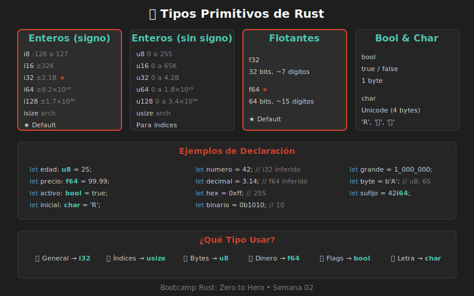

# 📖 Tipos Primitivos

## 🎯 Objetivo de Aprendizaje

Conocer todos los tipos primitivos de Rust: enteros, flotantes, booleanos y caracteres.

---

## 📚 Contenido

### Sistema de Tipos de Rust

Rust es un lenguaje **fuertemente tipado**:
- Cada valor tiene un tipo específico
- Los tipos se verifican en compilación
- No hay conversiones implícitas peligrosas



---

## 🔢 Tipos Enteros

### Enteros con Signo (Positivos y Negativos)

| Tipo | Bits | Rango |
|------|------|-------|
| `i8` | 8 | -128 a 127 |
| `i16` | 16 | -32,768 a 32,767 |
| `i32` | 32 | -2,147,483,648 a 2,147,483,647 |
| `i64` | 64 | -9.2×10¹⁸ a 9.2×10¹⁸ |
| `i128` | 128 | ±1.7×10³⁸ |
| `isize` | arch | Depende de arquitectura (32/64 bits) |

### Enteros sin Signo (Solo Positivos)

| Tipo | Bits | Rango |
|------|------|-------|
| `u8` | 8 | 0 a 255 |
| `u16` | 16 | 0 a 65,535 |
| `u32` | 32 | 0 a 4,294,967,295 |
| `u64` | 64 | 0 a 1.8×10¹⁹ |
| `u128` | 128 | 0 a 3.4×10³⁸ |
| `usize` | arch | Depende de arquitectura |

### Ejemplos de Enteros

```rust
fn main() {
    // Tipo por defecto: i32
    let numero = 42;
    
    // Tipos explícitos
    let byte: u8 = 255;
    let grande: i64 = 1_000_000_000_000;
    let indice: usize = 0;
    
    // Literales con sufijo
    let a = 42i32;
    let b = 100u8;
    let c = 1_000_000i64;
    
    // Diferentes bases
    let decimal = 98_222;      // 98222
    let hex = 0xff;            // 255
    let octal = 0o77;          // 63
    let binario = 0b1111_0000; // 240
    let byte_char = b'A';      // 65 (u8)
    
    println!("decimal: {}", decimal);
    println!("hex: {}", hex);
    println!("binario: {}", binario);
}
```

### ¿Cuál Usar?

| Situación | Tipo Recomendado |
|-----------|-----------------|
| General | `i32` (default) |
| Índices de colecciones | `usize` |
| Bytes/ASCII | `u8` |
| Contadores grandes | `i64` o `u64` |
| Edad, cantidades pequeñas | `u8` o `u16` |

---

## 🔢 Tipos Flotantes

| Tipo | Bits | Precisión |
|------|------|-----------|
| `f32` | 32 | ~6-7 dígitos decimales |
| `f64` | 64 | ~15-16 dígitos decimales |

### Ejemplos de Flotantes

```rust
fn main() {
    // Tipo por defecto: f64
    let pi = 3.14159265359;
    
    // Tipo explícito
    let precio: f32 = 99.99;
    let e: f64 = 2.718281828;
    
    // Con sufijo
    let x = 2.0f32;
    let y = 3.0f64;
    
    // Operaciones
    let suma = 5.5 + 4.5;        // 10.0
    let division = 10.0 / 3.0;   // 3.333...
    
    println!("Pi: {}", pi);
    println!("División: {:.4}", division);  // 4 decimales
}
```

### ⚠️ Precisión de Flotantes

```rust
fn main() {
    let a = 0.1 + 0.2;
    println!("{}", a);  // 0.30000000000000004 😱
    
    // Para comparar flotantes:
    let b = 0.3;
    let diferencia = (a - b).abs();
    let epsilon = 1e-10;
    
    if diferencia < epsilon {
        println!("Son prácticamente iguales");
    }
}
```

> ⚠️ Nunca uses `==` directamente con flotantes.

---

## ✅ Tipo Booleano

```rust
fn main() {
    let verdadero: bool = true;
    let falso: bool = false;
    
    // Inferido
    let activo = true;
    let encontrado = false;
    
    // De comparaciones
    let es_mayor = 5 > 3;      // true
    let es_igual = 5 == 5;     // true
    let es_diferente = 5 != 3; // true
    
    // Operadores lógicos
    let y = true && false;     // false (AND)
    let o = true || false;     // true (OR)
    let no = !true;            // false (NOT)
    
    println!("es_mayor: {}", es_mayor);
    println!("y: {}, o: {}, no: {}", y, o, no);
}
```

### Uso en Condicionales

```rust
fn main() {
    let edad = 18;
    let es_adulto = edad >= 18;
    
    if es_adulto {
        println!("Puede votar");
    }
}
```

---

## 🔤 Tipo Carácter

El tipo `char` representa un **carácter Unicode** (4 bytes):

```rust
fn main() {
    let letra: char = 'R';
    let emoji: char = '🦀';
    let chino: char = '中';
    let corazon: char = '❤';
    
    // Caracteres especiales
    let nueva_linea = '\n';
    let tab = '\t';
    let comilla = '\'';
    let backslash = '\\';
    
    // Unicode con código
    let omega = '\u{03A9}';  // Ω
    
    println!("Letra: {}", letra);
    println!("Emoji: {}", emoji);
    println!("Omega: {}", omega);
}
```

### char vs String

| `char` | `String` / `&str` |
|--------|-------------------|
| Un solo carácter | Secuencia de caracteres |
| Comillas simples `'R'` | Comillas dobles `"Rust"` |
| 4 bytes siempre | Variable |
| `'🦀'` | `"🦀"` |

```rust
fn main() {
    let caracter: char = 'H';
    let texto: &str = "Hola";
    
    // Obtener char de string
    let primer_char = texto.chars().next().unwrap();
    println!("Primer carácter: {}", primer_char);
}
```

---

## 📊 Tabla Resumen

| Categoría | Tipos | Default | Ejemplo |
|-----------|-------|---------|---------|
| Enteros con signo | `i8, i16, i32, i64, i128, isize` | `i32` | `let x = 42;` |
| Enteros sin signo | `u8, u16, u32, u64, u128, usize` | - | `let x: u8 = 255;` |
| Flotantes | `f32, f64` | `f64` | `let x = 3.14;` |
| Booleano | `bool` | - | `let x = true;` |
| Carácter | `char` | - | `let x = 'R';` |

---

## 🧪 Ejercicio Rápido

Declara variables para representar:
1. Tu edad (entero positivo pequeño)
2. El precio de un producto (decimal)
3. Si tienes mascota (verdadero/falso)
4. La inicial de tu nombre (carácter)

<details>
<summary>Ver solución</summary>

```rust
fn main() {
    let edad: u8 = 25;
    let precio: f64 = 49.99;
    let tiene_mascota: bool = true;
    let inicial: char = 'J';
    
    println!("Edad: {}", edad);
    println!("Precio: ${:.2}", precio);
    println!("Tiene mascota: {}", tiene_mascota);
    println!("Inicial: {}", inicial);
}
```

</details>

---

## 🔗 Navegación

[← Variables Mutables](./02-variables-mutables.md) | [Shadowing →](./04-shadowing.md)
