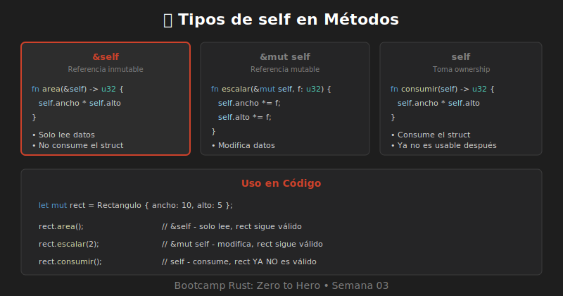

# 🔨 Métodos con impl



## ¿Qué es un Método?

Un **método** es una función asociada a un struct que tiene acceso a sus datos a través de `self`.

---

## Bloque impl

Los métodos se definen dentro de un bloque `impl`:

```rust
struct Rectangulo {
    ancho: u32,
    alto: u32,
}

impl Rectangulo {
    // Los métodos van aquí
}
```

---

## Primer Método: Calcular Área

```rust
struct Rectangulo {
    ancho: u32,
    alto: u32,
}

impl Rectangulo {
    fn area(&self) -> u32 {
        self.ancho * self.alto
    }
}

fn main() {
    let rect = Rectangulo { ancho: 10, alto: 5 };
    println!("Área: {}", rect.area());  // 50
}
```

---

## Tipos de self

| Sintaxis | Significado | Uso |
|----------|-------------|-----|
| `&self` | Referencia inmutable | Leer datos |
| `&mut self` | Referencia mutable | Modificar datos |
| `self` | Toma ownership | Transformar/consumir |

### Ejemplo con los tres tipos

```rust
struct Contador {
    valor: i32,
}

impl Contador {
    // Lee el valor (no modifica)
    fn obtener(&self) -> i32 {
        self.valor
    }

    // Modifica el valor
    fn incrementar(&mut self) {
        self.valor += 1;
    }

    // Consume el contador y retorna el valor
    fn consumir(self) -> i32 {
        self.valor
    }
}
```

---

## &self: Métodos de Lectura

Usan `&self` para tomar prestada la instancia sin modificarla:

```rust
impl Rectangulo {
    fn area(&self) -> u32 {
        self.ancho * self.alto
    }

    fn perimetro(&self) -> u32 {
        2 * (self.ancho + self.alto)
    }

    fn es_cuadrado(&self) -> bool {
        self.ancho == self.alto
    }

    fn describir(&self) {
        println!("Rectángulo {}x{}", self.ancho, self.alto);
    }
}
```

---

## &mut self: Métodos de Modificación

Usan `&mut self` para poder modificar los campos:

```rust
impl Rectangulo {
    fn escalar(&mut self, factor: u32) {
        self.ancho *= factor;
        self.alto *= factor;
    }

    fn hacer_cuadrado(&mut self) {
        let lado = self.ancho.max(self.alto);
        self.ancho = lado;
        self.alto = lado;
    }

    fn reset(&mut self) {
        self.ancho = 0;
        self.alto = 0;
    }
}
```

### Uso

```rust
fn main() {
    let mut rect = Rectangulo { ancho: 10, alto: 5 };
    
    rect.escalar(2);
    println!("Después de escalar: {}x{}", rect.ancho, rect.alto);
    // 20x10
}
```

---

## self: Métodos que Consumen

Toman ownership del struct (raro pero útil):

```rust
struct ConexionDB {
    url: String,
    activa: bool,
}

impl ConexionDB {
    // Consume la conexión y retorna la URL
    fn cerrar(self) -> String {
        println!("Cerrando conexión...");
        self.url  // Retorna la URL, la conexión ya no existe
    }
}

fn main() {
    let conn = ConexionDB {
        url: String::from("localhost:5432"),
        activa: true,
    };
    
    let url = conn.cerrar();
    // conn ya no es válida aquí
}
```

---

## Métodos con Parámetros

```rust
impl Rectangulo {
    fn puede_contener(&self, otro: &Rectangulo) -> bool {
        self.ancho > otro.ancho && self.alto > otro.alto
    }

    fn cambiar_dimensiones(&mut self, nuevo_ancho: u32, nuevo_alto: u32) {
        self.ancho = nuevo_ancho;
        self.alto = nuevo_alto;
    }
}

fn main() {
    let grande = Rectangulo { ancho: 20, alto: 15 };
    let pequeno = Rectangulo { ancho: 5, alto: 3 };

    if grande.puede_contener(&pequeno) {
        println!("El grande puede contener al pequeño");
    }
}
```

---

## Múltiples Bloques impl

Puedes tener varios bloques `impl` para el mismo struct:

```rust
struct Usuario {
    nombre: String,
    edad: u32,
}

// Bloque 1: Constructores
impl Usuario {
    fn new(nombre: String) -> Self {
        Self { nombre, edad: 0 }
    }
}

// Bloque 2: Métodos de lectura
impl Usuario {
    fn nombre(&self) -> &str {
        &self.nombre
    }

    fn edad(&self) -> u32 {
        self.edad
    }
}

// Bloque 3: Métodos de modificación
impl Usuario {
    fn set_edad(&mut self, edad: u32) {
        self.edad = edad;
    }
}
```

---

## Llamada Automática de Referencia

Rust automáticamente añade `&`, `&mut` o `*` al llamar métodos:

```rust
let rect = Rectangulo { ancho: 10, alto: 5 };

// Estas dos formas son equivalentes:
rect.area();
(&rect).area();
```

---

## 📝 Resumen

| Concepto | Descripción |
|----------|-------------|
| `impl Struct` | Bloque para definir métodos |
| `&self` | Método que lee (borrow inmutable) |
| `&mut self` | Método que modifica (borrow mutable) |
| `self` | Método que consume ownership |
| Múltiples `impl` | Se pueden tener varios bloques |

---

*Siguiente: [04-funciones-asociadas.md](./04-funciones-asociadas.md)*
