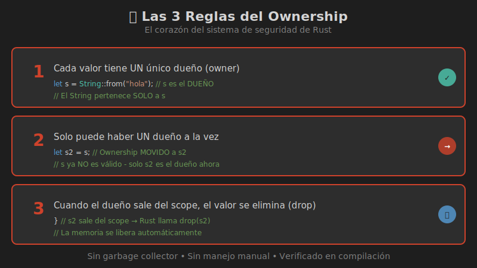

# 📦 El Sistema de Ownership

> **El concepto más importante de Rust** - La base de la seguridad de memoria



---

## ¿Por Qué Ownership?

Otros lenguajes manejan la memoria de dos formas:

| Enfoque | Lenguajes | Problema |
|---------|-----------|----------|
| **Garbage Collector** | Java, Python, Go | Pausas impredecibles, overhead |
| **Manual** | C, C++ | Use-after-free, double-free, memory leaks |

**Rust** usa un tercer enfoque: **Ownership** - reglas verificadas en **tiempo de compilación**.

```
✅ Sin garbage collector → Rendimiento predecible
✅ Sin manejo manual → Sin errores de memoria
✅ Cero costo en runtime → Verificación en compilación
```

---

## Las 3 Reglas del Ownership

### Regla 1: Cada valor tiene UN dueño

```rust
fn main() {
    let s = String::from("hola");  // s es el dueño de este String
    //  ↑
    //  └── DUEÑO (owner)
}
```

### Regla 2: Solo UN dueño a la vez

```rust
fn main() {
    let s1 = String::from("hola");
    let s2 = s1;  // Ownership MOVIDO a s2
    //      ↑
    //      └── s1 ya NO es dueño
    
    // println!("{}", s1);  // ❌ ERROR: s1 ya no es válido
    println!("{}", s2);     // ✅ OK: s2 es el dueño ahora
}
```

### Regla 3: Al salir del scope, el valor se elimina

```rust
fn main() {
    {
        let s = String::from("hola");
        // s es válido aquí
    }  // ← s sale del scope, se llama a DROP
    
    // s ya no existe
}
```

---

## ¿Qué es el Scope?

El **scope** es la región del código donde una variable es válida:

```rust
fn main() {                      // ─┐
    // s no existe todavía       //  │
                                 //  │
    let s = String::from("hola");// ─┼─┐ s es válido
                                 //  │ │
    println!("{}", s);           //  │ │
                                 //  │ │
}                                // ─┘─┘ s sale del scope (drop)
```

---

## La Función drop()

Cuando un valor sale del scope, Rust llama automáticamente a `drop()`:

```rust
fn main() {
    let s = String::from("hola");
    // ... usar s ...
}  // Aquí Rust llama: drop(s)
   // La memoria del String se libera
```

Esto es similar al patrón **RAII** de C++ (Resource Acquisition Is Initialization).

---

## Visualizando Ownership

### Stack vs Heap

```
STACK                          HEAP
┌─────────────────┐           ┌──────────────────┐
│ s               │           │                  │
│ ┌─────────────┐ │           │ ┌──────────────┐ │
│ │ ptr     ────┼─┼───────────┼→│ h │ o │ l │ a││
│ │ len: 4      │ │           │ └──────────────┘ │
│ │ capacity: 4 │ │           │                  │
│ └─────────────┘ │           │                  │
└─────────────────┘           └──────────────────┘
```

El **stack** contiene:
- Puntero a los datos
- Longitud
- Capacidad

El **heap** contiene:
- Los datos reales del String

---

## ¿Por Qué No Copiar?

Si Rust copiara automáticamente:

```
STACK (si copiara)             HEAP
┌─────────────────┐           ┌──────────────────┐
│ s1              │           │                  │
│ ┌─────────────┐ │           │ ┌──────────────┐ │
│ │ ptr     ────┼─┼───────┬───┼→│ h │ o │ l │ a││
│ └─────────────┘ │       │   │ └──────────────┘ │
├─────────────────┤       │   │                  │
│ s2              │       │   │                  │
│ ┌─────────────┐ │       │   │                  │
│ │ ptr     ────┼─┼───────┘   │                  │
│ └─────────────┘ │           │                  │
└─────────────────┘           └──────────────────┘

❌ PROBLEMA: Al hacer drop, ¡se liberaría la misma memoria DOS veces!
   Esto es un "double free" - error crítico de memoria.
```

Por eso Rust **mueve** en lugar de copiar.

---

## El Move en Acción

```rust
fn main() {
    let s1 = String::from("hola");
    let s2 = s1;  // MOVE, no copy
    
    // Ahora solo s2 es válido
}
```

Después del move:

```
STACK                          HEAP
┌─────────────────┐           ┌──────────────────┐
│ s1 (INVÁLIDO)   │           │                  │
│ ┌─────────────┐ │           │ ┌──────────────┐ │
│ │ ─────────── │ │           │ │ h │ o │ l │ a││
│ └─────────────┘ │           │ └──────────────┘ │
├─────────────────┤           │        ↑         │
│ s2              │           │        │         │
│ ┌─────────────┐ │           │        │         │
│ │ ptr     ────┼─┼───────────┼────────┘         │
│ └─────────────┘ │           │                  │
└─────────────────┘           └──────────────────┘
```

---

## Ownership con Funciones

### Pasar ownership a una función

```rust
fn main() {
    let s = String::from("hola");
    tomar_ownership(s);       // s se MUEVE a la función
    
    // println!("{}", s);     // ❌ ERROR: s ya no es válido
}

fn tomar_ownership(cadena: String) {
    println!("{}", cadena);
}  // cadena sale del scope, se hace drop
```

### Devolver ownership desde una función

```rust
fn main() {
    let s = crear_string();   // Ownership viene de la función
    println!("{}", s);        // ✅ s es válido
}

fn crear_string() -> String {
    let s = String::from("hola");
    s  // Ownership se DEVUELVE al llamador
}
```

---

## Resumen

| Concepto | Descripción |
|----------|-------------|
| **Owner** | La variable que "posee" un valor |
| **Move** | Transferencia de ownership |
| **Scope** | Región donde una variable es válida |
| **Drop** | Liberación de recursos al salir del scope |

---

## 🧪 Ejercicio Mental

¿Qué imprime este código?

```rust
fn main() {
    let s1 = String::from("Rust");
    let s2 = s1;
    let s3 = s2;
    println!("{}", s3);
}
```

<details>
<summary>Ver respuesta</summary>

Imprime: `Rust`

El ownership pasa: `s1 → s2 → s3`

Solo `s3` es válido al final.

</details>

---

## 📚 Siguiente

[Move vs Copy →](02-move-copy.md)
