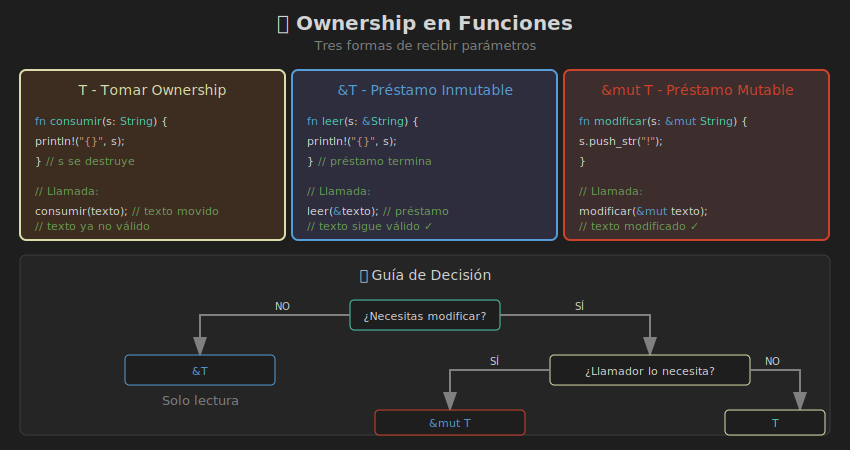

# 🔀 Ownership en Funciones

> **¿Cómo diseñar funciones que manejen ownership correctamente?**



---

## Tres Formas de Recibir Parámetros

| Firma | Ownership | Uso |
|-------|-----------|-----|
| `fn f(x: T)` | Toma ownership | Cuando necesitas consumir el valor |
| `fn f(x: &T)` | Préstamo inmutable | Solo lectura |
| `fn f(x: &mut T)` | Préstamo mutable | Lectura + modificación |

---

## 1. Tomar Ownership: `T`

La función **consume** el valor:

```rust
fn consumir(s: String) {
    println!("Consumido: {}", s);
}  // s se destruye aquí

fn main() {
    let texto = String::from("hola");
    consumir(texto);
    
    // println!("{}", texto);  // ❌ ERROR: texto movido
}
```

### ¿Cuándo usar?

- Transformar el valor en otro tipo
- El llamador no necesita el valor después
- Funciones como constructores o conversiones

```rust
fn a_mayusculas(mut s: String) -> String {
    s.make_ascii_uppercase();
    s  // Devolver ownership
}
```

---

## 2. Referencia Inmutable: `&T`

Solo **lectura**, el valor sigue perteneciendo al llamador:

```rust
fn longitud(s: &String) -> usize {
    s.len()
}

fn main() {
    let texto = String::from("hola");
    let len = longitud(&texto);  // Préstamo
    
    println!("{} tiene {} caracteres", texto, len);  // ✅ texto sigue válido
}
```

### ¿Cuándo usar?

- Solo necesitas leer/inspeccionar
- No quieres afectar el ownership del llamador
- **La mayoría de los casos**

---

## 3. Referencia Mutable: `&mut T`

**Lectura + modificación**, el valor sigue perteneciendo al llamador:

```rust
fn agregar_exclamacion(s: &mut String) {
    s.push_str("!");
}

fn main() {
    let mut texto = String::from("hola");
    agregar_exclamacion(&mut texto);
    
    println!("{}", texto);  // "hola!"
}
```

### ¿Cuándo usar?

- Necesitas modificar el valor
- El llamador quiere ver los cambios
- Más eficiente que clonar + devolver

---

## Devolver Ownership

### Crear y devolver

```rust
fn crear_saludo(nombre: &str) -> String {
    format!("¡Hola, {}!", nombre)
}

fn main() {
    let saludo = crear_saludo("Rust");  // Recibe ownership
    println!("{}", saludo);
}
```

### Recibir, transformar y devolver

```rust
fn procesar(mut s: String) -> String {
    s.push_str(" procesado");
    s  // Devolver ownership
}

fn main() {
    let original = String::from("dato");
    let procesado = procesar(original);
    // original ya no es válido, pero tenemos procesado
}
```

---

## Patrón: Devolver Múltiples Valores

A veces quieres devolver el valor original más algo extra:

```rust
// OPCIÓN 1: Tupla (ownership de vuelta)
fn calcular_con_longitud(s: String) -> (String, usize) {
    let len = s.len();
    (s, len)  // Devolver ambos
}

fn main() {
    let texto = String::from("hola");
    let (texto, len) = calcular_con_longitud(texto);
    println!("{} tiene {} chars", texto, len);
}
```

```rust
// OPCIÓN 2: Referencia (mejor)
fn calcular_longitud(s: &String) -> usize {
    s.len()
}

fn main() {
    let texto = String::from("hola");
    let len = calcular_longitud(&texto);
    println!("{} tiene {} chars", texto, len);
}
```

**Preferir la opción 2** - más simple y eficiente.

---

## Guía de Decisión

```
¿Necesitas modificar el valor?
│
├─ NO ────→ ¿Necesitas ownership después?
│           │
│           ├─ NO ────→ Usar &T
│           │
│           └─ SÍ ────→ Usar T o .clone()
│
└─ SÍ ────→ ¿El llamador lo necesita después?
            │
            ├─ SÍ ────→ Usar &mut T
            │
            └─ NO ────→ Usar T (consumir)
```

---

## Ejemplos Prácticos

### API de String típica

```rust
// Solo lectura - usa referencia
fn es_palindromo(s: &str) -> bool {
    let chars: Vec<_> = s.chars().collect();
    let reversed: Vec<_> = s.chars().rev().collect();
    chars == reversed
}

// Modificación in-place - usa ref mutable
fn capitalizar(s: &mut String) {
    if let Some(c) = s.chars().next() {
        let upper = c.to_uppercase().to_string();
        s.replace_range(0..c.len_utf8(), &upper);
    }
}

// Crear nuevo valor - devuelve ownership
fn repetir(s: &str, n: usize) -> String {
    s.repeat(n)
}
```

### API de Vec típica

```rust
// Buscar (lectura) - referencia
fn contiene_negativo(numeros: &[i32]) -> bool {
    numeros.iter().any(|&n| n < 0)
}

// Modificar - referencia mutable
fn duplicar_todos(numeros: &mut Vec<i32>) {
    for n in numeros.iter_mut() {
        *n *= 2;
    }
}

// Crear nuevo - devolver ownership
fn filtrar_positivos(numeros: Vec<i32>) -> Vec<i32> {
    numeros.into_iter().filter(|&n| n > 0).collect()
}
```

---

## Métodos con self

Los mismos principios aplican a métodos:

```rust
struct Contador {
    valor: i32,
}

impl Contador {
    // self: consume el struct
    fn consumir(self) -> i32 {
        self.valor
    }
    
    // &self: solo lectura
    fn valor(&self) -> i32 {
        self.valor
    }
    
    // &mut self: modificación
    fn incrementar(&mut self) {
        self.valor += 1;
    }
}
```

---

## Errores Comunes

### ❌ Tomar ownership cuando solo necesitas leer

```rust
// MAL
fn imprimir(s: String) {
    println!("{}", s);
}

// BIEN
fn imprimir(s: &str) {
    println!("{}", s);
}
```

### ❌ Retornar referencia a variable local

```rust
// MAL - No compila
fn crear() -> &String {
    let s = String::from("hola");
    &s  // ❌ s se destruye al terminar
}

// BIEN - Retornar ownership
fn crear() -> String {
    String::from("hola")
}
```

### ❌ Olvidar pasar como mutable

```rust
fn modificar(s: &mut String) {
    s.push('!');
}

fn main() {
    let mut texto = String::from("hola");
    // modificar(&texto);      // ❌ ERROR
    modificar(&mut texto);     // ✅ Correcto
}
```

---

## &String vs &str

Preferir `&str` sobre `&String`:

```rust
// ACEPTABLE
fn saludar(nombre: &String) {
    println!("Hola, {}", nombre);
}

// MEJOR - más flexible
fn saludar(nombre: &str) {
    println!("Hola, {}", nombre);
}

fn main() {
    let s = String::from("Rust");
    saludar(&s);      // String se convierte a &str
    saludar("Rust");  // &str directamente
}
```

`&str` acepta tanto `&String` como string literals.

---

## Resumen

| Necesidad | Firma | Llamada |
|-----------|-------|---------|
| Solo leer | `fn f(x: &T)` | `f(&valor)` |
| Modificar | `fn f(x: &mut T)` | `f(&mut valor)` |
| Consumir | `fn f(x: T)` | `f(valor)` |
| Crear | `fn f() -> T` | `let x = f()` |

---

## 🧪 Ejercicio Mental

¿Qué firma usarías para estas funciones?

1. Contar palabras en un texto
2. Ordenar un vector in-place
3. Concatenar dos strings en uno nuevo
4. Vaciar un vector y retornar sus elementos

<details>
<summary>Ver respuesta</summary>

```rust
// 1. Solo lectura
fn contar_palabras(texto: &str) -> usize

// 2. Modificar in-place
fn ordenar(vec: &mut Vec<i32>)

// 3. Crear nuevo (puede tomar refs)
fn concatenar(a: &str, b: &str) -> String

// 4. Consumir y transformar
fn vaciar<T>(vec: Vec<T>) -> Vec<T>
// O mejor: fn vaciar<T>(vec: &mut Vec<T>) -> Vec<T>
```

</details>

---

## 📚 Volver

[← Inicio de Semana 04](../README.md)
