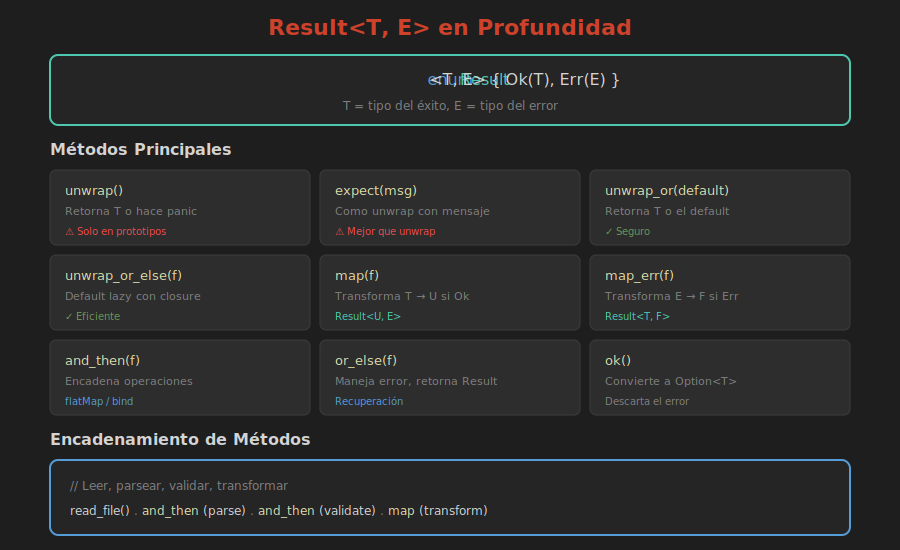

# 🔧 Result en Profundidad

> **El tipo central para manejo de errores**



---

## Anatomía de Result

```rust
enum Result<T, E> {
    Ok(T),   // Valor exitoso de tipo T
    Err(E),  // Error de tipo E
}
```

A diferencia de `Option`, `Result` lleva información sobre **qué salió mal**.

---

## Creando Results

```rust
fn dividir(a: f64, b: f64) -> Result<f64, String> {
    if b == 0.0 {
        Err(String::from("División por cero"))
    } else {
        Ok(a / b)
    }
}

fn main() {
    let r1 = dividir(10.0, 2.0);   // Ok(5.0)
    let r2 = dividir(10.0, 0.0);   // Err("División por cero")
}
```

---

## Consumiendo Results con match

```rust
fn main() {
    match dividir(10.0, 2.0) {
        Ok(resultado) => println!("Resultado: {}", resultado),
        Err(error) => println!("Error: {}", error),
    }
}
```

---

## Métodos Esenciales

### unwrap y expect

```rust
// unwrap: pánico si es Err
let valor = Ok(42).unwrap();  // 42
let boom = Err("fallo").unwrap();  // ¡Pánico!

// expect: pánico con mensaje personalizado
let valor = resultado.expect("Debería funcionar");
```

⚠️ Solo usar en prototipos o cuando estás 100% seguro.

---

### unwrap_or y unwrap_or_else

```rust
// Valor por defecto
let n = resultado.unwrap_or(0);

// Valor calculado (solo si es Err)
let n = resultado.unwrap_or_else(|e| {
    log::error!("Error: {}", e);
    valor_por_defecto()
});
```

---

### map y map_err

```rust
// Transformar el valor Ok
let doble: Result<i32, &str> = Ok(21).map(|n| n * 2);  // Ok(42)

// Transformar el error
let con_contexto = resultado.map_err(|e| {
    format!("Error en operación: {}", e)
});
```

---

### and_then (flatMap)

Para encadenar operaciones que retornan Result:

```rust
fn parsear(s: &str) -> Result<i32, String> {
    s.parse().map_err(|_| "No es número".into())
}

fn duplicar(n: i32) -> Result<i32, String> {
    if n > 1000 {
        Err("Muy grande".into())
    } else {
        Ok(n * 2)
    }
}

fn main() {
    let resultado = parsear("21")
        .and_then(duplicar);  // Ok(42)
    
    let error = parsear("abc")
        .and_then(duplicar);  // Err("No es número")
}
```

---

### is_ok e is_err

```rust
let r: Result<i32, &str> = Ok(42);

if r.is_ok() {
    println!("Éxito");
}

if r.is_err() {
    println!("Falló");
}
```

---

### ok y err

Convertir a Option:

```rust
let resultado: Result<i32, &str> = Ok(42);

let maybe_valor: Option<i32> = resultado.ok();      // Some(42)
let maybe_error: Option<&str> = resultado.err();   // None
```

---

## Combinadores Avanzados

### or y or_else

Fallback si es Err:

```rust
let r1: Result<i32, &str> = Err("fallo");
let r2: Result<i32, &str> = Ok(42);

let final_result = r1.or(r2);  // Ok(42)

// Con función
let resultado = intentar_primero()
    .or_else(|_| intentar_segundo())
    .or_else(|_| intentar_tercero());
```

---

### and

Encadenar si Ok:

```rust
let r1: Result<i32, &str> = Ok(2);
let r2: Result<i32, &str> = Ok(3);

let combined = r1.and(r2);  // Ok(3) - retorna el segundo
```

---

### transpose

Convertir `Option<Result<T, E>>` ↔ `Result<Option<T>, E>`:

```rust
let x: Option<Result<i32, &str>> = Some(Ok(5));
let y: Result<Option<i32>, &str> = x.transpose();  // Ok(Some(5))
```

---

## Result con Errores de la Biblioteca Estándar

### std::io::Error

```rust
use std::fs::File;
use std::io::{self, Read};

fn leer_archivo(ruta: &str) -> Result<String, io::Error> {
    let mut archivo = File::open(ruta)?;
    let mut contenido = String::new();
    archivo.read_to_string(&mut contenido)?;
    Ok(contenido)
}
```

---

### std::num::ParseIntError

```rust
fn parsear_numero(s: &str) -> Result<i32, std::num::ParseIntError> {
    s.trim().parse()
}
```

---

## Patrón: Coleccionar Results

```rust
let strings = vec!["1", "2", "tres", "4"];

// Opción 1: Parar en el primer error
let numeros: Result<Vec<i32>, _> = strings
    .iter()
    .map(|s| s.parse::<i32>())
    .collect();

// Opción 2: Separar éxitos de errores
let (exitos, errores): (Vec<_>, Vec<_>) = strings
    .iter()
    .map(|s| s.parse::<i32>())
    .partition(Result::is_ok);
```

---

## Resumen de Métodos

| Método | Entrada | Salida | Uso |
|--------|---------|--------|-----|
| `unwrap()` | `Result<T,E>` | `T` o pánico | Prototipos |
| `expect(msg)` | `Result<T,E>` | `T` o pánico | Debug |
| `unwrap_or(def)` | `Result<T,E>` | `T` | Default |
| `map(f)` | `Result<T,E>` | `Result<U,E>` | Transformar Ok |
| `map_err(f)` | `Result<T,E>` | `Result<T,F>` | Transformar Err |
| `and_then(f)` | `Result<T,E>` | `Result<U,E>` | Encadenar |
| `ok()` | `Result<T,E>` | `Option<T>` | Descartar error |
| `err()` | `Result<T,E>` | `Option<E>` | Solo error |
| `?` | `Result<T,E>` | `T` o return Err | Propagación |

---

## 🧪 Ejercicio Mental

Encadena estas operaciones con `and_then`:

```rust
fn obtener_config(path: &str) -> Result<String, Error>
fn parsear_config(s: &str) -> Result<Config, Error>
fn validar_config(c: Config) -> Result<Config, Error>
```

<details>
<summary>Ver respuesta</summary>

```rust
fn cargar_config(path: &str) -> Result<Config, Error> {
    obtener_config(path)
        .and_then(|s| parsear_config(&s))
        .and_then(validar_config)
}
```

</details>

---

## 📚 Siguiente

[Propagación con ? →](03-propagacion-errores.md)
