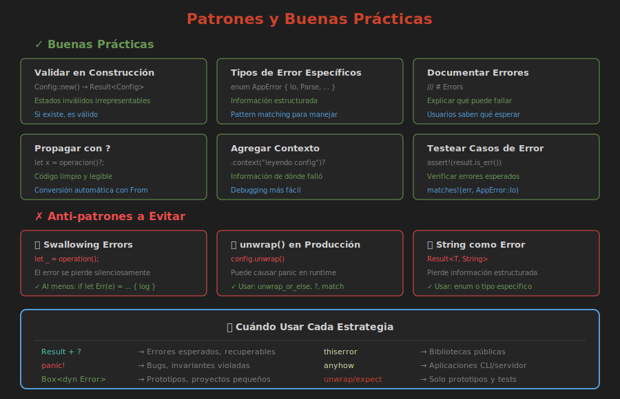

# 🏆 Patrones y Buenas Prácticas

> **Escribiendo código robusto y mantenible**



---

## Regla de Oro

> **Haz que los estados inválidos sean irrepresentables**

```rust
// ❌ Malo: puede tener email vacío
struct Usuario {
    email: String,  // ¿Qué pasa si está vacío?
}

// ✅ Mejor: valida en construcción
struct Email(String);

impl Email {
    fn new(s: &str) -> Result<Self, EmailError> {
        if s.contains('@') && s.len() > 3 {
            Ok(Email(s.to_string()))
        } else {
            Err(EmailError::Invalido(s.to_string()))
        }
    }
}

struct Usuario {
    email: Email,  // Siempre válido
}
```

---

## Patrón: Validación en Construcción

```rust
struct Config {
    puerto: u16,
    max_conexiones: u32,
    timeout_ms: u64,
}

impl Config {
    pub fn new(
        puerto: u16,
        max_conexiones: u32,
        timeout_ms: u64,
    ) -> Result<Self, ConfigError> {
        if puerto == 0 {
            return Err(ConfigError::campo("puerto", "no puede ser 0"));
        }
        if max_conexiones == 0 {
            return Err(ConfigError::campo("max_conexiones", "debe ser > 0"));
        }
        if timeout_ms < 100 {
            return Err(ConfigError::campo("timeout", "mínimo 100ms"));
        }
        
        Ok(Config { puerto, max_conexiones, timeout_ms })
    }
}
```

---

## Patrón: Builder con Validación

```rust
#[derive(Default)]
struct ConfigBuilder {
    puerto: Option<u16>,
    max_conexiones: Option<u32>,
    timeout_ms: Option<u64>,
}

impl ConfigBuilder {
    pub fn puerto(mut self, p: u16) -> Self {
        self.puerto = Some(p);
        self
    }
    
    pub fn max_conexiones(mut self, m: u32) -> Self {
        self.max_conexiones = Some(m);
        self
    }
    
    pub fn build(self) -> Result<Config, ConfigError> {
        let puerto = self.puerto
            .ok_or(ConfigError::campo("puerto", "requerido"))?;
        let max = self.max_conexiones
            .ok_or(ConfigError::campo("max_conexiones", "requerido"))?;
        let timeout = self.timeout_ms.unwrap_or(5000);
        
        Config::new(puerto, max, timeout)
    }
}

// Uso:
let config = ConfigBuilder::default()
    .puerto(8080)
    .max_conexiones(100)
    .build()?;
```

---

## Patrón: Acumular Errores

A veces quieres **todos** los errores, no solo el primero:

```rust
fn validar_formulario(form: &Formulario) -> Result<(), Vec<String>> {
    let mut errores = Vec::new();
    
    if form.nombre.is_empty() {
        errores.push("Nombre requerido".to_string());
    }
    
    if form.email.is_empty() {
        errores.push("Email requerido".to_string());
    } else if !form.email.contains('@') {
        errores.push("Email inválido".to_string());
    }
    
    if form.edad < 18 {
        errores.push("Debe ser mayor de 18".to_string());
    }
    
    if errores.is_empty() {
        Ok(())
    } else {
        Err(errores)
    }
}
```

---

## Patrón: Retry con Backoff

```rust
fn con_reintentos<T, E, F>(mut operacion: F, max: u32) -> Result<T, E>
where
    F: FnMut() -> Result<T, E>,
{
    let mut intentos = 0;
    loop {
        match operacion() {
            Ok(v) => return Ok(v),
            Err(e) if intentos < max => {
                intentos += 1;
                std::thread::sleep(
                    std::time::Duration::from_millis(100 * 2u64.pow(intentos))
                );
            }
            Err(e) => return Err(e),
        }
    }
}

// Uso:
let resultado = con_reintentos(|| conectar_servidor(), 3)?;
```

---

## Patrón: Fallback

```rust
fn obtener_config() -> Config {
    cargar_archivo("config.toml")
        .or_else(|_| cargar_archivo("config.default.toml"))
        .or_else(|_| cargar_env())
        .unwrap_or_else(|_| Config::default())
}
```

---

## Patrón: Logging de Errores

```rust
fn procesar(datos: &str) -> Result<(), AppError> {
    parsear(datos)
        .map_err(|e| {
            eprintln!("Error parseando: {}", e);
            e
        })?;
    
    validar(datos)
        .inspect_err(|e| eprintln!("Validación falló: {}", e))?;
    
    Ok(())
}
```

---

## Anti-Patrones a Evitar

### ❌ Swallowing Errors

```rust
// MAL: El error se pierde
let _ = archivo.write_all(datos);

// BIEN: Al menos log
if let Err(e) = archivo.write_all(datos) {
    eprintln!("Error escribiendo: {}", e);
}
```

### ❌ Panic en Bibliotecas

```rust
// MAL: Una biblioteca no debería hacer panic
pub fn parsear(s: &str) -> Dato {
    s.parse().unwrap()  // ¡No!
}

// BIEN: Retornar Result
pub fn parsear(s: &str) -> Result<Dato, ParseError> {
    s.parse()
}
```

### ❌ String como Único Tipo de Error

```rust
// MAL: Pierde información estructurada
fn cargar() -> Result<Data, String>

// BIEN: Tipo específico
fn cargar() -> Result<Data, CargarError>
```

### ❌ Unwrap en Producción

```rust
// MAL: Puede causar pánico
let config = leer_config().unwrap();

// BIEN: Manejar el error
let config = leer_config().unwrap_or_else(|e| {
    eprintln!("Error: {}. Usando defaults.", e);
    Config::default()
});
```

---

## Cuándo Usar Cada Estrategia

| Situación | Estrategia |
|-----------|------------|
| Error esperado | `Result` + propagación |
| Bug del programador | `panic!` |
| Validación de input | Acumular errores |
| Operación de red | Retry con backoff |
| Config opcional | Fallback a default |
| Prototipo rápido | `unwrap()` / `expect()` |

---

## Documentando Errores

```rust
/// Carga la configuración desde un archivo.
///
/// # Errors
///
/// Esta función retorna un error si:
/// - El archivo no existe (`ConfigError::ArchivoNoEncontrado`)
/// - El archivo no es TOML válido (`ConfigError::ParseError`)
/// - La configuración falla validación (`ConfigError::Validacion`)
///
/// # Examples
///
/// ```
/// # use mi_crate::{cargar_config, ConfigError};
/// let config = cargar_config("config.toml")?;
/// # Ok::<(), ConfigError>(())
/// ```
pub fn cargar_config(ruta: &str) -> Result<Config, ConfigError> {
    // ...
}
```

---

## Testing de Errores

```rust
#[cfg(test)]
mod tests {
    use super::*;

    #[test]
    fn test_division_por_cero() {
        let resultado = dividir(10.0, 0.0);
        assert!(resultado.is_err());
        
        // Verificar tipo específico de error
        assert!(matches!(
            resultado,
            Err(MathError::DivisionPorCero)
        ));
    }
    
    #[test]
    fn test_mensaje_error() {
        let err = dividir(10.0, 0.0).unwrap_err();
        assert_eq!(err.to_string(), "División por cero no permitida");
    }
    
    #[test]
    #[should_panic(expected = "invariante violada")]
    fn test_panic_esperado() {
        funcion_que_debe_panic();
    }
}
```

---

## Resumen de Buenas Prácticas

1. ✅ Usa `Result` para errores recuperables
2. ✅ Usa `panic!` solo para bugs
3. ✅ Crea tipos de error descriptivos
4. ✅ Implementa `From` para conversión automática
5. ✅ Documenta los errores posibles
6. ✅ Testea los casos de error
7. ✅ Valida en el momento de construcción
8. ✅ Nunca ignores errores silenciosamente

---

## 📚 Recursos Adicionales

- [Rust Error Handling (Libro)](https://doc.rust-lang.org/book/ch09-00-error-handling.html)
- [thiserror crate](https://docs.rs/thiserror)
- [anyhow crate](https://docs.rs/anyhow)
