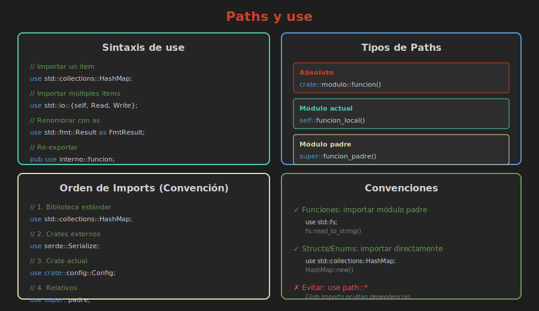

# 🛤️ Paths y use

> **Importando y referenciando código**



---

## Tipos de Paths

### Path Absoluto
Comienza desde la raíz del crate:

```rust
crate::modulo::submodulo::funcion()
```

### Path Relativo
Comienza desde el módulo actual:

```rust
self::funcion()      // Este módulo
super::funcion()     // Módulo padre
submodulo::funcion() // Submódulo
```

---

## La Palabra Clave use

`use` crea un atajo para acceder a elementos:

```rust
mod geometria {
    pub mod formas {
        pub struct Circulo {
            pub radio: f64,
        }
        
        pub struct Rectangulo {
            pub ancho: f64,
            pub alto: f64,
        }
    }
}

// Sin use:
fn sin_use() {
    let c = geometria::formas::Circulo { radio: 5.0 };
    let r = geometria::formas::Rectangulo { ancho: 10.0, alto: 5.0 };
}

// Con use:
use geometria::formas::Circulo;
use geometria::formas::Rectangulo;

fn con_use() {
    let c = Circulo { radio: 5.0 };
    let r = Rectangulo { ancho: 10.0, alto: 5.0 };
}
```

---

## Importar Múltiples Items

### Llaves para Agrupar

```rust
use std::collections::{HashMap, HashSet, BTreeMap};
use std::io::{self, Read, Write};

// self importa el módulo mismo
// Equivalente a:
// use std::io;
// use std::io::Read;
// use std::io::Write;
```

### Importar Todo con *

```rust
use std::collections::*;  // ⚠️ Generalmente evitar

// Mejor ser explícito:
use std::collections::{HashMap, HashSet};
```

---

## Renombrar con as

```rust
use std::fmt::Result as FmtResult;
use std::io::Result as IoResult;

fn formatear() -> FmtResult {
    Ok(())
}

fn leer() -> IoResult<String> {
    Ok("datos".to_string())
}
```

---

## Re-exportación con pub use

```rust
mod interno {
    pub mod utilidades {
        pub fn helper() {}
    }
    
    pub mod tipos {
        pub struct Config {}
    }
}

// Re-exportar para simplificar la API
pub use interno::utilidades::helper;
pub use interno::tipos::Config;

// Ahora los usuarios pueden hacer:
// use mi_crate::helper;
// use mi_crate::Config;
// En lugar de:
// use mi_crate::interno::utilidades::helper;
```

---

## Convenciones de use

### Funciones: Importar el Módulo Padre

```rust
// ✅ Bueno: queda claro de dónde viene
use std::fs;
fs::read_to_string("archivo.txt");

// ⚠️ Menos claro
use std::fs::read_to_string;
read_to_string("archivo.txt"); // ¿De dónde viene?
```

### Structs, Enums, Traits: Importar Directamente

```rust
// ✅ Bueno
use std::collections::HashMap;
let map = HashMap::new();

// ⚠️ Innecesariamente largo
use std::collections;
let map = collections::HashMap::new();
```

---

## Orden de Imports (Convención)

```rust
// 1. Biblioteca estándar
use std::collections::HashMap;
use std::fs;
use std::io::{self, Read};

// 2. Crates externos
use serde::{Deserialize, Serialize};
use tokio::runtime::Runtime;

// 3. Crates del workspace
use mi_otro_crate::utilidad;

// 4. Módulos del crate actual
use crate::config::Config;
use crate::errores::AppError;

// 5. Módulos relativos
use super::padre;
use self::hijo;
```

---

## use en Módulos

```rust
mod exterior {
    // use aplica a este módulo y sus hijos
    use std::collections::HashMap;
    
    pub fn crear_mapa() -> HashMap<String, i32> {
        HashMap::new()
    }
    
    mod interior {
        // Necesita su propio use o path completo
        use std::collections::HashSet;
        
        pub fn crear_set() -> HashSet<i32> {
            HashSet::new()
        }
    }
}
```

---

## Prelude

Algunos items están disponibles sin `use`:

```rust
// Estos ya están importados automáticamente:
let s = String::from("hola");  // String
let v = vec![1, 2, 3];         // Vec
let o: Option<i32> = Some(5);  // Option
let r: Result<i32, &str> = Ok(42); // Result

// Traits comunes también:
// Clone, Copy, Debug, Default, etc.
```

---

## Ejemplo Completo

```rust
// Imports organizados
use std::collections::HashMap;
use std::fs::File;
use std::io::{self, BufRead, BufReader};

mod config {
    pub struct Settings {
        pub nombre: String,
        pub valor: i32,
    }
}

mod procesador {
    // Import relativo
    use super::config::Settings;
    
    pub fn procesar(settings: &Settings) {
        println!("Procesando: {}", settings.nombre);
    }
}

// Re-exportar para API limpia
pub use config::Settings;
pub use procesador::procesar;

fn main() -> io::Result<()> {
    let settings = Settings {
        nombre: "test".to_string(),
        valor: 42,
    };
    
    procesar(&settings);
    
    Ok(())
}
```

---

## Anti-patrones a Evitar

```rust
// ❌ Glob imports en código de producción
use std::collections::*;

// ❌ Imports muy profundos repetidos
use crate::a::b::c::d::e::Tipo;
use crate::a::b::c::d::e::OtroTipo;
// ✅ Mejor: usar módulo común
use crate::a::b::c::d::e::{Tipo, OtroTipo};

// ❌ Conflictos de nombres sin resolver
use std::fmt::Result;
use std::io::Result; // Error!
// ✅ Usar alias
use std::fmt::Result as FmtResult;
use std::io::Result as IoResult;
```

---

## Resumen

| Sintaxis | Descripción |
|----------|-------------|
| `use path::item` | Importar un item |
| `use path::{a, b}` | Importar múltiples |
| `use path::*` | Importar todo (evitar) |
| `use path as alias` | Renombrar import |
| `pub use path::item` | Re-exportar |
| `crate::` | Path absoluto |
| `self::` | Módulo actual |
| `super::` | Módulo padre |

---

## 📚 Siguiente

[Archivos y Carpetas →](04-archivos-carpetas.md)
