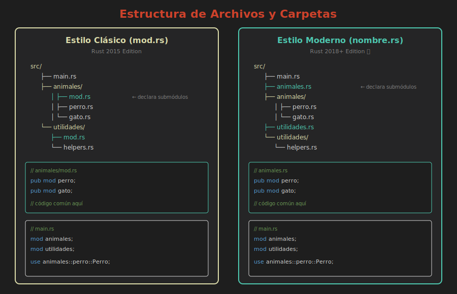

# 📂 Archivos y Carpetas

> **Separando módulos en archivos**



---

## De Inline a Archivos

Cuando un módulo crece, es mejor moverlo a su propio archivo:

```rust
// Antes: todo en main.rs
mod matematicas {
    pub fn sumar(a: i32, b: i32) -> i32 { a + b }
    pub fn restar(a: i32, b: i32) -> i32 { a - b }
    // ... muchas más funciones
}

fn main() {
    println!("{}", matematicas::sumar(2, 3));
}
```

---

## Módulo en Archivo Separado

### Estructura:
```
src/
├── main.rs
└── matematicas.rs
```

### main.rs:
```rust
mod matematicas;  // Declara el módulo (busca matematicas.rs)

fn main() {
    println!("{}", matematicas::sumar(2, 3));
}
```

### matematicas.rs:
```rust
pub fn sumar(a: i32, b: i32) -> i32 {
    a + b
}

pub fn restar(a: i32, b: i32) -> i32 {
    a - b
}
```

---

## Módulo con Submódulos

### Opción 1: Carpeta con mod.rs (estilo antiguo)

```
src/
├── main.rs
└── matematicas/
    ├── mod.rs         ← Punto de entrada del módulo
    ├── basicas.rs
    └── avanzadas.rs
```

### matematicas/mod.rs:
```rust
pub mod basicas;
pub mod avanzadas;

// Re-exportar para conveniencia
pub use basicas::sumar;
pub use basicas::restar;
```

---

## Opción 2: Archivo con Nombre del Módulo (estilo moderno)

```
src/
├── main.rs
├── matematicas.rs     ← Punto de entrada del módulo
└── matematicas/
    ├── basicas.rs
    └── avanzadas.rs
```

### matematicas.rs:
```rust
pub mod basicas;
pub mod avanzadas;

pub use basicas::sumar;
pub use basicas::restar;
```

> 💡 **Recomendación**: Usa el estilo moderno (archivo .rs + carpeta)

---

## Ejemplo Completo

### Estructura del Proyecto:
```
mi_proyecto/
├── Cargo.toml
└── src/
    ├── main.rs
    ├── config.rs
    ├── db.rs
    └── db/
        ├── conexion.rs
        └── consultas.rs
```

### main.rs:
```rust
mod config;
mod db;

use config::Config;
use db::Database;

fn main() {
    let config = Config::cargar();
    let db = Database::conectar(&config);
    db.consultar("SELECT * FROM usuarios");
}
```

### config.rs:
```rust
pub struct Config {
    pub db_url: String,
    pub puerto: u16,
}

impl Config {
    pub fn cargar() -> Self {
        Config {
            db_url: "localhost:5432".to_string(),
            puerto: 8080,
        }
    }
}
```

### db.rs:
```rust
mod conexion;
mod consultas;

pub use conexion::Conexion;
pub use consultas::ejecutar;

use crate::config::Config;

pub struct Database {
    conexion: Conexion,
}

impl Database {
    pub fn conectar(config: &Config) -> Self {
        let conexion = Conexion::nueva(&config.db_url);
        Database { conexion }
    }
    
    pub fn consultar(&self, sql: &str) {
        ejecutar(&self.conexion, sql);
    }
}
```

### db/conexion.rs:
```rust
pub struct Conexion {
    url: String,
    activa: bool,
}

impl Conexion {
    pub fn nueva(url: &str) -> Self {
        println!("Conectando a {}", url);
        Conexion {
            url: url.to_string(),
            activa: true,
        }
    }
    
    pub fn esta_activa(&self) -> bool {
        self.activa
    }
}
```

### db/consultas.rs:
```rust
use super::Conexion;

pub fn ejecutar(conn: &Conexion, sql: &str) {
    if conn.esta_activa() {
        println!("Ejecutando: {}", sql);
    }
}
```

---

## Reglas de Correspondencia

| Declaración | Archivo buscado |
|-------------|-----------------|
| `mod foo;` | `foo.rs` o `foo/mod.rs` |
| `mod foo;` en `bar.rs` | `bar/foo.rs` o `bar/foo/mod.rs` |

---

## lib.rs vs main.rs

### Binario (ejecutable):
```
src/
└── main.rs  ← Punto de entrada
```

### Biblioteca:
```
src/
└── lib.rs   ← Punto de entrada
```

### Ambos:
```
src/
├── main.rs  ← Binario
└── lib.rs   ← Biblioteca
```

```rust
// main.rs puede usar la biblioteca:
use mi_crate::funcion_de_lib;

fn main() {
    funcion_de_lib();
}
```

---

## Múltiples Binarios

```
src/
├── lib.rs
├── main.rs
└── bin/
    ├── servidor.rs
    └── cliente.rs
```

```bash
cargo run                    # Ejecuta main.rs
cargo run --bin servidor     # Ejecuta bin/servidor.rs
cargo run --bin cliente      # Ejecuta bin/cliente.rs
```

---

## Tests en Módulos

```rust
// matematicas.rs
pub fn sumar(a: i32, b: i32) -> i32 {
    a + b
}

#[cfg(test)]
mod tests {
    use super::*;
    
    #[test]
    fn test_sumar() {
        assert_eq!(sumar(2, 3), 5);
    }
}
```

---

## Estructura Recomendada para Proyectos

### Proyecto Pequeño:
```
src/
├── main.rs
├── lib.rs (opcional)
├── config.rs
└── utils.rs
```

### Proyecto Mediano:
```
src/
├── main.rs
├── lib.rs
├── config.rs
├── error.rs
├── models/
│   ├── mod.rs
│   ├── usuario.rs
│   └── producto.rs
└── services/
    ├── mod.rs
    └── auth.rs
```

### Proyecto Grande:
```
src/
├── main.rs
├── lib.rs
├── config.rs
├── error.rs
├── api/
├── db/
├── models/
├── services/
└── utils/
```

---

## Resumen

| Patrón | Uso |
|--------|-----|
| `mod nombre;` | Busca `nombre.rs` o `nombre/mod.rs` |
| `nombre.rs` + `nombre/` | Estilo moderno (preferido) |
| `nombre/mod.rs` | Estilo antiguo |
| `lib.rs` | Biblioteca |
| `main.rs` | Binario |

---

## 📚 Siguiente

[Crates y Cargo →](05-crates-cargo.md)
