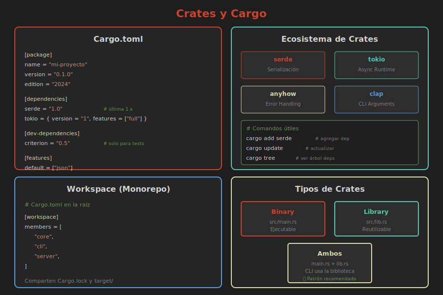

# 📦 Crates y Cargo

> **El ecosistema de paquetes de Rust**



---

## ¿Qué es un Crate?

Un **crate** es una unidad de compilación en Rust:
- **Binary crate**: Produce un ejecutable
- **Library crate**: Produce código reutilizable

```
mi_proyecto/
├── Cargo.toml    ← Manifiesto del crate
└── src/
    ├── main.rs   ← Binary crate (raíz)
    └── lib.rs    ← Library crate (raíz)
```

---

## Cargo.toml

El manifiesto que describe tu crate:

```toml
[package]
name = "mi_proyecto"
version = "0.1.0"
edition = "2024"
authors = ["Tu Nombre <tu@email.com>"]
description = "Descripción corta del proyecto"
license = "MIT"

[dependencies]
serde = "1.0"
tokio = { version = "1", features = ["full"] }

[dev-dependencies]
criterion = "0.5"

[build-dependencies]
cc = "1.0"
```

---

## Agregar Dependencias

### Con cargo add (recomendado):

```bash
cargo add serde
cargo add tokio --features full
cargo add rand@0.8
```

### Manualmente en Cargo.toml:

```toml
[dependencies]
serde = "1.0"                    # Versión simple
serde_json = "1.0.91"            # Versión específica
tokio = { version = "1", features = ["full"] }
mi_crate = { path = "../mi_crate" }        # Local
otro = { git = "https://github.com/..." }   # Git
```

---

## Versiones Semánticas

```
MAJOR.MINOR.PATCH
  ^1.2.3
```

| Especificación | Significado |
|----------------|-------------|
| `"1.0"` | >= 1.0.0, < 2.0.0 |
| `"1.2.3"` | >= 1.2.3, < 2.0.0 |
| `"=1.2.3"` | Exactamente 1.2.3 |
| `">=1.0, <2.0"` | Rango |
| `"^1.2.3"` | >= 1.2.3, < 2.0.0 (default) |
| `"~1.2.3"` | >= 1.2.3, < 1.3.0 |

---

## Usar Crates Externos

```rust
// Cargo.toml
// [dependencies]
// rand = "0.8"
// chrono = "0.4"

use rand::Rng;
use chrono::Local;

fn main() {
    // Número aleatorio
    let mut rng = rand::thread_rng();
    let n: u32 = rng.gen_range(1..100);
    println!("Número aleatorio: {}", n);
    
    // Fecha actual
    let ahora = Local::now();
    println!("Fecha: {}", ahora.format("%Y-%m-%d %H:%M:%S"));
}
```

---

## crates.io

El registro oficial de crates de Rust.

### Buscar crates:
```bash
cargo search json
```

### Crates populares:
| Crate | Descripción |
|-------|-------------|
| `serde` | Serialización/deserialización |
| `tokio` | Runtime async |
| `reqwest` | Cliente HTTP |
| `clap` | Parser de argumentos CLI |
| `anyhow` | Manejo de errores simplificado |
| `thiserror` | Derivar Error fácilmente |
| `log` | Logging |
| `regex` | Expresiones regulares |

---

## Features

Funcionalidades opcionales de un crate:

```toml
[dependencies]
# Activar features específicas
tokio = { version = "1", features = ["rt-multi-thread", "macros"] }

# Activar todas las features
serde = { version = "1", features = ["derive"] }
```

### Definir features en tu crate:

```toml
[features]
default = ["json"]  # Features por defecto
json = ["dep:serde_json"]
xml = ["dep:quick-xml"]

[dependencies]
serde_json = { version = "1", optional = true }
quick-xml = { version = "0.23", optional = true }
```

---

## Workspace

Múltiples crates relacionados:

```
mi_workspace/
├── Cargo.toml          ← Workspace root
├── crate_a/
│   ├── Cargo.toml
│   └── src/lib.rs
├── crate_b/
│   ├── Cargo.toml
│   └── src/lib.rs
└── app/
    ├── Cargo.toml
    └── src/main.rs
```

### Cargo.toml (raíz):
```toml
[workspace]
members = ["crate_a", "crate_b", "app"]
```

### app/Cargo.toml:
```toml
[dependencies]
crate_a = { path = "../crate_a" }
crate_b = { path = "../crate_b" }
```

---

## Comandos Cargo Útiles

```bash
# Compilar
cargo build
cargo build --release

# Ejecutar
cargo run
cargo run --example demo

# Tests
cargo test
cargo test --package mi_crate

# Documentación
cargo doc --open

# Verificar sin compilar
cargo check

# Limpiar
cargo clean

# Actualizar dependencias
cargo update

# Ver árbol de dependencias
cargo tree

# Auditar seguridad
cargo audit
```

---

## Publicar un Crate

### 1. Preparar Cargo.toml:
```toml
[package]
name = "mi_crate_unico"
version = "0.1.0"
edition = "2024"
description = "Una descripción útil"
license = "MIT OR Apache-2.0"
repository = "https://github.com/usuario/mi_crate"
documentation = "https://docs.rs/mi_crate_unico"
keywords = ["keyword1", "keyword2"]
categories = ["development-tools"]
```

### 2. Login y publicar:
```bash
cargo login
cargo publish --dry-run  # Verificar
cargo publish            # Publicar
```

---

## Crear Biblioteca Reutilizable

```bash
cargo new mi_biblioteca --lib
```

### src/lib.rs:
```rust
//! # Mi Biblioteca
//! 
//! `mi_biblioteca` proporciona funciones útiles.

/// Suma dos números.
///
/// # Examples
///
/// ```
/// let resultado = mi_biblioteca::sumar(2, 3);
/// assert_eq!(resultado, 5);
/// ```
pub fn sumar(a: i32, b: i32) -> i32 {
    a + b
}

#[cfg(test)]
mod tests {
    use super::*;

    #[test]
    fn test_sumar() {
        assert_eq!(sumar(2, 2), 4);
    }
}
```

---

## Resumen

| Concepto | Descripción |
|----------|-------------|
| Crate | Unidad de compilación |
| Cargo.toml | Manifiesto del proyecto |
| crates.io | Registro de crates |
| `cargo add` | Agregar dependencia |
| Features | Funcionalidad opcional |
| Workspace | Múltiples crates relacionados |

---

## 📚 Recursos

- [crates.io](https://crates.io)
- [docs.rs](https://docs.rs)
- [lib.rs](https://lib.rs) (búsqueda mejorada)
- [The Cargo Book](https://doc.rust-lang.org/cargo/)
