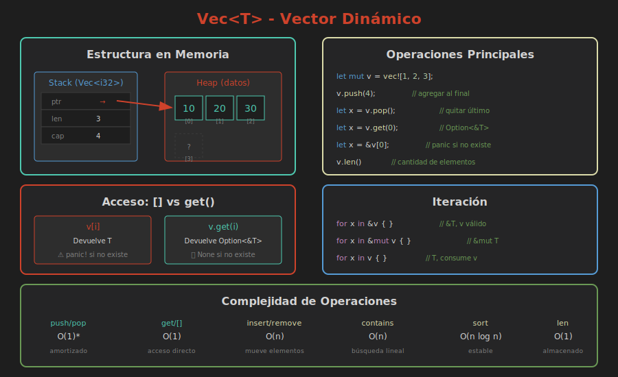

# 📚 Vectores (Vec<T>)

> **La colección dinámica más usada en Rust**

## 🎯 Objetivos

- Entender qué es un Vec y cuándo usarlo
- Crear vectores de diferentes formas
- Realizar operaciones CRUD en vectores
- Iterar sobre vectores de forma segura

---

## 🧠 ¿Qué es un Vector?

Un **Vec<T>** (vector) es una colección que:

- Almacena elementos del **mismo tipo** `T`
- Tiene **tamaño dinámico** (puede crecer o decrecer)
- Almacena datos en el **heap**
- Mantiene elementos en **orden secuencial**



---

## 📝 Crear Vectores

### Método 1: `Vec::new()`

```rust
// Vector vacío - requiere anotación de tipo
let v: Vec<i32> = Vec::new();

// O Rust infiere el tipo del primer elemento
let mut v = Vec::new();
v.push(1);  // Ahora Rust sabe que es Vec<i32>
```

### Método 2: Macro `vec!`

```rust
// Crear con valores iniciales
let v = vec![1, 2, 3, 4, 5];

// Crear con valor repetido
let ceros = vec![0; 10];  // [0, 0, 0, 0, 0, 0, 0, 0, 0, 0]
```

### Método 3: Con capacidad inicial

```rust
// Pre-reservar espacio (evita realocaciones)
let mut v = Vec::with_capacity(100);
println!("Longitud: {}", v.len());       // 0
println!("Capacidad: {}", v.capacity()); // 100
```

---

## ➕ Agregar Elementos

### `push` - Agregar al final

```rust
let mut v = vec![1, 2, 3];
v.push(4);
v.push(5);
// v = [1, 2, 3, 4, 5]
```

### `insert` - Insertar en posición

```rust
let mut v = vec![1, 2, 4, 5];
v.insert(2, 3);  // Insertar 3 en índice 2
// v = [1, 2, 3, 4, 5]
```

### `extend` - Agregar múltiples

```rust
let mut v = vec![1, 2, 3];
v.extend([4, 5, 6]);
// v = [1, 2, 3, 4, 5, 6]
```

---

## 📖 Leer Elementos

### Acceso por índice `[]`

```rust
let v = vec![10, 20, 30, 40];

let segundo = v[1];  // 20
println!("El segundo elemento es: {}", segundo);

// ⚠️ PANIC si el índice no existe
let x = v[10];  // panic: index out of bounds
```

### Acceso seguro con `get()`

```rust
let v = vec![10, 20, 30, 40];

match v.get(1) {
    Some(valor) => println!("Encontrado: {}", valor),
    None => println!("Índice fuera de rango"),
}

// O con if let
if let Some(valor) = v.get(10) {
    println!("Valor: {}", valor);
} else {
    println!("No existe");
}
```

### Comparación: `[]` vs `get()`

| Operación | Índice válido | Índice inválido |
|-----------|---------------|-----------------|
| `v[i]` | Devuelve `T` | **PANIC** |
| `v.get(i)` | `Some(&T)` | `None` |

> 💡 **Regla**: Usa `get()` cuando el índice puede ser inválido.
> Usa `[]` solo cuando estés **seguro** de que el índice existe.

---

## 🔄 Modificar Elementos

```rust
let mut v = vec![1, 2, 3, 4, 5];

// Modificar por índice
v[0] = 100;

// Modificar con get_mut
if let Some(elemento) = v.get_mut(2) {
    *elemento = 300;
}

// v = [100, 2, 300, 4, 5]
```

---

## ➖ Eliminar Elementos

### `pop` - Eliminar el último

```rust
let mut v = vec![1, 2, 3];
let ultimo = v.pop();  // Some(3)
// v = [1, 2]

let vacio: Vec<i32> = vec![];
let nada = vacio.pop();  // None
```

### `remove` - Eliminar por índice

```rust
let mut v = vec![1, 2, 3, 4, 5];
let eliminado = v.remove(2);  // Elimina y devuelve 3
// v = [1, 2, 4, 5]
```

### `retain` - Mantener elementos que cumplan condición

```rust
let mut v = vec![1, 2, 3, 4, 5, 6];
v.retain(|x| x % 2 == 0);  // Solo pares
// v = [2, 4, 6]
```

### `clear` - Vaciar el vector

```rust
let mut v = vec![1, 2, 3];
v.clear();
// v = []
```

---

## 🔁 Iterar sobre Vectores

### Iteración inmutable

```rust
let v = vec![1, 2, 3, 4, 5];

// Forma idiomática
for elemento in &v {
    println!("{}", elemento);
}

// Con índices (cuando los necesitas)
for (indice, elemento) in v.iter().enumerate() {
    println!("[{}] = {}", indice, elemento);
}
```

### Iteración mutable

```rust
let mut v = vec![1, 2, 3, 4, 5];

for elemento in &mut v {
    *elemento *= 2;  // Duplicar cada elemento
}
// v = [2, 4, 6, 8, 10]
```

### Iteración con consumo

```rust
let v = vec![String::from("a"), String::from("b")];

for s in v {  // v se mueve aquí
    println!("{}", s);
}
// v ya no es válido aquí
```

---

## 📊 Métodos Útiles

### Información

```rust
let v = vec![1, 2, 3, 4, 5];

v.len()        // 5 - número de elementos
v.is_empty()   // false
v.capacity()   // >= 5 - espacio reservado
v.first()      // Some(&1)
v.last()       // Some(&5)
```

### Búsqueda

```rust
let v = vec![10, 20, 30, 20, 40];

v.contains(&20)           // true
v.iter().position(|&x| x == 20)  // Some(1) - primer índice
```

### Ordenamiento

```rust
let mut v = vec![3, 1, 4, 1, 5, 9, 2, 6];

v.sort();      // [1, 1, 2, 3, 4, 5, 6, 9]
v.reverse();   // [9, 6, 5, 4, 3, 2, 1, 1]
v.dedup();     // Elimina duplicados consecutivos
```

---

## ⚠️ Ownership y Borrowing en Vec

### El problema clásico

```rust
let mut v = vec![1, 2, 3, 4, 5];
let primero = &v[0];  // Préstamo inmutable

v.push(6);  // ❌ ERROR: no puede mutar mientras hay préstamo

println!("{}", primero);
```

### La solución

```rust
let mut v = vec![1, 2, 3, 4, 5];

// Opción 1: Terminar de usar la referencia antes de mutar
let primero = v[0];  // Copia el valor (i32 es Copy)
v.push(6);  // ✅ OK

// Opción 2: Limitar el scope del préstamo
{
    let primero = &v[0];
    println!("{}", primero);
}  // préstamo termina aquí
v.push(6);  // ✅ OK
```

---

## 🎯 Ejercicio Rápido

```rust
fn main() {
    let mut numeros = vec![1, 2, 3, 4, 5];
    
    // 1. Agrega el 6 al final
    // 2. Inserta el 0 al inicio
    // 3. Duplica cada elemento
    // 4. Imprime el vector resultante
    
    // Tu código aquí...
}
```

<details>
<summary>Ver solución</summary>

```rust
fn main() {
    let mut numeros = vec![1, 2, 3, 4, 5];
    
    numeros.push(6);
    numeros.insert(0, 0);
    
    for n in &mut numeros {
        *n *= 2;
    }
    
    println!("{:?}", numeros);  // [0, 2, 4, 6, 8, 10, 12]
}
```

</details>

---

## 📖 Resumen

| Operación | Método | Complejidad |
|-----------|--------|-------------|
| Agregar al final | `push()` | O(1) amortizado |
| Insertar | `insert(i, v)` | O(n) |
| Leer | `[i]` o `get(i)` | O(1) |
| Eliminar final | `pop()` | O(1) |
| Eliminar | `remove(i)` | O(n) |
| Buscar | `contains()` | O(n) |
| Ordenar | `sort()` | O(n log n) |

---

**Siguiente**: [02 - Strings](02-strings.md)
