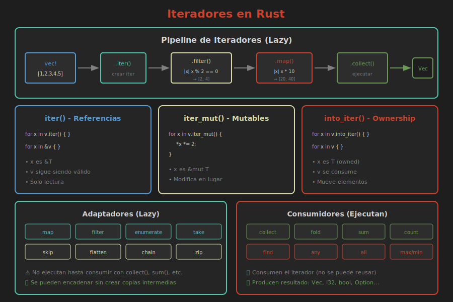

# 📚 Iteradores Básicos

> **El patrón funcional de Rust para procesar colecciones**

## 🎯 Objetivos

- Entender qué son los iteradores
- Usar `iter()`, `iter_mut()`, `into_iter()`
- Aplicar adaptadores comunes: map, filter, fold
- Entender lazy evaluation

---

## 🧠 ¿Qué es un Iterador?

Un **iterador** es un patrón que permite:

- Procesar elementos **uno a uno**
- Combinar operaciones de forma **elegante**
- Evaluar de forma **lazy** (perezosa)
- Escribir código **funcional** y legible



---

## 📝 Crear Iteradores

### `iter()` - Referencias inmutables

```rust
let v = vec![1, 2, 3];

for n in v.iter() {
    println!("{}", n);  // n es &i32
}

// v sigue siendo válido
println!("{:?}", v);
```

### `iter_mut()` - Referencias mutables

```rust
let mut v = vec![1, 2, 3];

for n in v.iter_mut() {
    *n *= 2;  // n es &mut i32
}

println!("{:?}", v);  // [2, 4, 6]
```

### `into_iter()` - Consumir la colección

```rust
let v = vec![String::from("a"), String::from("b")];

for s in v.into_iter() {
    println!("{}", s);  // s es String (ownership)
}

// ❌ v ya no es válido
// println!("{:?}", v);
```

### Resumen de tipos

| Método | Tipo de elemento | La colección... |
|--------|------------------|-----------------|
| `iter()` | `&T` | Sigue válida |
| `iter_mut()` | `&mut T` | Sigue válida (modificada) |
| `into_iter()` | `T` | Se consume |

---

## 🔄 Adaptadores (Transformaciones)

Los adaptadores **transforman** un iterador en otro. Son **lazy**: no hacen nada hasta que se consume el resultado.

### `map` - Transformar elementos

```rust
let v = vec![1, 2, 3, 4, 5];

// Duplicar cada elemento
let duplicados: Vec<i32> = v.iter()
    .map(|x| x * 2)
    .collect();

println!("{:?}", duplicados);  // [2, 4, 6, 8, 10]
```

### `filter` - Filtrar elementos

```rust
let v = vec![1, 2, 3, 4, 5, 6, 7, 8, 9, 10];

// Solo números pares
let pares: Vec<&i32> = v.iter()
    .filter(|x| *x % 2 == 0)
    .collect();

println!("{:?}", pares);  // [2, 4, 6, 8, 10]
```

### `map` + `filter` combinados

```rust
let v = vec![1, 2, 3, 4, 5];

// Duplicar pares
let resultado: Vec<i32> = v.iter()
    .filter(|x| *x % 2 == 0)  // Solo pares
    .map(|x| x * 2)           // Duplicar
    .collect();

println!("{:?}", resultado);  // [4, 8]
```

### `filter_map` - Filtrar y transformar

```rust
let strings = vec!["1", "dos", "3", "cuatro", "5"];

// Parsear solo los que son números válidos
let numeros: Vec<i32> = strings.iter()
    .filter_map(|s| s.parse().ok())
    .collect();

println!("{:?}", numeros);  // [1, 3, 5]
```

### `enumerate` - Agregar índices

```rust
let v = vec!["a", "b", "c"];

for (indice, valor) in v.iter().enumerate() {
    println!("[{}] = {}", indice, valor);
}
// [0] = a
// [1] = b
// [2] = c
```

### `take` y `skip`

```rust
let v = vec![1, 2, 3, 4, 5, 6, 7, 8, 9, 10];

// Primeros 3
let primeros: Vec<&i32> = v.iter().take(3).collect();
println!("{:?}", primeros);  // [1, 2, 3]

// Saltar 5, tomar resto
let resto: Vec<&i32> = v.iter().skip(5).collect();
println!("{:?}", resto);  // [6, 7, 8, 9, 10]

// Combinados: elementos 3 al 6
let medio: Vec<&i32> = v.iter().skip(2).take(4).collect();
println!("{:?}", medio);  // [3, 4, 5, 6]
```

### `flatten` - Aplanar iteradores anidados

```rust
let nested = vec![vec![1, 2], vec![3, 4], vec![5, 6]];

let flat: Vec<&i32> = nested.iter()
    .flatten()
    .collect();

println!("{:?}", flat);  // [1, 2, 3, 4, 5, 6]
```

### `chain` - Encadenar iteradores

```rust
let a = vec![1, 2, 3];
let b = vec![4, 5, 6];

let combinado: Vec<&i32> = a.iter()
    .chain(b.iter())
    .collect();

println!("{:?}", combinado);  // [1, 2, 3, 4, 5, 6]
```

---

## 📊 Consumidores (Resultados)

Los consumidores **ejecutan** el iterador y producen un resultado final.

### `collect` - Recolectar en colección

```rust
let v = vec![1, 2, 3, 4, 5];

// Recolectar en Vec
let vec_result: Vec<i32> = v.iter().map(|x| x * 2).collect();

// Recolectar en HashSet
use std::collections::HashSet;
let set_result: HashSet<i32> = v.iter().copied().collect();

// Recolectar en String
let chars = vec!['H', 'o', 'l', 'a'];
let string: String = chars.iter().collect();
```

### `fold` - Reducir a un valor

```rust
let v = vec![1, 2, 3, 4, 5];

// Suma con fold
let suma = v.iter().fold(0, |acc, x| acc + x);
println!("Suma: {}", suma);  // 15

// Producto con fold
let producto = v.iter().fold(1, |acc, x| acc * x);
println!("Producto: {}", producto);  // 120

// Concatenar strings
let palabras = vec!["Hola", " ", "mundo"];
let frase = palabras.iter().fold(String::new(), |mut acc, s| {
    acc.push_str(s);
    acc
});
println!("{}", frase);  // "Hola mundo"
```

### `sum` y `product`

```rust
let v = vec![1, 2, 3, 4, 5];

let suma: i32 = v.iter().sum();       // 15
let producto: i32 = v.iter().product(); // 120
```

### `count` y `len`

```rust
let v = vec![1, 2, 3, 4, 5];

// count() consume el iterador
let pares = v.iter().filter(|x| *x % 2 == 0).count();
println!("Pares: {}", pares);  // 2
```

### `find` - Buscar elemento

```rust
let v = vec![1, 2, 3, 4, 5];

// Primer par
let primer_par = v.iter().find(|x| *x % 2 == 0);
println!("{:?}", primer_par);  // Some(&2)

// Primer mayor a 10
let mayor_10 = v.iter().find(|x| **x > 10);
println!("{:?}", mayor_10);  // None
```

### `any` y `all`

```rust
let v = vec![2, 4, 6, 8, 10];

// ¿Alguno es impar?
let hay_impar = v.iter().any(|x| x % 2 != 0);
println!("{}", hay_impar);  // false

// ¿Todos son pares?
let todos_pares = v.iter().all(|x| x % 2 == 0);
println!("{}", todos_pares);  // true
```

### `min`, `max`, `min_by_key`, `max_by_key`

```rust
let v = vec![3, 1, 4, 1, 5, 9, 2, 6];

println!("Min: {:?}", v.iter().min());  // Some(&1)
println!("Max: {:?}", v.iter().max());  // Some(&9)

// Con structs
struct Persona {
    nombre: String,
    edad: u32,
}

let personas = vec![
    Persona { nombre: "Ana".into(), edad: 25 },
    Persona { nombre: "Bob".into(), edad: 30 },
    Persona { nombre: "Carlos".into(), edad: 20 },
];

let mas_joven = personas.iter().min_by_key(|p| p.edad);
println!("Más joven: {}", mas_joven.unwrap().nombre);  // Carlos
```

---

## 🦥 Lazy Evaluation

Los iteradores son **lazy**: no hacen nada hasta que se consume el resultado.

```rust
let v = vec![1, 2, 3, 4, 5];

// Esto NO hace nada (lazy)
let iter = v.iter().map(|x| {
    println!("Procesando {}", x);
    x * 2
});

// Recién aquí se ejecuta
let resultado: Vec<_> = iter.collect();
```

### Ventajas de lazy evaluation

1. **Eficiencia**: Solo procesa lo necesario
2. **Composición**: Combinar operaciones sin copias intermedias
3. **Cortocircuito**: `find`, `any`, `all` pueden terminar temprano

```rust
let v = vec![1, 2, 3, 4, 5, 6, 7, 8, 9, 10];

// Solo procesa hasta encontrar el primero
let primero = v.iter()
    .filter(|x| {
        println!("Filtrando {}", x);
        *x % 2 == 0
    })
    .find(|x| **x > 3);

// Solo imprime "Filtrando" para 1, 2, 3, 4
println!("{:?}", primero);  // Some(&4)
```

---

## 🎯 Patrones Comunes

### Transformar Vec de un tipo a otro

```rust
let strings = vec!["1", "2", "3"];

let numeros: Vec<i32> = strings.iter()
    .map(|s| s.parse().unwrap())
    .collect();
```

### Filtrar y mapear

```rust
struct Producto {
    nombre: String,
    precio: f64,
    en_stock: bool,
}

let productos = vec![/* ... */];

// Nombres de productos en stock por menos de $50
let ofertas: Vec<&str> = productos.iter()
    .filter(|p| p.en_stock && p.precio < 50.0)
    .map(|p| p.nombre.as_str())
    .collect();
```

### Sumar campo de structs

```rust
let total: f64 = productos.iter()
    .filter(|p| p.en_stock)
    .map(|p| p.precio)
    .sum();
```

### Agrupar elementos

```rust
use std::collections::HashMap;

let palabras = vec!["rust", "es", "rápido", "y", "seguro"];

let por_longitud: HashMap<usize, Vec<&str>> = palabras.iter()
    .fold(HashMap::new(), |mut acc, palabra| {
        acc.entry(palabra.len()).or_default().push(*palabra);
        acc
    });
```

---

## ⚠️ `copied()` y `cloned()`

Cuando iteras con `iter()`, obtienes referencias. A veces necesitas valores.

```rust
let v = vec![1, 2, 3];

// iter() da &i32
let refs: Vec<&i32> = v.iter().collect();

// copied() convierte &T a T (para tipos Copy)
let vals: Vec<i32> = v.iter().copied().collect();

// cloned() convierte &T a T (llama clone())
let cloned: Vec<i32> = v.iter().cloned().collect();
```

---

## 🎯 Ejercicio Rápido

```rust
fn main() {
    let numeros = vec![1, 2, 3, 4, 5, 6, 7, 8, 9, 10];
    
    // 1. Filtra solo impares
    // 2. Eleva al cuadrado
    // 3. Suma todos
    // Resultado esperado: 1 + 9 + 25 + 49 + 81 = 165
    
    // Tu código aquí...
}
```

<details>
<summary>Ver solución</summary>

```rust
fn main() {
    let numeros = vec![1, 2, 3, 4, 5, 6, 7, 8, 9, 10];
    
    let suma: i32 = numeros.iter()
        .filter(|x| *x % 2 != 0)  // Impares
        .map(|x| x * x)           // Cuadrado
        .sum();                    // Sumar
    
    println!("Suma: {}", suma);  // 165
}
```

</details>

---

## 📖 Resumen

| Adaptador | Función |
|-----------|---------|
| `map` | Transforma cada elemento |
| `filter` | Filtra por condición |
| `enumerate` | Agrega índices |
| `take(n)` | Toma primeros n |
| `skip(n)` | Salta primeros n |
| `flatten` | Aplana anidados |
| `chain` | Encadena iteradores |

| Consumidor | Resultado |
|------------|-----------|
| `collect` | Colección |
| `fold` | Valor reducido |
| `sum` / `product` | Suma / Producto |
| `count` | Cantidad |
| `find` | Option del primero que cumple |
| `any` / `all` | bool |
| `min` / `max` | Option del extremo |

---

**Anterior**: [03 - HashMaps](03-hashmaps.md)  
**Siguiente**: [05 - Patrones y Buenas Prácticas](05-patrones-colecciones.md)
