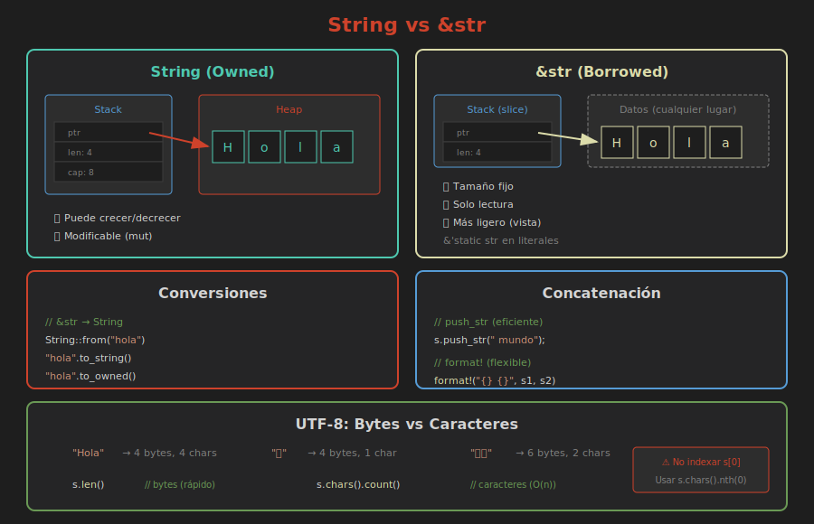

# 📚 Strings en Rust

> **String vs &str: Entendiendo el texto en Rust**

## 🎯 Objetivos

- Diferenciar `String` y `&str`
- Crear y manipular Strings
- Entender UTF-8 en Rust
- Trabajar con slices de string

---

## 🧠 Dos Tipos de Strings

Rust tiene dos tipos principales para texto:

| Tipo | Almacenamiento | Propiedad | Modificable |
|------|----------------|-----------|-------------|
| `String` | Heap | Owned | ✅ Sí |
| `&str` | Stack/Heap | Borrowed | ❌ No |



---

## 📝 String (Owned)

### ¿Qué es?

- Una cadena **propietaria** almacenada en el heap
- Puede **crecer o decrecer**
- Implementa `Drop` (se libera automáticamente)

### Crear Strings

```rust
// Desde literal
let s1 = String::from("Hola mundo");

// Método to_string() en &str
let s2 = "Hola mundo".to_string();

// String vacío
let s3 = String::new();

// Con capacidad inicial
let s4 = String::with_capacity(100);

// Desde caracteres
let s5: String = ['H', 'o', 'l', 'a'].iter().collect();
```

---

## 📝 &str (Borrowed)

### ¿Qué es?

- Un **slice** (vista) de una cadena
- Referencia a datos que existen en otro lugar
- **Inmutable** por defecto
- También llamado "string slice"

### Literales de String

```rust
// Los literales son &'static str
let saludo: &str = "Hola mundo";

// &str también puede ser un slice de String
let s = String::from("Hola mundo");
let slice: &str = &s[0..4];  // "Hola"
```

---

## 🔄 Conversiones

### De &str a String

```rust
let slice: &str = "Hola";

// Opción 1: String::from()
let string1 = String::from(slice);

// Opción 2: to_string()
let string2 = slice.to_string();

// Opción 3: to_owned()
let string3 = slice.to_owned();

// Opción 4: into()
let string4: String = slice.into();
```

### De String a &str

```rust
let string = String::from("Hola");

// Automático por deref coercion
let slice: &str = &string;

// Explícito con as_str()
let slice = string.as_str();
```

---

## ➕ Concatenación

### Método `push` y `push_str`

```rust
let mut s = String::from("Hola");

s.push(' ');           // Agregar un char
s.push_str("mundo");   // Agregar un &str

println!("{}", s);     // "Hola mundo"
```

### Operador `+`

```rust
let s1 = String::from("Hola");
let s2 = String::from(" mundo");

// s1 se mueve, s2 se presta
let s3 = s1 + &s2;
// s1 ya no es válido
// s2 sigue siendo válido

println!("{}", s3);  // "Hola mundo"
```

> ⚠️ El operador `+` consume el primer String.

### Macro `format!`

```rust
let s1 = String::from("Hola");
let s2 = String::from("mundo");

// No consume ninguno - más flexible
let s3 = format!("{} {}", s1, s2);

println!("{}", s1);  // ✅ s1 sigue válido
println!("{}", s2);  // ✅ s2 sigue válido
println!("{}", s3);  // "Hola mundo"
```

> 💡 **Preferir** `format!` para concatenación compleja.

---

## 📖 Acceso a Caracteres

### ⚠️ No indexación directa

```rust
let s = String::from("Hola");

// ❌ ERROR: Rust no permite indexar strings
// let h = s[0];
```

### ¿Por qué?

Rust usa **UTF-8**, donde los caracteres pueden ocupar 1-4 bytes:

```rust
let hola = "Hola";     // 4 bytes, 4 chars
let emoji = "🦀";      // 4 bytes, 1 char
let ruso = "Здравствуйте";  // 24 bytes, 12 chars
```

### Acceso seguro

```rust
let s = String::from("Hola 🦀");

// Por bytes
for b in s.bytes() {
    println!("{}", b);  // Valores numéricos de bytes
}

// Por caracteres (chars)
for c in s.chars() {
    println!("{}", c);  // H, o, l, a, , 🦀
}

// Con índices
for (i, c) in s.char_indices() {
    println!("[{}] {}", i, c);
}
```

### Obtener un carácter específico

```rust
let s = String::from("Hola");

// Opción 1: nth() - O(n)
let tercero = s.chars().nth(2);  // Some('l')

// Opción 2: Convertir a Vec<char>
let chars: Vec<char> = s.chars().collect();
let tercero = chars[2];  // 'l'
```

---

## ✂️ Slicing

### Slices válidos (por bytes)

```rust
let s = String::from("Hola mundo");

let hola = &s[0..4];   // "Hola"
let mundo = &s[5..];   // "mundo"
let todo = &s[..];     // "Hola mundo"
```

### ⚠️ Cuidado con UTF-8

```rust
let s = String::from("Здравствуйте");

// Cada carácter cirílico ocupa 2 bytes
let slice = &s[0..4];  // ✅ "Зд" (2 caracteres)
// let slice = &s[0..1];  // ❌ PANIC: no es límite de char
```

---

## 🔧 Métodos Útiles

### Información

```rust
let s = String::from("Hola mundo");

s.len()           // 10 (bytes, no caracteres)
s.is_empty()      // false
s.chars().count() // 10 (caracteres)
```

### Búsqueda

```rust
let s = String::from("Hola mundo");

s.contains("mundo")      // true
s.starts_with("Hola")    // true
s.ends_with("mundo")     // true
s.find("mundo")          // Some(5)
```

### Transformación

```rust
let s = String::from("  Hola Mundo  ");

s.to_lowercase()     // "  hola mundo  "
s.to_uppercase()     // "  HOLA MUNDO  "
s.trim()             // "Hola Mundo"
s.replace("Mundo", "Rust")  // "  Hola Rust  "
```

### División

```rust
let s = String::from("uno,dos,tres");

// Split devuelve un iterador
for parte in s.split(',') {
    println!("{}", parte);
}

// Colectar en Vec
let partes: Vec<&str> = s.split(',').collect();
// ["uno", "dos", "tres"]

// Dividir por líneas
let texto = "línea 1\nlínea 2\nlínea 3";
for linea in texto.lines() {
    println!("{}", linea);
}
```

### Modificación (requiere mut)

```rust
let mut s = String::from("Hola");

s.clear();              // Vaciar
s.truncate(2);          // Mantener solo primeros 2 bytes
s.insert(0, '¡');       // Insertar char
s.insert_str(5, "!");   // Insertar &str
```

---

## 🎯 Patrones Comunes

### Función que acepta cualquier string

```rust
// ✅ Acepta &str y &String (por deref coercion)
fn saludar(nombre: &str) {
    println!("Hola, {}!", nombre);
}

// Uso
saludar("Mundo");                    // &str literal
saludar(&String::from("Rust"));      // &String → &str
```

### Función que necesita ownership

```rust
// Acepta String (toma ownership)
fn guardar_nombre(nombre: String) {
    // Ahora es dueño del String
}

// O genérica con Into<String>
fn guardar_nombre<S: Into<String>>(nombre: S) {
    let nombre = nombre.into();
}
```

---

## ⚠️ Errores Comunes

### Error 1: Indexación directa

```rust
// ❌ No compila
let s = String::from("Hola");
let c = s[0];

// ✅ Correcto
let c = s.chars().next().unwrap();
```

### Error 2: Slice en medio de carácter UTF-8

```rust
// ❌ Panic en runtime
let s = "🦀🦀🦀";
let slice = &s[0..2];  // 🦀 ocupa 4 bytes

// ✅ Correcto
let slice = &s[0..4];  // "🦀"
```

### Error 3: Concatenar sin considerar ownership

```rust
// ❌ s1 ya no es válido después
let s1 = String::from("Hola");
let s2 = s1 + " mundo";
println!("{}", s1);  // ERROR

// ✅ Usar format! o clone()
let s1 = String::from("Hola");
let s2 = format!("{} mundo", s1);
println!("{}", s1);  // OK
```

---

## 🎯 Ejercicio Rápido

```rust
fn main() {
    let frase = String::from("rust es genial");
    
    // 1. Convierte a mayúsculas
    // 2. Reemplaza "genial" por "INCREÍBLE"
    // 3. Cuenta las palabras
    // 4. Imprime el resultado
    
    // Tu código aquí...
}
```

<details>
<summary>Ver solución</summary>

```rust
fn main() {
    let frase = String::from("rust es genial");
    
    let mayusculas = frase.to_uppercase();
    let reemplazado = mayusculas.replace("GENIAL", "INCREÍBLE");
    let palabras = reemplazado.split_whitespace().count();
    
    println!("{}", reemplazado);  // "RUST ES INCREÍBLE"
    println!("Palabras: {}", palabras);  // 3
}
```

</details>

---

## 📖 Resumen

| Operación | String | &str |
|-----------|--------|------|
| Crear | `String::from()`, `to_string()` | Literal `"..."` |
| Modificar | ✅ `push`, `push_str` | ❌ Inmutable |
| Concatenar | `+`, `format!` | Solo con `format!` |
| Tamaño | Dinámico | Fijo |
| Almacenamiento | Heap | Depende |

---

**Anterior**: [01 - Vectores](01-vectores.md)  
**Siguiente**: [03 - HashMaps](03-hashmaps.md)
