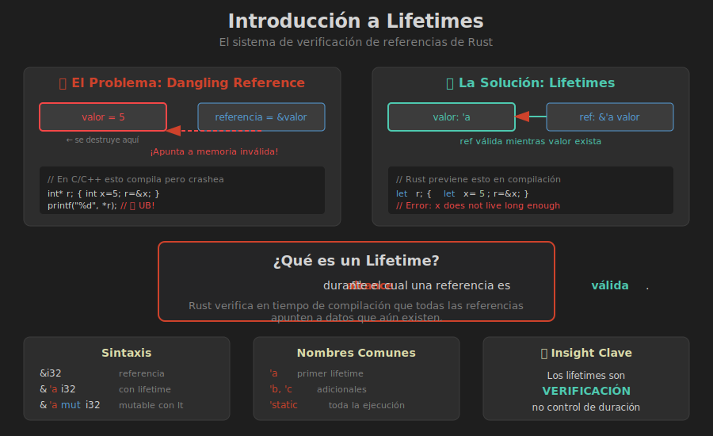

# 📚 Introducción a Lifetimes



## 🎯 Objetivos de Aprendizaje

- Comprender qué son los lifetimes
- Entender por qué Rust los necesita
- Visualizar el concepto de "alcance de validez"

---

## 🤔 ¿Qué Problema Resuelven los Lifetimes?

### El Problema: Dangling References

En lenguajes sin gestión automática de memoria, es fácil crear **referencias colgantes**:

```rust
// ❌ Esto NO compila en Rust
fn main() {
    let referencia;
    {
        let valor = 5;
        referencia = &valor;  // valor se destruye aquí
    }
    println!("{}", referencia);  // ¡Referencia a memoria inválida!
}
```

```
error[E0597]: `valor` does not live long enough
 --> src/main.rs:5:21
  |
4 |         let valor = 5;
5 |         referencia = &valor;
  |                      ^^^^^^ borrowed value does not live long enough
6 |     }
  |     - `valor` dropped here while still borrowed
7 |     println!("{}", referencia);
  |                    ---------- borrow later used here
```

### La Solución: Lifetimes

Los **lifetimes** son la forma que tiene Rust de **verificar en tiempo de compilación** que todas las referencias son válidas.

---

## 📖 ¿Qué es un Lifetime?

> Un **lifetime** es el alcance durante el cual una referencia es válida.

### Concepto Clave

```rust
fn main() {
    let x = 5;            // ─────────┬─── 'a comienza
    let r = &x;           //          │
    println!("{}", r);    //          │
}                         // ─────────┴─── 'a termina
```

El lifetime `'a` representa el tiempo durante el cual `x` existe y `r` puede referenciarlo de forma segura.

### Lifetimes vs Scopes

| Concepto | Descripción |
|----------|-------------|
| **Scope** | Región del código donde un nombre es visible |
| **Lifetime** | Región donde una referencia es válida |

```rust
fn main() {
    let r;                  // Scope de r comienza
    {
        let x = 5;          // Lifetime de x comienza
        r = &x;             // r referencia a x
    }                       // Lifetime de x TERMINA
    // r todavía está en scope, pero su lifetime NO es válido
}
```

---

## 🔍 El Borrow Checker

El **borrow checker** es el componente del compilador que verifica lifetimes:

```rust
fn main() {
    let string1 = String::from("hola");
    let string2 = String::from("mundo más largo");
    
    let resultado = longest(&string1, &string2);
    println!("El más largo es: {}", resultado);
}

// ❌ Esto NO compila
fn longest(x: &str, y: &str) -> &str {
    if x.len() > y.len() {
        x
    } else {
        y
    }
}
```

```
error[E0106]: missing lifetime specifier
 --> src/main.rs:10:33
   |
10 | fn longest(x: &str, y: &str) -> &str {
   |               ----     ----     ^ expected named lifetime parameter
   |
   = help: this function's return type contains a borrowed value,
     but the signature does not say whether it is borrowed from `x` or `y`
```

### ¿Por Qué el Error?

El compilador no sabe:
- ¿El valor retornado viene de `x` o de `y`?
- ¿Cuánto tiempo debe ser válida la referencia retornada?

---

## 🏷️ Sintaxis de Anotaciones

### Nomenclatura

```rust
&i32        // una referencia
&'a i32     // una referencia con lifetime explícito 'a
&'a mut i32 // una referencia mutable con lifetime 'a
```

### Convenciones de Nombres

| Nombre | Uso |
|--------|-----|
| `'a` | Primer lifetime (más común) |
| `'b` | Segundo lifetime |
| `'c`, `'d`... | Lifetimes adicionales |
| `'static` | Lifetime especial: toda la ejecución |
| `'_` | Lifetime anónimo/inferido |

---

## 💡 Analogía: Préstamo de Libros

Piensa en lifetimes como préstamos en una biblioteca:

```
┌─────────────────────────────────────────┐
│          BIBLIOTECA (Programa)          │
├─────────────────────────────────────────┤
│                                         │
│   📚 Libro (valor)                      │
│   ├── Propietario: Estante A            │
│   └── Lifetime: mientras esté en A      │
│                                         │
│   📋 Ficha de préstamo (referencia)     │
│   ├── Apunta a: Libro                   │
│   └── Válida mientras libro exista      │
│                                         │
│   ❌ Si el libro se devuelve/destruye,  │
│      la ficha ya no es válida           │
│                                         │
└─────────────────────────────────────────┘
```

---

## ✅ Verificación de Comprensión

### Pregunta 1
¿Por qué este código no compila?

```rust
fn main() {
    let r;
    {
        let x = 5;
        r = &x;
    }
    println!("{}", r);
}
```

<details>
<summary>Ver respuesta</summary>

`x` se destruye al final del bloque interno, pero `r` intenta usarlo después. El lifetime de la referencia excede el lifetime del valor.

</details>

### Pregunta 2
¿Qué garantizan los lifetimes?

<details>
<summary>Ver respuesta</summary>

Que las referencias siempre apuntan a datos válidos. Nunca tendrás una referencia colgante (dangling reference) en Rust seguro.

</details>

---

## 📌 Puntos Clave

1. **Lifetimes** = alcance de validez de referencias
2. **Propósito** = prevenir dangling references
3. **Verificación** = en tiempo de compilación (zero-cost)
4. **Sintaxis** = `'a`, `'b`, etc.
5. **Borrow checker** = verifica que lifetimes sean válidos

---

## 🔗 Próximo Tema

En el siguiente módulo aprenderemos a **anotar lifetimes en funciones** para resolver errores como el de `longest`.

→ [02 - Lifetimes en Funciones](02-lifetimes-funciones.md)
