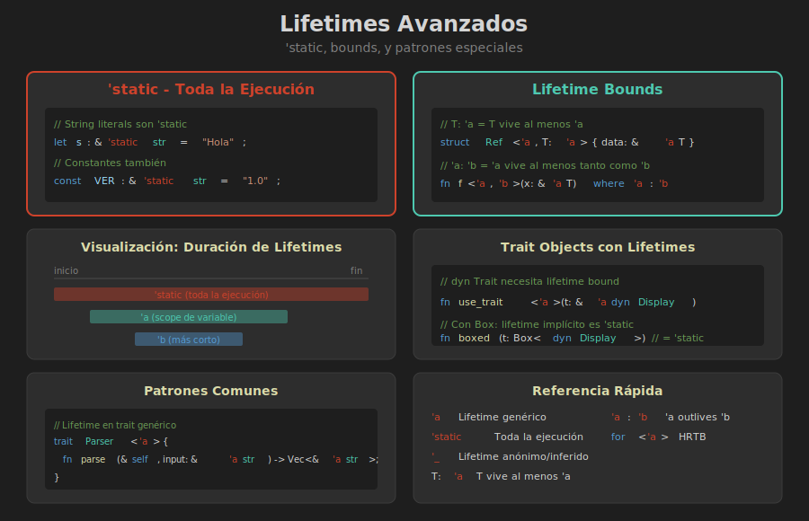

# 📚 Lifetimes Avanzados



## 🎯 Objetivos de Aprendizaje

- Entender el lifetime `'static`
- Usar lifetime bounds (`T: 'a`, `'a: 'b`)
- Aplicar patrones avanzados de lifetimes

---

## 🌟 El Lifetime 'static

### ¿Qué es 'static?

`'static` indica que una referencia **puede** vivir durante toda la ejecución del programa.

```rust
// String literals tienen lifetime 'static
let s: &'static str = "Hola mundo";

// Vive en el binario del programa, siempre disponible
```

### Casos de 'static

#### 1. String Literals

```rust
fn get_greeting() -> &'static str {
    "¡Hola!"  // Compilado en el binario
}
```

#### 2. Constantes

```rust
const CONFIG: &'static str = "production";
static VERSION: &'static str = "1.0.0";
```

#### 3. Valores Leaked (avanzado)

```rust
fn create_static() -> &'static str {
    let s = String::from("leaked");
    Box::leak(s.into_boxed_str())  // Memory leak intencional
}
```

### ⚠️ 'static NO Significa Inmutable

```rust
use std::sync::Mutex;

// 'static + mutable
static COUNTER: Mutex<i32> = Mutex::new(0);

fn increment() {
    *COUNTER.lock().unwrap() += 1;
}
```

---

## 🔗 Lifetime Bounds

### T: 'a - "T vive al menos tanto como 'a"

```rust
struct Wrapper<'a, T: 'a> {
    value: &'a T,
}
```

**Significado:** El tipo `T` debe tener un lifetime de al menos `'a`.

### Ejemplo Práctico

```rust
struct Ref<'a, T: 'a> {
    data: &'a T,
}

impl<'a, T: 'a> Ref<'a, T> {
    fn new(data: &'a T) -> Self {
        Ref { data }
    }
    
    fn get(&self) -> &T {
        self.data
    }
}
```

### 'a: 'b - "a outlives b"

```rust
fn process<'a, 'b>(x: &'a str, y: &'b str) -> &'b str
where
    'a: 'b,  // 'a vive al menos tanto como 'b
{
    if x.len() > 0 { y } else { y }
}
```

---

## 🎯 Patrones Avanzados

### Patrón 1: Trait Objects con Lifetime

```rust
trait Processor {
    fn process(&self) -> &str;
}

// Trait object con lifetime
fn use_processor<'a>(p: &'a dyn Processor) -> &'a str {
    p.process()
}

// Con Box
fn boxed_processor<'a>(p: Box<dyn Processor + 'a>) -> &'a str {
    p.process()
}
```

### Patrón 2: Lifetime en Traits

```rust
trait Parser<'a> {
    fn parse(&self, input: &'a str) -> Vec<&'a str>;
}

struct SimpleParser;

impl<'a> Parser<'a> for SimpleParser {
    fn parse(&self, input: &'a str) -> Vec<&'a str> {
        input.split_whitespace().collect()
    }
}
```

### Patrón 3: Higher-Ranked Trait Bounds (HRTB)

```rust
// "Para cualquier lifetime 'a"
fn process<F>(f: F)
where
    F: for<'a> Fn(&'a str) -> &'a str,
{
    let s = String::from("hola");
    let result = f(&s);
    println!("{}", result);
}
```

---

## 📝 Combinando Lifetimes y Genéricos

### Struct con Lifetime y Tipo Genérico

```rust
struct Container<'a, T> {
    name: &'a str,
    value: T,
}

impl<'a, T> Container<'a, T> {
    fn new(name: &'a str, value: T) -> Self {
        Container { name, value }
    }
    
    fn name(&self) -> &str {
        self.name
    }
    
    fn value(&self) -> &T {
        &self.value
    }
}
```

### Con Trait Bounds

```rust
use std::fmt::Display;

struct Labeled<'a, T: Display> {
    label: &'a str,
    value: T,
}

impl<'a, T: Display> Labeled<'a, T> {
    fn describe(&self) -> String {
        format!("{}: {}", self.label, self.value)
    }
}
```

---

## 🔄 Covariance y Contravariance

### Covariance (lo más común)

```rust
// &'a T es covariante en 'a
// Si 'long: 'short, entonces &'long T puede usarse donde se espera &'short T

fn example<'short, 'long: 'short>(long_ref: &'long str) -> &'short str {
    long_ref  // OK: 'long vive más, puede "reducirse" a 'short
}
```

### Invariance (con &mut)

```rust
// &'a mut T es invariante en T
// No puedes sustituir lifetimes libremente

fn no_extend<'a>(r: &mut &'a str, s: &'a str) {
    *r = s;
}
```

---

## ⚠️ Errores Comunes Avanzados

### Error 1: Confundir 'static con "siempre válido"

```rust
// ❌ Pensar que esto funciona
fn bad<'a>() -> &'a str {
    let s = String::from("temp");
    &s  // Error: s no es 'static
}

// ✅ Correcto con 'static
fn good() -> &'static str {
    "literal"  // OK: los literals son 'static
}
```

### Error 2: Bounds Innecesarios

```rust
// ❌ Redundante en Rust moderno
struct Old<'a, T: 'a> {
    data: &'a T,
}

// ✅ Rust infiere T: 'a automáticamente
struct Modern<'a, T> {
    data: &'a T,
}
```

### Error 3: HRTB Incorrecto

```rust
// ❌ Error común
fn bad<'a, F: Fn(&'a str)>(f: F, s: &'a str) {
    f(s);
}

// ✅ Si necesitas que F funcione con cualquier lifetime
fn good<F>(f: F)
where
    F: for<'a> Fn(&'a str),
{
    let s = String::from("temp");
    f(&s);
}
```

---

## 📊 Tabla de Referencia Rápida

| Sintaxis | Significado |
|----------|-------------|
| `'a` | Un lifetime genérico |
| `'static` | Vive toda la ejecución |
| `'_` | Lifetime anónimo/inferido |
| `T: 'a` | T vive al menos 'a |
| `'a: 'b` | 'a vive al menos tanto como 'b |
| `for<'a>` | Para cualquier lifetime 'a |

---

## ✅ Verificación de Comprensión

### Ejercicio 1
¿Cuál es la diferencia entre estas dos funciones?

```rust
fn a() -> &'static str { "hola" }
fn b<'a>() -> &'a str { "hola" }
```

<details>
<summary>Ver respuesta</summary>

- `a()` retorna explícitamente una referencia `'static`
- `b()` tiene un lifetime genérico `'a`, pero como retorna un literal, Rust lo trata como `'static` de todos modos

En la práctica, `a` es más claro sobre la intención.

</details>

### Ejercicio 2
¿Por qué esto compila?

```rust
fn use_short<'a, 'b: 'a>(long: &'b str) -> &'a str {
    long
}
```

<details>
<summary>Ver respuesta</summary>

El bound `'b: 'a` significa que `'b` vive al menos tanto como `'a`. Por lo tanto, es seguro retornar `long` (con lifetime `'b`) como algo con lifetime `'a`, porque `'b` es "más largo".

</details>

---

## 📌 Puntos Clave

1. `'static` = puede vivir toda la ejecución (no significa inmutable)
2. `T: 'a` = tipo T vive al menos tanto como 'a
3. `'a: 'b` = lifetime 'a outlives 'b
4. HRTB (`for<'a>`) = para cualquier lifetime posible
5. En Rust moderno, muchos bounds se infieren automáticamente

---

## 🎉 Resumen del Módulo

Has aprendido:
- ✅ Qué son los lifetimes y por qué existen
- ✅ Cómo anotar lifetimes en funciones
- ✅ Cómo usar lifetimes en structs
- ✅ Las 3 reglas de elision
- ✅ Conceptos avanzados: 'static, bounds, HRTB

¡Ahora estás listo para practicar!

→ [Prácticas de la Semana 11](../2-practica/)
