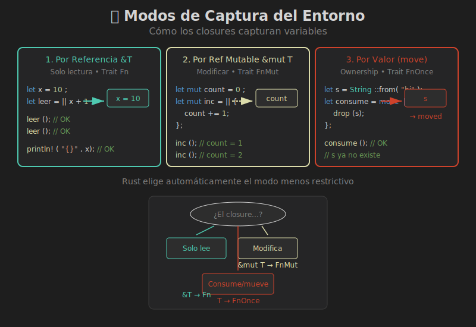

# 📚 Captura del Entorno



## 🎯 Objetivos de Aprendizaje

- Entender los tres modos de captura
- Saber cuándo usar `move`
- Predecir cómo el compilador captura variables

---

## 🤔 ¿Qué es Captura del Entorno?

Los closures pueden **capturar** variables del scope donde se definen:

```rust
fn main() {
    let mensaje = String::from("Hola");
    
    // El closure "captura" la variable mensaje
    let imprimir = || println!("{}", mensaje);
    
    imprimir();  // Usa 'mensaje' del entorno
}
```

---

## 📋 Los Tres Modos de Captura

Rust tiene tres formas de capturar variables:

| Modo | Captura como | Trait | Uso |
|------|--------------|-------|-----|
| Por referencia | `&T` | `Fn` | Solo leer |
| Por referencia mutable | `&mut T` | `FnMut` | Modificar |
| Por valor (move) | `T` | `FnOnce` | Tomar ownership |

---

## 1️⃣ Captura por Referencia (`&T`)

El closure toma prestada la variable **inmutablemente**:

```rust
fn main() {
    let x = 10;
    
    // Captura &x (referencia inmutable)
    let leer_x = || println!("x = {}", x);
    
    leer_x();
    leer_x();  // Puede llamarse múltiples veces
    
    println!("x original: {}", x);  // x sigue disponible
}
```

### Visualización

```
Antes del closure:
┌─────────┐
│  x = 10 │
└─────────┘

Durante el closure:
┌─────────┐     ┌──────────────┐
│  x = 10 │ ◄── │ leer_x: &x   │
└─────────┘     └──────────────┘
```

---

## 2️⃣ Captura por Referencia Mutable (`&mut T`)

El closure toma prestada la variable **mutablemente**:

```rust
fn main() {
    let mut contador = 0;
    
    // Captura &mut contador
    let mut incrementar = || {
        contador += 1;
        println!("Contador: {}", contador);
    };
    
    incrementar();  // Contador: 1
    incrementar();  // Contador: 2
    
    // ❌ Error: no puedes usar contador mientras
    //    'incrementar' lo tiene prestado mutablemente
    // println!("{}", contador);
    
    // Después de que el closure deja de usarse:
    drop(incrementar);
    println!("Final: {}", contador);  // ✅ OK: 2
}
```

### Nota Importante

El closure mismo debe ser `mut`:

```rust
let mut contador = 0;
let mut inc = || contador += 1;  // 'inc' debe ser mut
//  ^^^
```

---

## 3️⃣ Captura por Valor (`move`)

El closure **toma ownership** de la variable:

```rust
fn main() {
    let s = String::from("hola");
    
    // move transfiere ownership de 's' al closure
    let consume = move || {
        println!("{}", s);
        drop(s);  // Podemos destruir s
    };
    
    consume();
    
    // ❌ Error: 's' ya fue movido al closure
    // println!("{}", s);
}
```

### Cuándo Usar `move`

1. **Threads**: El closure puede outlive el scope actual

```rust
use std::thread;

let data = vec![1, 2, 3];

// Sin move: ❌ error - data podría destruirse antes que el thread
// Con move: ✅ el thread tiene ownership de data
let handle = thread::spawn(move || {
    println!("{:?}", data);
});

handle.join().unwrap();
```

2. **Retornar closures**: Deben ownar sus datos

```rust
fn crear_contador() -> impl FnMut() -> i32 {
    let mut count = 0;
    move || {
        count += 1;
        count
    }
}

let mut contador = crear_contador();
println!("{}", contador());  // 1
println!("{}", contador());  // 2
```

---

## 🔍 Reglas de Captura Automática

Rust elige el modo **menos restrictivo** que funcione:

```rust
let s = String::from("hello");

// Solo lee s → captura &s
let len = || s.len();

// Modifica s → captura &mut s
let mut vec = Vec::new();
let mut push = || vec.push(1);

// Mueve s → captura s (ownership)
let consume = || drop(s);
```

### Diagrama de Decisión

```
¿El closure...?
     │
     ├── Solo lee la variable
     │        │
     │        └── Captura &T (Fn)
     │
     ├── Modifica la variable
     │        │
     │        └── Captura &mut T (FnMut)
     │
     └── Consume/mueve la variable
              │
              └── Captura T (FnOnce)
```

---

## 🔄 `move` con Tipos Copy

Para tipos `Copy`, `move` hace una **copia**:

```rust
let x = 42;  // i32 implementa Copy

let closure = move || println!("{}", x);

// x sigue disponible porque se copió
println!("Original: {}", x);
closure();
```

### Comparación

```rust
// Tipo NO Copy (String)
let s = String::from("hola");
let c = move || println!("{}", s);
// s ya no disponible ❌

// Tipo Copy (i32)
let n = 42;
let c = move || println!("{}", n);
println!("{}", n);  // n sigue disponible ✅
```

---

## 📊 Captura de Múltiples Variables

Un closure puede capturar múltiples variables con diferentes modos:

```rust
fn main() {
    let a = String::from("a");  // Se leerá
    let mut b = String::from("b");  // Se modificará
    let c = String::from("c");  // Se consumirá
    
    let closure = || {
        println!("{}", a);       // Captura &a
        b.push_str("!");         // Captura &mut b
        drop(c);                 // Captura c (move)
    };
    
    // El closure es FnOnce porque captura c por valor
}
```

---

## ⚠️ Patrones Problemáticos

### 1. Préstamo Durante Closure Activo

```rust
let mut data = vec![1, 2, 3];
let closure = || data.push(4);  // &mut data

// ❌ No puedes leer data mientras closure existe
// println!("{:?}", data);

closure();
drop(closure);  // Libera el préstamo
println!("{:?}", data);  // ✅ OK ahora
```

### 2. Captura Parcial de Structs

```rust
struct Punto { x: i32, y: i32 }

let mut p = Punto { x: 0, y: 0 };

// Rust captura todo el struct, no solo p.x
let closure = || p.x += 1;

// ❌ No puedes acceder a ningún campo
// println!("{}", p.y);
```

### Solución: Capturar Solo lo Necesario

```rust
let mut p = Punto { x: 0, y: 0 };

// Crear referencia antes
let x_ref = &mut p.x;
let closure = || *x_ref += 1;

// O mover campos específicos
let x = p.x;
let closure = move || println!("{}", x);
println!("{}", p.y);  // ✅ OK
```

---

## 💡 Trucos y Patrones

### Forzar Captura por Valor de Un Campo

```rust
let config = Config { timeout: 30, retries: 3 };

// Captura solo timeout por valor
let timeout = config.timeout;
let closure = move || println!("Timeout: {}", timeout);

// config sigue disponible
println!("{}", config.retries);
```

### Clone Antes de Move

```rust
let data = vec![1, 2, 3];
let data_clone = data.clone();

let closure = move || println!("{:?}", data_clone);

// data original sigue disponible
println!("{:?}", data);
```

---

## 🎯 Resumen

| Modo | Sintaxis | Captura | Trait | Puede llamarse |
|------|----------|---------|-------|----------------|
| Referencia | `\|\| expr` | `&T` | `Fn` | Múltiples veces |
| Ref. Mut | `\|\| expr` | `&mut T` | `FnMut` | Múltiples veces |
| Por valor | `move \|\| expr` | `T` | `FnOnce` | Una vez (si consume) |

### Cuándo Usar `move`

- ✅ Threads
- ✅ Retornar closures
- ✅ Cuando el closure debe outlive el scope
- ✅ Cuando necesitas ownership en el closure

---

## 🔗 Siguiente

[03 - Fn Traits](03-fn-traits.md)
