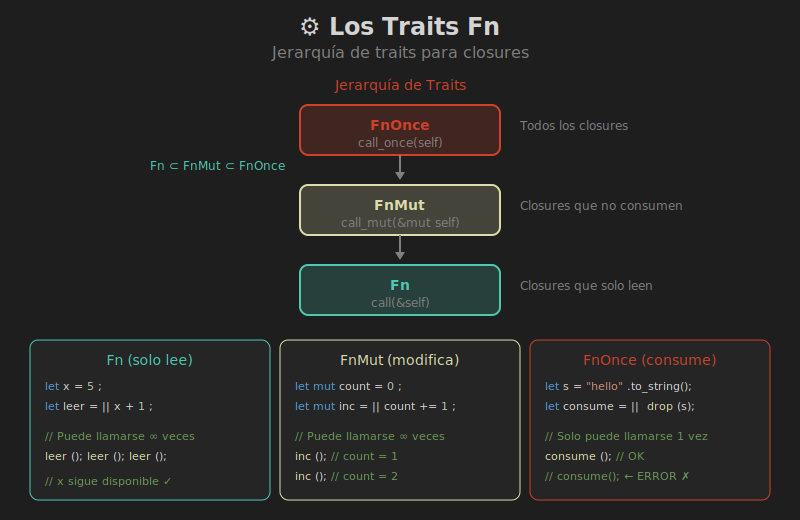

# 📚 Los Traits Fn



## 🎯 Objetivos de Aprendizaje

- Entender la jerarquía Fn, FnMut, FnOnce
- Elegir el trait correcto para cada situación
- Aplicar bounds de Fn en funciones genéricas

---

## 🤔 ¿Por Qué Tres Traits?

Cada modo de captura corresponde a un trait:

| Trait | Firma | Captura | Puede llamarse |
|-------|-------|---------|----------------|
| `Fn` | `&self` | `&T` | ∞ veces |
| `FnMut` | `&mut self` | `&mut T` | ∞ veces |
| `FnOnce` | `self` | `T` | 1 vez |

---

## 📊 Jerarquía de Traits

```
         FnOnce
           │
           │ (todos los closures)
           │
        FnMut
           │
           │ (closures que no consumen)
           │
          Fn
           │
           │ (closures que solo leen)
```

**Importante**: Todo `Fn` es también `FnMut`, y todo `FnMut` es también `FnOnce`.

```rust
// Este closure implementa los TRES traits
let x = 5;
let leer = || println!("{}", x);

// Funciona con cualquier bound:
fn usa_fn<F: Fn()>(f: F) { f(); f(); }
fn usa_fnmut<F: FnMut()>(mut f: F) { f(); f(); }
fn usa_fnonce<F: FnOnce()>(f: F) { f(); }

usa_fn(leer);      // ✅
usa_fnmut(leer);   // ✅
usa_fnonce(leer);  // ✅
```

---

## 1️⃣ Trait `Fn`

Closures que **solo leen** del entorno:

```rust
trait Fn<Args>: FnMut<Args> {
    fn call(&self, args: Args) -> Self::Output;
}
```

### Ejemplo

```rust
let mensaje = String::from("Hola");

// Solo lee 'mensaje' → implementa Fn
let saludar = || println!("{}", mensaje);

fn llamar_dos_veces<F: Fn()>(f: F) {
    f();
    f();
}

llamar_dos_veces(saludar);  // ✅ Funciona
```

### Cuándo Usar `Fn`

- Callbacks que se ejecutan múltiples veces
- Closures compartidos entre threads (`Fn + Sync`)
- Cuando no necesitas modificar el entorno

```rust
// Ejemplo: event handler
fn on_click<F: Fn()>(handler: F) {
    // El handler puede ejecutarse muchas veces
    handler();
    handler();
}
```

---

## 2️⃣ Trait `FnMut`

Closures que **modifican** el entorno:

```rust
trait FnMut<Args>: FnOnce<Args> {
    fn call_mut(&mut self, args: Args) -> Self::Output;
}
```

### Ejemplo

```rust
let mut total = 0;

// Modifica 'total' → implementa FnMut (no Fn)
let mut acumular = |x| total += x;

fn aplicar_a_lista<F: FnMut(i32)>(mut f: F, lista: &[i32]) {
    for &item in lista {
        f(item);
    }
}

aplicar_a_lista(acumular, &[1, 2, 3, 4, 5]);
println!("Total: {}", total);  // 15
```

### Cuándo Usar `FnMut`

- Acumuladores o contadores
- Closures que actualizan estado
- Iteradores como `map`, `filter`

```rust
// La mayoría de métodos de Iterator usan FnMut
let nums: Vec<i32> = vec![1, 2, 3]
    .into_iter()
    .map(|x| x * 2)  // FnMut
    .collect();
```

---

## 3️⃣ Trait `FnOnce`

Closures que **consumen** valores del entorno:

```rust
trait FnOnce<Args> {
    type Output;
    fn call_once(self, args: Args) -> Self::Output;
}
```

### Ejemplo

```rust
let mensaje = String::from("Adiós");

// Consume 'mensaje' → implementa SOLO FnOnce
let despedir = || {
    println!("{}", mensaje);
    drop(mensaje);  // Consume el String
};

fn ejecutar_una_vez<F: FnOnce()>(f: F) {
    f();
    // f();  // ❌ Error: f ya fue consumido
}

ejecutar_una_vez(despedir);
```

### Cuándo Usar `FnOnce`

- Cuando el closure necesita ownership
- Closures que se ejecutan exactamente una vez
- Threads (si no es `Fn + Send`)

```rust
// thread::spawn requiere FnOnce + Send
use std::thread;

let data = vec![1, 2, 3];
thread::spawn(move || {
    // Este closure es FnOnce porque mueve 'data'
    println!("{:?}", data);
});
```

---

## 🔄 Eligiendo el Trait Correcto

### Regla General

Usa el trait **más general** que funcione:

```rust
// Más flexible (acepta más closures)
fn usar_fnonce<F: FnOnce()>(f: F) { ... }

// Más restrictivo
fn usar_fn<F: Fn()>(f: F) { ... }
```

### Tabla de Decisión

| Necesitas... | Usa |
|--------------|-----|
| Llamar múltiples veces, solo leer | `Fn` |
| Llamar múltiples veces, modificar | `FnMut` |
| Llamar una sola vez | `FnOnce` |
| Máxima flexibilidad | `FnOnce` |

---

## 📝 Sintaxis de Bounds

### Forma Corta

```rust
fn aplicar<F: Fn(i32) -> i32>(f: F, x: i32) -> i32 {
    f(x)
}
```

### Forma con Where

```rust
fn aplicar<F>(f: F, x: i32) -> i32
where
    F: Fn(i32) -> i32,
{
    f(x)
}
```

### Múltiples Bounds

```rust
fn ejecutar_y_clonar<F>(f: F) -> F
where
    F: Fn() + Clone,
{
    f();
    f.clone()
}
```

---

## 🏗️ Almacenar Closures en Structs

### Con Genéricos

```rust
struct Boton<F>
where
    F: Fn(),
{
    on_click: F,
}

impl<F: Fn()> Boton<F> {
    fn click(&self) {
        (self.on_click)();
    }
}

let boton = Boton {
    on_click: || println!("¡Click!"),
};
boton.click();
```

### Con Box<dyn Fn()> (Trait Objects)

```rust
struct Boton {
    on_click: Box<dyn Fn()>,
}

impl Boton {
    fn click(&self) {
        (self.on_click)();
    }
}

let boton = Boton {
    on_click: Box::new(|| println!("¡Click!")),
};
```

---

## ⚡ Comparación: Genéricos vs Trait Objects

| Aspecto | Genérico `F: Fn()` | `Box<dyn Fn()>` |
|---------|-------------------|-----------------|
| Performance | Mejor (monomorphization) | Indirección |
| Tamaño en memoria | Conocido en compile | Heap allocation |
| Flexibilidad | Un tipo por instancia | Diferentes closures |
| Tamaño del binario | Puede crecer | Más pequeño |

```rust
// Genéricos: cada tipo de closure genera código específico
fn procesar_generico<F: Fn()>(f: F) { f() }

// Trait object: un solo código, dispatch dinámico
fn procesar_dinamico(f: &dyn Fn()) { f() }
```

---

## 💡 Patrones Comunes

### 1. Callbacks Opcionales

```rust
struct Config {
    on_error: Option<Box<dyn Fn(&str)>>,
}

impl Config {
    fn report_error(&self, msg: &str) {
        if let Some(handler) = &self.on_error {
            handler(msg);
        }
    }
}
```

### 2. Builder Pattern con Closures

```rust
struct Request<F>
where
    F: Fn(&str),
{
    url: String,
    on_success: F,
}

impl<F: Fn(&str)> Request<F> {
    fn new(url: &str, on_success: F) -> Self {
        Request {
            url: url.to_string(),
            on_success,
        }
    }
}
```

### 3. Función que Retorna Closure

```rust
fn crear_multiplicador(factor: i32) -> impl Fn(i32) -> i32 {
    move |x| x * factor
}

let doble = crear_multiplicador(2);
let triple = crear_multiplicador(3);

println!("{}", doble(5));   // 10
println!("{}", triple(5));  // 15
```

---

## ⚠️ Errores Comunes

### 1. Bound Muy Restrictivo

```rust
// ❌ Demasiado restrictivo
fn ejecutar<F: Fn()>(f: F) {
    f();
}

let mut count = 0;
ejecutar(|| count += 1);  // Error: closure es FnMut

// ✅ Solución: usar FnMut
fn ejecutar<F: FnMut()>(mut f: F) {
    f();
}
```

### 2. Olvidar `mut` en el Parámetro

```rust
// ❌ Error
fn aplicar<F: FnMut()>(f: F) {
    f();  // Error: f no es mut
}

// ✅ Correcto
fn aplicar<F: FnMut()>(mut f: F) {
    f();
}
```

---

## 🎯 Resumen

| Trait | Método | Self | Uso Principal |
|-------|--------|------|---------------|
| `Fn` | `call` | `&self` | Lectura, múltiples llamadas |
| `FnMut` | `call_mut` | `&mut self` | Modificación, múltiples llamadas |
| `FnOnce` | `call_once` | `self` | Consumo, una llamada |

### Regla de Oro

> Usa `FnOnce` para máxima flexibilidad, `FnMut` cuando necesites múltiples llamadas con estado, `Fn` cuando solo leas.

---

## 🔗 Siguiente

[04 - Iteradores](04-iteradores.md)
