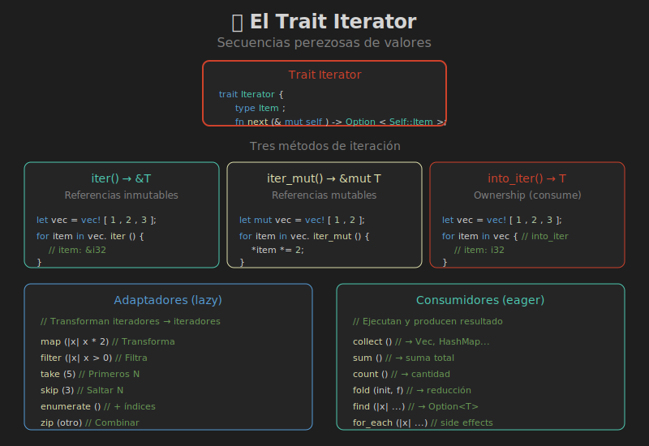

# 📚 Iteradores



## 🎯 Objetivos de Aprendizaje

- Entender el trait `Iterator`
- Usar los tres métodos de iteración
- Dominar adaptadores y consumidores

---

## 🤔 ¿Qué es un Iterador?

Un iterador es un objeto que produce una secuencia de valores, uno a la vez.

```rust
trait Iterator {
    type Item;
    fn next(&mut self) -> Option<Self::Item>;
}
```

### Uso Básico

```rust
let nums = vec![1, 2, 3];
let mut iter = nums.iter();

println!("{:?}", iter.next());  // Some(&1)
println!("{:?}", iter.next());  // Some(&2)
println!("{:?}", iter.next());  // Some(&3)
println!("{:?}", iter.next());  // None
```

---

## 🔄 Los Tres Métodos de Iteración

### 1. `iter()` - Referencias Inmutables

```rust
let vec = vec![1, 2, 3];

for item in vec.iter() {
    // item es &i32
    println!("{}", item);
}

// vec sigue disponible
println!("{:?}", vec);
```

### 2. `iter_mut()` - Referencias Mutables

```rust
let mut vec = vec![1, 2, 3];

for item in vec.iter_mut() {
    // item es &mut i32
    *item *= 2;
}

println!("{:?}", vec);  // [2, 4, 6]
```

### 3. `into_iter()` - Por Valor (Consume)

```rust
let vec = vec![1, 2, 3];

for item in vec.into_iter() {
    // item es i32 (ownership)
    println!("{}", item);
}

// ❌ vec ya no existe
// println!("{:?}", vec);
```

### Tabla Comparativa

| Método | Tipo de Item | ¿Consume? | Uso |
|--------|--------------|-----------|-----|
| `iter()` | `&T` | No | Solo leer |
| `iter_mut()` | `&mut T` | No | Modificar |
| `into_iter()` | `T` | Sí | Consumir |

---

## 🔧 For Loops y Iteradores

El `for` loop usa `into_iter()` implícitamente:

```rust
let vec = vec![1, 2, 3];

// Estas dos formas son equivalentes:
for item in vec { ... }
for item in vec.into_iter() { ... }

// Para referencias, usa iter() o &vec:
for item in &vec { ... }      // item: &T
for item in vec.iter() { ... } // item: &T

for item in &mut vec { ... }       // item: &mut T
for item in vec.iter_mut() { ... } // item: &mut T
```

---

## 🎨 Adaptadores de Iteradores

Los adaptadores transforman iteradores en otros iteradores. Son **lazy** (no se ejecutan hasta consumir).

### `map()` - Transformar Elementos

```rust
let nums = vec![1, 2, 3];

let doubled: Vec<i32> = nums.iter()
    .map(|x| x * 2)
    .collect();

// doubled = [2, 4, 6]
```

### `filter()` - Filtrar Elementos

```rust
let nums = vec![1, 2, 3, 4, 5, 6];

let pares: Vec<&i32> = nums.iter()
    .filter(|x| *x % 2 == 0)
    .collect();

// pares = [&2, &4, &6]
```

### `filter_map()` - Filtrar y Transformar

```rust
let strings = vec!["1", "dos", "3", "cuatro"];

let numeros: Vec<i32> = strings.iter()
    .filter_map(|s| s.parse().ok())
    .collect();

// numeros = [1, 3]
```

### `take()` y `skip()`

```rust
let nums: Vec<i32> = (1..=10).collect();

// Primeros 3
let primeros: Vec<i32> = nums.iter().copied().take(3).collect();
// [1, 2, 3]

// Saltar primeros 3
let resto: Vec<i32> = nums.iter().copied().skip(3).collect();
// [4, 5, 6, 7, 8, 9, 10]
```

### `enumerate()` - Añadir Índices

```rust
let frutas = vec!["🍎", "🍌", "🍊"];

for (i, fruta) in frutas.iter().enumerate() {
    println!("{}: {}", i, fruta);
}
// 0: 🍎
// 1: 🍌
// 2: 🍊
```

### `zip()` - Combinar Iteradores

```rust
let nombres = vec!["Ana", "Bob"];
let edades = vec![25, 30];

let personas: Vec<_> = nombres.iter()
    .zip(edades.iter())
    .collect();

// personas = [("Ana", 25), ("Bob", 30)]
```

### `chain()` - Concatenar Iteradores

```rust
let a = vec![1, 2];
let b = vec![3, 4];

let combined: Vec<i32> = a.iter()
    .chain(b.iter())
    .copied()
    .collect();

// combined = [1, 2, 3, 4]
```

### `flatten()` - Aplanar

```rust
let nested = vec![vec![1, 2], vec![3, 4]];

let flat: Vec<i32> = nested.into_iter()
    .flatten()
    .collect();

// flat = [1, 2, 3, 4]
```

---

## 🏁 Consumidores de Iteradores

Los consumidores **ejecutan** el iterador y producen un resultado.

### `collect()` - Recolectar en Colección

```rust
// A Vec
let v: Vec<i32> = (1..5).collect();

// A HashSet
use std::collections::HashSet;
let set: HashSet<i32> = (1..5).collect();

// A String
let s: String = vec!['a', 'b', 'c'].into_iter().collect();
```

### `sum()` y `product()`

```rust
let suma: i32 = (1..=5).sum();       // 15
let producto: i32 = (1..=5).product(); // 120
```

### `count()`

```rust
let cantidad = (1..=100).filter(|x| x % 2 == 0).count();
// cantidad = 50
```

### `fold()` - Reducción Personalizada

```rust
let nums = vec![1, 2, 3, 4];

let suma = nums.iter().fold(0, |acc, x| acc + x);
// suma = 10

let concatenado = nums.iter()
    .fold(String::new(), |acc, x| format!("{}{}", acc, x));
// concatenado = "1234"
```

### `find()` - Buscar Elemento

```rust
let nums = vec![1, 2, 3, 4, 5];

let primero_par = nums.iter().find(|&&x| x % 2 == 0);
// Some(&2)
```

### `any()` y `all()`

```rust
let nums = vec![2, 4, 6, 8];

let todos_pares = nums.iter().all(|&x| x % 2 == 0);  // true
let alguno_impar = nums.iter().any(|&x| x % 2 != 0); // false
```

### `for_each()` - Ejecutar Side Effects

```rust
vec![1, 2, 3].iter()
    .for_each(|x| println!("{}", x));
```

---

## ⚡ Lazy vs Eager

Los adaptadores son **lazy**: no hacen nada hasta que se consume.

```rust
// ❌ Esto NO imprime nada
vec![1, 2, 3].iter().map(|x| {
    println!("Procesando {}", x);
    x * 2
});

// ✅ Esto SÍ imprime
vec![1, 2, 3].iter().map(|x| {
    println!("Procesando {}", x);
    x * 2
}).collect::<Vec<_>>();
```

### Ventajas de Lazy

```rust
// Solo procesa los primeros 3 elementos
let result: Vec<i32> = (1..)
    .map(|x| x * 2)  // Infinito
    .take(3)          // Toma solo 3
    .collect();

// result = [2, 4, 6]
```

---

## 🔄 Combinando Operaciones

```rust
let datos = vec!["  hola  ", "mundo", "  RUST  "];

let procesado: Vec<String> = datos.iter()
    .map(|s| s.trim())                    // Quitar espacios
    .filter(|s| !s.is_empty())            // Filtrar vacíos
    .map(|s| s.to_lowercase())            // Minúsculas
    .collect();

// procesado = ["hola", "mundo", "rust"]
```

### Pipeline Complejo

```rust
struct Persona {
    nombre: String,
    edad: u32,
    ciudad: String,
}

let personas = vec![
    Persona { nombre: "Ana".into(), edad: 25, ciudad: "Madrid".into() },
    Persona { nombre: "Bob".into(), edad: 17, ciudad: "Barcelona".into() },
    Persona { nombre: "Carlos".into(), edad: 30, ciudad: "Madrid".into() },
];

// Nombres de adultos de Madrid
let nombres: Vec<&str> = personas.iter()
    .filter(|p| p.edad >= 18)
    .filter(|p| p.ciudad == "Madrid")
    .map(|p| p.nombre.as_str())
    .collect();

// nombres = ["Ana", "Carlos"]
```

---

## 📊 Iteradores vs Loops

```rust
// Estilo imperativo
let mut suma = 0;
for num in &numeros {
    if *num > 0 {
        suma += num * 2;
    }
}

// Estilo funcional
let suma: i32 = numeros.iter()
    .filter(|&&n| n > 0)
    .map(|&n| n * 2)
    .sum();
```

| Aspecto | Loops | Iteradores |
|---------|-------|------------|
| Verbosidad | Más código | Más conciso |
| Legibilidad | Paso a paso | Declarativo |
| Performance | Similar | Similar (zero-cost) |
| Composición | Difícil | Natural |

---

## 🎯 Resumen

| Categoría | Métodos |
|-----------|---------|
| **Creación** | `iter()`, `iter_mut()`, `into_iter()` |
| **Transformación** | `map()`, `filter()`, `filter_map()` |
| **Selección** | `take()`, `skip()`, `take_while()` |
| **Combinación** | `chain()`, `zip()`, `flatten()` |
| **Consumo** | `collect()`, `fold()`, `sum()`, `count()` |
| **Búsqueda** | `find()`, `any()`, `all()`, `position()` |

---

## 🔗 Siguiente

[05 - Iteradores Avanzados](05-iteradores-avanzados.md)
