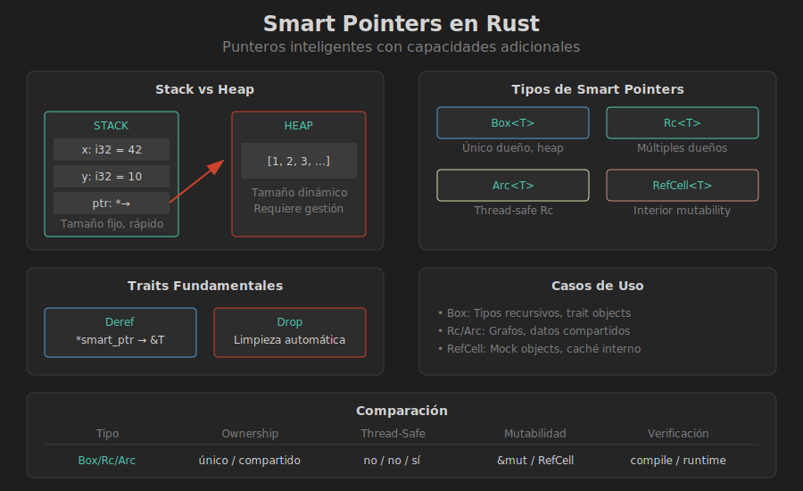

# 📦 Introducción a Smart Pointers

## 🎯 Objetivos de Aprendizaje

- Comprender qué son los smart pointers y por qué existen
- Entender la diferencia entre stack y heap
- Conocer los traits `Deref` y `Drop`
- Identificar cuándo usar smart pointers

---

## 🧠 ¿Qué es un Smart Pointer?

Un **smart pointer** es una estructura de datos que actúa como un puntero pero con capacidades adicionales, como:

- **Conteo de referencias** (saber cuántos "dueños" tiene)
- **Liberación automática** de memoria
- **Metadatos** adicionales sobre el dato

```rust
// Puntero regular (referencia)
let x = 5;
let r: &i32 = &x;  // Solo apunta a x

// Smart pointer
let b: Box<i32> = Box::new(5);  // Dueño del dato en heap
// Cuando b sale de scope, la memoria se libera automáticamente
```

---

## 📊 Stack vs Heap



### Stack (Pila)

- Memoria **rápida** y de tamaño **fijo**
- Variables locales y datos de tamaño conocido
- Se libera automáticamente al salir del scope
- **LIFO** (Last In, First Out)

### Heap (Montículo)

- Memoria **flexible** y de tamaño **dinámico**
- Datos cuyo tamaño se conoce en runtime
- Requiere **gestión manual** (en C) o **smart pointers** (en Rust)
- Más lento que el stack

```rust
// Stack: tamaño conocido en compile time
let a: i32 = 42;           // 4 bytes en stack
let arr: [i32; 3] = [1, 2, 3];  // 12 bytes en stack

// Heap: tamaño dinámico o grande
let v: Vec<i32> = vec![1, 2, 3];  // Datos en heap
let s: String = String::from("hello");  // Datos en heap
let b: Box<i32> = Box::new(42);  // 4 bytes en heap
```

---

## 🔧 Traits Fundamentales

### El Trait `Deref`

Permite que un smart pointer se comporte como una referencia:

```rust
use std::ops::Deref;

struct MiBox<T>(T);

impl<T> Deref for MiBox<T> {
    type Target = T;
    
    fn deref(&self) -> &Self::Target {
        &self.0
    }
}

fn main() {
    let x = MiBox(5);
    
    // Gracias a Deref, podemos usar * como con referencias
    assert_eq!(5, *x);
    
    // Deref coercion: &MiBox<T> → &T automáticamente
    fn toma_ref(n: &i32) {
        println!("{}", n);
    }
    toma_ref(&x);  // Funciona por deref coercion
}
```

### El Trait `Drop`

Se ejecuta automáticamente cuando el valor sale de scope:

```rust
struct MiRecurso {
    nombre: String,
}

impl Drop for MiRecurso {
    fn drop(&mut self) {
        println!("Liberando recurso: {}", self.nombre);
    }
}

fn main() {
    let r1 = MiRecurso { nombre: String::from("archivo.txt") };
    let r2 = MiRecurso { nombre: String::from("conexion_db") };
    
    println!("Recursos creados");
}  // Aquí se llama drop() automáticamente
   // Salida:
   // Liberando recurso: conexion_db
   // Liberando recurso: archivo.txt
```

---

## 📦 Smart Pointers en la Biblioteca Estándar

| Tipo | Descripción | Caso de Uso |
|------|-------------|-------------|
| `Box<T>` | Único dueño, datos en heap | Tipos recursivos, datos grandes |
| `Rc<T>` | Múltiples dueños, single-thread | Grafos, estructuras compartidas |
| `Arc<T>` | Múltiples dueños, multi-thread | Datos compartidos entre threads |
| `RefCell<T>` | Mutabilidad interior | Mutar con referencia inmutable |
| `Mutex<T>` | Mutabilidad + thread-safe | Datos mutables entre threads |
| `RwLock<T>` | Múltiples lectores, un escritor | Read-heavy workloads |

### Comparación Visual

```
┌─────────────────────────────────────────────────────────────┐
│                    OWNERSHIP                                │
├─────────────────────────────────────────────────────────────┤
│                                                             │
│   ÚNICO DUEÑO              MÚLTIPLES DUEÑOS                │
│   ───────────              ─────────────────                │
│                                                             │
│   Box<T>                   Rc<T>  (single-thread)          │
│   │                        Arc<T> (multi-thread)           │
│   └─> Heap allocation      │                               │
│       Drop al salir scope  └─> Reference counting          │
│                                Drop cuando count = 0       │
│                                                             │
├─────────────────────────────────────────────────────────────┤
│                    MUTABILIDAD                              │
├─────────────────────────────────────────────────────────────┤
│                                                             │
│   COMPILE TIME             RUNTIME                         │
│   ────────────             ───────                         │
│                                                             │
│   &mut T                   RefCell<T> (single-thread)      │
│   │                        Mutex<T>   (multi-thread)       │
│   └─> Borrow checker       │                               │
│       en compilación       └─> Borrow checking             │
│                                en runtime                  │
│                                                             │
└─────────────────────────────────────────────────────────────┘
```

---

## 🤔 ¿Cuándo Usar Smart Pointers?

### Usa `Box<T>` cuando:

1. **Tipo recursivo** - El compilador no puede calcular el tamaño

```rust
// ❌ ERROR: tamaño infinito
enum Lista {
    Cons(i32, Lista),
    Nil,
}

// ✅ CORRECTO: Box tiene tamaño fijo (un puntero)
enum Lista {
    Cons(i32, Box<Lista>),
    Nil,
}
```

2. **Datos grandes** - Evitar copiar en stack

```rust
// Mover 1MB de datos es costoso
let datos_grandes = [0u8; 1_000_000];

// Box solo mueve el puntero (8 bytes)
let boxed = Box::new([0u8; 1_000_000]);
```

3. **Trait objects** - Tipos de tamaño desconocido

```rust
trait Animal {
    fn hablar(&self);
}

// Box permite tener cualquier tipo que implemente Animal
let animales: Vec<Box<dyn Animal>> = vec![
    Box::new(Perro),
    Box::new(Gato),
];
```

### Usa `Rc<T>` / `Arc<T>` cuando:

- Múltiples partes del código necesitan **leer** el mismo dato
- No sabes en compile time quién será el último en usar el dato

### Usa `RefCell<T>` cuando:

- Necesitas mutar un dato pero solo tienes acceso inmutable
- El patrón de borrowing es correcto pero el compilador no puede verificarlo

---

## ⚠️ Errores Comunes

### 1. Usar Box innecesariamente

```rust
// ❌ Innecesario: i32 es pequeño y Copy
let x = Box::new(5);

// ✅ Mejor: usar directamente
let x = 5;
```

### 2. No entender el costo

```rust
// Cada acceso a través de Box requiere indirección
let b = Box::new(42);
let suma = *b + *b;  // Dos accesos al heap

// Si vas a usar el valor muchas veces, cópialo
let valor = *b;
let suma = valor + valor;  // Accesos al stack
```

---

## 🎯 Resumen

| Concepto | Descripción |
|----------|-------------|
| Smart Pointer | Puntero con capacidades extra |
| `Deref` | Permite usar `*` y deref coercion |
| `Drop` | Limpieza automática al salir de scope |
| Stack | Rápido, tamaño fijo, LIFO |
| Heap | Flexible, tamaño dinámico, más lento |

---

## 📚 Próximo Tema

En el siguiente archivo exploraremos **Box<T>** en detalle, incluyendo:
- Estructuras recursivas
- Trait objects
- Patterns de uso

➡️ [02-box.md](02-box.md)
