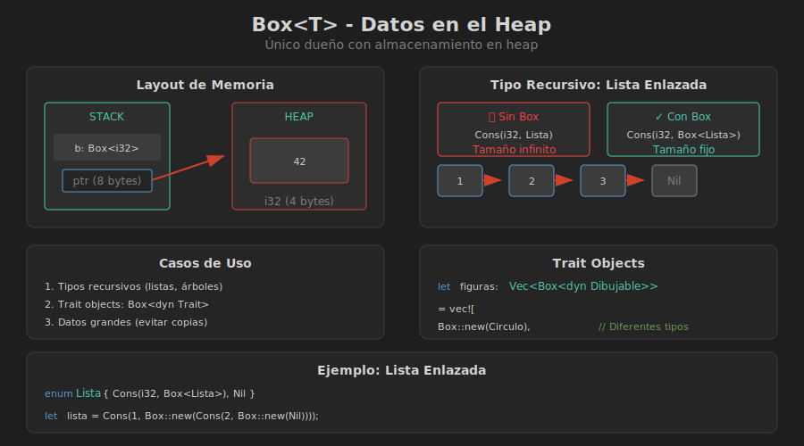

# 📦 Box<T> - Datos en el Heap

## 🎯 Objetivos de Aprendizaje

- Comprender cuándo y por qué usar `Box<T>`
- Implementar estructuras de datos recursivas
- Usar trait objects con Box
- Entender el costo y beneficios de Box

---

## 🧠 ¿Qué es Box<T>?

`Box<T>` es el smart pointer más simple: almacena datos en el **heap** en lugar del stack.

```rust
fn main() {
    // Almacena 5 en el heap
    let b = Box::new(5);
    
    // Usamos * para acceder al valor
    println!("b = {}", *b);
    
    // Deref coercion: se puede usar como &i32
    fn usa_ref(n: &i32) {
        println!("valor: {}", n);
    }
    usa_ref(&b);  // Funciona automáticamente
}
// b se libera automáticamente aquí
```

### Memoria

```
Stack                 Heap
┌─────────┐          ┌─────────┐
│ b: ptr ─┼─────────→│    5    │
└─────────┘          └─────────┘
  8 bytes              4 bytes
```

---

## 📊 Caso 1: Tipos Recursivos



El caso más común para Box es **tipos recursivos**. Sin Box, el compilador no puede calcular el tamaño:

```rust
// ❌ ERROR: recursive type has infinite size
enum Lista {
    Cons(i32, Lista),  // Lista contiene Lista contiene Lista...
    Nil,
}
```

### La Solución: Indirección con Box

```rust
// ✅ CORRECTO: Box tiene tamaño fijo (un puntero)
enum Lista {
    Cons(i32, Box<Lista>),
    Nil,
}

use Lista::{Cons, Nil};

fn main() {
    // Lista: 1 -> 2 -> 3 -> Nil
    let lista = Cons(1, 
        Box::new(Cons(2, 
            Box::new(Cons(3, 
                Box::new(Nil))))));
    
    imprimir_lista(&lista);
}

fn imprimir_lista(lista: &Lista) {
    match lista {
        Cons(valor, siguiente) => {
            print!("{} -> ", valor);
            imprimir_lista(siguiente);
        }
        Nil => println!("Nil"),
    }
}
```

### Lista Enlazada Completa

```rust
#[derive(Debug)]
pub struct ListaEnlazada<T> {
    head: Option<Box<Nodo<T>>>,
}

#[derive(Debug)]
struct Nodo<T> {
    valor: T,
    siguiente: Option<Box<Nodo<T>>>,
}

impl<T> ListaEnlazada<T> {
    pub fn new() -> Self {
        ListaEnlazada { head: None }
    }
    
    /// Agrega al inicio (O(1))
    pub fn push(&mut self, valor: T) {
        let nuevo_nodo = Box::new(Nodo {
            valor,
            siguiente: self.head.take(),
        });
        self.head = Some(nuevo_nodo);
    }
    
    /// Remueve del inicio (O(1))
    pub fn pop(&mut self) -> Option<T> {
        self.head.take().map(|nodo| {
            self.head = nodo.siguiente;
            nodo.valor
        })
    }
    
    /// Peek al primer elemento
    pub fn peek(&self) -> Option<&T> {
        self.head.as_ref().map(|nodo| &nodo.valor)
    }
    
    /// ¿Está vacía?
    pub fn is_empty(&self) -> bool {
        self.head.is_none()
    }
}

impl<T> Default for ListaEnlazada<T> {
    fn default() -> Self {
        Self::new()
    }
}

fn main() {
    let mut lista = ListaEnlazada::new();
    
    lista.push(1);
    lista.push(2);
    lista.push(3);
    
    println!("Peek: {:?}", lista.peek());  // Some(3)
    
    while let Some(valor) = lista.pop() {
        println!("Pop: {}", valor);  // 3, 2, 1
    }
}
```

---

## 🎭 Caso 2: Trait Objects

Box permite almacenar tipos que implementan un trait cuando no conocemos el tipo concreto en compile time:

```rust
trait Dibujable {
    fn dibujar(&self);
    fn area(&self) -> f64;
}

struct Circulo {
    radio: f64,
}

impl Dibujable for Circulo {
    fn dibujar(&self) {
        println!("○ Círculo con radio {}", self.radio);
    }
    
    fn area(&self) -> f64 {
        std::f64::consts::PI * self.radio * self.radio
    }
}

struct Rectangulo {
    ancho: f64,
    alto: f64,
}

impl Dibujable for Rectangulo {
    fn dibujar(&self) {
        println!("▭ Rectángulo {}x{}", self.ancho, self.alto);
    }
    
    fn area(&self) -> f64 {
        self.ancho * self.alto
    }
}

fn main() {
    // Vec de trait objects - cada elemento puede ser diferente tipo
    let figuras: Vec<Box<dyn Dibujable>> = vec![
        Box::new(Circulo { radio: 5.0 }),
        Box::new(Rectangulo { ancho: 4.0, alto: 3.0 }),
        Box::new(Circulo { radio: 2.0 }),
    ];
    
    let mut area_total = 0.0;
    
    for figura in &figuras {
        figura.dibujar();
        area_total += figura.area();
    }
    
    println!("Área total: {:.2}", area_total);
}
```

### ¿Por qué Box<dyn Trait>?

```rust
// ❌ ERROR: el tamaño de dyn Trait no se conoce en compile time
let formas: Vec<dyn Dibujable> = vec![...];

// ✅ Box<dyn Trait> tiene tamaño fijo (puntero + vtable pointer)
let formas: Vec<Box<dyn Dibujable>> = vec![...];

// También funciona con referencias
let formas: Vec<&dyn Dibujable> = vec![...];
```

---

## 📦 Caso 3: Datos Grandes

Mover datos grandes es costoso. Box permite mover solo el puntero:

```rust
// Estructura de 1MB
struct DatosGrandes {
    buffer: [u8; 1_000_000],
}

fn main() {
    // ❌ Copia 1MB al pasar a la función
    let datos = DatosGrandes { buffer: [0; 1_000_000] };
    procesar(datos);  // Mueve 1MB
    
    // ✅ Solo mueve 8 bytes (el puntero)
    let datos = Box::new(DatosGrandes { buffer: [0; 1_000_000] });
    procesar_box(datos);  // Mueve 8 bytes
}

fn procesar(datos: DatosGrandes) {
    println!("Procesando {} bytes", datos.buffer.len());
}

fn procesar_box(datos: Box<DatosGrandes>) {
    println!("Procesando {} bytes", datos.buffer.len());
}
```

---

## 🔧 Métodos Útiles de Box

```rust
fn main() {
    // Crear Box
    let b = Box::new(42);
    
    // Convertir a valor (consume el Box)
    let valor: i32 = *b;
    
    // Box::leak - convierte a referencia estática (¡cuidado con memory leaks!)
    let b = Box::new(String::from("hello"));
    let s: &'static str = Box::leak(b);
    println!("{}", s);  // s vive para siempre
    
    // Box::into_raw / Box::from_raw - para FFI
    let b = Box::new(42);
    let ptr = Box::into_raw(b);  // Ahora debemos liberar manualmente
    unsafe {
        let b = Box::from_raw(ptr);  // Reconstruir el Box
        println!("{}", b);
    }  // Se libera aquí
}
```

---

## ⚡ Árbol Binario con Box

```rust
#[derive(Debug)]
struct ArbolBinario<T> {
    valor: T,
    izquierda: Option<Box<ArbolBinario<T>>>,
    derecha: Option<Box<ArbolBinario<T>>>,
}

impl<T> ArbolBinario<T> {
    fn new(valor: T) -> Self {
        ArbolBinario {
            valor,
            izquierda: None,
            derecha: None,
        }
    }
    
    fn con_hijos(valor: T, izq: ArbolBinario<T>, der: ArbolBinario<T>) -> Self {
        ArbolBinario {
            valor,
            izquierda: Some(Box::new(izq)),
            derecha: Some(Box::new(der)),
        }
    }
}

impl<T: Ord> ArbolBinario<T> {
    fn insertar(&mut self, valor: T) {
        if valor < self.valor {
            match &mut self.izquierda {
                Some(izq) => izq.insertar(valor),
                None => self.izquierda = Some(Box::new(ArbolBinario::new(valor))),
            }
        } else {
            match &mut self.derecha {
                Some(der) => der.insertar(valor),
                None => self.derecha = Some(Box::new(ArbolBinario::new(valor))),
            }
        }
    }
    
    fn contiene(&self, valor: &T) -> bool {
        if valor == &self.valor {
            true
        } else if valor < &self.valor {
            self.izquierda.as_ref().map_or(false, |izq| izq.contiene(valor))
        } else {
            self.derecha.as_ref().map_or(false, |der| der.contiene(valor))
        }
    }
}

fn main() {
    let mut arbol = ArbolBinario::new(5);
    arbol.insertar(3);
    arbol.insertar(7);
    arbol.insertar(1);
    arbol.insertar(9);
    
    println!("Contiene 7: {}", arbol.contiene(&7));  // true
    println!("Contiene 4: {}", arbol.contiene(&4));  // false
    
    println!("{:#?}", arbol);
}
```

---

## ⚠️ Cuándo NO Usar Box

```rust
// ❌ Innecesario: i32 es pequeño y Copy
let x = Box::new(5);

// ❌ Innecesario: Vec ya usa heap internamente
let v = Box::new(vec![1, 2, 3]);

// ❌ Innecesario: String ya usa heap
let s = Box::new(String::from("hello"));

// ✅ Casos válidos:
// - Tipos recursivos
// - Trait objects (dyn Trait)
// - Datos realmente grandes que quieres evitar copiar
```

---

## 🎯 Resumen

| Concepto | Descripción |
|----------|-------------|
| `Box<T>` | Almacena T en el heap |
| Tamaño | Fijo: un puntero (8 bytes en 64-bit) |
| Ownership | Único dueño |
| Drop | Automático al salir de scope |
| Casos de uso | Tipos recursivos, trait objects, datos grandes |

---

## 📚 Próximo Tema

En el siguiente archivo exploraremos **Rc<T> y Arc<T>** para cuando necesitas múltiples dueños:

➡️ [03-rc-arc.md](03-rc-arc.md)
