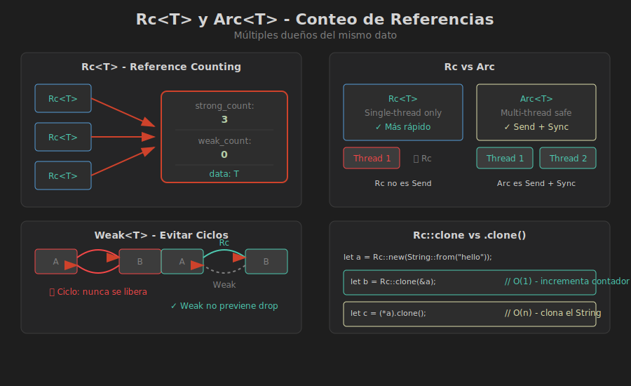

# 🔄 Rc<T> y Arc<T> - Conteo de Referencias

## 🎯 Objetivos de Aprendizaje

- Entender el conteo de referencias
- Usar `Rc<T>` para múltiples dueños en single-thread
- Usar `Arc<T>` para múltiples dueños entre threads
- Evitar ciclos de referencias con `Weak<T>`

---

## 🧠 El Problema: Múltiples Dueños

A veces, un dato necesita pertenecer a varias partes del programa:

```rust
// ❌ ERROR: no podemos tener dos dueños con Box
fn main() {
    let datos = Box::new(vec![1, 2, 3]);
    
    let a = datos;       // a es dueño
    let b = datos;       // ERROR: datos ya se movió a 'a'
}
```

### La Solución: Reference Counting

`Rc<T>` (Reference Counted) permite múltiples "dueños". El dato se libera cuando el **último** dueño desaparece.

```rust
use std::rc::Rc;

fn main() {
    let datos = Rc::new(vec![1, 2, 3]);
    
    let a = Rc::clone(&datos);  // a comparte ownership
    let b = Rc::clone(&datos);  // b también comparte
    
    println!("Referencias: {}", Rc::strong_count(&datos));  // 3
    
    drop(a);
    println!("Referencias: {}", Rc::strong_count(&datos));  // 2
    
    drop(b);
    println!("Referencias: {}", Rc::strong_count(&datos));  // 1
}  // datos se libera aquí (count llega a 0)
```

---

## 📊 Rc<T> en Detalle



### Anatomía de Rc

```
┌─────────────┐
│   Rc<T>     │
├─────────────┤     ┌──────────────────────┐
│ ptr ────────┼────→│ strong_count: 3      │
└─────────────┘     │ weak_count: 0        │
                    │ data: T              │
┌─────────────┐     └──────────────────────┘
│   Rc<T>     │            ↑
├─────────────┤            │
│ ptr ────────┼────────────┘
└─────────────┘
```

### Uso Básico

```rust
use std::rc::Rc;

#[derive(Debug)]
struct Usuario {
    nombre: String,
    edad: u32,
}

fn main() {
    // Crear un Rc
    let usuario = Rc::new(Usuario {
        nombre: String::from("Alice"),
        edad: 30,
    });
    
    // Rc::clone incrementa el contador (NO clona los datos)
    let ref1 = Rc::clone(&usuario);
    let ref2 = Rc::clone(&usuario);
    
    // Todos apuntan al mismo dato
    println!("usuario: {:?}", usuario);
    println!("ref1: {:?}", ref1);
    println!("ref2: {:?}", ref2);
    
    // Ver el conteo
    println!("Strong count: {}", Rc::strong_count(&usuario));
}
```

### ⚠️ Rc::clone vs .clone()

```rust
use std::rc::Rc;

let datos = Rc::new(String::from("hello"));

// ✅ CORRECTO: solo incrementa el contador
let r1 = Rc::clone(&datos);  // Barato: O(1)

// ⚠️ CUIDADO: esto también funciona pero es confuso
let r2 = datos.clone();  // También incrementa contador por Deref

// Para clonar el STRING interno (caro):
let copia = (*datos).clone();  // Clona el String
// o
let copia = String::clone(&datos);  // Más explícito
```

---

## 🌳 Ejemplo: Grafo con Nodos Compartidos

```rust
use std::rc::Rc;

#[derive(Debug)]
struct Nodo {
    valor: i32,
    vecinos: Vec<Rc<Nodo>>,
}

impl Nodo {
    fn new(valor: i32) -> Rc<Self> {
        Rc::new(Nodo {
            valor,
            vecinos: Vec::new(),
        })
    }
}

fn main() {
    // Crear nodos compartidos
    let nodo_compartido = Nodo::new(100);
    
    // Varios nodos pueden apuntar al mismo nodo
    let nodo_a = Rc::new(Nodo {
        valor: 1,
        vecinos: vec![Rc::clone(&nodo_compartido)],
    });
    
    let nodo_b = Rc::new(Nodo {
        valor: 2,
        vecinos: vec![Rc::clone(&nodo_compartido)],
    });
    
    println!("nodo_compartido tiene {} referencias", 
             Rc::strong_count(&nodo_compartido));  // 3
    
    println!("A apunta a: {:?}", nodo_a.vecinos[0].valor);  // 100
    println!("B apunta a: {:?}", nodo_b.vecinos[0].valor);  // 100
}
```

---

## ⚡ Arc<T> - Atomic Reference Counting

`Arc<T>` es como `Rc<T>` pero **thread-safe**:

```rust
use std::sync::Arc;
use std::thread;

fn main() {
    let datos = Arc::new(vec![1, 2, 3, 4, 5]);
    let mut handles = vec![];
    
    for i in 0..3 {
        let datos_clone = Arc::clone(&datos);
        
        let handle = thread::spawn(move || {
            let suma: i32 = datos_clone.iter().sum();
            println!("Thread {}: suma = {}", i, suma);
        });
        
        handles.push(handle);
    }
    
    for handle in handles {
        handle.join().unwrap();
    }
    
    println!("Datos originales: {:?}", datos);
}
```

### Rc vs Arc

| Característica | `Rc<T>` | `Arc<T>` |
|----------------|---------|----------|
| Thread-safe | ❌ No | ✅ Sí |
| Performance | Más rápido | Más lento (atómico) |
| Trait `Send` | ❌ No | ✅ Sí |
| Trait `Sync` | ❌ No | ✅ Sí |
| Uso | Single-thread | Multi-thread |

```rust
use std::rc::Rc;
use std::sync::Arc;
use std::thread;

fn main() {
    let rc = Rc::new(5);
    
    // ❌ ERROR: Rc no implementa Send
    // thread::spawn(move || {
    //     println!("{}", rc);
    // });
    
    let arc = Arc::new(5);
    
    // ✅ OK: Arc es thread-safe
    thread::spawn(move || {
        println!("{}", arc);
    }).join().unwrap();
}
```

---

## 🔗 Weak<T> - Evitando Ciclos

Un problema con Rc: los **ciclos de referencias** nunca se liberan:

```rust
use std::rc::Rc;
use std::cell::RefCell;

#[derive(Debug)]
struct Nodo {
    valor: i32,
    // ❌ PROBLEMA: si A apunta a B y B apunta a A, nunca se liberan
    siguiente: Option<Rc<RefCell<Nodo>>>,
}

fn main() {
    let a = Rc::new(RefCell::new(Nodo { valor: 1, siguiente: None }));
    let b = Rc::new(RefCell::new(Nodo { valor: 2, siguiente: None }));
    
    // Crear ciclo
    a.borrow_mut().siguiente = Some(Rc::clone(&b));
    b.borrow_mut().siguiente = Some(Rc::clone(&a));  // CICLO!
    
    // a y b nunca se liberarán (memory leak)
}
```

### La Solución: Weak References

`Weak<T>` no incrementa el `strong_count`, así que no previene la liberación:

```rust
use std::rc::{Rc, Weak};
use std::cell::RefCell;

#[derive(Debug)]
struct Nodo {
    valor: i32,
    padre: Option<Weak<RefCell<Nodo>>>,      // Weak: no evita liberación
    hijos: Vec<Rc<RefCell<Nodo>>>,           // Rc: mantiene vivos a los hijos
}

impl Nodo {
    fn new(valor: i32) -> Rc<RefCell<Self>> {
        Rc::new(RefCell::new(Nodo {
            valor,
            padre: None,
            hijos: Vec::new(),
        }))
    }
    
    fn agregar_hijo(padre: &Rc<RefCell<Self>>, hijo: Rc<RefCell<Self>>) {
        // Hijo tiene weak reference al padre
        hijo.borrow_mut().padre = Some(Rc::downgrade(padre));
        // Padre tiene strong reference al hijo
        padre.borrow_mut().hijos.push(hijo);
    }
}

fn main() {
    let raiz = Nodo::new(1);
    let hijo1 = Nodo::new(2);
    let hijo2 = Nodo::new(3);
    
    Nodo::agregar_hijo(&raiz, hijo1);
    Nodo::agregar_hijo(&raiz, hijo2);
    
    println!("Raíz strong_count: {}", Rc::strong_count(&raiz));  // 1
    
    // Acceder al padre desde un hijo
    if let Some(ref hijo) = raiz.borrow().hijos.first() {
        if let Some(padre_weak) = &hijo.borrow().padre {
            // upgrade() retorna Option<Rc<T>>
            if let Some(padre) = padre_weak.upgrade() {
                println!("Padre del hijo: {}", padre.borrow().valor);
            }
        }
    }
}
```

### Weak API

```rust
use std::rc::{Rc, Weak};

fn main() {
    let fuerte = Rc::new(42);
    
    // Crear Weak desde Rc
    let debil: Weak<i32> = Rc::downgrade(&fuerte);
    
    // Contar referencias
    println!("Strong: {}", Rc::strong_count(&fuerte));  // 1
    println!("Weak: {}", Rc::weak_count(&fuerte));      // 1
    
    // upgrade() intenta obtener Rc
    if let Some(rc) = debil.upgrade() {
        println!("Valor: {}", rc);
    }
    
    // Después de drop, upgrade() retorna None
    drop(fuerte);
    assert!(debil.upgrade().is_none());
}
```

---

## 📋 Patrones Comunes

### 1. Cache Compartido

```rust
use std::rc::Rc;
use std::collections::HashMap;

struct Cache {
    datos: HashMap<String, Rc<String>>,
}

impl Cache {
    fn new() -> Self {
        Cache { datos: HashMap::new() }
    }
    
    fn get_or_insert(&mut self, key: &str, valor: String) -> Rc<String> {
        self.datos
            .entry(key.to_string())
            .or_insert_with(|| Rc::new(valor))
            .clone()
    }
}

fn main() {
    let mut cache = Cache::new();
    
    let v1 = cache.get_or_insert("clave", String::from("valor"));
    let v2 = cache.get_or_insert("clave", String::from("otro"));  // Retorna el existente
    
    // v1 y v2 apuntan al mismo String
    assert!(Rc::ptr_eq(&v1, &v2));
}
```

### 2. Observer Pattern Simplificado

```rust
use std::rc::{Rc, Weak};
use std::cell::RefCell;

trait Observer {
    fn notificar(&self, mensaje: &str);
}

struct Subject {
    observers: Vec<Weak<dyn Observer>>,
}

impl Subject {
    fn new() -> Self {
        Subject { observers: Vec::new() }
    }
    
    fn suscribir(&mut self, observer: &Rc<dyn Observer>) {
        self.observers.push(Rc::downgrade(observer));
    }
    
    fn notificar_todos(&mut self, mensaje: &str) {
        // Filtrar observers que ya no existen
        self.observers.retain(|weak| weak.upgrade().is_some());
        
        for weak in &self.observers {
            if let Some(observer) = weak.upgrade() {
                observer.notificar(mensaje);
            }
        }
    }
}
```

---

## ⚠️ Errores Comunes

### 1. Usar Rc entre threads

```rust
// ❌ ERROR: Rc no es Send
use std::rc::Rc;
use std::thread;

let rc = Rc::new(5);
thread::spawn(move || println!("{}", rc));  // No compila
```

### 2. Ciclos sin Weak

```rust
// ❌ Memory leak
struct A { b: Option<Rc<B>> }
struct B { a: Option<Rc<A>> }

// ✅ Usar Weak en una dirección
struct A { b: Option<Rc<B>> }
struct B { a: Option<Weak<A>> }  // Weak rompe el ciclo
```

### 3. Olvidar que Rc no permite mutación

```rust
use std::rc::Rc;

let rc = Rc::new(5);
// ❌ ERROR: Rc<T> solo da acceso inmutable
// *rc = 10;

// ✅ Usar RefCell para mutabilidad interior
use std::cell::RefCell;
let rc = Rc::new(RefCell::new(5));
*rc.borrow_mut() = 10;
```

---

## 🎯 Resumen

| Tipo | Múltiples Dueños | Thread-Safe | Mutabilidad |
|------|------------------|-------------|-------------|
| `Box<T>` | ❌ | N/A | `&mut` normal |
| `Rc<T>` | ✅ | ❌ | Requiere RefCell |
| `Arc<T>` | ✅ | ✅ | Requiere Mutex |
| `Weak<T>` | Referencia débil | Según Rc/Arc | - |

---

## 📚 Próximo Tema

En el siguiente archivo exploraremos **RefCell<T>** para mutabilidad interior:

➡️ [04-refcell.md](04-refcell.md)
