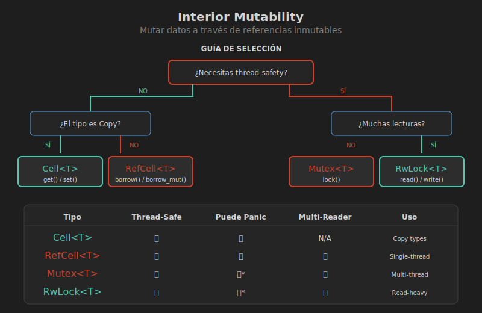

# Interior Mutability

## 🎯 Objetivos

- Comprender el patrón de interior mutability
- Conocer las variantes: Cell, RefCell, Mutex, RwLock
- Elegir la herramienta correcta para cada caso
- Entender UnsafeCell como base

## 📚 Conceptos

### ¿Qué es Interior Mutability?

Permite mutar datos a través de una referencia inmutable (`&T`):

```
┌─────────────────────────────────────────────────────────────┐
│                   INTERIOR MUTABILITY                        │
├─────────────────────────────────────────────────────────────┤
│                                                             │
│   Normal:                    Interior Mutability:           │
│   ┌─────────┐               ┌─────────┐                    │
│   │ &mut T  │ → mutar       │ &T      │ → mutar (!)        │
│   │ &T      │ → solo leer   └────┬────┘                    │
│   └─────────┘                    │                         │
│                                  ▼                         │
│                             ┌─────────┐                    │
│                             │ Cell<T> │                    │
│                             │RefCell<T│                    │
│                             │ Mutex<T>│                    │
│                             └─────────┘                    │
│                                                             │
└─────────────────────────────────────────────────────────────┘
```

## 🔧 Cell<T> - Para Tipos Copy

`Cell<T>` permite mutar valores `Copy` sin borrowing:

```rust
use std::cell::Cell;

fn main() {
    let x = Cell::new(5);
    
    // get() copia el valor (requiere T: Copy)
    println!("Valor: {}", x.get());
    
    // set() reemplaza el valor
    x.set(10);
    println!("Nuevo valor: {}", x.get());
    
    // No hay borrowing, siempre disponible
    let a = x.get();
    x.set(20);
    let b = x.get();
    println!("a={}, b={}", a, b); // a=10, b=20
}
```

### Cell vs RefCell

| Característica | Cell<T> | RefCell<T> |
|----------------|---------|------------|
| Requiere | T: Copy | Cualquier T |
| Método lectura | `get()` (copia) | `borrow()` (referencia) |
| Método escritura | `set()` | `borrow_mut()` |
| Puede panic | ❌ Nunca | ✅ Sí |
| Overhead | Cero | Pequeño |

```rust
use std::cell::{Cell, RefCell};

// Cell para tipos Copy simples
let counter = Cell::new(0);
counter.set(counter.get() + 1);

// RefCell para tipos más complejos
let data = RefCell::new(vec![1, 2, 3]);
data.borrow_mut().push(4);
```

## 🔒 Mutex<T> - Thread-Safe

`Mutex` provee interior mutability con exclusión mutua:

```rust
use std::sync::Mutex;

fn main() {
    let data = Mutex::new(5);
    
    // lock() bloquea hasta obtener acceso exclusivo
    {
        let mut guard = data.lock().unwrap();
        *guard += 10;
    } // guard se libera, unlock automático
    
    println!("Valor: {:?}", data.lock().unwrap());
}
```

### Mutex con Arc para Multi-threading

```rust
use std::sync::{Arc, Mutex};
use std::thread;

fn main() {
    let counter = Arc::new(Mutex::new(0));
    let mut handles = vec![];
    
    for _ in 0..10 {
        let counter = Arc::clone(&counter);
        let handle = thread::spawn(move || {
            let mut num = counter.lock().unwrap();
            *num += 1;
        });
        handles.push(handle);
    }
    
    for handle in handles {
        handle.join().unwrap();
    }
    
    println!("Resultado: {}", *counter.lock().unwrap());
}
```

## 📖 RwLock<T> - Múltiples Lectores

`RwLock` permite múltiples lectores O un escritor:

```rust
use std::sync::RwLock;

fn main() {
    let lock = RwLock::new(5);
    
    // Múltiples lectores simultáneos
    {
        let r1 = lock.read().unwrap();
        let r2 = lock.read().unwrap();
        println!("Lectores: {} y {}", *r1, *r2);
    }
    
    // Un escritor exclusivo
    {
        let mut w = lock.write().unwrap();
        *w += 10;
    }
    
    println!("Nuevo valor: {}", *lock.read().unwrap());
}
```

## 📊 Comparación Completa

| Tipo | Thread-Safe | Panic | Múltiples Lectores | Uso |
|------|-------------|-------|-------------------|-----|
| Cell<T> | ❌ | ❌ | N/A (copia) | Tipos Copy simples |
| RefCell<T> | ❌ | ✅ | ✅ | Single-thread mutable |
| Mutex<T> | ✅ | ❌* | ❌ | Multi-thread exclusivo |
| RwLock<T> | ✅ | ❌* | ✅ | Multi-thread lectura pesada |

*Puede panic si el lock está envenenado (poisoned)

## 🔧 UnsafeCell - La Base

Todos los tipos de interior mutability usan `UnsafeCell` internamente:

```rust
use std::cell::UnsafeCell;

// ⚠️ Solo usar cuando realmente necesario
struct MyCell<T> {
    value: UnsafeCell<T>,
}

impl<T> MyCell<T> {
    fn new(value: T) -> Self {
        MyCell {
            value: UnsafeCell::new(value),
        }
    }
    
    fn set(&self, value: T) {
        unsafe {
            *self.value.get() = value;
        }
    }
    
    fn get(&self) -> &T {
        unsafe { &*self.value.get() }
    }
}
```

## 📖 Ejemplo: Contador con Múltiples Estrategias

```rust
use std::cell::{Cell, RefCell};
use std::sync::{Arc, Mutex, RwLock};

// Single-thread, tipo Copy
struct CellCounter {
    count: Cell<u32>,
}

impl CellCounter {
    fn new() -> Self {
        CellCounter { count: Cell::new(0) }
    }
    
    fn increment(&self) {
        self.count.set(self.count.get() + 1);
    }
}

// Single-thread, tipo complejo
struct RefCellCounter {
    counts: RefCell<Vec<u32>>,
}

impl RefCellCounter {
    fn new() -> Self {
        RefCellCounter { counts: RefCell::new(vec![]) }
    }
    
    fn record(&self, value: u32) {
        self.counts.borrow_mut().push(value);
    }
}

// Multi-thread
struct MutexCounter {
    count: Mutex<u32>,
}

impl MutexCounter {
    fn new() -> Self {
        MutexCounter { count: Mutex::new(0) }
    }
    
    fn increment(&self) {
        *self.count.lock().unwrap() += 1;
    }
}
```

## ⚠️ Errores Comunes

### 1. RefCell en Multi-threading

```rust
use std::cell::RefCell;
use std::thread;

let data = RefCell::new(5);
// ❌ RefCell no es Send
// thread::spawn(move || { data.borrow_mut(); });

// ✅ Usar Mutex
use std::sync::{Arc, Mutex};
let data = Arc::new(Mutex::new(5));
let data_clone = Arc::clone(&data);
thread::spawn(move || {
    *data_clone.lock().unwrap() += 1;
});
```

### 2. Deadlock con Mutex

```rust
use std::sync::Mutex;

let a = Mutex::new(1);
let b = Mutex::new(2);

// Thread 1: lock a, then b
// Thread 2: lock b, then a
// ¡Deadlock potencial!

// Solución: siempre adquirir locks en el mismo orden
```

## 📊 Diagrama Visual



## 🎯 Guía de Selección

```
¿Necesitas thread-safety?
├── NO
│   ├── ¿El tipo es Copy?
│   │   ├── SÍ → Cell<T>
│   │   └── NO → RefCell<T>
│   └── 
└── SÍ
    ├── ¿Muchas lecturas, pocas escrituras?
    │   ├── SÍ → RwLock<T>
    │   └── NO → Mutex<T>
    └──
```

## 🔗 Siguiente

[05 - Patrones con Smart Pointers](05-patrones.md)
