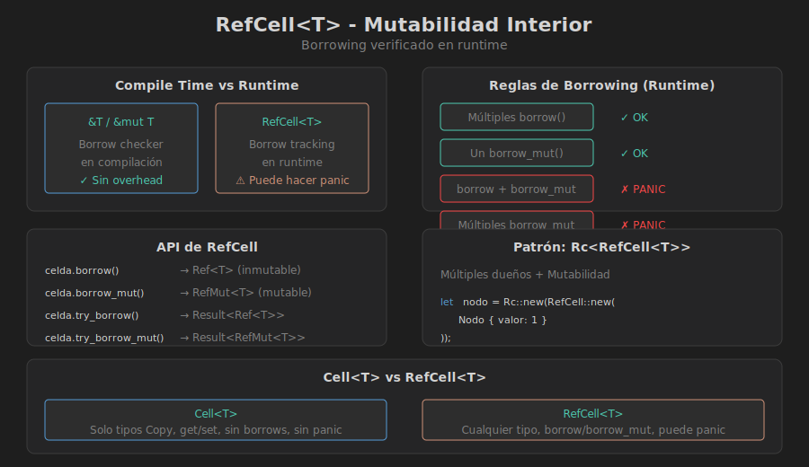

# 🔓 RefCell<T> - Mutabilidad Interior

## 🎯 Objetivos de Aprendizaje

- Comprender el concepto de mutabilidad interior
- Usar `RefCell<T>` para mutar datos con referencia inmutable
- Entender las reglas de borrowing en runtime
- Evitar panics por violaciones de borrowing

---

## 🧠 El Problema: Mutar con Referencia Inmutable

A veces el diseño requiere mutar datos cuando solo tenemos acceso inmutable:

```rust
// ❌ No compila: no podemos mutar a través de &self
struct Contador {
    valor: i32,
}

impl Contador {
    fn incrementar(&self) {
        self.valor += 1;  // ERROR: cannot mutate immutable field
    }
}
```

### La Solución: Interior Mutability

`RefCell<T>` mueve las reglas de borrowing de **compile time** a **runtime**:

```rust
use std::cell::RefCell;

struct Contador {
    valor: RefCell<i32>,
}

impl Contador {
    fn new() -> Self {
        Contador { valor: RefCell::new(0) }
    }
    
    fn incrementar(&self) {  // &self, no &mut self
        *self.valor.borrow_mut() += 1;
    }
    
    fn valor(&self) -> i32 {
        *self.valor.borrow()
    }
}

fn main() {
    let contador = Contador::new();
    
    contador.incrementar();
    contador.incrementar();
    
    println!("Valor: {}", contador.valor());  // 2
}
```

---

## 📊 RefCell en Detalle



### Reglas de Borrowing (en Runtime)

Las mismas reglas de siempre, pero verificadas cuando el programa corre:

| Situación | Compile Time (`&`/`&mut`) | Runtime (`RefCell`) |
|-----------|---------------------------|---------------------|
| Múltiples `&` | ✅ OK | ✅ OK |
| Un `&mut` | ✅ OK | ✅ OK |
| `&` + `&mut` | ❌ Error de compilación | ⚠️ **Panic en runtime** |
| Múltiples `&mut` | ❌ Error de compilación | ⚠️ **Panic en runtime** |

### API de RefCell

```rust
use std::cell::RefCell;

fn main() {
    let celda = RefCell::new(42);
    
    // borrow() → Ref<T> (inmutable)
    {
        let r1 = celda.borrow();
        let r2 = celda.borrow();  // ✅ Múltiples borrows inmutables OK
        println!("{}, {}", r1, r2);
    }  // r1 y r2 se liberan aquí
    
    // borrow_mut() → RefMut<T> (mutable)
    {
        let mut m = celda.borrow_mut();
        *m = 100;
    }  // m se libera aquí
    
    // try_borrow() y try_borrow_mut() → Result<Ref/RefMut, BorrowError>
    if let Ok(r) = celda.try_borrow() {
        println!("Valor: {}", r);
    }
    
    // into_inner() consume el RefCell
    let valor = celda.into_inner();
    println!("Valor final: {}", valor);
}
```

---

## ⚠️ Panics con RefCell

```rust
use std::cell::RefCell;

fn main() {
    let celda = RefCell::new(5);
    
    // ❌ PANIC: ya hay un borrow mutable activo
    let mut m = celda.borrow_mut();
    let r = celda.borrow();  // PANIC: already mutably borrowed
    
    // ❌ PANIC: dos borrows mutables
    let m1 = celda.borrow_mut();
    let m2 = celda.borrow_mut();  // PANIC: already mutably borrowed
}
```

### Evitando Panics

```rust
use std::cell::RefCell;

fn main() {
    let celda = RefCell::new(5);
    
    // ✅ Limitar el scope de borrows
    {
        let mut m = celda.borrow_mut();
        *m = 10;
    }  // m se libera aquí
    
    let r = celda.borrow();  // ✅ OK ahora
    println!("{}", r);
    
    // ✅ Usar try_borrow para evitar panics
    if let Ok(mut m) = celda.try_borrow_mut() {
        *m = 20;
    } else {
        println!("No se pudo obtener borrow mutable");
    }
}
```

---

## 🔗 Patrón Común: Rc<RefCell<T>>

Combinar `Rc` (múltiples dueños) con `RefCell` (mutabilidad interior):

```rust
use std::rc::Rc;
use std::cell::RefCell;

#[derive(Debug)]
struct Nodo {
    valor: i32,
    hijos: Vec<Rc<RefCell<Nodo>>>,
}

impl Nodo {
    fn new(valor: i32) -> Rc<RefCell<Self>> {
        Rc::new(RefCell::new(Nodo {
            valor,
            hijos: Vec::new(),
        }))
    }
    
    fn agregar_hijo(padre: &Rc<RefCell<Self>>, hijo: Rc<RefCell<Self>>) {
        padre.borrow_mut().hijos.push(hijo);
    }
}

fn main() {
    let raiz = Nodo::new(1);
    let hijo1 = Nodo::new(2);
    let hijo2 = Nodo::new(3);
    
    // Mismo nodo puede ser hijo de múltiples padres
    Nodo::agregar_hijo(&raiz, Rc::clone(&hijo1));
    Nodo::agregar_hijo(&raiz, Rc::clone(&hijo2));
    
    // Modificar un nodo
    hijo1.borrow_mut().valor = 20;
    
    // Leer el árbol
    for hijo in &raiz.borrow().hijos {
        println!("Hijo: {}", hijo.borrow().valor);
    }
}
```

---

## 📋 Casos de Uso

### 1. Mock Objects para Testing

```rust
use std::cell::RefCell;

trait Mensajero {
    fn enviar(&self, mensaje: &str);
}

struct MockMensajero {
    mensajes: RefCell<Vec<String>>,
}

impl MockMensajero {
    fn new() -> Self {
        MockMensajero {
            mensajes: RefCell::new(Vec::new()),
        }
    }
}

impl Mensajero for MockMensajero {
    fn enviar(&self, mensaje: &str) {
        // ¡Podemos mutar con &self!
        self.mensajes.borrow_mut().push(mensaje.to_string());
    }
}

#[cfg(test)]
mod tests {
    use super::*;
    
    #[test]
    fn test_envio() {
        let mock = MockMensajero::new();
        
        mock.enviar("Hola");
        mock.enviar("Mundo");
        
        let mensajes = mock.mensajes.borrow();
        assert_eq!(mensajes.len(), 2);
        assert_eq!(mensajes[0], "Hola");
    }
}
```

### 2. Caché Interno

```rust
use std::cell::RefCell;
use std::collections::HashMap;

struct Calculadora {
    cache: RefCell<HashMap<(i32, i32), i32>>,
}

impl Calculadora {
    fn new() -> Self {
        Calculadora {
            cache: RefCell::new(HashMap::new()),
        }
    }
    
    // Método inmutable que puede cachear resultados
    fn suma_costosa(&self, a: i32, b: i32) -> i32 {
        let key = (a, b);
        
        // Verificar cache
        if let Some(&resultado) = self.cache.borrow().get(&key) {
            println!("Cache hit!");
            return resultado;
        }
        
        // Calcular (simular operación costosa)
        println!("Calculando...");
        let resultado = a + b;
        
        // Guardar en cache
        self.cache.borrow_mut().insert(key, resultado);
        
        resultado
    }
}

fn main() {
    let calc = Calculadora::new();
    
    println!("Resultado: {}", calc.suma_costosa(5, 3));  // Calculando...
    println!("Resultado: {}", calc.suma_costosa(5, 3));  // Cache hit!
}
```

### 3. Observer Pattern

```rust
use std::cell::RefCell;
use std::rc::Rc;

type Callback = Box<dyn Fn(i32)>;

struct Observable {
    valor: RefCell<i32>,
    observers: RefCell<Vec<Callback>>,
}

impl Observable {
    fn new(valor: i32) -> Self {
        Observable {
            valor: RefCell::new(valor),
            observers: RefCell::new(Vec::new()),
        }
    }
    
    fn suscribir(&self, callback: Callback) {
        self.observers.borrow_mut().push(callback);
    }
    
    fn set_valor(&self, nuevo: i32) {
        *self.valor.borrow_mut() = nuevo;
        
        for observer in self.observers.borrow().iter() {
            observer(nuevo);
        }
    }
    
    fn get_valor(&self) -> i32 {
        *self.valor.borrow()
    }
}

fn main() {
    let observable = Observable::new(0);
    
    observable.suscribir(Box::new(|v| println!("Observer 1: {}", v)));
    observable.suscribir(Box::new(|v| println!("Observer 2: valor * 2 = {}", v * 2)));
    
    observable.set_valor(42);
    // Observer 1: 42
    // Observer 2: valor * 2 = 84
}
```

---

## 🔄 Cell<T> vs RefCell<T>

Para tipos `Copy`, existe `Cell<T>` que es más eficiente:

```rust
use std::cell::{Cell, RefCell};

fn main() {
    // Cell: para tipos Copy, sin borrowing
    let cell = Cell::new(5);
    cell.set(10);  // No retorna referencia
    let valor = cell.get();  // Copia el valor
    println!("Cell: {}", valor);
    
    // RefCell: para cualquier tipo, con borrowing
    let refcell = RefCell::new(String::from("hello"));
    refcell.borrow_mut().push_str(" world");
    println!("RefCell: {}", refcell.borrow());
}
```

| Característica | `Cell<T>` | `RefCell<T>` |
|----------------|-----------|--------------|
| Tipos | Solo `Copy` | Cualquier tipo |
| Método get | Copia el valor | N/A |
| Método set | Reemplaza valor | N/A |
| Borrowing | No (get/set) | Sí (borrow/borrow_mut) |
| Overhead | Mínimo | Contador de borrows |
| Panic posible | No | Sí |

---

## ⚠️ Errores Comunes

### 1. Mantener borrows demasiado tiempo

```rust
// ❌ PROBLEMA: borrow vive demasiado
let celda = RefCell::new(vec![1, 2, 3]);
let r = celda.borrow();
// ... mucho código ...
let m = celda.borrow_mut();  // PANIC si r sigue vivo

// ✅ SOLUCIÓN: drop explícito o scope limitado
drop(r);
let m = celda.borrow_mut();  // OK
```

### 2. Borrow dentro de loop

```rust
// ❌ PROBLEMA: borrow_mut en cada iteración mientras hay borrow
let datos = RefCell::new(vec![1, 2, 3]);
for item in datos.borrow().iter() {
    datos.borrow_mut().push(*item * 2);  // PANIC
}

// ✅ SOLUCIÓN: clonar o separar operaciones
let clonado: Vec<_> = datos.borrow().clone();
for item in clonado {
    datos.borrow_mut().push(item * 2);
}
```

---

## 🎯 Resumen

| Concepto | Descripción |
|----------|-------------|
| `RefCell<T>` | Mutabilidad interior con borrowing en runtime |
| `borrow()` | Obtiene `Ref<T>` (inmutable) |
| `borrow_mut()` | Obtiene `RefMut<T>` (mutable) |
| `try_borrow*` | Versiones que no hacen panic |
| `Cell<T>` | Alternativa más simple para tipos Copy |

### Cuándo Usar RefCell

- ✅ Mock objects en tests
- ✅ Caché interno en structs inmutables
- ✅ Observer/callback patterns
- ✅ Cuando el borrow checker es demasiado conservador
- ❌ No usar si puedes reestructurar para usar `&mut`

---

## 📚 Próximo Tema

En el siguiente archivo veremos **patrones avanzados** combinando smart pointers:

➡️ [05-patrones-avanzados.md](05-patrones-avanzados.md)
