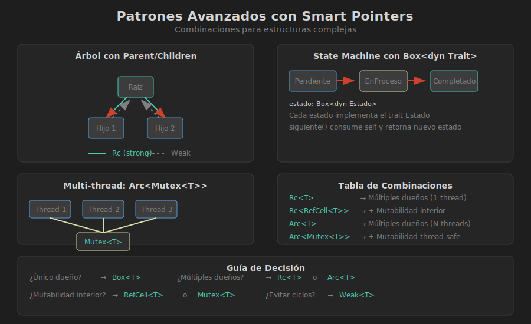

# 🧩 Patrones Avanzados con Smart Pointers

## 🎯 Objetivos de Aprendizaje

- Combinar smart pointers efectivamente
- Implementar estructuras de datos complejas
- Usar `Weak<T>` para evitar ciclos
- Aplicar patrones comunes en Rust

---

## 📊 Combinaciones de Smart Pointers



### Tabla de Combinaciones

| Combinación | Uso | Ejemplo |
|-------------|-----|---------|
| `Box<dyn Trait>` | Trait objects | Colección de tipos heterogéneos |
| `Rc<T>` | Múltiples dueños inmutables | Grafos, árboles compartidos |
| `Rc<RefCell<T>>` | Múltiples dueños + mutabilidad | Nodos de árbol mutables |
| `Arc<Mutex<T>>` | Multi-thread + mutabilidad | Estado compartido entre threads |
| `Weak<T>` | Referencias sin ownership | Evitar ciclos en grafos |

---

## 🌳 Patrón 1: Árbol con Parent/Children

El patrón más común: hijos tienen `Rc` y padres tienen `Weak`:

```rust
use std::rc::{Rc, Weak};
use std::cell::RefCell;

#[derive(Debug)]
struct NodoArbol {
    valor: i32,
    padre: RefCell<Weak<NodoArbol>>,
    hijos: RefCell<Vec<Rc<NodoArbol>>>,
}

impl NodoArbol {
    fn new(valor: i32) -> Rc<Self> {
        Rc::new(NodoArbol {
            valor,
            padre: RefCell::new(Weak::new()),
            hijos: RefCell::new(Vec::new()),
        })
    }
    
    fn agregar_hijo(padre: &Rc<Self>, hijo: &Rc<Self>) {
        // Hijo guarda weak reference al padre
        *hijo.padre.borrow_mut() = Rc::downgrade(padre);
        // Padre guarda strong reference al hijo
        padre.hijos.borrow_mut().push(Rc::clone(hijo));
    }
    
    fn obtener_padre(&self) -> Option<Rc<Self>> {
        self.padre.borrow().upgrade()
    }
    
    fn profundidad(&self) -> usize {
        match self.obtener_padre() {
            Some(padre) => 1 + padre.profundidad(),
            None => 0,
        }
    }
}

fn main() {
    let raiz = NodoArbol::new(1);
    let hijo1 = NodoArbol::new(2);
    let hijo2 = NodoArbol::new(3);
    let nieto = NodoArbol::new(4);
    
    NodoArbol::agregar_hijo(&raiz, &hijo1);
    NodoArbol::agregar_hijo(&raiz, &hijo2);
    NodoArbol::agregar_hijo(&hijo1, &nieto);
    
    println!("Profundidad de nieto: {}", nieto.profundidad());  // 2
    
    // Verificar que no hay memory leaks
    println!("raiz strong_count: {}", Rc::strong_count(&raiz));    // 1
    println!("hijo1 strong_count: {}", Rc::strong_count(&hijo1));  // 2 (raiz + nieto's parent)
}
```

---

## 🕸️ Patrón 2: Grafo Dirigido

Grafos con nodos compartidos usando `Rc`:

```rust
use std::rc::Rc;
use std::cell::RefCell;
use std::collections::HashMap;

type NodoRef = Rc<RefCell<NodoGrafo>>;

#[derive(Debug)]
struct NodoGrafo {
    id: String,
    vecinos: Vec<NodoRef>,
}

struct Grafo {
    nodos: HashMap<String, NodoRef>,
}

impl Grafo {
    fn new() -> Self {
        Grafo { nodos: HashMap::new() }
    }
    
    fn agregar_nodo(&mut self, id: &str) -> NodoRef {
        let nodo = Rc::new(RefCell::new(NodoGrafo {
            id: id.to_string(),
            vecinos: Vec::new(),
        }));
        self.nodos.insert(id.to_string(), Rc::clone(&nodo));
        nodo
    }
    
    fn conectar(&self, desde: &str, hacia: &str) {
        if let (Some(nodo_desde), Some(nodo_hacia)) = 
            (self.nodos.get(desde), self.nodos.get(hacia)) 
        {
            nodo_desde.borrow_mut().vecinos.push(Rc::clone(nodo_hacia));
        }
    }
    
    fn vecinos_de(&self, id: &str) -> Vec<String> {
        self.nodos.get(id)
            .map(|nodo| {
                nodo.borrow()
                    .vecinos
                    .iter()
                    .map(|v| v.borrow().id.clone())
                    .collect()
            })
            .unwrap_or_default()
    }
}

fn main() {
    let mut grafo = Grafo::new();
    
    grafo.agregar_nodo("A");
    grafo.agregar_nodo("B");
    grafo.agregar_nodo("C");
    
    grafo.conectar("A", "B");
    grafo.conectar("A", "C");
    grafo.conectar("B", "C");
    
    println!("Vecinos de A: {:?}", grafo.vecinos_de("A"));  // ["B", "C"]
    println!("Vecinos de B: {:?}", grafo.vecinos_de("B"));  // ["C"]
}
```

---

## 🔄 Patrón 3: Lista Doblemente Enlazada

Usando `Weak` para el enlace `prev`:

```rust
use std::rc::{Rc, Weak};
use std::cell::RefCell;

type Enlace<T> = Option<Rc<RefCell<Nodo<T>>>>;
type EnlaceDebil<T> = Option<Weak<RefCell<Nodo<T>>>>;

#[derive(Debug)]
struct Nodo<T> {
    valor: T,
    siguiente: Enlace<T>,
    anterior: EnlaceDebil<T>,
}

#[derive(Debug)]
pub struct ListaDoble<T> {
    cabeza: Enlace<T>,
    cola: EnlaceDebil<T>,
    longitud: usize,
}

impl<T> ListaDoble<T> {
    pub fn new() -> Self {
        ListaDoble {
            cabeza: None,
            cola: None,
            longitud: 0,
        }
    }
    
    pub fn push_front(&mut self, valor: T) {
        let nuevo_nodo = Rc::new(RefCell::new(Nodo {
            valor,
            siguiente: self.cabeza.take(),
            anterior: None,
        }));
        
        match &self.cabeza {
            Some(vieja_cabeza) => {
                vieja_cabeza.borrow_mut().anterior = Some(Rc::downgrade(&nuevo_nodo));
            }
            None => {
                self.cola = Some(Rc::downgrade(&nuevo_nodo));
            }
        }
        
        self.cabeza = Some(nuevo_nodo);
        self.longitud += 1;
    }
    
    pub fn push_back(&mut self, valor: T) {
        let nuevo_nodo = Rc::new(RefCell::new(Nodo {
            valor,
            siguiente: None,
            anterior: self.cola.clone(),
        }));
        
        match self.cola.as_ref().and_then(|w| w.upgrade()) {
            Some(vieja_cola) => {
                vieja_cola.borrow_mut().siguiente = Some(Rc::clone(&nuevo_nodo));
            }
            None => {
                self.cabeza = Some(Rc::clone(&nuevo_nodo));
            }
        }
        
        self.cola = Some(Rc::downgrade(&nuevo_nodo));
        self.longitud += 1;
    }
    
    pub fn pop_front(&mut self) -> Option<T> {
        self.cabeza.take().map(|vieja_cabeza| {
            match vieja_cabeza.borrow_mut().siguiente.take() {
                Some(nueva_cabeza) => {
                    nueva_cabeza.borrow_mut().anterior = None;
                    self.cabeza = Some(nueva_cabeza);
                }
                None => {
                    self.cola = None;
                }
            }
            self.longitud -= 1;
            Rc::try_unwrap(vieja_cabeza).ok().unwrap().into_inner().valor
        })
    }
    
    pub fn len(&self) -> usize {
        self.longitud
    }
    
    pub fn is_empty(&self) -> bool {
        self.longitud == 0
    }
}

impl<T> Default for ListaDoble<T> {
    fn default() -> Self {
        Self::new()
    }
}

fn main() {
    let mut lista: ListaDoble<i32> = ListaDoble::new();
    
    lista.push_back(1);
    lista.push_back(2);
    lista.push_front(0);
    
    println!("Longitud: {}", lista.len());  // 3
    
    while let Some(valor) = lista.pop_front() {
        println!("Pop: {}", valor);  // 0, 1, 2
    }
}
```

---

## 🎭 Patrón 4: Trait Objects con Estado

Usando `Box<dyn Trait>` para polimorfismo:

```rust
trait Estado {
    fn nombre(&self) -> &str;
    fn siguiente(self: Box<Self>) -> Box<dyn Estado>;
    fn puede_cancelar(&self) -> bool;
}

struct Pendiente;
struct EnProceso;
struct Completado;
struct Cancelado;

impl Estado for Pendiente {
    fn nombre(&self) -> &str { "Pendiente" }
    
    fn siguiente(self: Box<Self>) -> Box<dyn Estado> {
        Box::new(EnProceso)
    }
    
    fn puede_cancelar(&self) -> bool { true }
}

impl Estado for EnProceso {
    fn nombre(&self) -> &str { "En Proceso" }
    
    fn siguiente(self: Box<Self>) -> Box<dyn Estado> {
        Box::new(Completado)
    }
    
    fn puede_cancelar(&self) -> bool { true }
}

impl Estado for Completado {
    fn nombre(&self) -> &str { "Completado" }
    
    fn siguiente(self: Box<Self>) -> Box<dyn Estado> {
        self  // Estado final
    }
    
    fn puede_cancelar(&self) -> bool { false }
}

impl Estado for Cancelado {
    fn nombre(&self) -> &str { "Cancelado" }
    
    fn siguiente(self: Box<Self>) -> Box<dyn Estado> {
        self  // Estado final
    }
    
    fn puede_cancelar(&self) -> bool { false }
}

struct Pedido {
    id: u32,
    estado: Box<dyn Estado>,
}

impl Pedido {
    fn new(id: u32) -> Self {
        Pedido {
            id,
            estado: Box::new(Pendiente),
        }
    }
    
    fn avanzar(&mut self) {
        // Necesitamos tomar ownership del estado actual
        let estado_actual = std::mem::replace(
            &mut self.estado, 
            Box::new(Pendiente)  // Placeholder temporal
        );
        self.estado = estado_actual.siguiente();
    }
    
    fn cancelar(&mut self) -> Result<(), &str> {
        if self.estado.puede_cancelar() {
            self.estado = Box::new(Cancelado);
            Ok(())
        } else {
            Err("No se puede cancelar en este estado")
        }
    }
    
    fn estado(&self) -> &str {
        self.estado.nombre()
    }
}

fn main() {
    let mut pedido = Pedido::new(1);
    
    println!("Estado: {}", pedido.estado());  // Pendiente
    
    pedido.avanzar();
    println!("Estado: {}", pedido.estado());  // En Proceso
    
    pedido.avanzar();
    println!("Estado: {}", pedido.estado());  // Completado
    
    match pedido.cancelar() {
        Ok(()) => println!("Cancelado"),
        Err(e) => println!("Error: {}", e),  // No se puede cancelar
    }
}
```

---

## 🔐 Patrón 5: Arc<Mutex<T>> para Threads

Estado compartido mutable entre threads:

```rust
use std::sync::{Arc, Mutex};
use std::thread;

struct ContadorCompartido {
    valor: Arc<Mutex<i32>>,
}

impl ContadorCompartido {
    fn new() -> Self {
        ContadorCompartido {
            valor: Arc::new(Mutex::new(0)),
        }
    }
    
    fn clonar_handle(&self) -> Arc<Mutex<i32>> {
        Arc::clone(&self.valor)
    }
    
    fn incrementar(&self) {
        let mut valor = self.valor.lock().unwrap();
        *valor += 1;
    }
    
    fn obtener(&self) -> i32 {
        *self.valor.lock().unwrap()
    }
}

fn main() {
    let contador = ContadorCompartido::new();
    let mut handles = vec![];
    
    for _ in 0..10 {
        let handle = contador.clonar_handle();
        
        let h = thread::spawn(move || {
            for _ in 0..100 {
                let mut valor = handle.lock().unwrap();
                *valor += 1;
            }
        });
        
        handles.push(h);
    }
    
    for h in handles {
        h.join().unwrap();
    }
    
    println!("Valor final: {}", contador.obtener());  // 1000
}
```

---

## 📋 Resumen de Patrones

| Patrón | Estructura | Smart Pointers |
|--------|------------|----------------|
| Árbol | Parent ↔ Children | `Rc` + `Weak` + `RefCell` |
| Grafo | Nodos compartidos | `Rc<RefCell<T>>` |
| Lista doble | Prev ↔ Next | `Rc` + `Weak` |
| State machine | Estados dinámicos | `Box<dyn Trait>` |
| Multi-thread | Estado compartido | `Arc<Mutex<T>>` |

---

## ⚠️ Mejores Prácticas

### 1. Preferir Compile-Time sobre Runtime

```rust
// ✅ Mejor: verificación en compile time
fn procesar(datos: &mut Vec<i32>) {
    datos.push(1);
}

// ⚠️ Solo si es necesario: verificación en runtime
fn procesar_refcell(datos: &RefCell<Vec<i32>>) {
    datos.borrow_mut().push(1);
}
```

### 2. Mantener Borrows Cortos

```rust
// ✅ Scope limitado
{
    let mut guard = celda.borrow_mut();
    guard.push(1);
}  // guard se libera aquí
let valor = celda.borrow()[0];

// ❌ Borrow muy largo
let guard = celda.borrow_mut();
// ... mucho código ...
// guard sigue vivo, bloquea otros borrows
```

### 3. Weak para Referencias Opcionales

```rust
// ✅ Weak para "pertenece a" o "apunta a"
struct Empleado {
    nombre: String,
    departamento: Weak<Departamento>,  // Puede no existir
}

// ✅ Rc para "posee" o "contiene"
struct Departamento {
    nombre: String,
    empleados: Vec<Rc<Empleado>>,  // Mantiene vivos
}
```

---

## 🎯 Checklist de Diseño

Antes de usar smart pointers, pregúntate:

- [ ] ¿Realmente necesito múltiples dueños? → Si no, usa `Box` o referencias
- [ ] ¿Necesito mutabilidad? → Si no, `Rc` sin `RefCell` es suficiente
- [ ] ¿Es multi-thread? → Usa `Arc` en lugar de `Rc`
- [ ] ¿Hay ciclos potenciales? → Usa `Weak` para romperlos
- [ ] ¿Puedo rediseñar para evitar smart pointers? → A menudo sí

---

## 📚 Práctica

Ahora que conoces los patrones, es hora de practicar:

➡️ [Práctica 01: Box](../2-practica/practica-01-box/)
