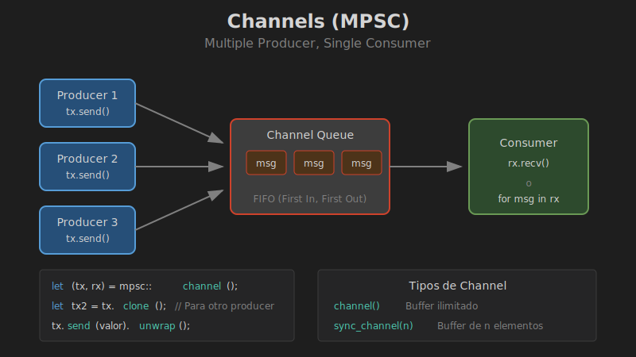

# Channels y MPSC

## 🎯 Objetivos

- Comunicar threads mediante channels
- Usar `mpsc` (multiple producer, single consumer)
- Enviar múltiples valores
- Clonar transmitters para múltiples productores



## 📚 Conceptos

### ¿Qué es un Channel?

Un channel es un mecanismo de comunicación entre threads. En Rust, `mpsc` significa:
- **M**ultiple **P**roducer: Varios threads pueden enviar
- **S**ingle **C**onsumer: Un thread recibe

```rust
use std::sync::mpsc;
use std::thread;

fn main() {
    // Crear channel
    let (tx, rx) = mpsc::channel();

    // Enviar desde otro thread
    thread::spawn(move || {
        tx.send("Hola desde el thread!").unwrap();
    });

    // Recibir en el thread principal
    let mensaje = rx.recv().unwrap();
    println!("Recibido: {}", mensaje);
}
```

### Anatomía del Channel

```
┌─────────────────────────────────────────────────────────────┐
│                      MPSC CHANNEL                           │
├─────────────────────────────────────────────────────────────┤
│                                                             │
│   Sender (tx)                     Receiver (rx)             │
│   ┌─────────┐                     ┌─────────┐              │
│   │Producer1│──┐                  │         │              │
│   └─────────┘  │   ┌─────────┐   │Consumer │              │
│   ┌─────────┐  ├──►│  Queue  │──►│         │              │
│   │Producer2│──┤   └─────────┘   └─────────┘              │
│   └─────────┘  │                                           │
│   ┌─────────┐  │                                           │
│   │Producer3│──┘                                           │
│   └─────────┘                                              │
│                                                             │
│   tx.send(msg)                    rx.recv()                │
│                                   rx.try_recv()            │
└─────────────────────────────────────────────────────────────┘
```

## 🔧 API de Channels

### Crear Channel

```rust
use std::sync::mpsc;

// Channel asíncrono (buffer ilimitado)
let (tx, rx) = mpsc::channel::<String>();

// Channel síncrono (buffer limitado)
let (tx, rx) = mpsc::sync_channel::<String>(10);
```

### Enviar Mensajes

```rust
// send() - Puede fallar si el receiver se cerró
tx.send(valor).unwrap();

// Con manejo de errores
match tx.send(valor) {
    Ok(()) => println!("Enviado"),
    Err(e) => println!("Error: {}", e),
}
```

### Recibir Mensajes

```rust
// recv() - Bloquea hasta recibir
let msg = rx.recv().unwrap();

// try_recv() - No bloquea
match rx.try_recv() {
    Ok(msg) => println!("Mensaje: {}", msg),
    Err(mpsc::TryRecvError::Empty) => println!("Vacío"),
    Err(mpsc::TryRecvError::Disconnected) => println!("Cerrado"),
}

// recv_timeout() - Bloquea con límite de tiempo
use std::time::Duration;
match rx.recv_timeout(Duration::from_secs(1)) {
    Ok(msg) => println!("Recibido: {}", msg),
    Err(_) => println!("Timeout o desconectado"),
}
```

### Iterar sobre Mensajes

```rust
use std::sync::mpsc;
use std::thread;

fn main() {
    let (tx, rx) = mpsc::channel();

    thread::spawn(move || {
        for i in 1..=5 {
            tx.send(i).unwrap();
        }
        // tx se dropea aquí, cerrando el channel
    });

    // Iterar hasta que el channel se cierre
    for msg in rx {
        println!("Recibido: {}", msg);
    }
    println!("Channel cerrado");
}
```

## 👥 Múltiples Productores

Clona el `Sender` para múltiples productores:

```rust
use std::sync::mpsc;
use std::thread;

fn main() {
    let (tx, rx) = mpsc::channel();

    // Crear 3 productores
    for i in 0..3 {
        let tx_clone = tx.clone();
        thread::spawn(move || {
            for j in 0..3 {
                tx_clone.send(format!("Thread {}: mensaje {}", i, j)).unwrap();
            }
        });
    }

    // Importante: dropear el tx original
    drop(tx);

    // Recibir todos los mensajes
    for msg in rx {
        println!("{}", msg);
    }
}
```

## 📊 Tipos de Channels

### Channel Asíncrono (Ilimitado)

```rust
let (tx, rx) = mpsc::channel();

// El sender NUNCA bloquea
// Los mensajes se acumulan en memoria
tx.send(1).unwrap();
tx.send(2).unwrap();
tx.send(3).unwrap();
// No hay límite (cuidado con memoria!)
```

### Channel Síncrono (Limitado)

```rust
let (tx, rx) = mpsc::sync_channel(2); // Buffer de 2

tx.send(1).unwrap();  // No bloquea
tx.send(2).unwrap();  // No bloquea (buffer lleno)
// tx.send(3).unwrap(); // BLOQUEA hasta que rx consuma

// Con try_send
match tx.try_send(3) {
    Ok(()) => println!("Enviado"),
    Err(mpsc::TrySendError::Full(v)) => println!("Buffer lleno: {}", v),
    Err(mpsc::TrySendError::Disconnected(v)) => println!("Cerrado"),
}
```

## 🎯 Patrones Comunes

### Worker con Respuesta

```rust
use std::sync::mpsc;
use std::thread;

enum Mensaje {
    Calcular(i32, i32),
    Terminar,
}

fn main() {
    let (tx_trabajo, rx_trabajo) = mpsc::channel();
    let (tx_resultado, rx_resultado) = mpsc::channel();

    // Worker thread
    thread::spawn(move || {
        loop {
            match rx_trabajo.recv().unwrap() {
                Mensaje::Calcular(a, b) => {
                    tx_resultado.send(a + b).unwrap();
                }
                Mensaje::Terminar => break,
            }
        }
    });

    // Enviar trabajo
    tx_trabajo.send(Mensaje::Calcular(10, 20)).unwrap();
    tx_trabajo.send(Mensaje::Calcular(5, 5)).unwrap();

    // Recibir resultados
    println!("Resultado 1: {}", rx_resultado.recv().unwrap());
    println!("Resultado 2: {}", rx_resultado.recv().unwrap());

    // Terminar worker
    tx_trabajo.send(Mensaje::Terminar).unwrap();
}
```

### Fan-Out / Fan-In

```rust
use std::sync::mpsc;
use std::thread;

fn main() {
    let (tx, rx) = mpsc::channel();
    let (tx_results, rx_results) = mpsc::channel();

    // Fan-out: múltiples workers
    for id in 0..4 {
        let rx = rx.clone(); // ❌ No se puede clonar Receiver!
        // Necesitamos otro patrón...
    }
}

// Solución: usar crossbeam-channel o distribuir trabajo de otra forma
```

## ⚠️ Errores Comunes

### 1. No dropear tx original

```rust
let (tx, rx) = mpsc::channel();
let tx2 = tx.clone();

thread::spawn(move || { tx2.send(1).unwrap(); });

// ❌ El iterador nunca termina porque tx sigue vivo
// for msg in rx { ... }

// ✅ Dropear tx original
drop(tx);
for msg in rx {
    println!("{}", msg);
}
```

### 2. Deadlock por orden de operaciones

```rust
// ❌ Deadlock: send bloquea esperando recv, pero recv nunca se llama
let (tx, rx) = mpsc::sync_channel(0);
tx.send(1).unwrap();  // Bloquea para siempre
let msg = rx.recv();

// ✅ Usar threads separados
let (tx, rx) = mpsc::sync_channel(0);
thread::spawn(move || { tx.send(1).unwrap(); });
let msg = rx.recv().unwrap();
```

## 📊 Comparación

| Característica | `channel()` | `sync_channel(n)` |
|----------------|-------------|-------------------|
| Buffer | Ilimitado | n elementos |
| send() bloquea | Nunca | Cuando lleno |
| Uso de memoria | Crece | Limitado |
| Backpressure | No | Sí |

## 🎯 Resumen

```rust
use std::sync::mpsc;
use std::thread;

// Crear channel
let (tx, rx) = mpsc::channel();

// Clonar para múltiples productores
let tx2 = tx.clone();

// Enviar
tx.send(valor).unwrap();

// Recibir
let msg = rx.recv().unwrap();

// Iterar
for msg in rx { /* ... */ }
```

## 📖 Siguiente

[03-mutex.md](03-mutex.md) - Proteger datos compartidos
