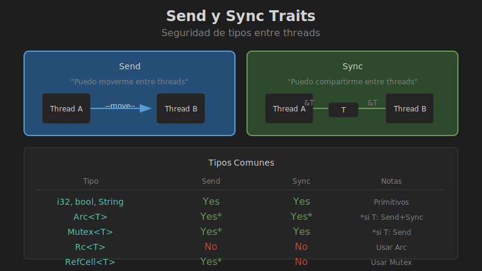

# Traits Send y Sync

## 🎯 Objetivos

- Entender el trait `Send`
- Entender el trait `Sync`
- Conocer qué tipos implementan estos traits
- Implementar tipos thread-safe



## 📚 Conceptos

### ¿Qué son Send y Sync?

Son **marker traits** que indican al compilador si un tipo es seguro para usar con threads:

```
┌─────────────────────────────────────────────────────────────┐
│                    SEND Y SYNC                              │
├─────────────────────────────────────────────────────────────┤
│                                                             │
│   Send: "Puedo moverme entre threads"                       │
│   ─────────────────────────────────                         │
│   T: Send significa que T puede transferirse                │
│   de un thread a otro de forma segura.                      │
│                                                             │
│   ┌─────────┐    move    ┌─────────┐                       │
│   │Thread A │ ────────►  │Thread B │                       │
│   │  [T]    │            │  [T]    │                       │
│   └─────────┘            └─────────┘                       │
│                                                             │
├─────────────────────────────────────────────────────────────┤
│                                                             │
│   Sync: "Puedo compartirme entre threads"                   │
│   ───────────────────────────────────────                   │
│   T: Sync significa que &T puede enviarse                   │
│   entre threads de forma segura.                            │
│                                                             │
│   ┌─────────┐            ┌─────────┐                       │
│   │Thread A │            │Thread B │                       │
│   │  &T ────┼────────────┼── &T    │                       │
│   └─────────┘     ▲      └─────────┘                       │
│                   │                                         │
│              ┌────┴────┐                                   │
│              │    T    │                                   │
│              └─────────┘                                   │
│                                                             │
└─────────────────────────────────────────────────────────────┘
```

### Definición Formal

```rust
// Si T es Send, ownership de T puede moverse entre threads
pub unsafe auto trait Send { }

// Si T es Sync, &T puede compartirse entre threads
// Equivalente a: &T es Send
pub unsafe auto trait Sync { }
```

## 📊 Tipos Comunes

### Tipos que son Send + Sync

```rust
// Primitivos
i32, u64, f64, bool, char  // ✅ Send + Sync

// Strings
String, &str               // ✅ Send + Sync

// Colecciones
Vec<T>, HashMap<K, V>      // ✅ si T, K, V son Send + Sync

// Smart pointers thread-safe
Arc<T>                     // ✅ Send + Sync si T: Send + Sync
Mutex<T>                   // ✅ Send + Sync si T: Send
RwLock<T>                  // ✅ Send + Sync si T: Send + Sync

// Box
Box<T>                     // ✅ Send si T: Send, Sync si T: Sync
```

### Tipos que NO son Send ni Sync

```rust
// Reference counting no atómico
Rc<T>                      // ❌ No es Send ni Sync

// Interior mutability sin sincronización
Cell<T>                    // ❌ No es Sync (sí es Send si T: Send)
RefCell<T>                 // ❌ No es Sync (sí es Send si T: Send)

// Raw pointers
*mut T, *const T           // ❌ No son Send ni Sync por defecto
```

## 🔧 En la Práctica

### Por qué Rc no es Send

```rust
use std::rc::Rc;
use std::thread;

fn main() {
    let rc = Rc::new(5);
    
    // ❌ Error: Rc<i32> cannot be sent between threads safely
    thread::spawn(move || {
        println!("{}", rc);
    });
}
```

El contador de referencias de `Rc` no es atómico, lo que causaría data races.

### Solución: Usar Arc

```rust
use std::sync::Arc;
use std::thread;

fn main() {
    let arc = Arc::new(5);
    let arc_clone = Arc::clone(&arc);
    
    // ✅ Arc es Send + Sync
    thread::spawn(move || {
        println!("{}", arc_clone);
    }).join().unwrap();
}
```

### Por qué RefCell no es Sync

```rust
use std::cell::RefCell;
use std::thread;
use std::sync::Arc;

fn main() {
    // RefCell es Send pero NO Sync
    let cell = Arc::new(RefCell::new(5));
    let cell_clone = Arc::clone(&cell);
    
    // ❌ Error: RefCell<i32> cannot be shared between threads safely
    thread::spawn(move || {
        *cell_clone.borrow_mut() = 10;
    });
}
```

`RefCell` verifica borrowing en runtime sin sincronización, causando data races.

### Solución: Usar Mutex

```rust
use std::sync::{Arc, Mutex};
use std::thread;

fn main() {
    let data = Arc::new(Mutex::new(5));
    let data_clone = Arc::clone(&data);
    
    // ✅ Mutex es Sync
    thread::spawn(move || {
        *data_clone.lock().unwrap() = 10;
    }).join().unwrap();
}
```

## 📋 Tabla de Referencia

| Tipo | Send | Sync | Notas |
|------|------|------|-------|
| `i32`, `bool`, etc. | ✅ | ✅ | Primitivos |
| `String` | ✅ | ✅ | Owned string |
| `&T` | ✅ | ✅ | Si T: Sync |
| `&mut T` | ✅ | ❌ | Exclusivo |
| `Box<T>` | ✅* | ✅* | *Si T lo es |
| `Vec<T>` | ✅* | ✅* | *Si T lo es |
| `Rc<T>` | ❌ | ❌ | Usar Arc |
| `Arc<T>` | ✅* | ✅* | *Si T: Send + Sync |
| `Cell<T>` | ✅* | ❌ | *Si T: Send |
| `RefCell<T>` | ✅* | ❌ | *Si T: Send |
| `Mutex<T>` | ✅* | ✅ | *Si T: Send |
| `RwLock<T>` | ✅* | ✅* | *Si T: Send + Sync |
| `*mut T` | ❌ | ❌ | Raw pointer |

## 🔒 Implementar Send/Sync Manualmente

### Caso: Wrapper de Raw Pointer

```rust
use std::ptr::NonNull;

struct MiPuntero<T> {
    ptr: NonNull<T>,
}

// Raw pointers no son Send/Sync por defecto
// Debemos garantizar manualmente que es seguro

// UNSAFE: Afirmamos que MiPuntero es Send si T es Send
unsafe impl<T: Send> Send for MiPuntero<T> {}

// UNSAFE: Afirmamos que MiPuntero es Sync si T es Sync
unsafe impl<T: Sync> Sync for MiPuntero<T> {}
```

⚠️ **Advertencia**: Implementar `Send`/`Sync` manualmente es `unsafe` porque el compilador no puede verificar la corrección. Solo hazlo si entiendes completamente las implicaciones.

### Opt-out de Send/Sync

```rust
use std::marker::PhantomData;
use std::cell::UnsafeCell;

struct NoEnviar {
    // PhantomData<*const ()> hace que el tipo no sea Send ni Sync
    _marker: PhantomData<*const ()>,
}

// O usando UnsafeCell
struct NoCompartir<T> {
    data: UnsafeCell<T>,
}
// UnsafeCell<T> no es Sync automáticamente
```

## 🎯 Reglas Prácticas

### Cuándo un tipo es Send

Un tipo es `Send` si puede moverse de forma segura a otro thread:
- ✅ No contiene referencias a datos thread-local
- ✅ No contiene `Rc<T>` u otros tipos no-Send
- ✅ Si es un struct, todos sus campos son Send

### Cuándo un tipo es Sync

Un tipo es `Sync` si múltiples threads pueden tener `&T` simultáneamente:
- ✅ Es inmutable, o
- ✅ Usa sincronización interna (Mutex, Atomic, etc.)
- ❌ No es Sync si permite mutación sin sincronización (Cell, RefCell)

## 📊 Relación entre Send y Sync

```rust
// Si T: Sync, entonces &T: Send
// (Si puedo compartir &T, puedo enviar &T a otro thread)

// Esto significa:
// Arc<T> requiere T: Send + Sync
// - Send para poder mover Arc entre threads
// - Sync porque múltiples threads tendrán &T via Arc

// Mutex<T> solo requiere T: Send
// - El Mutex garantiza acceso exclusivo
// - No se comparte &T directamente
```

## 🎯 Resumen

```rust
// Send: Ownership puede moverse entre threads
// Sync: &T puede compartirse entre threads

// La mayoría de tipos son Send + Sync
// Excepciones notables:
// - Rc<T>: No es Send ni Sync (usar Arc)
// - RefCell<T>: No es Sync (usar Mutex)
// - Cell<T>: No es Sync (usar Atomic*)
// - Raw pointers: No son Send ni Sync por defecto

// El compilador verifica automáticamente
fn requiere_send<T: Send>(t: T) {}
fn requiere_sync<T: Sync>(t: T) {}
```

## 📖 Siguiente

[05-patrones.md](05-patrones.md) - Patrones de concurrencia
