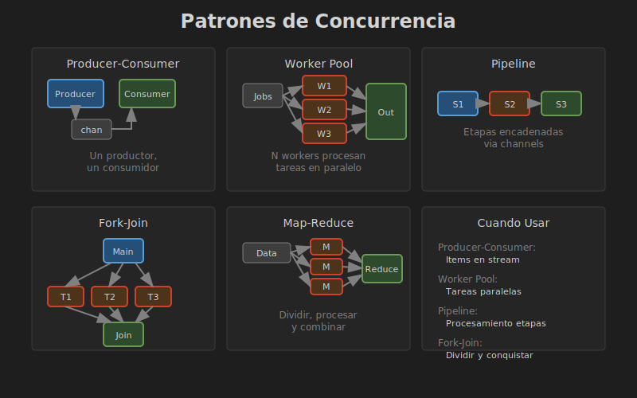

# Patrones de Concurrencia

## 🎯 Objetivos

- Implementar patrones comunes de concurrencia
- Conocer Producer-Consumer
- Implementar Thread Pool básico
- Aplicar buenas prácticas



## 📚 Patrones

### 1. Producer-Consumer

Uno o más threads producen datos, otros los consumen:

```rust
use std::sync::mpsc;
use std::thread;
use std::time::Duration;

fn main() {
    let (tx, rx) = mpsc::channel();

    // Productor
    let producer = thread::spawn(move || {
        for i in 0..10 {
            println!("Produciendo: {}", i);
            tx.send(i).unwrap();
            thread::sleep(Duration::from_millis(100));
        }
    });

    // Consumidor
    let consumer = thread::spawn(move || {
        for item in rx {
            println!("Consumiendo: {}", item);
            thread::sleep(Duration::from_millis(150));
        }
    });

    producer.join().unwrap();
    consumer.join().unwrap();
}
```

### 2. Worker Pool

Múltiples workers procesan tareas de una cola:

```rust
use std::sync::{mpsc, Arc, Mutex};
use std::thread;

type Job = Box<dyn FnOnce() + Send + 'static>;

struct ThreadPool {
    workers: Vec<Worker>,
    sender: mpsc::Sender<Job>,
}

struct Worker {
    id: usize,
    thread: thread::JoinHandle<()>,
}

impl ThreadPool {
    fn new(size: usize) -> Self {
        let (sender, receiver) = mpsc::channel();
        let receiver = Arc::new(Mutex::new(receiver));

        let mut workers = Vec::with_capacity(size);
        for id in 0..size {
            workers.push(Worker::new(id, Arc::clone(&receiver)));
        }

        ThreadPool { workers, sender }
    }

    fn execute<F>(&self, f: F)
    where
        F: FnOnce() + Send + 'static,
    {
        let job = Box::new(f);
        self.sender.send(job).unwrap();
    }
}

impl Worker {
    fn new(id: usize, receiver: Arc<Mutex<mpsc::Receiver<Job>>>) -> Self {
        let thread = thread::spawn(move || loop {
            let job = receiver.lock().unwrap().recv();
            match job {
                Ok(job) => {
                    println!("Worker {} ejecutando tarea", id);
                    job();
                }
                Err(_) => {
                    println!("Worker {} terminando", id);
                    break;
                }
            }
        });

        Worker { id, thread }
    }
}

fn main() {
    let pool = ThreadPool::new(4);

    for i in 0..8 {
        pool.execute(move || {
            println!("Tarea {} ejecutándose", i);
            thread::sleep(std::time::Duration::from_millis(100));
        });
    }

    thread::sleep(std::time::Duration::from_secs(2));
}
```

### 3. Map-Reduce

Dividir trabajo, procesar en paralelo, combinar resultados:

```rust
use std::thread;

fn map_reduce<T, U, R, M, Re>(
    data: Vec<T>,
    num_threads: usize,
    map_fn: M,
    reduce_fn: Re,
) -> R
where
    T: Send + 'static,
    U: Send + 'static,
    R: Send + 'static,
    M: Fn(T) -> U + Send + Sync + Copy + 'static,
    Re: Fn(Vec<U>) -> R,
{
    let chunk_size = (data.len() + num_threads - 1) / num_threads;
    let mut handles = vec![];

    for chunk in data.into_iter().collect::<Vec<_>>().chunks(chunk_size) {
        let chunk = chunk.to_vec();
        let handle = thread::spawn(move || {
            chunk.into_iter().map(map_fn).collect::<Vec<_>>()
        });
        handles.push(handle);
    }

    let results: Vec<U> = handles
        .into_iter()
        .flat_map(|h| h.join().unwrap())
        .collect();

    reduce_fn(results)
}

fn main() {
    let numeros: Vec<i32> = (1..=100).collect();

    let suma = map_reduce(
        numeros,
        4,
        |x| x * x,                    // Map: elevar al cuadrado
        |results| results.iter().sum() // Reduce: sumar todo
    );

    println!("Suma de cuadrados: {}", suma);
}
```

### 4. Pipeline

Procesar datos en etapas sucesivas:

```rust
use std::sync::mpsc;
use std::thread;

fn main() {
    // Etapa 1 → Etapa 2 → Etapa 3
    let (tx1, rx1) = mpsc::channel();
    let (tx2, rx2) = mpsc::channel();
    let (tx3, rx3) = mpsc::channel();

    // Generador
    thread::spawn(move || {
        for i in 1..=5 {
            tx1.send(i).unwrap();
        }
    });

    // Etapa 1: Duplicar
    thread::spawn(move || {
        for n in rx1 {
            tx2.send(n * 2).unwrap();
        }
    });

    // Etapa 2: Sumar 10
    thread::spawn(move || {
        for n in rx2 {
            tx3.send(n + 10).unwrap();
        }
    });

    // Consumidor final
    for resultado in rx3 {
        println!("Resultado: {}", resultado);
    }
}
```

### 5. Fork-Join

Dividir tarea, ejecutar en paralelo, esperar todos:

```rust
use std::thread;
use std::sync::Arc;

fn fork_join<T, F>(tasks: Vec<F>) -> Vec<T>
where
    T: Send + 'static,
    F: FnOnce() -> T + Send + 'static,
{
    let handles: Vec<_> = tasks
        .into_iter()
        .map(|task| thread::spawn(task))
        .collect();

    handles
        .into_iter()
        .map(|h| h.join().unwrap())
        .collect()
}

fn main() {
    let tasks: Vec<Box<dyn FnOnce() -> i32 + Send>> = vec![
        Box::new(|| { thread::sleep(std::time::Duration::from_millis(100)); 1 }),
        Box::new(|| { thread::sleep(std::time::Duration::from_millis(50)); 2 }),
        Box::new(|| { thread::sleep(std::time::Duration::from_millis(75)); 3 }),
    ];

    let results = fork_join(tasks);
    println!("Resultados: {:?}", results);
}
```

### 6. Barrier (Punto de Sincronización)

Todos los threads esperan en un punto antes de continuar:

```rust
use std::sync::{Arc, Barrier};
use std::thread;

fn main() {
    let num_threads = 4;
    let barrier = Arc::new(Barrier::new(num_threads));

    let mut handles = vec![];

    for i in 0..num_threads {
        let barrier = Arc::clone(&barrier);
        handles.push(thread::spawn(move || {
            println!("Thread {} antes de la barrera", i);
            
            // Todos esperan aquí
            barrier.wait();
            
            println!("Thread {} después de la barrera", i);
        }));
    }

    for h in handles {
        h.join().unwrap();
    }
}
```

### 7. Once (Inicialización Única)

Ejecutar código solo una vez de forma thread-safe:

```rust
use std::sync::Once;

static INIT: Once = Once::new();
static mut CONFIG: Option<String> = None;

fn get_config() -> &'static str {
    INIT.call_once(|| {
        println!("Inicializando config...");
        unsafe {
            CONFIG = Some("valor configurado".to_string());
        }
    });
    
    unsafe { CONFIG.as_ref().unwrap() }
}

fn main() {
    // Solo se inicializa una vez
    println!("{}", get_config());
    println!("{}", get_config());
    println!("{}", get_config());
}
```

O mejor, usar `OnceLock` (Rust 1.70+):

```rust
use std::sync::OnceLock;

static CONFIG: OnceLock<String> = OnceLock::new();

fn get_config() -> &'static str {
    CONFIG.get_or_init(|| {
        println!("Inicializando config...");
        "valor configurado".to_string()
    })
}
```

## 📊 Comparación de Patrones

| Patrón | Uso | Comunicación | Complejidad |
|--------|-----|--------------|-------------|
| Producer-Consumer | Procesar items | Channel | ⭐ |
| Worker Pool | Tareas paralelas | Channel + Mutex | ⭐⭐ |
| Map-Reduce | Procesamiento de datos | Fork-Join | ⭐⭐ |
| Pipeline | Procesamiento por etapas | Channels encadenados | ⭐⭐ |
| Fork-Join | Tareas independientes | Join handles | ⭐ |
| Barrier | Sincronización | Barrier | ⭐ |

## ⚠️ Anti-Patrones

### 1. Lock Granular Excesivo

```rust
// ❌ Demasiados locks pequeños = overhead
struct Malo {
    a: Mutex<i32>,
    b: Mutex<i32>,
    c: Mutex<i32>,
}

// ✅ Un lock para datos relacionados
struct Mejor {
    data: Mutex<(i32, i32, i32)>,
}
```

### 2. Compartir cuando Comunicar es Mejor

```rust
// ❌ Compartir estado mutable
let counter = Arc::new(Mutex::new(0));
// Múltiples threads incrementando...

// ✅ Comunicar resultados
let (tx, rx) = mpsc::channel();
// Cada thread envía su resultado, uno suma todo
```

### 3. Busy Waiting

```rust
// ❌ Consume CPU innecesariamente
while !flag.load(Ordering::SeqCst) {
    // Espera activa
}

// ✅ Usar primitivas de sincronización
condvar.wait(lock).unwrap();
```

## 🎯 Buenas Prácticas

1. **Preferir channels sobre estado compartido**
2. **Minimizar la duración de los locks**
3. **Usar el patrón correcto para cada caso**
4. **Evitar deadlocks con orden consistente de locks**
5. **Testear con múltiples ejecuciones** (race conditions son intermitentes)

## 🎯 Resumen

```rust
// Producer-Consumer: channel simple
// Worker Pool: múltiples consumidores de una cola
// Map-Reduce: dividir, procesar, combinar
// Pipeline: etapas encadenadas
// Fork-Join: paralelo, esperar todos
// Barrier: punto de sincronización

// Elegir según:
// - Naturaleza del problema
// - Patrón de comunicación
// - Requisitos de rendimiento
```

## 📖 Recursos

- [Glosario](../3-recursos/GLOSARIO.md)
- [Recursos adicionales](../3-recursos/RECURSOS.md)
