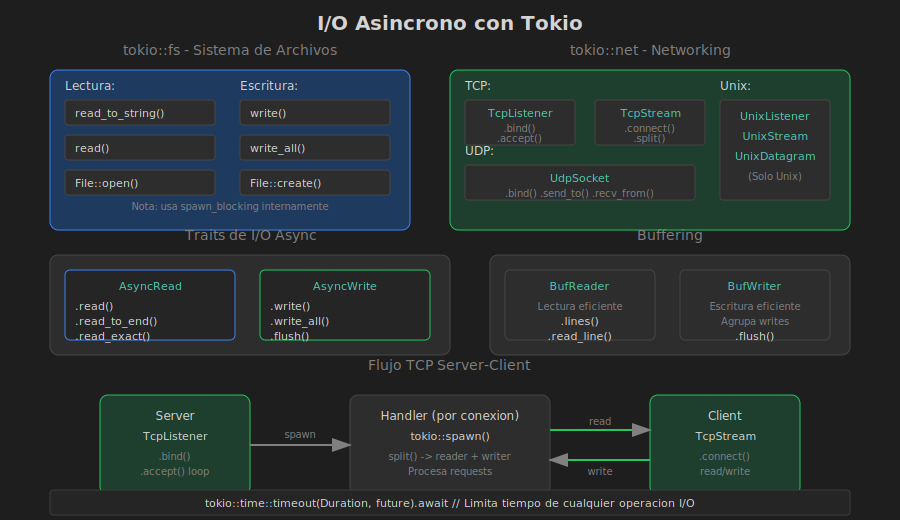

# I/O Asíncrono



## 🎯 Objetivos

- Usar I/O de archivos async con Tokio
- Implementar networking TCP/UDP async
- Manejar streams de datos
- Aplicar buffering y utilidades de I/O

## 📚 Contenido

### tokio::fs - Sistema de Archivos

```toml
[dependencies]
tokio = { version = "1", features = ["fs", "io-util"] }
```

### Leer Archivos

```rust
use tokio::fs;
use tokio::io::AsyncReadExt;

#[tokio::main]
async fn main() -> std::io::Result<()> {
    // Leer todo el archivo (simple)
    let contenido = fs::read_to_string("archivo.txt").await?;
    println!("Contenido: {}", contenido);
    
    // Leer bytes
    let bytes = fs::read("archivo.bin").await?;
    println!("Bytes: {}", bytes.len());
    
    // Leer con buffer manual
    let mut archivo = fs::File::open("archivo.txt").await?;
    let mut buffer = Vec::new();
    archivo.read_to_end(&mut buffer).await?;
    
    Ok(())
}
```

### Escribir Archivos

```rust
use tokio::fs;
use tokio::io::AsyncWriteExt;

#[tokio::main]
async fn main() -> std::io::Result<()> {
    // Escribir string
    fs::write("salida.txt", "Hola mundo").await?;
    
    // Escribir con más control
    let mut archivo = fs::File::create("salida2.txt").await?;
    archivo.write_all(b"Linea 1\n").await?;
    archivo.write_all(b"Linea 2\n").await?;
    archivo.flush().await?;
    
    Ok(())
}
```

### Operaciones de Directorio

```rust
use tokio::fs;

#[tokio::main]
async fn main() -> std::io::Result<()> {
    // Crear directorio
    fs::create_dir_all("path/to/dir").await?;
    
    // Listar directorio
    let mut entries = fs::read_dir(".").await?;
    while let Some(entry) = entries.next_entry().await? {
        println!("{:?}", entry.file_name());
    }
    
    // Eliminar archivo
    fs::remove_file("archivo.txt").await?;
    
    // Renombrar
    fs::rename("viejo.txt", "nuevo.txt").await?;
    
    Ok(())
}
```

---

## AsyncRead y AsyncWrite

### Traits Fundamentales

```rust
use tokio::io::{AsyncRead, AsyncWrite, AsyncReadExt, AsyncWriteExt};

// AsyncReadExt provee métodos como:
// - read()       - Leer bytes
// - read_to_end() - Leer todo
// - read_exact()  - Leer cantidad exacta
// - read_buf()    - Leer a buffer

// AsyncWriteExt provee:
// - write()      - Escribir bytes
// - write_all()  - Escribir todo
// - flush()      - Vaciar buffer
```

### Copiar Streams

```rust
use tokio::io::{self, AsyncReadExt, AsyncWriteExt};

async fn copiar_archivo(origen: &str, destino: &str) -> io::Result<u64> {
    let mut src = tokio::fs::File::open(origen).await?;
    let mut dst = tokio::fs::File::create(destino).await?;
    
    // Copiar todo
    let bytes = io::copy(&mut src, &mut dst).await?;
    
    Ok(bytes)
}
```

---

## tokio::net - Networking

### TCP Client

```rust
use tokio::net::TcpStream;
use tokio::io::{AsyncReadExt, AsyncWriteExt};

#[tokio::main]
async fn main() -> std::io::Result<()> {
    // Conectar
    let mut stream = TcpStream::connect("127.0.0.1:8080").await?;
    
    // Enviar datos
    stream.write_all(b"GET / HTTP/1.1\r\n\r\n").await?;
    
    // Recibir respuesta
    let mut buffer = vec![0u8; 1024];
    let n = stream.read(&mut buffer).await?;
    
    println!("Respuesta: {}", String::from_utf8_lossy(&buffer[..n]));
    
    Ok(())
}
```

### TCP Server

```rust
use tokio::net::TcpListener;
use tokio::io::{AsyncReadExt, AsyncWriteExt};

#[tokio::main]
async fn main() -> std::io::Result<()> {
    let listener = TcpListener::bind("127.0.0.1:8080").await?;
    println!("Servidor escuchando en 127.0.0.1:8080");
    
    loop {
        let (mut socket, addr) = listener.accept().await?;
        println!("Conexión desde: {}", addr);
        
        // Spawn task para cada conexión
        tokio::spawn(async move {
            let mut buffer = [0u8; 1024];
            
            loop {
                match socket.read(&mut buffer).await {
                    Ok(0) => break, // Conexión cerrada
                    Ok(n) => {
                        // Echo: devolver lo recibido
                        if socket.write_all(&buffer[..n]).await.is_err() {
                            break;
                        }
                    }
                    Err(_) => break,
                }
            }
        });
    }
}
```

### Split: Lectura y Escritura Separadas

```rust
use tokio::net::TcpStream;
use tokio::io::{AsyncReadExt, AsyncWriteExt};

async fn handle_connection(stream: TcpStream) {
    let (mut reader, mut writer) = stream.into_split();
    
    // Ahora puedes usar reader y writer independientemente
    let read_task = tokio::spawn(async move {
        let mut buf = [0u8; 1024];
        loop {
            match reader.read(&mut buf).await {
                Ok(0) => break,
                Ok(n) => println!("Recibido: {:?}", &buf[..n]),
                Err(_) => break,
            }
        }
    });
    
    let write_task = tokio::spawn(async move {
        writer.write_all(b"Hola!").await.ok();
    });
    
    let _ = tokio::join!(read_task, write_task);
}
```

---

## UDP

```rust
use tokio::net::UdpSocket;

#[tokio::main]
async fn main() -> std::io::Result<()> {
    // Servidor UDP
    let socket = UdpSocket::bind("127.0.0.1:8080").await?;
    
    let mut buf = [0u8; 1024];
    
    loop {
        let (len, addr) = socket.recv_from(&mut buf).await?;
        println!("Recibido de {}: {:?}", addr, &buf[..len]);
        
        // Responder
        socket.send_to(&buf[..len], addr).await?;
    }
}

// Cliente UDP
async fn cliente() -> std::io::Result<()> {
    let socket = UdpSocket::bind("127.0.0.1:0").await?;
    socket.connect("127.0.0.1:8080").await?;
    
    socket.send(b"Hola").await?;
    
    let mut buf = [0u8; 1024];
    let n = socket.recv(&mut buf).await?;
    println!("Respuesta: {:?}", &buf[..n]);
    
    Ok(())
}
```

---

## BufReader y BufWriter

### Buffering para Mejor Rendimiento

```rust
use tokio::io::{AsyncBufReadExt, AsyncWriteExt, BufReader, BufWriter};
use tokio::fs::File;

#[tokio::main]
async fn main() -> std::io::Result<()> {
    // Lectura con buffer
    let file = File::open("archivo.txt").await?;
    let reader = BufReader::new(file);
    let mut lines = reader.lines();
    
    while let Some(line) = lines.next_line().await? {
        println!("Línea: {}", line);
    }
    
    // Escritura con buffer
    let file = File::create("salida.txt").await?;
    let mut writer = BufWriter::new(file);
    
    writer.write_all(b"Linea 1\n").await?;
    writer.write_all(b"Linea 2\n").await?;
    writer.flush().await?; // Importante: vaciar el buffer
    
    Ok(())
}
```

### Leer Líneas con Protocolo

```rust
use tokio::io::{AsyncBufReadExt, AsyncWriteExt, BufReader};
use tokio::net::TcpStream;

async fn chat_client() -> std::io::Result<()> {
    let stream = TcpStream::connect("127.0.0.1:8080").await?;
    let (reader, mut writer) = stream.into_split();
    let mut reader = BufReader::new(reader);
    
    // Enviar mensaje
    writer.write_all(b"Hola servidor\n").await?;
    
    // Leer respuesta línea por línea
    let mut line = String::new();
    reader.read_line(&mut line).await?;
    println!("Servidor dice: {}", line.trim());
    
    Ok(())
}
```

---

## Timeouts en I/O

```rust
use tokio::time::{timeout, Duration};
use tokio::net::TcpStream;
use tokio::io::AsyncReadExt;

async fn leer_con_timeout() -> std::io::Result<Vec<u8>> {
    let mut stream = TcpStream::connect("127.0.0.1:8080").await?;
    let mut buffer = vec![0u8; 1024];
    
    // Timeout de 5 segundos para la lectura
    match timeout(Duration::from_secs(5), stream.read(&mut buffer)).await {
        Ok(Ok(n)) => {
            buffer.truncate(n);
            Ok(buffer)
        }
        Ok(Err(e)) => Err(e),
        Err(_) => Err(std::io::Error::new(
            std::io::ErrorKind::TimedOut,
            "Operación de lectura excedió el tiempo límite"
        )),
    }
}
```

---

## Streams con tokio-stream

```toml
[dependencies]
tokio-stream = "0.1"
```

```rust
use tokio_stream::StreamExt;
use tokio::fs;

async fn procesar_directorio() -> std::io::Result<()> {
    let entries = fs::read_dir(".").await?;
    let mut stream = tokio_stream::wrappers::ReadDirStream::new(entries);
    
    while let Some(entry) = stream.next().await {
        let entry = entry?;
        println!("Archivo: {:?}", entry.file_name());
    }
    
    Ok(())
}
```

---

## Ejemplo: Servidor de Chat Simple

```rust
use tokio::net::{TcpListener, TcpStream};
use tokio::io::{AsyncBufReadExt, AsyncWriteExt, BufReader};
use tokio::sync::broadcast;

#[tokio::main]
async fn main() -> std::io::Result<()> {
    let listener = TcpListener::bind("127.0.0.1:8080").await?;
    let (tx, _rx) = broadcast::channel::<String>(100);
    
    println!("Servidor de chat en 127.0.0.1:8080");
    
    loop {
        let (socket, addr) = listener.accept().await?;
        let tx = tx.clone();
        let mut rx = tx.subscribe();
        
        tokio::spawn(async move {
            let (reader, mut writer) = socket.into_split();
            let mut reader = BufReader::new(reader);
            let mut line = String::new();
            
            // Task para recibir mensajes del broadcast
            let mut writer_clone = writer;
            let recv_task = tokio::spawn(async move {
                while let Ok(msg) = rx.recv().await {
                    if writer_clone.write_all(msg.as_bytes()).await.is_err() {
                        break;
                    }
                }
            });
            
            // Leer mensajes del cliente
            loop {
                line.clear();
                if reader.read_line(&mut line).await.unwrap_or(0) == 0 {
                    break;
                }
                let msg = format!("[{}]: {}", addr, line);
                let _ = tx.send(msg);
            }
            
            recv_task.abort();
        });
    }
}
```

---

## Resumen

| Módulo | Uso |
|--------|-----|
| `tokio::fs` | Archivos async |
| `tokio::net` | TCP, UDP async |
| `AsyncReadExt` | Métodos de lectura |
| `AsyncWriteExt` | Métodos de escritura |
| `BufReader` | Lectura con buffer |
| `BufWriter` | Escritura con buffer |
| `split()` | Separar reader/writer |
| `timeout` | Límite de tiempo I/O |

---

**Siguiente:** [05 - Patrones Async](05-patrones.md)
