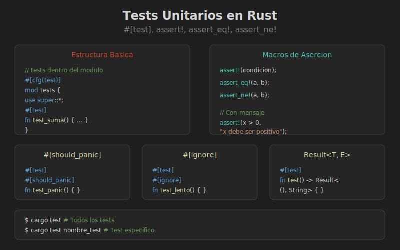

# Tests Unitarios en Rust



## Objetivos

- Escribir tests unitarios con `#[test]`
- Usar macros de asercion
- Manejar panic y errores en tests
- Organizar tests en modulos

---

## El Atributo #[test]

```rust
#[test]
fn mi_primer_test() {
    assert_eq!(2 + 2, 4);
}
```

Rust compila los tests solo cuando ejecutas `cargo test`.

---

## Macros de Asercion

| Macro | Uso |
|-------|-----|
| `assert!(expr)` | Verifica que expr sea true |
| `assert_eq!(a, b)` | Verifica que a == b |
| `assert_ne!(a, b)` | Verifica que a != b |

### Mensajes Personalizados

```rust
#[test]
fn test_con_mensaje() {
    let resultado = 5;
    assert!(
        resultado > 0,
        "El resultado deberia ser positivo, pero fue {}",
        resultado
    );
}
```

---

## Modulo de Tests

```rust
// src/lib.rs

pub fn suma(a: i32, b: i32) -> i32 {
    a + b
}

pub fn resta(a: i32, b: i32) -> i32 {
    a - b
}

#[cfg(test)]
mod tests {
    use super::*;

    #[test]
    fn test_suma() {
        assert_eq!(suma(2, 3), 5);
    }

    #[test]
    fn test_resta() {
        assert_eq!(resta(5, 3), 2);
    }

    #[test]
    fn test_suma_negativos() {
        assert_eq!(suma(-1, -1), -2);
    }
}
```

El atributo `#[cfg(test)]` indica que el modulo solo se compila en modo test.

---

## Tests que Esperan Panic

```rust
pub fn dividir(a: i32, b: i32) -> i32 {
    if b == 0 {
        panic!("Division por cero");
    }
    a / b
}

#[cfg(test)]
mod tests {
    use super::*;

    #[test]
    #[should_panic]
    fn test_division_por_cero() {
        dividir(10, 0);
    }

    #[test]
    #[should_panic(expected = "Division por cero")]
    fn test_panic_mensaje_especifico() {
        dividir(10, 0);
    }
}
```

---

## Tests con Result

```rust
#[cfg(test)]
mod tests {
    #[test]
    fn test_con_result() -> Result<(), String> {
        let valor = "42".parse::<i32>()
            .map_err(|e| e.to_string())?;
        
        if valor == 42 {
            Ok(())
        } else {
            Err(format!("Esperaba 42, obtuve {}", valor))
        }
    }
}
```

---

## Ignorar Tests

```rust
#[test]
#[ignore]
fn test_lento() {
    // Este test tarda mucho
    std::thread::sleep(std::time::Duration::from_secs(60));
}
```

Ejecutar tests ignorados:

```bash
cargo test -- --ignored
```

---

## Comandos Utiles

```bash
# Todos los tests
cargo test

# Test especifico
cargo test test_suma

# Tests que contienen "division"
cargo test division

# Ver println! en tests
cargo test -- --show-output

# Un solo hilo (para tests que comparten estado)
cargo test -- --test-threads=1
```

---

## Buenas Practicas

1. **Nombres descriptivos**: `test_suma_numeros_positivos`
2. **Un assert por test** (cuando sea posible)
3. **Tests independientes**: No depender del orden
4. **Arrange-Act-Assert**: Patron AAA

```rust
#[test]
fn test_patron_aaa() {
    // Arrange (preparar)
    let calculadora = Calculadora::new();
    
    // Act (actuar)
    let resultado = calculadora.suma(2, 3);
    
    // Assert (verificar)
    assert_eq!(resultado, 5);
}
```
