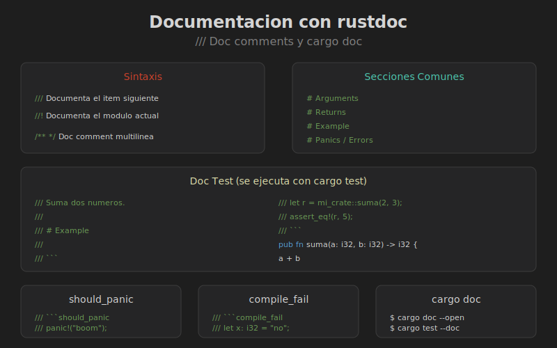

# Documentacion con rustdoc



## Objetivos

- Documentar codigo con `///` y `//!`
- Escribir doc tests
- Generar documentacion HTML

---

## Comentarios de Documentacion

| Sintaxis | Uso |
|----------|-----|
| `///` | Documenta el item siguiente |
| `//!` | Documenta el item contenedor |

```rust
//! # Mi Crate
//!
//! Este crate proporciona utilidades matematicas.

/// Suma dos numeros.
///
/// # Ejemplo
///
/// ```
/// let r = mi_crate::suma(2, 3);
/// assert_eq!(r, 5);
/// ```
pub fn suma(a: i32, b: i32) -> i32 {
    a + b
}
```

---

## Secciones de Documentacion

```rust
/// Divide dos numeros.
///
/// # Argumentos
///
/// * `dividendo` - El numero a dividir
/// * `divisor` - El numero por el cual dividir
///
/// # Retorna
///
/// El cociente de la division.
///
/// # Errores
///
/// Retorna `Err` si el divisor es cero.
///
/// # Ejemplo
///
/// ```
/// use mi_crate::dividir;
///
/// let resultado = dividir(10, 2).unwrap();
/// assert_eq!(resultado, 5);
/// ```
///
/// # Panics
///
/// Esta funcion no produce panic.
pub fn dividir(dividendo: i32, divisor: i32) -> Result<i32, String> {
    if divisor == 0 {
        Err("Division por cero".to_string())
    } else {
        Ok(dividendo / divisor)
    }
}
```

---

## Doc Tests

Los ejemplos en documentacion se ejecutan como tests:

```rust
/// Verifica si un numero es par.
///
/// ```
/// assert!(mi_crate::es_par(4));
/// assert!(!mi_crate::es_par(3));
/// ```
pub fn es_par(n: i32) -> bool {
    n % 2 == 0
}
```

```bash
cargo test --doc
```

---

## Ocultar Lineas en Doc Tests

```rust
/// Procesa datos.
///
/// ```
/// # use mi_crate::procesar;
/// # fn main() -> Result<(), Box<dyn std::error::Error>> {
/// let datos = procesar("entrada")?;
/// assert_eq!(datos, "ENTRADA");
/// # Ok(())
/// # }
/// ```
pub fn procesar(s: &str) -> Result<String, std::io::Error> {
    Ok(s.to_uppercase())
}
```

Las lineas con `#` se ejecutan pero no aparecen en la documentacion.

---

## Doc Tests que Deben Fallar

```rust
/// Esta funcion produce panic con entrada invalida.
///
/// ```should_panic
/// mi_crate::dividir_unsafe(1, 0);
/// ```
pub fn dividir_unsafe(a: i32, b: i32) -> i32 {
    a / b
}
```

```rust
/// Este codigo no compila (y eso es correcto).
///
/// ```compile_fail
/// let x: i32 = "no soy un numero";
/// ```
pub fn ejemplo() {}
```

---

## Documentar Modulos

```rust
//! # Modulo de Utilidades
//!
//! Este modulo contiene funciones de utilidad.
//!
//! ## Ejemplo
//!
//! ```
//! use mi_crate::utils;
//!
//! let texto = utils::capitalizar("hola");
//! assert_eq!(texto, "Hola");
//! ```

pub fn capitalizar(s: &str) -> String {
    let mut chars = s.chars();
    match chars.next() {
        None => String::new(),
        Some(c) => c.to_uppercase().chain(chars).collect(),
    }
}
```

---

## Documentar Structs y Enums

```rust
/// Representa un punto en el espacio 2D.
///
/// # Campos
///
/// * `x` - Coordenada horizontal
/// * `y` - Coordenada vertical
#[derive(Debug, Clone, Copy)]
pub struct Punto {
    /// Coordenada X
    pub x: f64,
    /// Coordenada Y
    pub y: f64,
}

impl Punto {
    /// Crea un nuevo punto.
    ///
    /// # Ejemplo
    ///
    /// ```
    /// use mi_crate::Punto;
    ///
    /// let p = Punto::new(3.0, 4.0);
    /// ```
    pub fn new(x: f64, y: f64) -> Self {
        Punto { x, y }
    }

    /// Calcula la distancia al origen.
    pub fn distancia_origen(&self) -> f64 {
        (self.x.powi(2) + self.y.powi(2)).sqrt()
    }
}
```

---

## Generar Documentacion

```bash
# Generar y abrir en navegador
cargo doc --open

# Solo tu crate (sin dependencias)
cargo doc --no-deps --open

# Incluir items privados
cargo doc --document-private-items
```

---

## Links entre Documentacion

```rust
/// Usa [`suma`] para sumar y [`resta`] para restar.
///
/// Ver tambien: [`Calculadora::new`]
pub fn ejemplo() {}

/// Implementa el trait [`std::fmt::Display`].
pub struct MiTipo;
```

---

## Badges y Metadata

En `Cargo.toml`:

```toml
[package]
name = "mi_crate"
version = "1.0.0"
description = "Utilidades matematicas"
documentation = "https://docs.rs/mi_crate"
repository = "https://github.com/user/mi_crate"
license = "MIT"
keywords = ["math", "utilities"]
categories = ["mathematics"]
```
