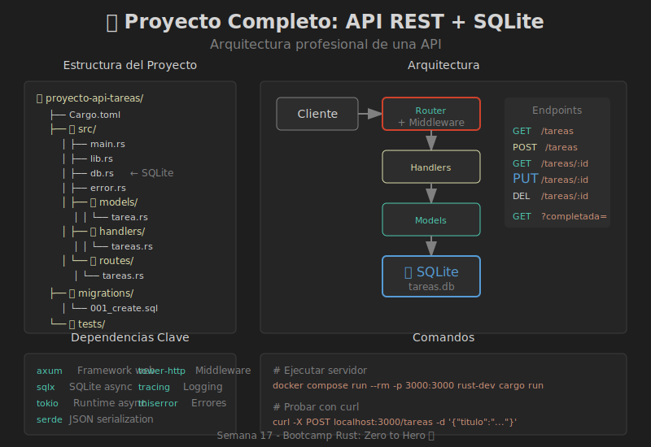

# 📖 Proyecto Completo: API REST con SQLite

## Arquitectura del Proyecto

Un proyecto API REST profesional tiene una estructura modular:

```
proyecto-api-tareas/
├── Cargo.toml
├── src/
│   ├── main.rs              # Punto de entrada
│   ├── lib.rs               # Exportaciones públicas
│   ├── config.rs            # Configuración
│   ├── db.rs                # Conexión a SQLite
│   ├── error.rs             # Manejo de errores
│   ├── routes/
│   │   ├── mod.rs
│   │   └── tareas.rs        # Rutas de tareas
│   ├── handlers/
│   │   ├── mod.rs
│   │   └── tareas.rs        # Lógica de handlers
│   └── models/
│       ├── mod.rs
│       └── tarea.rs         # Modelo Tarea
├── migrations/
│   └── 001_create_tareas.sql
├── tests/
│   └── api_tests.rs
└── README.md
```

---

## 🎯 Diagrama Visual



---

## Dependencias con SQLite

```toml
[package]
name = "proyecto-api-tareas"
version = "0.1.0"
edition = "2024"

[dependencies]
# Framework web
axum = "0.8"
tokio = { version = "1", features = ["full"] }

# Serialización
serde = { version = "1", features = ["derive"] }
serde_json = "1"

# Base de datos SQLite
sqlx = { version = "0.8", features = ["runtime-tokio", "sqlite"] }

# Middleware y utilidades
tower-http = { version = "0.6", features = ["trace", "cors"] }
tracing = "0.1"
tracing-subscriber = "0.3"

# Manejo de errores
thiserror = "2"
```

---

## Configuración de Base de Datos

### db.rs - Conexión SQLite

```rust
use sqlx::{sqlite::SqlitePoolOptions, SqlitePool};
use std::env;

pub type DbPool = SqlitePool;

pub async fn crear_pool() -> Result<DbPool, sqlx::Error> {
    let database_url = env::var("DATABASE_URL")
        .unwrap_or_else(|_| "sqlite:tareas.db?mode=rwc".to_string());
    
    let pool = SqlitePoolOptions::new()
        .max_connections(5)
        .connect(&database_url)
        .await?;
    
    // Ejecutar migraciones
    sqlx::migrate!("./migrations")
        .run(&pool)
        .await?;
    
    Ok(pool)
}
```

### Migración SQL

```sql
-- migrations/001_create_tareas.sql
CREATE TABLE IF NOT EXISTS tareas (
    id INTEGER PRIMARY KEY AUTOINCREMENT,
    titulo TEXT NOT NULL,
    descripcion TEXT,
    completada BOOLEAN NOT NULL DEFAULT FALSE,
    creada_en DATETIME DEFAULT CURRENT_TIMESTAMP,
    actualizada_en DATETIME DEFAULT CURRENT_TIMESTAMP
);

-- Índice para búsquedas por estado
CREATE INDEX IF NOT EXISTS idx_tareas_completada ON tareas(completada);
```

---

## Modelo con SQLx

### models/tarea.rs

```rust
use serde::{Deserialize, Serialize};
use sqlx::FromRow;

/// Tarea almacenada en la base de datos
#[derive(Debug, Clone, Serialize, Deserialize, FromRow)]
pub struct Tarea {
    pub id: i64,
    pub titulo: String,
    pub descripcion: Option<String>,
    pub completada: bool,
    pub creada_en: String,
    pub actualizada_en: String,
}

/// DTO para crear una tarea
#[derive(Debug, Deserialize)]
pub struct CrearTarea {
    pub titulo: String,
    pub descripcion: Option<String>,
}

/// DTO para actualizar una tarea
#[derive(Debug, Deserialize)]
pub struct ActualizarTarea {
    pub titulo: Option<String>,
    pub descripcion: Option<String>,
    pub completada: Option<bool>,
}

/// Filtros de consulta
#[derive(Debug, Deserialize)]
pub struct FiltroTareas {
    pub completada: Option<bool>,
    pub limite: Option<i64>,
    pub offset: Option<i64>,
}
```

---

## Repositorio de Datos

### handlers/tareas.rs - Operaciones CRUD

```rust
use axum::{
    extract::{Path, Query, State},
    http::StatusCode,
    response::Json,
};
use sqlx::SqlitePool;

use crate::models::tarea::{ActualizarTarea, CrearTarea, FiltroTareas, Tarea};
use crate::error::ApiError;

type Result<T> = std::result::Result<T, ApiError>;

/// GET /tareas - Listar todas las tareas
pub async fn listar(
    State(pool): State<SqlitePool>,
    Query(filtro): Query<FiltroTareas>,
) -> Result<Json<Vec<Tarea>>> {
    let limite = filtro.limite.unwrap_or(100);
    let offset = filtro.offset.unwrap_or(0);
    
    let tareas = match filtro.completada {
        Some(completada) => {
            sqlx::query_as::<_, Tarea>(
                "SELECT * FROM tareas WHERE completada = ? ORDER BY id DESC LIMIT ? OFFSET ?"
            )
            .bind(completada)
            .bind(limite)
            .bind(offset)
            .fetch_all(&pool)
            .await?
        }
        None => {
            sqlx::query_as::<_, Tarea>(
                "SELECT * FROM tareas ORDER BY id DESC LIMIT ? OFFSET ?"
            )
            .bind(limite)
            .bind(offset)
            .fetch_all(&pool)
            .await?
        }
    };
    
    Ok(Json(tareas))
}

/// GET /tareas/:id - Obtener una tarea
pub async fn obtener(
    State(pool): State<SqlitePool>,
    Path(id): Path<i64>,
) -> Result<Json<Tarea>> {
    let tarea = sqlx::query_as::<_, Tarea>(
        "SELECT * FROM tareas WHERE id = ?"
    )
    .bind(id)
    .fetch_optional(&pool)
    .await?
    .ok_or(ApiError::NotFound(format!("Tarea {} no encontrada", id)))?;
    
    Ok(Json(tarea))
}

/// POST /tareas - Crear nueva tarea
pub async fn crear(
    State(pool): State<SqlitePool>,
    Json(datos): Json<CrearTarea>,
) -> Result<(StatusCode, Json<Tarea>)> {
    // Validación
    if datos.titulo.trim().is_empty() {
        return Err(ApiError::Validacion("Título es requerido".into()));
    }
    
    let resultado = sqlx::query(
        "INSERT INTO tareas (titulo, descripcion) VALUES (?, ?)"
    )
    .bind(&datos.titulo)
    .bind(&datos.descripcion)
    .execute(&pool)
    .await?;
    
    let id = resultado.last_insert_rowid();
    
    let tarea = sqlx::query_as::<_, Tarea>(
        "SELECT * FROM tareas WHERE id = ?"
    )
    .bind(id)
    .fetch_one(&pool)
    .await?;
    
    Ok((StatusCode::CREATED, Json(tarea)))
}

/// PUT /tareas/:id - Actualizar tarea
pub async fn actualizar(
    State(pool): State<SqlitePool>,
    Path(id): Path<i64>,
    Json(datos): Json<ActualizarTarea>,
) -> Result<Json<Tarea>> {
    // Verificar que existe
    let existe = sqlx::query("SELECT id FROM tareas WHERE id = ?")
        .bind(id)
        .fetch_optional(&pool)
        .await?;
    
    if existe.is_none() {
        return Err(ApiError::NotFound(format!("Tarea {} no encontrada", id)));
    }
    
    // Actualizar campos proporcionados
    if let Some(titulo) = &datos.titulo {
        sqlx::query("UPDATE tareas SET titulo = ?, actualizada_en = CURRENT_TIMESTAMP WHERE id = ?")
            .bind(titulo)
            .bind(id)
            .execute(&pool)
            .await?;
    }
    
    if let Some(descripcion) = &datos.descripcion {
        sqlx::query("UPDATE tareas SET descripcion = ?, actualizada_en = CURRENT_TIMESTAMP WHERE id = ?")
            .bind(descripcion)
            .bind(id)
            .execute(&pool)
            .await?;
    }
    
    if let Some(completada) = datos.completada {
        sqlx::query("UPDATE tareas SET completada = ?, actualizada_en = CURRENT_TIMESTAMP WHERE id = ?")
            .bind(completada)
            .bind(id)
            .execute(&pool)
            .await?;
    }
    
    // Obtener tarea actualizada
    let tarea = sqlx::query_as::<_, Tarea>(
        "SELECT * FROM tareas WHERE id = ?"
    )
    .bind(id)
    .fetch_one(&pool)
    .await?;
    
    Ok(Json(tarea))
}

/// DELETE /tareas/:id - Eliminar tarea
pub async fn eliminar(
    State(pool): State<SqlitePool>,
    Path(id): Path<i64>,
) -> Result<StatusCode> {
    let resultado = sqlx::query("DELETE FROM tareas WHERE id = ?")
        .bind(id)
        .execute(&pool)
        .await?;
    
    if resultado.rows_affected() == 0 {
        return Err(ApiError::NotFound(format!("Tarea {} no encontrada", id)));
    }
    
    Ok(StatusCode::NO_CONTENT)
}
```

---

## Manejo de Errores

### error.rs

```rust
use axum::{
    http::StatusCode,
    response::{IntoResponse, Response},
    Json,
};
use serde_json::json;
use thiserror::Error;

#[derive(Error, Debug)]
pub enum ApiError {
    #[error("No encontrado: {0}")]
    NotFound(String),
    
    #[error("Error de validación: {0}")]
    Validacion(String),
    
    #[error("Error de base de datos: {0}")]
    Database(#[from] sqlx::Error),
    
    #[error("Error interno: {0}")]
    Interno(String),
}

impl IntoResponse for ApiError {
    fn into_response(self) -> Response {
        let (status, mensaje) = match &self {
            ApiError::NotFound(msg) => (StatusCode::NOT_FOUND, msg.clone()),
            ApiError::Validacion(msg) => (StatusCode::BAD_REQUEST, msg.clone()),
            ApiError::Database(e) => {
                tracing::error!("Error DB: {:?}", e);
                (StatusCode::INTERNAL_SERVER_ERROR, "Error de base de datos".into())
            }
            ApiError::Interno(msg) => (StatusCode::INTERNAL_SERVER_ERROR, msg.clone()),
        };
        
        let body = json!({
            "error": mensaje,
            "codigo": status.as_u16()
        });
        
        (status, Json(body)).into_response()
    }
}
```

---

## Rutas

### routes/tareas.rs

```rust
use axum::{
    routing::{get, post, put, delete},
    Router,
};
use sqlx::SqlitePool;

use crate::handlers::tareas;

pub fn rutas() -> Router<SqlitePool> {
    Router::new()
        .route("/", get(tareas::listar).post(tareas::crear))
        .route("/:id", 
            get(tareas::obtener)
                .put(tareas::actualizar)
                .delete(tareas::eliminar)
        )
}
```

### routes/mod.rs

```rust
use axum::Router;
use sqlx::SqlitePool;

mod tareas;

pub fn crear_rutas() -> Router<SqlitePool> {
    Router::new()
        .nest("/tareas", tareas::rutas())
}
```

---

## Main con SQLite

### main.rs

```rust
use axum::Router;
use tower_http::{
    cors::CorsLayer,
    trace::TraceLayer,
};
use tracing_subscriber;

mod config;
mod db;
mod error;
mod handlers;
mod models;
mod routes;

#[tokio::main]
async fn main() -> Result<(), Box<dyn std::error::Error>> {
    // Inicializar logging
    tracing_subscriber::fmt()
        .with_target(false)
        .compact()
        .init();
    
    tracing::info!("🚀 Iniciando API de Tareas...");
    
    // Crear pool de conexiones SQLite
    let pool = db::crear_pool().await?;
    tracing::info!("✅ Conexión a SQLite establecida");
    
    // Construir aplicación
    let app = Router::new()
        .merge(routes::crear_rutas())
        .layer(CorsLayer::permissive())
        .layer(TraceLayer::new_for_http())
        .with_state(pool);
    
    // Iniciar servidor
    let listener = tokio::net::TcpListener::bind("0.0.0.0:3000").await?;
    tracing::info!("🌐 Servidor escuchando en http://localhost:3000");
    tracing::info!("📝 Endpoints:");
    tracing::info!("   GET    /tareas");
    tracing::info!("   POST   /tareas");
    tracing::info!("   GET    /tareas/:id");
    tracing::info!("   PUT    /tareas/:id");
    tracing::info!("   DELETE /tareas/:id");
    
    axum::serve(listener, app).await?;
    
    Ok(())
}
```

---

## Tests de Integración

### tests/api_tests.rs

```rust
use axum::{
    body::Body,
    http::{Request, StatusCode},
};
use serde_json::{json, Value};
use tower::ServiceExt;

async fn crear_app_test() -> axum::Router {
    // Usar base de datos en memoria para tests
    std::env::set_var("DATABASE_URL", "sqlite::memory:");
    
    let pool = proyecto_api_tareas::db::crear_pool().await.unwrap();
    
    axum::Router::new()
        .merge(proyecto_api_tareas::routes::crear_rutas())
        .with_state(pool)
}

#[tokio::test]
async fn test_crear_tarea() {
    let app = crear_app_test().await;
    
    let response = app
        .oneshot(
            Request::builder()
                .method("POST")
                .uri("/tareas")
                .header("Content-Type", "application/json")
                .body(Body::from(
                    json!({
                        "titulo": "Test tarea",
                        "descripcion": "Descripción de prueba"
                    }).to_string()
                ))
                .unwrap()
        )
        .await
        .unwrap();
    
    assert_eq!(response.status(), StatusCode::CREATED);
}

#[tokio::test]
async fn test_listar_tareas() {
    let app = crear_app_test().await;
    
    let response = app
        .oneshot(
            Request::builder()
                .uri("/tareas")
                .body(Body::empty())
                .unwrap()
        )
        .await
        .unwrap();
    
    assert_eq!(response.status(), StatusCode::OK);
}

#[tokio::test]
async fn test_tarea_no_encontrada() {
    let app = crear_app_test().await;
    
    let response = app
        .oneshot(
            Request::builder()
                .uri("/tareas/999")
                .body(Body::empty())
                .unwrap()
        )
        .await
        .unwrap();
    
    assert_eq!(response.status(), StatusCode::NOT_FOUND);
}
```

---

## Comandos Docker

```bash
# Ejecutar servidor con SQLite
docker compose run --rm -p 3000:3000 rust-dev cargo run -p proyecto-api-tareas

# Ejecutar tests
docker compose run --rm rust-dev cargo test -p proyecto-api-tareas

# Ver la base de datos
docker compose run --rm rust-dev sqlite3 tareas.db ".tables"
docker compose run --rm rust-dev sqlite3 tareas.db "SELECT * FROM tareas"
```

---

## Probar con curl

```bash
# Crear tarea
curl -X POST http://localhost:3000/tareas \
  -H "Content-Type: application/json" \
  -d '{"titulo": "Aprender Rust", "descripcion": "Completar bootcamp"}'

# Listar tareas
curl http://localhost:3000/tareas

# Listar solo completadas
curl "http://localhost:3000/tareas?completada=true"

# Obtener tarea
curl http://localhost:3000/tareas/1

# Actualizar tarea
curl -X PUT http://localhost:3000/tareas/1 \
  -H "Content-Type: application/json" \
  -d '{"completada": true}'

# Eliminar tarea
curl -X DELETE http://localhost:3000/tareas/1
```

---

## Resumen del Proyecto

| Componente | Archivo | Descripción |
|------------|---------|-------------|
| **Entrada** | main.rs | Inicialización y servidor |
| **Base de datos** | db.rs | Pool SQLite con sqlx |
| **Modelos** | models/tarea.rs | Structs y DTOs |
| **Handlers** | handlers/tareas.rs | Lógica CRUD |
| **Rutas** | routes/tareas.rs | Definición endpoints |
| **Errores** | error.rs | Manejo centralizado |
| **Tests** | tests/api_tests.rs | Integración |

---

## 🎓 Conclusión del Bootcamp

¡Felicitaciones! Has completado el **Bootcamp Rust: Zero to Hero**.

En 17 semanas has dominado:

- ✅ Fundamentos de Rust y Ownership
- ✅ Structs, Enums y Pattern Matching  
- ✅ Error Handling profesional
- ✅ Traits, Generics y Lifetimes
- ✅ Closures e Iteradores
- ✅ Smart Pointers y Concurrencia
- ✅ Async/Await con Tokio
- ✅ Testing y Documentación
- ✅ **APIs REST con Axum y SQLite**

**¡Ahora eres un Rustacean profesional!** 🦀🎉
