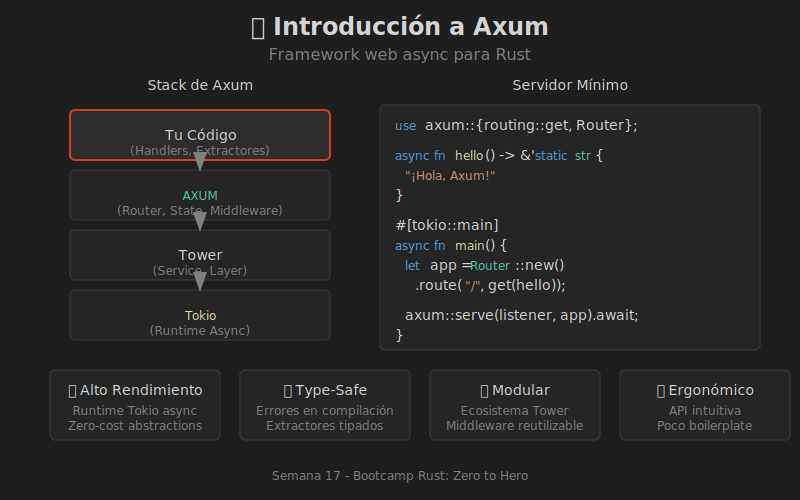

# 📖 Introducción a Axum

## ¿Qué es Axum?

**Axum** es un framework web para Rust construido sobre **Tokio** y **Tower**. Fue creado por el equipo de Tokio y se caracteriza por:

- 🚀 **Alto rendimiento** - Aprovecha el runtime asíncrono de Tokio
- 🔒 **Type-safe** - Errores detectados en compilación
- 🧩 **Modular** - Basado en el ecosistema Tower
- 📦 **Ergonómico** - API intuitiva y limpia

```
┌─────────────────────────────────────────────────────────────┐
│                    STACK DE AXUM                            │
├─────────────────────────────────────────────────────────────┤
│                                                             │
│   ┌─────────────────────────────────────────────────────┐   │
│   │                     Tu Código                       │   │
│   │              (Handlers, Extractores)                │   │
│   └───────────────────────┬─────────────────────────────┘   │
│                           │                                 │
│   ┌───────────────────────▼─────────────────────────────┐   │
│   │                      AXUM                           │   │
│   │            (Router, State, Middleware)              │   │
│   └───────────────────────┬─────────────────────────────┘   │
│                           │                                 │
│   ┌───────────────────────▼─────────────────────────────┐   │
│   │                     TOWER                           │   │
│   │              (Service, Layer, Filter)               │   │
│   └───────────────────────┬─────────────────────────────┘   │
│                           │                                 │
│   ┌───────────────────────▼─────────────────────────────┐   │
│   │                     TOKIO                           │   │
│   │              (Runtime, TcpListener)                 │   │
│   └─────────────────────────────────────────────────────┘   │
│                                                             │
└─────────────────────────────────────────────────────────────┘
```

---

## 🎯 Diagrama Visual



---

## Configuración del Proyecto

### Cargo.toml

```toml
[package]
name = "mi-api"
version = "0.1.0"
edition = "2024"

[dependencies]
axum = "0.8"
tokio = { version = "1", features = ["full"] }
serde = { version = "1", features = ["derive"] }
serde_json = "1"
```

### Versiones Clave

| Crate | Versión | Propósito |
|-------|---------|-----------|
| `axum` | 0.8 | Framework web |
| `tokio` | 1.x | Runtime async |
| `serde` | 1.x | Serialización |
| `tower-http` | 0.6 | Middleware HTTP |

---

## Servidor Mínimo

```rust
use axum::{routing::get, Router};

// Handler simple que retorna texto
async fn hello() -> &'static str {
    "¡Hola, Axum!"
}

#[tokio::main]
async fn main() {
    // Crear el router con una ruta
    let app = Router::new()
        .route("/", get(hello));

    // Crear el listener TCP
    let listener = tokio::net::TcpListener::bind("0.0.0.0:3000")
        .await
        .unwrap();

    println!("🚀 Servidor en http://localhost:3000");
    
    // Iniciar el servidor
    axum::serve(listener, app).await.unwrap();
}
```

### Desglose del Código

1. **`Router::new()`** - Crea un nuevo router vacío
2. **`.route("/", get(hello))`** - Asocia GET `/` al handler `hello`
3. **`TcpListener::bind()`** - Escucha en el puerto 3000
4. **`axum::serve()`** - Inicia el servidor

---

## Anatomía de un Handler

Un **handler** es una función async que procesa requests:

```rust
// Handler sin parámetros
async fn simple() -> &'static str {
    "Respuesta simple"
}

// Handler que retorna JSON
async fn json_handler() -> Json<Mensaje> {
    Json(Mensaje { 
        texto: "Hola".to_string() 
    })
}

// Handler con múltiples tipos de respuesta
async fn flexible() -> impl IntoResponse {
    (StatusCode::OK, "Todo bien")
}
```

### Tipos de Retorno Válidos

| Tipo | Descripción |
|------|-------------|
| `&'static str` | Texto estático |
| `String` | Texto dinámico |
| `Json<T>` | Respuesta JSON |
| `StatusCode` | Solo código de estado |
| `(StatusCode, T)` | Código + cuerpo |
| `impl IntoResponse` | Cualquier respuesta |
| `Result<T, E>` | Éxito o error |

---

## Flujo de un Request

```
┌─────────────────────────────────────────────────────────────┐
│                   FLUJO DE REQUEST                          │
├─────────────────────────────────────────────────────────────┤
│                                                             │
│   1. Cliente envía HTTP Request                             │
│      │                                                      │
│      ▼                                                      │
│   2. TcpListener recibe conexión                            │
│      │                                                      │
│      ▼                                                      │
│   3. Router busca ruta coincidente                          │
│      │                                                      │
│      ▼                                                      │
│   4. Extractores procesan el request                        │
│      │                                                      │
│      ▼                                                      │
│   5. Handler ejecuta lógica de negocio                      │
│      │                                                      │
│      ▼                                                      │
│   6. IntoResponse convierte a HTTP Response                 │
│      │                                                      │
│      ▼                                                      │
│   7. Cliente recibe respuesta                               │
│                                                             │
└─────────────────────────────────────────────────────────────┘
```

---

## Comparación con Otros Frameworks

| Característica | Axum | Actix-web | Rocket |
|---------------|------|-----------|--------|
| Runtime | Tokio | Actix | Tokio |
| Tipo de Macros | Mínimo | Mínimo | Extensivo |
| Type Safety | ✅ Compile-time | ✅ | ✅ |
| Middleware | Tower | Actix | Fairings |
| Curva aprendizaje | Media | Media | Baja |

### ¿Por qué elegir Axum?

1. **Ecosistema Tokio** - Compatible con todo el ecosistema
2. **Tower middleware** - Reutilizable y componible
3. **Sin macros complejas** - Código más explícito
4. **Extractores flexibles** - Type-safe y extensibles

---

## Primer Proyecto: Saludo Personalizado

```rust
use axum::{
    extract::Path,
    routing::get,
    Router,
};

// Handler con parámetro de ruta
async fn saludar(Path(nombre): Path<String>) -> String {
    format!("¡Hola, {}!", nombre)
}

// Handler de información
async fn info() -> &'static str {
    "API de Saludo v1.0"
}

#[tokio::main]
async fn main() {
    let app = Router::new()
        .route("/", get(info))
        .route("/saludo/:nombre", get(saludar));

    let listener = tokio::net::TcpListener::bind("0.0.0.0:3000")
        .await
        .unwrap();

    println!("🚀 Servidor en http://localhost:3000");
    println!("   Prueba: http://localhost:3000/saludo/Rust");
    
    axum::serve(listener, app).await.unwrap();
}
```

### Probar el servidor

```bash
# Información
curl http://localhost:3000/

# Saludo personalizado
curl http://localhost:3000/saludo/Ana
# Output: ¡Hola, Ana!

curl http://localhost:3000/saludo/Rust
# Output: ¡Hola, Rust!
```

---

## Resumen

| Concepto | Descripción |
|----------|-------------|
| **Axum** | Framework web async sobre Tokio |
| **Router** | Mapea rutas a handlers |
| **Handler** | Función async que procesa requests |
| **Extractor** | Extrae datos del request |
| **IntoResponse** | Convierte resultado a HTTP response |

### Próximo tema

En el siguiente archivo aprenderás sobre **Rutas y Handlers** en detalle.
