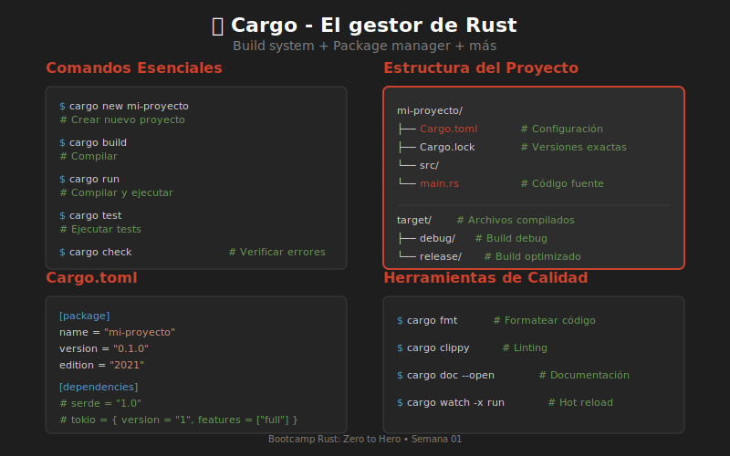

# 📦 Introducción a Cargo

## ¿Qué es Cargo?

**Cargo** es el gestor de paquetes y sistema de construcción oficial de Rust. Es equivalente a npm (Node.js), pip (Python) o Maven (Java), pero integrado directamente con el lenguaje.



---

## 🎯 Funciones de Cargo

| Función | Descripción |
|---------|-------------|
| **Build** | Compila tu código |
| **Run** | Compila y ejecuta |
| **Test** | Ejecuta tests |
| **Doc** | Genera documentación |
| **Publish** | Publica en crates.io |
| **Dependencies** | Gestiona dependencias |

---

## 🚀 Crear un Proyecto

### Nuevo binario (ejecutable)

```bash
cargo new mi-proyecto
cd mi-proyecto
```

Esto crea:

```
mi-proyecto/
├── Cargo.toml      ← Configuración del proyecto
└── src/
    └── main.rs     ← Punto de entrada
```

### Nueva librería

```bash
cargo new mi-libreria --lib
```

Esto crea:

```
mi-libreria/
├── Cargo.toml
└── src/
    └── lib.rs      ← Código de la librería
```

---

## 📄 Anatomía de Cargo.toml

```toml
[package]
name = "mi-proyecto"        # Nombre del proyecto
version = "0.1.0"           # Versión semántica
edition = "2021"            # Edición de Rust (2015, 2018, 2021)
authors = ["Tu Nombre"]     # Autores (opcional)
description = "..."         # Descripción (opcional)

[dependencies]
# Aquí van las dependencias externas
# serde = "1.0"
# tokio = { version = "1", features = ["full"] }

[dev-dependencies]
# Dependencias solo para tests

[[bin]]
# Configuración de binarios adicionales
```

---

## 🔧 Comandos Esenciales

### Compilar

```bash
# Compilar en modo debug (rápido, sin optimizaciones)
cargo build

# Compilar en modo release (lento, optimizado)
cargo build --release
```

**Ubicación de los binarios:**
- Debug: `target/debug/mi-proyecto`
- Release: `target/release/mi-proyecto`

### Ejecutar

```bash
# Compilar y ejecutar
cargo run

# Con argumentos
cargo run -- arg1 arg2

# En modo release
cargo run --release
```

### Verificar (sin compilar completamente)

```bash
# Más rápido que build, solo verifica errores
cargo check
```

### Tests

```bash
# Ejecutar todos los tests
cargo test

# Tests de un módulo específico
cargo test nombre_modulo

# Mostrar output de println
cargo test -- --nocapture
```

### Documentación

```bash
# Generar y abrir docs
cargo doc --open
```

---

## 📦 Gestión de Dependencias

### Agregar dependencias

```bash
# Usando cargo-edit (si está instalado)
cargo add serde

# O editar Cargo.toml manualmente
```

```toml
[dependencies]
serde = "1.0"                          # Versión exacta
serde_json = "1"                       # Cualquier 1.x.x
rand = ">=0.8, <0.9"                   # Rango de versiones
tokio = { version = "1", features = ["full"] }  # Con features
```

### Actualizar dependencias

```bash
# Ver actualizaciones disponibles
cargo update --dry-run

# Actualizar
cargo update
```

### Ver árbol de dependencias

```bash
cargo tree
```

---

## 🔍 Herramientas de Calidad

### Formateo

```bash
# Formatear código automáticamente
cargo fmt

# Verificar formato sin cambiar
cargo fmt --check
```

### Linting

```bash
# Ejecutar clippy (linter)
cargo clippy

# Con warnings como errores
cargo clippy -- -D warnings
```

---

## 📁 Estructura de un Proyecto Típico

```
mi-proyecto/
├── Cargo.toml           # Configuración
├── Cargo.lock           # Versiones exactas de dependencias
├── src/
│   ├── main.rs          # Punto de entrada (binario)
│   ├── lib.rs           # Librería (opcional)
│   └── bin/             # Binarios adicionales
│       └── otro.rs
├── tests/               # Tests de integración
│   └── integration_test.rs
├── examples/            # Ejemplos de uso
│   └── ejemplo.rs
├── benches/             # Benchmarks
│   └── benchmark.rs
└── target/              # Archivos compilados (ignorar en git)
    ├── debug/
    └── release/
```

---

## 💡 Tips Útiles

### Compilación más rápida

```bash
# Watch mode (recompila al guardar)
cargo watch -x run

# Solo check (más rápido)
cargo watch -x check
```

### Ver tamaño del binario

```bash
# Compilar release optimizado
cargo build --release

# Ver tamaño
ls -lh target/release/mi-proyecto
```

### Limpiar proyecto

```bash
# Eliminar target/
cargo clean
```

---

## 📝 Resumen de Comandos

| Comando | Descripción |
|---------|-------------|
| `cargo new nombre` | Crear proyecto |
| `cargo build` | Compilar |
| `cargo run` | Compilar y ejecutar |
| `cargo check` | Verificar errores |
| `cargo test` | Ejecutar tests |
| `cargo fmt` | Formatear código |
| `cargo clippy` | Linting |
| `cargo doc --open` | Documentación |
| `cargo clean` | Limpiar |

---

## 🎯 Ejercicio Rápido

Prueba estos comandos:

```bash
# 1. Crear proyecto
cargo new hola-cargo

# 2. Entrar al directorio
cd hola-cargo

# 3. Ver contenido
cat Cargo.toml
cat src/main.rs

# 4. Ejecutar
cargo run

# 5. Verificar formato
cargo fmt --check

# 6. Linting
cargo clippy
```

---

**Anterior**: [Setup del Entorno](03-setup-entorno.md)  
**Siguiente**: [Ejercicios Prácticos](../2-practica/)
