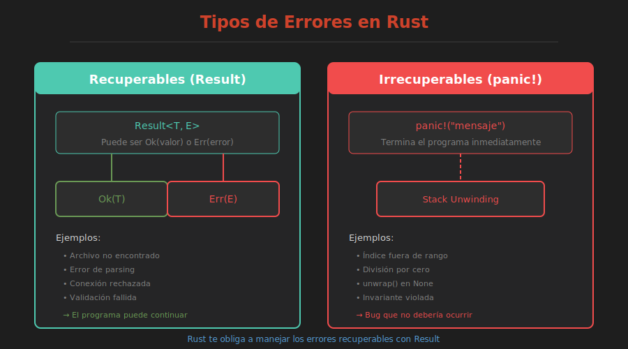

# 🚨 Tipos de Errores en Rust

> **Recuperables vs Irrecuperables**



---

## Filosofía de Rust

Rust distingue entre dos tipos de errores:

| Tipo | Mecanismo | Uso |
|------|-----------|-----|
| **Recuperables** | `Result<T, E>` | Archivo no encontrado, input inválido |
| **Irrecuperables** | `panic!` | Bugs, estados imposibles |

---

## Errores Irrecuperables: panic!

Cuando algo **no debería pasar nunca**:

```rust
fn main() {
    panic!("¡Algo salió terriblemente mal!");
}
```

Output:
```
thread 'main' panicked at 'Algo salió terriblemente mal!', src/main.rs:2:5
```

---

## Cuándo Usar panic!

### ✅ Apropiado:

```rust
// 1. Bugs del programador
fn get_item(items: &[i32], index: usize) -> i32 {
    items[index]  // Panic si index fuera de rango
}

// 2. Estados imposibles
fn procesar(estado: Estado) {
    match estado {
        Estado::Valido => { /* ... */ }
        Estado::Imposible => unreachable!("Nunca debería llegar aquí"),
    }
}

// 3. Prototipos y ejemplos
fn main() {
    let config = leer_config().expect("Config debe existir");
}
```

### ❌ No apropiado:

```rust
// No usar panic para errores esperados
fn dividir(a: i32, b: i32) -> i32 {
    if b == 0 {
        panic!("División por cero");  // ❌ Usar Result
    }
    a / b
}
```

---

## Errores Recuperables: Result

Para operaciones que **pueden fallar normalmente**:

```rust
use std::fs::File;

fn main() {
    let archivo = File::open("config.txt");
    
    match archivo {
        Ok(f) => println!("Archivo abierto: {:?}", f),
        Err(e) => println!("Error: {}", e),
    }
}
```

---

## Comparación Visual

```
┌─────────────────────────────────────────────┐
│              ERRORES EN RUST                │
├─────────────────────┬───────────────────────┤
│   IRRECUPERABLES    │    RECUPERABLES       │
│      panic!         │     Result<T,E>       │
├─────────────────────┼───────────────────────┤
│ • Bugs              │ • Input del usuario   │
│ • Violaciones de    │ • Archivos faltantes  │
│   invariantes       │ • Conexiones fallidas │
│ • Estados imposibles│ • Datos inválidos     │
├─────────────────────┼───────────────────────┤
│ Termina el programa │ El programa continúa  │
│ (o el thread)       │ y maneja el error     │
└─────────────────────┴───────────────────────┘
```

---

## Macros de Pánico

```rust
// panic! - Mensaje personalizado
panic!("Error crítico: {}", detalle);

// unreachable! - Código que no debería ejecutarse
match opcion {
    Some(x) => x,
    None => unreachable!(),
}

// unimplemented! - Funcionalidad pendiente
fn futura_feature() {
    unimplemented!("TODO: implementar en v2.0")
}

// todo! - Similar a unimplemented
fn work_in_progress() {
    todo!("Completar esta función")
}

// assert! - Verificar condiciones
assert!(x > 0, "x debe ser positivo");
assert_eq!(a, b, "Los valores deben ser iguales");
```

---

## Backtrace

Para ver el stack trace completo:

```bash
RUST_BACKTRACE=1 cargo run
```

Output con backtrace:
```
thread 'main' panicked at 'index out of bounds'
stack backtrace:
   0: std::panicking::begin_panic
   1: mi_programa::get_item
   2: mi_programa::main
   ...
```

---

## Catch Unwind (Avanzado)

Capturar pánicos (usar con precaución):

```rust
use std::panic;

fn main() {
    let resultado = panic::catch_unwind(|| {
        panic!("¡Oh no!");
    });
    
    match resultado {
        Ok(_) => println!("Todo bien"),
        Err(_) => println!("Hubo un pánico, pero lo capturamos"),
    }
}
```

⚠️ No es un mecanismo de control de flujo normal.

---

## Resumen

| Situación | Usar |
|-----------|------|
| Bug del programador | `panic!` |
| Input del usuario | `Result` |
| Archivo no encontrado | `Result` |
| Index fuera de rango | `panic!` (o `get()` → `Option`) |
| División por cero | `Result` |
| Memoria agotada | `panic!` (automático) |
| Estado imposible | `unreachable!` |
| TODO | `todo!` / `unimplemented!` |

---

## 🧪 Ejercicio Mental

¿Qué mecanismo usarías?

1. Usuario ingresa un email inválido
2. Array accedido con índice negativo
3. Servidor no responde
4. Se encontró un None donde siempre debería haber Some

<details>
<summary>Ver respuestas</summary>

1. `Result` - Error esperado del usuario
2. `panic!` - Bug del programador
3. `Result` - Fallo de red recuperable
4. `panic!` o `unreachable!` - Invariante roto

</details>

---

## 📚 Siguiente

[Result en Profundidad →](02-result-profundidad.md)
