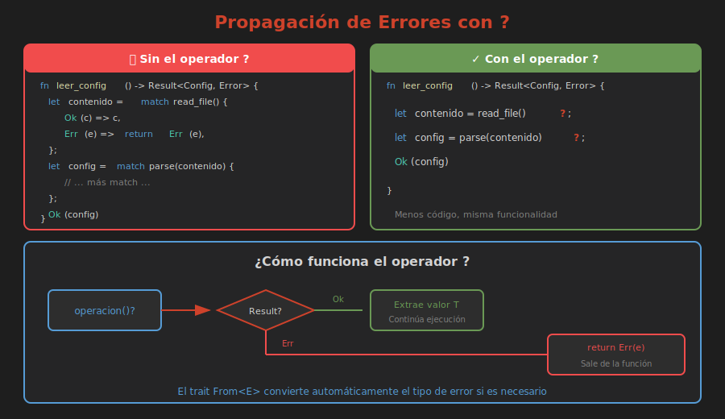

# ⚡ Propagación de Errores

> **El operador `?` - Elegancia en el manejo de errores**



---

## El Problema

Sin el operador `?`, el código se vuelve muy anidado:

```rust
fn procesar_archivo(ruta: &str) -> Result<Datos, Error> {
    let archivo = match File::open(ruta) {
        Ok(f) => f,
        Err(e) => return Err(e.into()),
    };
    
    let contenido = match leer_contenido(archivo) {
        Ok(c) => c,
        Err(e) => return Err(e.into()),
    };
    
    let datos = match parsear(contenido) {
        Ok(d) => d,
        Err(e) => return Err(e.into()),
    };
    
    Ok(datos)
}
```

---

## La Solución: Operador ?

```rust
fn procesar_archivo(ruta: &str) -> Result<Datos, Error> {
    let archivo = File::open(ruta)?;
    let contenido = leer_contenido(archivo)?;
    let datos = parsear(contenido)?;
    Ok(datos)
}
```

✨ Mucho más limpio y legible.

---

## ¿Qué Hace Exactamente ?

El operador `?` es equivalente a:

```rust
// Esto:
let valor = expresion?;

// Es equivalente a:
let valor = match expresion {
    Ok(v) => v,
    Err(e) => return Err(e.into()),
};
```

Nota el `.into()` - convierte automáticamente tipos de error.

---

## Requisitos para Usar ?

1. La función debe retornar `Result<T, E>` (o `Option<T>`)
2. El tipo de error debe ser convertible al tipo de error de la función

```rust
// ✅ Correcto - retorna Result
fn leer(ruta: &str) -> Result<String, io::Error> {
    let contenido = std::fs::read_to_string(ruta)?;
    Ok(contenido)
}

// ❌ Error - main no retorna Result
fn main() {
    let contenido = std::fs::read_to_string("archivo.txt")?;
    //                                                    ^ error
}

// ✅ Correcto - main puede retornar Result
fn main() -> Result<(), Box<dyn std::error::Error>> {
    let contenido = std::fs::read_to_string("archivo.txt")?;
    Ok(())
}
```

---

## ? con Option

También funciona con Option:

```rust
fn obtener_inicial(nombre: Option<&str>) -> Option<char> {
    let n = nombre?;           // Retorna None si es None
    let primera = n.chars().next()?;  // Retorna None si está vacío
    Some(primera.to_ascii_uppercase())
}
```

---

## Encadenamiento

```rust
fn primer_numero(texto: &str) -> Option<i32> {
    texto
        .split_whitespace()
        .next()?                    // Option<&str>
        .parse::<i32>()
        .ok()?                      // Option<i32>
        .checked_mul(2)             // Option<i32>
}
```

---

## Conversión Automática con From

El operador `?` llama `.into()` automáticamente:

```rust
use std::io;
use std::num::ParseIntError;

#[derive(Debug)]
enum MiError {
    Io(io::Error),
    Parse(ParseIntError),
}

impl From<io::Error> for MiError {
    fn from(e: io::Error) -> Self {
        MiError::Io(e)
    }
}

impl From<ParseIntError> for MiError {
    fn from(e: ParseIntError) -> Self {
        MiError::Parse(e)
    }
}

fn leer_numero(ruta: &str) -> Result<i32, MiError> {
    let contenido = std::fs::read_to_string(ruta)?;  // io::Error → MiError
    let numero = contenido.trim().parse()?;           // ParseIntError → MiError
    Ok(numero)
}
```

---

## Box<dyn Error>

Para prototipos o cuando no quieres definir un tipo de error:

```rust
use std::error::Error;

fn hacer_cosas() -> Result<(), Box<dyn Error>> {
    let archivo = std::fs::File::open("config.txt")?;
    let datos: serde_json::Value = serde_json::from_reader(archivo)?;
    println!("{:?}", datos);
    Ok(())
}
```

Acepta **cualquier tipo de error**.

---

## Agregar Contexto

A veces el error original no tiene suficiente información:

```rust
use std::fs;

fn leer_config(ruta: &str) -> Result<Config, String> {
    let contenido = fs::read_to_string(ruta)
        .map_err(|e| format!("Error leyendo {}: {}", ruta, e))?;
    
    let config: Config = toml::from_str(&contenido)
        .map_err(|e| format!("Error parseando config: {}", e))?;
    
    Ok(config)
}
```

---

## Patrón: ok_or para Option → Result

```rust
fn obtener_usuario(id: u32) -> Option<Usuario> {
    // ...
}

fn procesar_usuario(id: u32) -> Result<String, &'static str> {
    let usuario = obtener_usuario(id)
        .ok_or("Usuario no encontrado")?;
    
    Ok(usuario.nombre.clone())
}
```

---

## ? en Closures

Cuidado: `?` en closures requiere que el closure retorne Result:

```rust
fn procesar_lista(items: &[&str]) -> Result<Vec<i32>, ParseIntError> {
    items
        .iter()
        .map(|s| s.parse::<i32>())  // Cada parse retorna Result
        .collect()                   // collect maneja los Results
}

// O con ? explícito en closure que retorna Result:
fn procesar_con_try(items: &[&str]) -> Result<Vec<i32>, ParseIntError> {
    items
        .iter()
        .map(|s| -> Result<i32, ParseIntError> {
            let n = s.parse::<i32>()?;
            Ok(n * 2)
        })
        .collect()
}
```

---

## try Blocks (Nightly)

En Rust nightly, puedes usar `try` blocks:

```rust
#![feature(try_blocks)]

fn main() {
    let resultado: Result<i32, ParseIntError> = try {
        let a = "10".parse::<i32>()?;
        let b = "20".parse::<i32>()?;
        a + b
    };
}
```

---

## Resumen

| Sintaxis | Comportamiento |
|----------|----------------|
| `expr?` | Propaga Err, extrae Ok |
| `.map_err(\|e\| ...)` | Transforma error antes de ? |
| `.ok_or(err)` | Option → Result |
| `.ok_or_else(\|\| err)` | Option → Result (lazy) |

---

## 🧪 Ejercicio Mental

Refactoriza usando `?`:

```rust
fn cargar(path: &str) -> Result<Data, Error> {
    match std::fs::read_to_string(path) {
        Ok(s) => {
            match serde_json::from_str(&s) {
                Ok(d) => Ok(d),
                Err(e) => Err(Error::Parse(e)),
            }
        }
        Err(e) => Err(Error::Io(e)),
    }
}
```

<details>
<summary>Ver respuesta</summary>

```rust
fn cargar(path: &str) -> Result<Data, Error> {
    let s = std::fs::read_to_string(path)?;
    let d = serde_json::from_str(&s)?;
    Ok(d)
}
```
(Asumiendo que Error implementa From para ambos tipos de error)

</details>

---

## 📚 Siguiente

[Errores Personalizados →](04-errores-personalizados.md)
