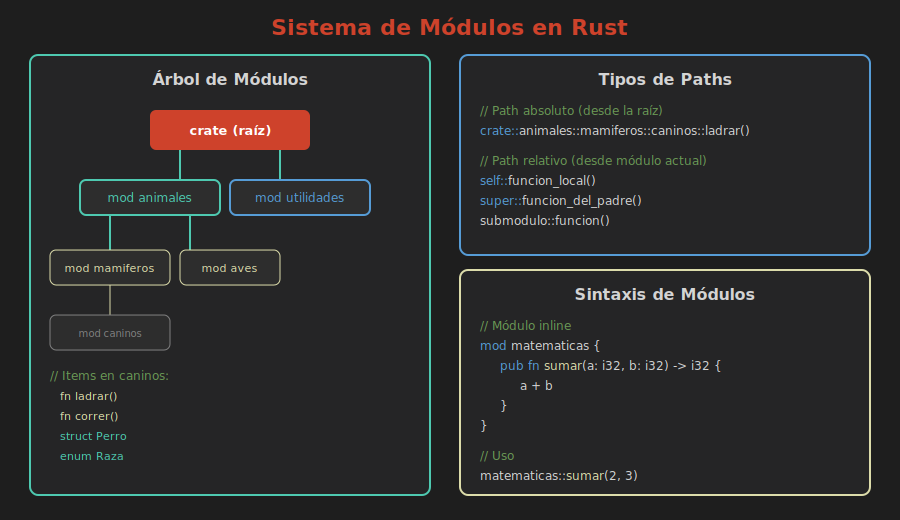

# 📦 Sistema de Módulos

> **Organizando código en unidades lógicas**



---

## ¿Qué es un Módulo?

Un módulo es un **contenedor de código** que agrupa elementos relacionados:
- Funciones
- Structs
- Enums
- Traits
- Constantes
- Otros módulos

---

## Crear un Módulo Inline

```rust
mod matematicas {
    pub fn sumar(a: i32, b: i32) -> i32 {
        a + b
    }
    
    pub fn restar(a: i32, b: i32) -> i32 {
        a - b
    }
    
    // Esta función es privada
    fn operacion_interna() {
        // Solo accesible dentro de este módulo
    }
}

fn main() {
    let resultado = matematicas::sumar(5, 3);
    println!("5 + 3 = {}", resultado);
}
```

---

## Módulos Anidados

```rust
mod animales {
    pub mod mamiferos {
        pub fn describir() {
            println!("Animales de sangre caliente");
        }
        
        pub mod caninos {
            pub fn ladrar() {
                println!("¡Guau!");
            }
        }
    }
    
    pub mod aves {
        pub fn volar() {
            println!("Volando...");
        }
    }
}

fn main() {
    animales::mamiferos::describir();
    animales::mamiferos::caninos::ladrar();
    animales::aves::volar();
}
```

---

## El Árbol de Módulos

Todo proyecto Rust tiene un **árbol de módulos** con raíz en:
- `main.rs` para binarios
- `lib.rs` para bibliotecas

```
crate (raíz)
├── main.rs o lib.rs
├── mod animales
│   ├── mod mamiferos
│   │   └── mod caninos
│   └── mod aves
└── mod matematicas
```

---

## Referencia a la Raíz con crate

```rust
mod utilidades {
    pub fn helper() {
        println!("Helper");
    }
}

mod servicios {
    pub fn procesar() {
        // Referencia absoluta desde la raíz
        crate::utilidades::helper();
    }
}
```

---

## self y super

```rust
mod padre {
    pub fn funcion_padre() {
        println!("Soy el padre");
    }
    
    pub mod hijo {
        pub fn llamar_padre() {
            // super = módulo padre
            super::funcion_padre();
        }
        
        pub fn llamar_hermano() {
            // self = este módulo
            self::otra_funcion();
        }
        
        fn otra_funcion() {
            println!("Otra función del hijo");
        }
    }
}
```

---

## ¿Por Qué Usar Módulos?

### 1. Organización
Agrupa código relacionado lógicamente.

### 2. Encapsulación
Oculta detalles de implementación.

### 3. Reutilización
Facilita usar código en diferentes partes.

### 4. Namespacing
Evita colisiones de nombres.

```rust
mod audio {
    pub fn play() { /* reproduce audio */ }
}

mod video {
    pub fn play() { /* reproduce video */ }
}

// Sin ambigüedad:
audio::play();
video::play();
```

---

## Ejemplo Práctico: Aplicación de Tareas

```rust
mod tareas {
    pub struct Tarea {
        pub titulo: String,
        completada: bool,
    }
    
    impl Tarea {
        pub fn nueva(titulo: &str) -> Self {
            Tarea {
                titulo: titulo.to_string(),
                completada: false,
            }
        }
        
        pub fn completar(&mut self) {
            self.completada = true;
        }
        
        pub fn esta_completada(&self) -> bool {
            self.completada
        }
    }
    
    pub mod almacenamiento {
        use super::Tarea;
        
        pub fn guardar(tarea: &Tarea) {
            println!("Guardando: {}", tarea.titulo);
        }
    }
}

fn main() {
    let mut tarea = tareas::Tarea::nueva("Aprender módulos");
    tarea.completar();
    tareas::almacenamiento::guardar(&tarea);
}
```

---

## Resumen

| Concepto | Descripción |
|----------|-------------|
| `mod nombre {}` | Define un módulo inline |
| `crate::` | Ruta desde la raíz |
| `super::` | Ruta al módulo padre |
| `self::` | Ruta al módulo actual |

---

## 📚 Siguiente

[Visibilidad y pub →](02-visibilidad-pub.md)
