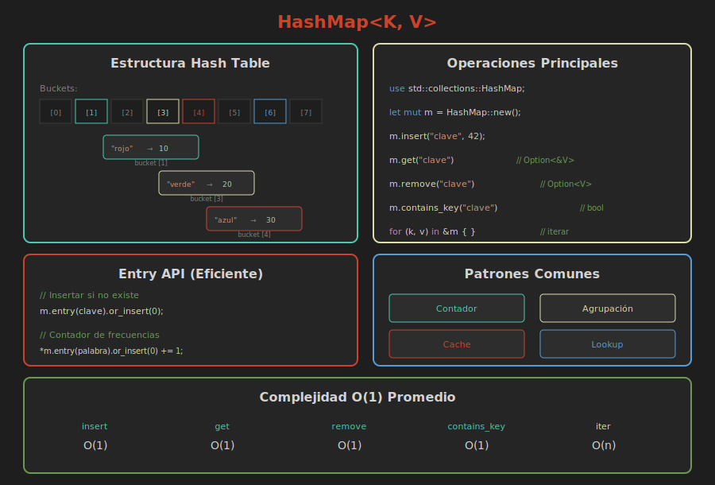

# 📚 HashMaps

> **Almacenamiento clave-valor en Rust**

## 🎯 Objetivos

- Crear y manipular HashMaps
- Entender ownership en claves y valores
- Usar la Entry API eficientemente
- Implementar patrones comunes

---

## 🧠 ¿Qué es un HashMap?

Un **HashMap<K, V>** es una colección que:

- Almacena pares **clave-valor**
- Acceso **O(1)** por clave (promedio)
- Las claves deben ser **únicas**
- Las claves deben implementar `Eq` y `Hash`



---

## 📦 Importación

```rust
// HashMap NO está en el prelude
use std::collections::HashMap;
```

---

## 📝 Crear HashMaps

### HashMap vacío

```rust
use std::collections::HashMap;

// Especificar tipos explícitamente
let mut mapa: HashMap<String, i32> = HashMap::new();

// O dejar que Rust infiera del primer insert
let mut mapa = HashMap::new();
mapa.insert(String::from("azul"), 10);
```

### Con capacidad inicial

```rust
// Pre-reservar espacio para evitar realocaciones
let mut mapa = HashMap::with_capacity(100);
```

### Desde iterador de tuplas

```rust
let pares = vec![
    (String::from("rojo"), 1),
    (String::from("verde"), 2),
    (String::from("azul"), 3),
];

let mapa: HashMap<String, i32> = pares.into_iter().collect();
```

### Desde dos vectores con zip

```rust
let claves = vec!["rojo", "verde", "azul"];
let valores = vec![1, 2, 3];

let mapa: HashMap<&str, i32> = claves
    .into_iter()
    .zip(valores.into_iter())
    .collect();
```

---

## ➕ Insertar Elementos

### `insert` - Insertar o reemplazar

```rust
let mut puntuaciones = HashMap::new();

// Insertar nuevos
puntuaciones.insert(String::from("Azul"), 10);
puntuaciones.insert(String::from("Rojo"), 50);

// Reemplazar existente (devuelve el valor anterior)
let anterior = puntuaciones.insert(String::from("Azul"), 25);
println!("Valor anterior: {:?}", anterior);  // Some(10)
```

### `insert` devuelve el valor anterior

```rust
let mut mapa = HashMap::new();

let v1 = mapa.insert("clave", 1);  // None (no existía)
let v2 = mapa.insert("clave", 2);  // Some(1) (reemplazado)
```

---

## 📖 Leer Elementos

### `get` - Acceso seguro

```rust
let mut mapa = HashMap::new();
mapa.insert(String::from("azul"), 10);

// Devuelve Option<&V>
match mapa.get("azul") {
    Some(valor) => println!("Encontrado: {}", valor),
    None => println!("No encontrado"),
}

// Con if let
if let Some(valor) = mapa.get("azul") {
    println!("Azul: {}", valor);
}

// O con unwrap_or
let valor = mapa.get("rojo").unwrap_or(&0);
```

### Acceso con `[]`

```rust
let mapa: HashMap<&str, i32> = [("azul", 10)].into_iter().collect();

// ⚠️ PANIC si la clave no existe
let valor = mapa["azul"];  // 10
// let valor = mapa["rojo"];  // PANIC!
```

### `contains_key` - Verificar existencia

```rust
if mapa.contains_key("azul") {
    println!("Existe la clave azul");
}
```

---

## 🔄 Modificar Elementos

### Obtener referencia mutable

```rust
let mut mapa = HashMap::new();
mapa.insert("contador", 0);

if let Some(valor) = mapa.get_mut("contador") {
    *valor += 1;
}
```

---

## ➖ Eliminar Elementos

### `remove` - Eliminar por clave

```rust
let mut mapa = HashMap::new();
mapa.insert("clave", 100);

// Elimina y devuelve el valor
let eliminado = mapa.remove("clave");  // Some(100)
let no_existe = mapa.remove("otra");   // None
```

### `clear` - Vaciar todo

```rust
mapa.clear();
```

---

## 🔁 Iterar sobre HashMaps

### Iterar claves y valores

```rust
let mapa: HashMap<&str, i32> = [
    ("rojo", 1),
    ("verde", 2),
    ("azul", 3),
].into_iter().collect();

// Iterar sobre pares (clave, valor)
for (clave, valor) in &mapa {
    println!("{}: {}", clave, valor);
}

// Solo claves
for clave in mapa.keys() {
    println!("Clave: {}", clave);
}

// Solo valores
for valor in mapa.values() {
    println!("Valor: {}", valor);
}
```

### Iterar con mutabilidad

```rust
let mut mapa: HashMap<&str, i32> = [
    ("a", 1),
    ("b", 2),
].into_iter().collect();

for valor in mapa.values_mut() {
    *valor *= 10;
}
// mapa = {"a": 10, "b": 20}
```

> ⚠️ **Nota**: El orden de iteración en HashMap es **aleatorio**.

---

## 🎯 Entry API

La Entry API es la forma más eficiente de:
- Insertar si no existe
- Modificar si existe
- Evitar múltiples lookups

### `entry` + `or_insert`

```rust
let mut mapa = HashMap::new();

// Insertar solo si no existe
mapa.entry("clave").or_insert(0);

// Si ya existe, no hace nada
mapa.entry("clave").or_insert(100);  // Sigue siendo 0

println!("{:?}", mapa);  // {"clave": 0}
```

### `or_insert_with` - Insertar con función

```rust
let mut mapa = HashMap::new();

// Útil cuando crear el valor es costoso
mapa.entry("clave").or_insert_with(|| {
    println!("Calculando valor...");
    calcular_valor_costoso()
});
```

### Patrón contador

```rust
let texto = "hola mundo mundo hola hola";
let mut contador = HashMap::new();

for palabra in texto.split_whitespace() {
    // Obtener referencia al valor, insertar 0 si no existe
    let cuenta = contador.entry(palabra).or_insert(0);
    *cuenta += 1;
}

// {"hola": 3, "mundo": 2}
```

### `or_default` - Insertar valor por defecto

```rust
let mut mapa: HashMap<&str, Vec<i32>> = HashMap::new();

// Inserta Vec vacío si no existe
mapa.entry("numeros").or_default().push(1);
mapa.entry("numeros").or_default().push(2);

// {"numeros": [1, 2]}
```

### `and_modify` - Modificar si existe

```rust
let mut mapa = HashMap::new();
mapa.insert("clave", 1);

mapa.entry("clave")
    .and_modify(|v| *v += 10)  // Si existe, suma 10
    .or_insert(0);             // Si no existe, inserta 0

// {"clave": 11}
```

---

## ⚠️ Ownership en HashMap

### Tipos Copy

```rust
let mut mapa = HashMap::new();

let clave = 1;
let valor = 10;

mapa.insert(clave, valor);

// clave y valor siguen válidos (i32 es Copy)
println!("{}, {}", clave, valor);
```

### Tipos no-Copy (String)

```rust
let mut mapa = HashMap::new();

let clave = String::from("favorito");
let valor = String::from("azul");

mapa.insert(clave, valor);

// ❌ ERROR: clave y valor fueron movidos
// println!("{}, {}", clave, valor);
```

### Solución: Referencias o Clone

```rust
// Opción 1: Usar referencias (necesita lifetimes)
let clave = String::from("favorito");
let valor = String::from("azul");
let mut mapa: HashMap<&str, &str> = HashMap::new();
mapa.insert(&clave, &valor);

// Opción 2: Clonar
let mut mapa = HashMap::new();
mapa.insert(clave.clone(), valor.clone());
```

---

## 📊 Patrones Comunes

### Contador de frecuencias

```rust
fn contar_palabras(texto: &str) -> HashMap<&str, usize> {
    let mut contador = HashMap::new();
    
    for palabra in texto.split_whitespace() {
        *contador.entry(palabra).or_insert(0) += 1;
    }
    
    contador
}
```

### Agrupar por clave

```rust
fn agrupar_por_inicial(palabras: &[&str]) -> HashMap<char, Vec<&str>> {
    let mut grupos = HashMap::new();
    
    for palabra in palabras {
        if let Some(inicial) = palabra.chars().next() {
            grupos.entry(inicial)
                  .or_default()
                  .push(*palabra);
        }
    }
    
    grupos
}

// Uso
let palabras = ["rust", "rápido", "seguro", "simple"];
let grupos = agrupar_por_inicial(&palabras);
// {'r': ["rust", "rápido"], 's': ["seguro", "simple"]}
```

### Cache / Memoización

```rust
use std::collections::HashMap;

fn fibonacci_memo(n: u64, cache: &mut HashMap<u64, u64>) -> u64 {
    if n <= 1 {
        return n;
    }
    
    if let Some(&resultado) = cache.get(&n) {
        return resultado;
    }
    
    let resultado = fibonacci_memo(n - 1, cache) + fibonacci_memo(n - 2, cache);
    cache.insert(n, resultado);
    resultado
}
```

---

## 🎯 Ejercicio Rápido

```rust
use std::collections::HashMap;

fn main() {
    let votos = vec!["rojo", "azul", "rojo", "verde", "azul", "rojo"];
    
    // 1. Cuenta los votos por cada color
    // 2. Encuentra el color ganador
    // 3. Imprime los resultados
    
    // Tu código aquí...
}
```

<details>
<summary>Ver solución</summary>

```rust
use std::collections::HashMap;

fn main() {
    let votos = vec!["rojo", "azul", "rojo", "verde", "azul", "rojo"];
    
    // Contar votos
    let mut conteo = HashMap::new();
    for voto in votos {
        *conteo.entry(voto).or_insert(0) += 1;
    }
    
    // Encontrar ganador
    let ganador = conteo
        .iter()
        .max_by_key(|&(_, cuenta)| cuenta)
        .map(|(color, _)| *color);
    
    // Imprimir
    println!("Resultados: {:?}", conteo);
    println!("Ganador: {:?}", ganador);
}
```

</details>

---

## 📖 Resumen

| Operación | Método | Complejidad |
|-----------|--------|-------------|
| Insertar | `insert(k, v)` | O(1) |
| Leer | `get(&k)` | O(1) |
| Eliminar | `remove(&k)` | O(1) |
| Contiene | `contains_key(&k)` | O(1) |
| Entry API | `entry(k)` | O(1) |
| Iterar | `iter()` | O(n) |

---

**Anterior**: [02 - Strings](02-strings.md)  
**Siguiente**: [04 - Iteradores Básicos](04-iteradores-basicos.md)
