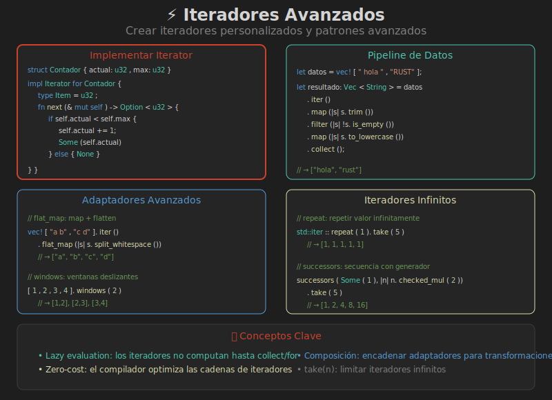

# 📚 Iteradores Avanzados



## 🎯 Objetivos de Aprendizaje

- Crear iteradores personalizados
- Usar adaptadores avanzados
- Optimizar con iteradores

---

## 🏗️ Implementar el Trait Iterator

### Estructura Básica

```rust
struct Contador {
    actual: u32,
    max: u32,
}

impl Contador {
    fn new(max: u32) -> Self {
        Contador { actual: 0, max }
    }
}

impl Iterator for Contador {
    type Item = u32;
    
    fn next(&mut self) -> Option<Self::Item> {
        if self.actual < self.max {
            self.actual += 1;
            Some(self.actual)
        } else {
            None
        }
    }
}

// Uso
for n in Contador::new(5) {
    println!("{}", n);  // 1, 2, 3, 4, 5
}
```

### Iterador con Estado Complejo

```rust
struct Fibonacci {
    actual: u64,
    siguiente: u64,
}

impl Fibonacci {
    fn new() -> Self {
        Fibonacci { actual: 0, siguiente: 1 }
    }
}

impl Iterator for Fibonacci {
    type Item = u64;
    
    fn next(&mut self) -> Option<Self::Item> {
        let nuevo = self.actual + self.siguiente;
        self.actual = self.siguiente;
        self.siguiente = nuevo;
        Some(self.actual)
    }
}

// Uso - ¡Cuidado! Es infinito
let fib: Vec<u64> = Fibonacci::new().take(10).collect();
// [1, 1, 2, 3, 5, 8, 13, 21, 34, 55]
```

---

## 🔄 Iterador sobre Referencias

Cuando tu struct contiene datos y quieres iterar sobre referencias:

```rust
struct Lista<T> {
    elementos: Vec<T>,
}

impl<T> Lista<T> {
    fn new() -> Self {
        Lista { elementos: Vec::new() }
    }
    
    fn push(&mut self, item: T) {
        self.elementos.push(item);
    }
    
    // Retorna un iterador sobre referencias
    fn iter(&self) -> impl Iterator<Item = &T> {
        self.elementos.iter()
    }
}

// Uso
let mut lista = Lista::new();
lista.push(1);
lista.push(2);

for item in lista.iter() {
    println!("{}", item);  // &i32
}
```

### Implementación Completa (iter, iter_mut, into_iter)

```rust
impl<T> Lista<T> {
    fn iter(&self) -> std::slice::Iter<'_, T> {
        self.elementos.iter()
    }
    
    fn iter_mut(&mut self) -> std::slice::IterMut<'_, T> {
        self.elementos.iter_mut()
    }
}

impl<T> IntoIterator for Lista<T> {
    type Item = T;
    type IntoIter = std::vec::IntoIter<T>;
    
    fn into_iter(self) -> Self::IntoIter {
        self.elementos.into_iter()
    }
}

// También para referencias
impl<'a, T> IntoIterator for &'a Lista<T> {
    type Item = &'a T;
    type IntoIter = std::slice::Iter<'a, T>;
    
    fn into_iter(self) -> Self::IntoIter {
        self.elementos.iter()
    }
}
```

---

## 🛠️ Adaptadores Avanzados

### `flat_map()` - Map + Flatten

```rust
let frases = vec!["hola mundo", "rust es genial"];

let palabras: Vec<&str> = frases.iter()
    .flat_map(|s| s.split_whitespace())
    .collect();

// ["hola", "mundo", "rust", "es", "genial"]
```

### `scan()` - Fold con Estado Intermedio

```rust
let nums = vec![1, 2, 3, 4];

// Suma acumulativa
let sumas: Vec<i32> = nums.iter()
    .scan(0, |state, &x| {
        *state += x;
        Some(*state)
    })
    .collect();

// [1, 3, 6, 10]
```

### `peekable()` - Mirar Sin Consumir

```rust
let mut iter = vec![1, 2, 3].into_iter().peekable();

// Mirar sin consumir
assert_eq!(iter.peek(), Some(&1));
assert_eq!(iter.peek(), Some(&1));

// Ahora consumir
assert_eq!(iter.next(), Some(1));
assert_eq!(iter.peek(), Some(&2));
```

### `windows()` - Ventanas Deslizantes

```rust
let nums = vec![1, 2, 3, 4, 5];

// Ventanas de tamaño 3
for window in nums.windows(3) {
    println!("{:?}", window);
}
// [1, 2, 3]
// [2, 3, 4]
// [3, 4, 5]
```

### `chunks()` - Dividir en Grupos

```rust
let nums = vec![1, 2, 3, 4, 5, 6, 7];

for chunk in nums.chunks(3) {
    println!("{:?}", chunk);
}
// [1, 2, 3]
// [4, 5, 6]
// [7]
```

### `partition()` - Dividir por Predicado

```rust
let nums: Vec<i32> = (1..=10).collect();

let (pares, impares): (Vec<i32>, Vec<i32>) = nums
    .into_iter()
    .partition(|&x| x % 2 == 0);

// pares = [2, 4, 6, 8, 10]
// impares = [1, 3, 5, 7, 9]
```

### `inspect()` - Debug sin Modificar

```rust
let resultado: Vec<i32> = (1..=5)
    .inspect(|x| println!("Antes: {}", x))
    .map(|x| x * 2)
    .inspect(|x| println!("Después: {}", x))
    .collect();
```

---

## 🔢 Iteradores de Rangos

```rust
// Rango exclusivo
let r1: Vec<i32> = (1..5).collect();  // [1, 2, 3, 4]

// Rango inclusivo
let r2: Vec<i32> = (1..=5).collect(); // [1, 2, 3, 4, 5]

// Con step
let r3: Vec<i32> = (0..10).step_by(2).collect(); // [0, 2, 4, 6, 8]

// Descendente
let r4: Vec<i32> = (1..=5).rev().collect(); // [5, 4, 3, 2, 1]
```

---

## 🔁 Iteradores Infinitos

### `repeat()`

```rust
use std::iter;

// Repetir un valor
let unos: Vec<i32> = iter::repeat(1).take(5).collect();
// [1, 1, 1, 1, 1]
```

### `repeat_with()`

```rust
use std::iter;

let mut counter = 0;
let nums: Vec<i32> = iter::repeat_with(|| {
    counter += 1;
    counter
}).take(5).collect();

// [1, 2, 3, 4, 5]
```

### `successors()`

```rust
use std::iter;

// Potencias de 2
let potencias: Vec<i32> = iter::successors(Some(1), |&n| {
    n.checked_mul(2)
}).take(10).collect();

// [1, 2, 4, 8, 16, 32, 64, 128, 256, 512]
```

### `from_fn()`

```rust
use std::iter;

let mut state = 0;
let nums: Vec<i32> = iter::from_fn(|| {
    state += 1;
    if state <= 5 { Some(state) } else { None }
}).collect();

// [1, 2, 3, 4, 5]
```

---

## ⚡ Optimización con Iteradores

### Zero-Cost Abstractions

Los iteradores de Rust compilan a código tan eficiente como loops manuales:

```rust
// Estas dos versiones generan código similar:

// Estilo imperativo
let mut sum = 0;
for i in 0..1000 {
    sum += i;
}

// Estilo funcional
let sum: i32 = (0..1000).sum();
```

### Evitar Colecciones Intermedias

```rust
// ❌ Crea Vec intermedia
let temp: Vec<i32> = (1..1000).filter(|x| x % 2 == 0).collect();
let suma: i32 = temp.iter().sum();

// ✅ Sin colección intermedia
let suma: i32 = (1..1000).filter(|x| x % 2 == 0).sum();
```

### `collect()` con Tipo Específico

```rust
// Vec (heap allocated)
let v: Vec<i32> = (1..5).collect();

// Array (stack allocated) - requiere tamaño conocido
let arr: [i32; 4] = (1..5).collect::<Vec<_>>().try_into().unwrap();
```

---

## 🎯 Patrones Comunes

### Agrupar por Clave

```rust
use std::collections::HashMap;

let palabras = vec!["apple", "banana", "apricot", "blueberry"];

let por_letra: HashMap<char, Vec<&str>> = palabras.iter()
    .fold(HashMap::new(), |mut acc, &word| {
        let letra = word.chars().next().unwrap();
        acc.entry(letra).or_default().push(word);
        acc
    });

// {'a': ["apple", "apricot"], 'b': ["banana", "blueberry"]}
```

### Encontrar Máximo con Criterio

```rust
struct Producto {
    nombre: String,
    precio: f64,
}

let productos = vec![
    Producto { nombre: "A".into(), precio: 10.0 },
    Producto { nombre: "B".into(), precio: 25.0 },
    Producto { nombre: "C".into(), precio: 15.0 },
];

let mas_caro = productos.iter()
    .max_by(|a, b| a.precio.partial_cmp(&b.precio).unwrap());

// Some(Producto { nombre: "B", precio: 25.0 })
```

### Deduplicar Consecutivos

```rust
let nums = vec![1, 1, 2, 2, 2, 3, 1, 1];

let dedup: Vec<i32> = nums.iter()
    .copied()
    .fold(Vec::new(), |mut acc, x| {
        if acc.last() != Some(&x) {
            acc.push(x);
        }
        acc
    });

// [1, 2, 3, 1]

// O usando dedup() de Vec (in-place)
let mut nums = vec![1, 1, 2, 2, 2, 3, 1, 1];
nums.dedup();  // [1, 2, 3, 1]
```

---

## 📊 DoubleEndedIterator

Algunos iteradores pueden iterar desde ambos extremos:

```rust
let nums = vec![1, 2, 3, 4, 5];

// Desde el final
let rev: Vec<i32> = nums.iter().rev().copied().collect();
// [5, 4, 3, 2, 1]

// next_back()
let mut iter = nums.iter();
assert_eq!(iter.next(), Some(&1));
assert_eq!(iter.next_back(), Some(&5));
assert_eq!(iter.next(), Some(&2));
assert_eq!(iter.next_back(), Some(&4));
```

---

## 📐 ExactSizeIterator

Iteradores que conocen su longitud exacta:

```rust
let nums = vec![1, 2, 3];
let iter = nums.iter();

// Conocemos la longitud sin consumir
assert_eq!(iter.len(), 3);

// size_hint() para optimizaciones
let (lower, upper) = iter.size_hint();
assert_eq!(lower, 3);
assert_eq!(upper, Some(3));
```

---

## 🎯 Resumen

| Concepto | Uso |
|----------|-----|
| **Custom Iterator** | Implementar `Iterator` trait |
| **Infinitos** | `repeat`, `successors`, `from_fn` |
| **Avanzados** | `scan`, `peekable`, `windows` |
| **Optimización** | Evitar colecciones intermedias |
| **DoubleEnded** | Iterar desde ambos lados |

### Checklist para Iterador Personalizado

1. ✅ Definir struct con estado
2. ✅ Implementar `Iterator` trait
3. ✅ Definir `type Item`
4. ✅ Implementar `next()` → `Option<Item>`
5. ⚡ Opcional: `size_hint()`, `DoubleEndedIterator`

---

## 🔗 Navegación

| Anterior | Índice |
|----------|--------|
| [04 - Iteradores](04-iteradores.md) | [README](../README.md) |
