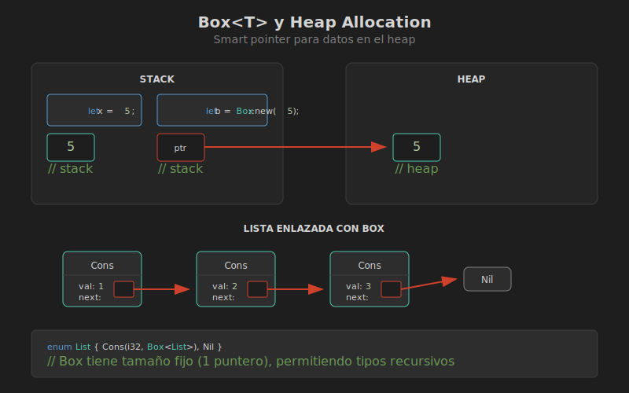

# Box<T> y Heap Allocation

## 🎯 Objetivos

- Comprender la diferencia entre stack y heap
- Usar `Box<T>` para almacenar datos en el heap
- Implementar tipos recursivos con Box



## 📚 Conceptos

### Stack vs Heap

```
┌─────────────────────────────────────────────────────────────┐
│                    MEMORIA EN RUST                          │
├─────────────────────────────────────────────────────────────┤
│                                                             │
│   STACK                          HEAP                       │
│   ┌─────────────┐               ┌─────────────────────┐    │
│   │ Tamaño fijo │               │ Tamaño dinámico     │    │
│   │ Rápido      │               │ Más lento           │    │
│   │ LIFO        │     ───►      │ Fragmentado         │    │
│   │ Auto-limpia │    puntero    │ Manual/RAII         │    │
│   └─────────────┘               └─────────────────────┘    │
│                                                             │
│   let x = 5;                    let b = Box::new(5);       │
│   ┌───┐                         ┌───┐    ┌───┐             │
│   │ 5 │                         │ * │───►│ 5 │             │
│   └───┘                         └───┘    └───┘             │
│   stack                         stack    heap              │
│                                                             │
└─────────────────────────────────────────────────────────────┘
```

### ¿Qué es Box<T>?

`Box<T>` es el smart pointer más simple: un puntero a datos almacenados en el heap.

```rust
fn main() {
    // Valor en el stack
    let x = 5;
    
    // Valor en el heap (Box es un puntero en el stack)
    let boxed = Box::new(5);
    
    // Acceso transparente gracias a Deref
    println!("x = {}, boxed = {}", x, *boxed);
    
    // Box se libera automáticamente al salir de scope
}
```

### Cuándo Usar Box

| Caso de Uso | Ejemplo |
|-------------|---------|
| Tipos recursivos | Listas enlazadas, árboles |
| Datos grandes | Evitar copias costosas |
| Trait objects | `Box<dyn Trait>` |
| Transferir ownership | Sin copiar datos |

## 🔧 Tipos Recursivos

Sin Box, los tipos recursivos no compilan:

```rust
// ❌ ERROR: tamaño infinito
enum List {
    Cons(i32, List),  // List contiene List que contiene List...
    Nil,
}
```

```
error[E0072]: recursive type `List` has infinite size
 --> src/main.rs:1:1
  |
1 | enum List {
  | ^^^^^^^^^
2 |     Cons(i32, List),
  |               ---- recursive without indirection
```

Con Box funciona porque el puntero tiene tamaño conocido:

```rust
// ✅ OK: Box tiene tamaño fijo (un puntero)
enum List {
    Cons(i32, Box<List>),
    Nil,
}

fn main() {
    let list = List::Cons(1,
        Box::new(List::Cons(2,
            Box::new(List::Cons(3,
                Box::new(List::Nil))))));
}
```

```
┌─────────────────────────────────────────────────────────────┐
│                    LISTA ENLAZADA CON BOX                   │
├─────────────────────────────────────────────────────────────┤
│                                                             │
│   Stack                Heap                                 │
│   ┌──────────┐        ┌──────────┐        ┌──────────┐     │
│   │ Cons     │        │ Cons     │        │ Cons     │     │
│   │ val: 1   │        │ val: 2   │        │ val: 3   │     │
│   │ next: *──┼───────►│ next: *──┼───────►│ next: *──┼──►Nil│
│   └──────────┘        └──────────┘        └──────────┘     │
│                                                             │
│   Tamaño: i32 + ptr   Tamaño: i32 + ptr   Tamaño: i32 + ptr│
│   (conocido)          (conocido)          (conocido)       │
│                                                             │
└─────────────────────────────────────────────────────────────┘
```

## 📖 Implementación de Lista

```rust
#[derive(Debug)]
enum List<T> {
    Cons(T, Box<List<T>>),
    Nil,
}

impl<T> List<T> {
    fn new() -> Self {
        List::Nil
    }
    
    fn prepend(self, value: T) -> Self {
        List::Cons(value, Box::new(self))
    }
    
    fn len(&self) -> usize {
        match self {
            List::Nil => 0,
            List::Cons(_, tail) => 1 + tail.len(),
        }
    }
}

fn main() {
    let list = List::new()
        .prepend(3)
        .prepend(2)
        .prepend(1);
    
    println!("Lista: {:?}", list);
    println!("Longitud: {}", list.len());
}
```

## 🌳 Árbol Binario con Box

```rust
#[derive(Debug)]
struct TreeNode<T> {
    value: T,
    left: Option<Box<TreeNode<T>>>,
    right: Option<Box<TreeNode<T>>>,
}

impl<T> TreeNode<T> {
    fn new(value: T) -> Self {
        TreeNode {
            value,
            left: None,
            right: None,
        }
    }
    
    fn with_children(
        value: T,
        left: Option<TreeNode<T>>,
        right: Option<TreeNode<T>>,
    ) -> Self {
        TreeNode {
            value,
            left: left.map(Box::new),
            right: right.map(Box::new),
        }
    }
}

fn main() {
    //       1
    //      / \
    //     2   3
    //    /
    //   4
    
    let tree = TreeNode::with_children(
        1,
        Some(TreeNode::with_children(
            2,
            Some(TreeNode::new(4)),
            None,
        )),
        Some(TreeNode::new(3)),
    );
    
    println!("{:#?}", tree);
}
```

## 🔄 El Trait Deref

Box implementa `Deref`, permitiendo usar `*` y auto-dereferencing:

```rust
use std::ops::Deref;

fn main() {
    let x = 5;
    let y = Box::new(x);
    
    assert_eq!(5, x);
    assert_eq!(5, *y);  // Deref explícito
    
    // Auto-deref en métodos
    let s = Box::new(String::from("hello"));
    println!("Longitud: {}", s.len());  // Auto-deref a String
    
    // Deref coercion: &Box<String> -> &String -> &str
    fn greet(name: &str) {
        println!("Hello, {}!", name);
    }
    greet(&s);  // Funciona por deref coercion
}
```

## 🗑️ El Trait Drop

Box implementa `Drop` para liberar memoria del heap:

```rust
struct CustomBox<T> {
    data: T,
}

impl<T> Drop for CustomBox<T> {
    fn drop(&mut self) {
        println!("Dropping CustomBox!");
    }
}

fn main() {
    let _b = CustomBox { data: 42 };
    println!("CustomBox creado");
    // Al salir de scope, se llama drop automáticamente
}
// Output:
// CustomBox creado
// Dropping CustomBox!
```

## ⚠️ Errores Comunes

### 1. Intentar Modificar Box Inmutable

```rust
// ❌ Error
let b = Box::new(5);
*b = 10;  // cannot assign to `*b`, as `b` is not declared as mutable

// ✅ Correcto
let mut b = Box::new(5);
*b = 10;
```

### 2. Box No Implementa Copy

```rust
// ❌ Error
let b1 = Box::new(5);
let b2 = b1;
println!("{}", b1);  // error: borrow of moved value

// ✅ Clonar explícitamente
let b1 = Box::new(5);
let b2 = b1.clone();
println!("{}, {}", b1, b2);
```

## 📊 Diagrama Visual


## 🎯 Resumen

| Característica | Box<T> |
|----------------|--------|
| Ubicación datos | Heap |
| Tamaño puntero | 1 palabra (usize) |
| Ownership | Único |
| Thread-safe | Sí (si T: Send) |
| Clonable | Si T: Clone |
| Uso principal | Tipos recursivos, trait objects |

## 🔗 Siguiente

[02 - Rc y Arc](02-rc-arc.md)
