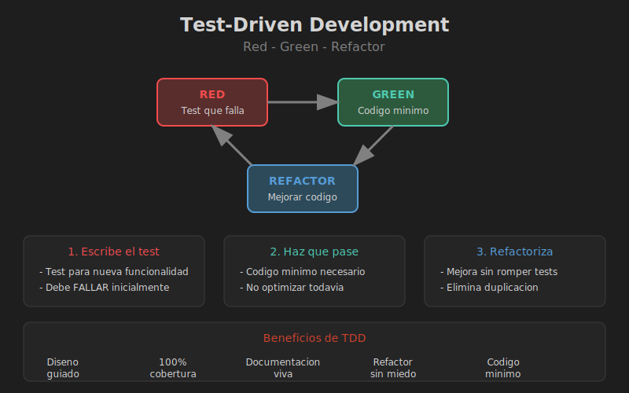

# Test-Driven Development (TDD)



## Objetivos

- Entender el ciclo Red-Green-Refactor
- Aplicar TDD en Rust
- Escribir tests antes del codigo

---

## El Ciclo TDD

```
    +-------+
    |  RED  |  <-- Escribe un test que falla
    +-------+
        |
        v
   +---------+
   |  GREEN  |  <-- Escribe codigo minimo para pasar
   +---------+
        |
        v
  +----------+
  | REFACTOR |  <-- Mejora el codigo sin romper tests
  +----------+
        |
        +-------> Volver a RED
```

---

## Ejemplo: Calculadora TDD

### Paso 1: RED - Test que falla

```rust
#[cfg(test)]
mod tests {
    use super::*;

    #[test]
    fn test_nueva_calculadora() {
        let calc = Calculadora::new();
        assert_eq!(calc.valor(), 0);
    }
}

// Esto no compila - Calculadora no existe
```

### Paso 2: GREEN - Codigo minimo

```rust
pub struct Calculadora {
    valor: i32,
}

impl Calculadora {
    pub fn new() -> Self {
        Calculadora { valor: 0 }
    }

    pub fn valor(&self) -> i32 {
        self.valor
    }
}

#[cfg(test)]
mod tests {
    use super::*;

    #[test]
    fn test_nueva_calculadora() {
        let calc = Calculadora::new();
        assert_eq!(calc.valor(), 0);
    }
}
```

### Paso 3: Siguiente test (RED)

```rust
#[test]
fn test_sumar() {
    let mut calc = Calculadora::new();
    calc.sumar(5);
    assert_eq!(calc.valor(), 5);
}
```

### Paso 4: Implementar (GREEN)

```rust
impl Calculadora {
    pub fn sumar(&mut self, n: i32) {
        self.valor += n;
    }
}
```

---

## Ejemplo Completo: Pila (Stack)

```rust
// Empezamos con los tests

#[cfg(test)]
mod tests {
    use super::*;

    #[test]
    fn test_pila_vacia() {
        let pila: Pila<i32> = Pila::new();
        assert!(pila.esta_vacia());
    }

    #[test]
    fn test_push_pop() {
        let mut pila = Pila::new();
        pila.push(42);
        assert_eq!(pila.pop(), Some(42));
    }

    #[test]
    fn test_pop_vacia() {
        let mut pila: Pila<i32> = Pila::new();
        assert_eq!(pila.pop(), None);
    }

    #[test]
    fn test_peek() {
        let mut pila = Pila::new();
        pila.push(1);
        pila.push(2);
        assert_eq!(pila.peek(), Some(&2));
        assert_eq!(pila.peek(), Some(&2)); // No consume
    }

    #[test]
    fn test_len() {
        let mut pila = Pila::new();
        assert_eq!(pila.len(), 0);
        pila.push(1);
        pila.push(2);
        assert_eq!(pila.len(), 2);
    }
}
```

Ahora implementamos para pasar los tests:

```rust
pub struct Pila<T> {
    elementos: Vec<T>,
}

impl<T> Pila<T> {
    pub fn new() -> Self {
        Pila { elementos: Vec::new() }
    }

    pub fn push(&mut self, item: T) {
        self.elementos.push(item);
    }

    pub fn pop(&mut self) -> Option<T> {
        self.elementos.pop()
    }

    pub fn peek(&self) -> Option<&T> {
        self.elementos.last()
    }

    pub fn esta_vacia(&self) -> bool {
        self.elementos.is_empty()
    }

    pub fn len(&self) -> usize {
        self.elementos.len()
    }
}
```

---

## Beneficios de TDD

| Beneficio | Descripcion |
|-----------|-------------|
| Diseno guiado | Los tests fuerzan buen diseno |
| Documentacion | Tests como ejemplos de uso |
| Confianza | Refactorizar sin miedo |
| Cobertura | 100% del codigo testeado |
| Foco | Implementar solo lo necesario |

---

## Tips para TDD en Rust

1. **Empieza simple**: Un test a la vez
2. **Tests pequenos**: Verificar una cosa
3. **Nombres claros**: `test_suma_numeros_negativos`
4. **Refactoriza seguido**: Mantener codigo limpio
5. **No anticipar**: Solo lo que el test necesita

---

## Flujo de Trabajo

```bash
# 1. Escribir test
# 2. Verificar que falla
cargo test test_nueva_funcionalidad

# 3. Implementar
# 4. Verificar que pasa
cargo test test_nueva_funcionalidad

# 5. Refactorizar
# 6. Verificar que sigue pasando
cargo test

# 7. Repetir
```

---

## Anti-Patrones

| Anti-Patron | Solucion |
|-------------|----------|
| Tests muy grandes | Dividir en tests pequenos |
| Escribir codigo primero | Disciplina: test primero |
| Tests acoplados | Tests independientes |
| Saltarse refactor | Reservar tiempo para limpiar |
