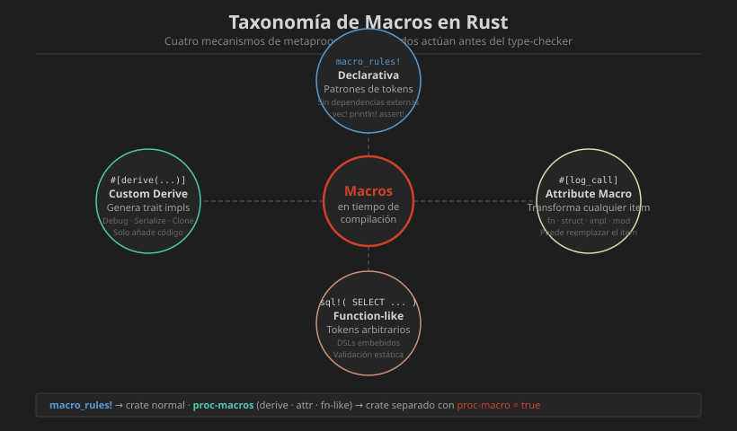

# 📖 Introducción a las Macros en Rust

## ¿Qué es una Macro?

Las macros en Rust son una forma de **metaprogramación**: código que escribe código. A diferencia de las macros de C (sustitución textual sin tipos), las macros de Rust operan sobre el **árbol de sintaxis abstracto** del código, lo que las hace seguras y verificadas por el compilador.

```
┌─────────────────────────────────────────────────────────────┐
│                  METAPROGRAMACIÓN EN RUST                   │
├─────────────────────────────────────────────────────────────┤
│                                                             │
│   Código fuente                     Código expandido        │
│   ┌─────────────────┐               ┌──────────────────┐   │
│   │ vec![1, 2, 3]   │──────────────▶│ {                │   │
│   └─────────────────┘  expande en   │   let mut v =    │   │
│                                     │     Vec::new();  │   │
│                                     │   v.push(1);     │   │
│                                     │   v.push(2);     │   │
│                                     │   v.push(3);     │   │
│                                     │   v              │   │
│                                     │ }                │   │
│                                     └──────────────────┘   │
│                                                             │
└─────────────────────────────────────────────────────────────┘
```

---

## Tipos de Macros en Rust

Rust tiene **cuatro tipos** de macros, divididos en dos categorías:

| Categoría | Tipo | Sintaxis | Ejemplo |
|-----------|------|----------|---------|
| Declarativa | `macro_rules!` | `nombre!(...)` | `vec![]`, `println!` |
| Proc-macro | Custom Derive | `#[derive(Trait)]` | `#[derive(Debug)]` |
| Proc-macro | Attribute | `#[attr(...)]` | `#[tokio::main]` |
| Proc-macro | Function-like | `nombre!(...)` | `sql!(...)` |

---

## Cuándo Usar Macros

### Casos de uso legítimos

```rust
// 1. Número variable de argumentos (imposible con funciones)
let v = vec![1, 2, 3, 4, 5];
println!("{} - {} - {}", a, b, c);

// 2. DSLs (Domain-Specific Languages)
let routes = router! {
    GET  "/users"     => list_users,
    POST "/users"     => create_user,
};

// 3. Implementar traits automáticamente
#[derive(Debug, Clone, PartialEq, Eq, Hash, Serialize)]
struct UserId(u64);

// 4. Eliminación de código repetitivo con verificación en compilación
assert_eq!(resultado, esperado, "Mensaje: {}", detalle);

// 5. Código condicional de compilación
#[cfg(feature = "logging")]
fn log(msg: &str) { println!("{}", msg); }
```

### La Regla de Oro

> **Prefiere siempre funciones y traits sobre macros.**
> Solo usa macros cuando no haya alternativa viable.

```rust
// ❌ Macro innecesaria — una función basta
macro_rules! duplicar {
    ($x:expr) => { $x * 2 }
}

// ✅ Función genérica, más legible y documentable
fn duplicar<T: std::ops::Mul<Output = T> + Copy>(x: T) -> T {
    x * x  // equivalente
}
```

---

## Flujo de Compilación con Macros

```
  ┌─────────────────┐
  │  Código fuente  │  (.rs)
  └────────┬────────┘
           │
           ▼
  ┌─────────────────┐
  │  Tokenización   │  Texto → tokens (identificadores, literales, etc.)
  └────────┬────────┘
           │
           ▼
  ┌─────────────────┐
  │ Expansión macro │  ◄── macro_rules! y proc-macros actúan AQUÍ
  │  (repetida      │      El resultado se vuelve a tokenizar
  │   hasta fixpoint│
  └────────┬────────┘
           │
           ▼
  ┌─────────────────┐
  │  Parsing (AST)  │  Árbol de Sintaxis Abstracto
  └────────┬────────┘
           │
           ▼
  ┌─────────────────┐
  │ Type checking   │  Borrow checker, lifetime analysis
  └────────┬────────┘
           │
           ▼
  ┌─────────────────┐
  │  LLVM IR / MIR  │  Código intermedio
  └────────┬────────┘
           │
           ▼
  ┌─────────────────┐
  │    Binario      │
  └─────────────────┘
```

---

## Ventajas vs Desventajas

| Ventajas | Desventajas |
|----------|-------------|
| Cero overhead en runtime | Errores de compilación confusos |
| Verificación en tiempo de compilación | Difíciles de debuggear |
| Eliminan boilerplate | Aumentan tiempo de compilación |
| Pueden generar código tipo-seguro | Ocultan la lógica real |
| Compatibles con el type system | Curva de aprendizaje alta |

---

## Las Macros del Estándar más Usadas

```rust
// ── Formateo y output ───────────────────────────────────────
println!("Hola, {}!", nombre);      // imprime con newline
print!("Sin newline: {}", x);       // imprime sin newline
eprintln!("Error: {}", msg);        // stderr con newline
format!("Cadena {}", valor);        // retorna String

// ── Colecciones ─────────────────────────────────────────────
let v = vec![1, 2, 3];              // Vec<i32>

// ── Assertions ──────────────────────────────────────────────
assert!(condicion);                  // pánico si false
assert_eq!(a, b);                   // pánico si a != b
assert_eq!(a, b, "msg: {}", ctx);   // con mensaje
assert_ne!(a, b);                   // pánico si a == b

// ── Desarrollo y marcadores ─────────────────────────────────
todo!()                              // "not yet implemented"
todo!("implementar auth")            // con mensaje
unimplemented!()                     // similar a todo!
unreachable!()                       // código inalcanzable
dbg!(valor)                          // imprime y retorna

// ── Control de compilación ───────────────────────────────────
#[cfg(test)]                         // condicional de compilación
#[cfg(feature = "feature-name")]
#[allow(dead_code)]
#[derive(Debug, Clone)]
```

---

## Hygiene en Macros

Las macros declarativas de Rust son **higiénicas**: las variables que definen internamente no "contaminan" el scope externo donde son invocadas.

```rust
macro_rules! crear_temp {
    ($valor:expr) => {{
        let temp = $valor;    // Este `temp` está en scope aislado
        temp * 2
    }};
}

let temp = "externo";
let resultado = crear_temp!(21);  // No colisiona con `temp` exterior
assert_eq!(resultado, 42);
assert_eq!(temp, "externo");  // ✅ temp exterior intacto
```

---

## Diagrama Visual



---

## Comparación con Macros en Otros Lenguajes

| Lenguaje | Tipo | Seguro | Sobre AST |
|----------|------|--------|-----------|
| C/C++ | Sustitución textual | ❌ No | ❌ No |
| Lisp | S-expressions | ✅ Sí | ✅ Sí |
| Rust `macro_rules!` | Patrones de tokens | ✅ Sí | Parcial |
| Rust proc-macro | TokenStream | ✅ Sí | ✅ Sí |
| Python decorators | Función de orden superior | ✅ Sí | ✅ Sí |

---

## Resumen

Las macros en Rust son herramientas de metaprogramación que operan sobre el árbol de sintaxis, no sobre texto. Existen cuatro tipos: declarativas (`macro_rules!`) y tres tipos de proc-macros (derive, attribute, function-like). Son poderosas pero deben usarse con moderación, prefiriendo siempre funciones y traits cuando sea posible.

---

## Siguiente Paso

Continúa con [02-macro-rules.md](02-macro-rules.md) para aprender a crear tus propias macros declarativas con `macro_rules!`.
