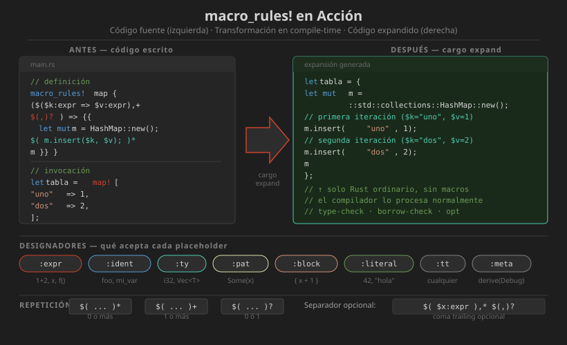

# 📖 Macros Declarativas con `macro_rules!`

## ¿Qué es `macro_rules!`?

`macro_rules!` es el sistema de macros declarativas de Rust. Funciona mediante **patrones de matching** sobre tokens, similar a un `match` pero para código fuente.

```rust
// Sintaxis básica
macro_rules! nombre_macro {
    // rama 1: si el input coincide con patrón1, expande a expansión1
    (patrón1) => { expansión1 };

    // rama 2: si el input coincide con patrón2, expande a expansión2
    (patrón2) => { expansión2 };
}
```

---

## Designadores de Fragmento

Los designadores indican qué tipo de token se espera en cada posición:

| Designador | Acepta | Ejemplo de uso |
|------------|--------|----------------|
| `expr` | Expresión | `$e:expr` → `1 + 2`, `x`, `f()` |
| `stmt` | Statement | `$s:stmt` → `let x = 1;` |
| `ty` | Tipo | `$t:ty` → `i32`, `Vec<String>` |
| `ident` | Identificador | `$n:ident` → `foo`, `mi_var` |
| `pat` | Patrón | `$p:pat` → `Some(x)`, `(a, b)` |
| `path` | Path | `$p:path` → `std::io::Error` |
| `block` | Bloque `{}` | `$b:block` → `{ x + 1 }` |
| `item` | Item Rust | `$i:item` → `fn foo() {}` |
| `meta` | Meta atributo | `$m:meta` → `derive(Debug)` |
| `tt` | Token árbol | `$t:tt` → cualquier token |
| `literal` | Literal | `$l:literal` → `42`, `"hola"` |
| `lifetime` | Lifetime | `$l:lifetime` → `'a`, `'static` |
| `vis` | Visibilidad | `$v:vis` → `pub`, `` (vacío) |

---

## Primera Macro: `saludar!`

```rust
/// Imprime un saludo personalizado.
///
/// # Examples
/// ```
/// saludar!("Mundo");
/// saludar!("Rust", "desde Semana 18");
/// ```
macro_rules! saludar {
    // Rama 1: solo nombre
    ($nombre:expr) => {
        println!("¡Hola, {}!", $nombre);
    };

    // Rama 2: nombre y contexto
    ($nombre:expr, $contexto:expr) => {
        println!("¡Hola, {}! — {}", $nombre, $contexto);
    };
}

fn main() {
    saludar!("Mundo");               // ¡Hola, Mundo!
    saludar!("Rust", "desde Semana 18");  // ¡Hola, Rust! — desde Semana 18
}
```

---

## Repetición en Macros

La repetición es una de las características más poderosas de `macro_rules!`:

```
$(patrón)sep?  operador
     │          │
     │          ├── * → 0 o más veces
     │          ├── + → 1 o más veces
     │          └── ? → 0 o 1 vez (no acepta separador)
     │
     └── sep: separador opcional (ej: `,`, `;`)
```

```rust
/// Crea un HashMap con pares clave-valor.
///
/// # Examples
/// ```
/// let m = map!{ "uno" => 1, "dos" => 2 };
/// assert_eq!(m["uno"], 1);
/// ```
macro_rules! map {
    // Acepta 0 o más pares clave => valor separados por coma
    // La coma final es opcional gracias a $(,)?
    ($($clave:expr => $valor:expr),* $(,)?) => {{
        let mut m = std::collections::HashMap::new();
        $(
            m.insert($clave, $valor);
        )*
        m
    }};
}

fn main() {
    let vacío = map!{};                         // HashMap vacío
    let uno = map!{ "a" => 1 };                 // un par
    let varios = map!{
        "x" => 10,
        "y" => 20,
        "z" => 30,   // coma final permitida
    };
}
```

---

## Diagrama: Flujo de Matching en macro_rules!



---

## Macros Recursivas

Las macros pueden llamarse a sí mismas para procesar listas de argumentos:

```rust
/// Calcula el máximo de 2 o más valores.
///
/// # Examples
/// ```
/// assert_eq!(maximo!(3, 1, 4, 1, 5, 9), 9);
/// ```
macro_rules! maximo {
    // Caso base: un solo elemento
    ($x:expr) => { $x };

    // Caso recursivo: comparar primero con el máximo del resto
    ($x:expr, $($resto:expr),+) => {
        {
            let primero = $x;
            let max_resto = maximo!($($resto),+);  // llamada recursiva
            if primero > max_resto { primero } else { max_resto }
        }
    };
}

fn main() {
    let m = maximo!(3, 7, 1, 9, 2);
    assert_eq!(m, 9);
}
```

---

## Exportar Macros

### Macros dentro del mismo crate

```rust
// Accesibles en el mismo crate automáticamente
macro_rules! mi_macro { ... }
```

### Exportar a otros crates

```rust
// En src/lib.rs — exportar la macro
#[macro_export]
macro_rules! map {
    ...
}
```

```rust
// En el crate consumidor
use mi_crate::map;  // desde Rust 2018+
// o
#[macro_use]
extern crate mi_crate;  // estilo antiguo, evitar
```

---

## Depuración con `cargo expand`

```bash
# Ver la expansión de todas las macros
cargo expand

# Ver expansión de un módulo específico
cargo expand mi_modulo

# Instalar si no está disponible (versión exacta)
cargo install cargo-expand@1.0.95
```

Ejemplo de expansión:

```rust
// Antes de expansión
let v = vec![1, 2, 3];

// Después de expansión (lo que ve el compilador)
let v = {
    let mut v = ::std::vec::Vec::new();
    v.push(1);
    v.push(2);
    v.push(3);
    v
};
```

---

## Restricciones de Seguimiento

Algunos designadores tienen restricciones sobre qué tokens pueden seguirles:

| Designador | Puede seguirle |
|------------|----------------|
| `expr` | `=>`, `,`, `;` |
| `stmt` | `=>`, `,`, `;` |
| `ty` | `{`, `[`, `=>`, `,`, `;`, `|`, `as`, `where` |
| `ident` | Cualquier token |
| `pat` | `=>`, `,`, `=`, `|`, `if`, `in` |
| `path` | `{`, `[`, `=>`, `,`, `;`, `|` |

```rust
// ❌ Error: expr no puede seguir de 'as'
macro_rules! mal {
    ($e:expr as $t:ty) => { ... }
}

// ✅ Correcto: usar 'tt' cuando se necesita más flexibilidad
macro_rules! bien {
    ($e:tt as $t:ty) => { ($e as $t) }
}
```

---

## Patron: Crear Estructuras con Macros

```rust
/// Genera implementaciones de conversión de/hacia String para un enum.
macro_rules! impl_display_enum {
    (
        enum $nombre:ident {
            $($variante:ident => $texto:literal),* $(,)?
        }
    ) => {
        impl std::fmt::Display for $nombre {
            fn fmt(&self, f: &mut std::fmt::Formatter<'_>) -> std::fmt::Result {
                match self {
                    $(Self::$variante => write!(f, $texto),)*
                }
            }
        }

        impl std::str::FromStr for $nombre {
            type Err = String;

            fn from_str(s: &str) -> Result<Self, Self::Err> {
                match s {
                    $($texto => Ok(Self::$variante),)*
                    otro => Err(format!("valor inválido: {}", otro)),
                }
            }
        }
    };
}

#[derive(Debug)]
enum Color { Rojo, Verde, Azul }

impl_display_enum! {
    enum Color {
        Rojo  => "rojo",
        Verde => "verde",
        Azul  => "azul",
    }
}
```

---

## Errores Comunes

```rust
// ❌ Olvidar el punto y coma en la expansión
macro_rules! mal {
    ($x:expr) => {
        let y = $x    // falta ;
        y + 1
    }
}

// ❌ Asumir que $x:expr puede seguirse de cualquier token
macro_rules! tambien_mal {
    ($a:expr $b:expr) => { ... }  // error: expr debe separarse
}

// ✅ Siempre incluir separador entre fragmentos
macro_rules! bien {
    ($a:expr, $b:expr) => { $a + $b }
}
```

---

## Resumen

`macro_rules!` permite crear macros declarativas mediante patrones de matching sobre tokens. Las características clave son: designadores de fragmento (`:expr`, `:ident`, etc.), repetición con `$()*`, `$()+`, `$(...)?`, y recursión. Las macros son higiénicas y pueden exportarse con `#[macro_export]`.

---

## Siguiente Paso

Continúa con [03-proc-macros-intro.md](03-proc-macros-intro.md) para conocer las macros procedurales, más potentes pero también más complejas.
