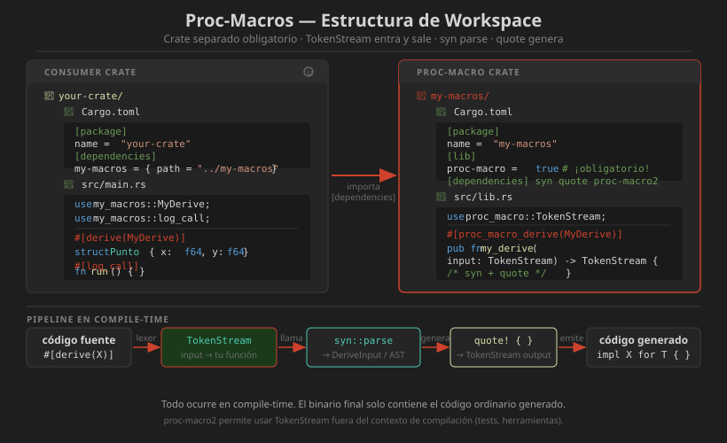

# 📖 Proc-Macros: Introducción

## ¿Qué son las Proc-Macros?

Las **macros procedurales** (proc-macros) son funciones Rust que reciben código como entrada (`TokenStream`) y producen código como salida (`TokenStream`). Son más potentes que `macro_rules!` porque pueden ejecutar lógica arbitraria de Rust durante la compilación.

```
  Código fuente                  Código generado
  ┌──────────────┐   TokenStream  ┌──────────────────┐
  │ #[derive(    │ ─────────────▶ │  fn (función      │
  │   MiDerive   │                │  proc-macro)      │
  │ )]           │                │  {               │
  │ struct Foo { │ ◀───────────── │    analiza +     │
  │   x: i32,    │  nuevo         │    genera código  │
  │ }            │  TokenStream   │  }               │
  └──────────────┘                └──────────────────┘
```

---

## Los Tres Tipos de Proc-Macros

### 1. Custom Derive

Añade implementaciones de traits a structs/enums:

```rust
#[derive(Debug, Clone, MiDerive)]  // ← Custom Derive
struct Punto {
    x: f64,
    y: f64,
}
```

### 2. Attribute Macros

Transforman cualquier item de Rust (funciones, structs, módulos):

```rust
#[tokio::main]        // ← Attribute macro
#[route(GET, "/")]    // ← Attribute macro con argumentos
async fn index() -> &'static str {
    "Hello"
}
```

### 3. Function-like Macros

Se invocan como funciones pero procesan tokens arbitrarios:

```rust
let query = sql!(SELECT * FROM users WHERE id = ?);
let html = html! { <div>{ content }</div> };
```

---

## Regla Fundamental: Crate Separado Obligatorio

Las proc-macros **deben** estar en su propio crate con `proc-macro = true`. Esta es una restricción del compilador, no una convención:

```
workspace/
├── Cargo.toml               ← workspace root
├── mi-crate/                ← crate consumidor
│   ├── Cargo.toml
│   └── src/
│       └── main.rs
└── mi-crate-derive/         ← crate proc-macro (SEPARADO, obligatorio)
    ├── Cargo.toml           ← [lib] proc-macro = true
    └── src/
        └── lib.rs
```

```toml
# mi-crate-derive/Cargo.toml
[package]
name    = "mi-crate-derive"
version = "0.1.0"
edition = "2021"

[lib]
proc-macro = true          # ← OBLIGATORIO

[dependencies]
syn         = { version = "2.0.101", features = ["full"] }
quote       = "1.0.40"
proc-macro2 = "1.0.95"
```

---

## El TokenStream

`TokenStream` es la unidad de trabajo de todas las proc-macros. Representa una secuencia de **tokens** (identificadores, literales, puntuación, grupos):

```rust
// Este código fuente...
struct Punto { x: f64 }

// ...se convierte en tokens:
// struct  Punto  {  x  :  f64  }
//   │       │    │  │  │   │   │
// Ident  Ident  Gr Ident  : Type  Gr
```

### TokenStream vs proc-macro2

| `proc_macro` | `proc_macro2` |
|--------------|---------------|
| Solo usable en proc-macro crates | Usable en cualquier crate |
| Proporcionado por el compilador | Crate de la comunidad |
| No testeable unitariamente | ✅ Testeable con `#[test]` |
| Obligatorio en la firma pública | Usar internamente con `proc_macro2` |

---

## Diagrama Visual



---

## Las Dependencias Esenciales

### `syn` — Parsing

`syn` parsea un `TokenStream` en un árbol de sintaxis estructurado (AST):

```rust
use syn::{parse_macro_input, DeriveInput};

#[proc_macro_derive(MiDerive)]
pub fn mi_derive(input: proc_macro::TokenStream) -> proc_macro::TokenStream {
    // parse_macro_input convierte TokenStream → DeriveInput (AST)
    let ast = parse_macro_input!(input as DeriveInput);

    // ast.ident  → nombre del struct/enum
    // ast.data   → campos del struct o variantes del enum
    // ast.generics → parámetros genéricos
    // ast.attrs  → atributos (#[...])

    todo!()
}
```

### `quote` — Generación de código

`quote!` construye un `TokenStream` a partir de código Rust interpolado:

```rust
use quote::quote;

let nombre = &ast.ident;  // el Ident "Punto"

// quote! genera tokens de Rust con interpolación con #variable
let codigo_generado = quote! {
    impl MiTrait for #nombre {
        fn describir(&self) -> String {
            format!("Soy un {}", stringify!(#nombre))
        }
    }
};
```

### `proc-macro2` — Compatibilidad y testing

```rust
use proc_macro2::TokenStream as TokenStream2;

// Usar proc_macro2::TokenStream internamente
fn impl_mi_derive(ast: &DeriveInput) -> TokenStream2 {
    let nombre = &ast.ident;
    quote! {
        impl MiTrait for #nombre { ... }
    }
}

// Convertir en la función pública
#[proc_macro_derive(MiDerive)]
pub fn mi_derive(input: proc_macro::TokenStream) -> proc_macro::TokenStream {
    let ast = parse_macro_input!(input as DeriveInput);
    impl_mi_derive(&ast).into()  // TokenStream2 → TokenStream
}
```

---

## Ciclo Completo: Hello World de Proc-Macro

### Paso 1: Crear el workspace

```toml
# Cargo.toml (raíz del workspace)
[workspace]
members = [
    "hello-derive",
    "hello-app",
]
resolver = "2"
```

### Paso 2: Crear el crate proc-macro

```toml
# hello-derive/Cargo.toml
[package]
name    = "hello-derive"
version = "0.1.0"
edition = "2021"

[lib]
proc-macro = true

[dependencies]
syn   = { version = "2.0.101", features = ["full"] }
quote = "1.0.40"
```

```rust
// hello-derive/src/lib.rs
use proc_macro::TokenStream;
use quote::quote;
use syn::{parse_macro_input, DeriveInput};

#[proc_macro_derive(Hello)]
pub fn hello_derive(input: TokenStream) -> TokenStream {
    let ast = parse_macro_input!(input as DeriveInput);
    let nombre = &ast.ident;

    let expanded = quote! {
        impl Hello for #nombre {
            fn hello(&self) -> String {
                format!("¡Hola desde {}!", stringify!(#nombre))
            }
        }
    };

    expanded.into()
}
```

### Paso 3: Usar la macro en el crate consumidor

```toml
# hello-app/Cargo.toml
[package]
name    = "hello-app"
version = "0.1.0"
edition = "2021"

[dependencies]
hello-derive = { path = "../hello-derive" }
```

```rust
// hello-app/src/main.rs
use hello_derive::Hello;

trait Hello {
    fn hello(&self) -> String;
}

#[derive(Hello)]
struct MiStruct;

fn main() {
    let s = MiStruct;
    println!("{}", s.hello());  // ¡Hola desde MiStruct!
}
```

---

## Errores y Diagnósticos

Las proc-macros pueden emitir errores con ubicación precisa:

```rust
use proc_macro::TokenStream;
use syn::{parse_macro_input, DeriveInput, Error};

#[proc_macro_derive(MiDerive)]
pub fn mi_derive(input: TokenStream) -> TokenStream {
    let ast = parse_macro_input!(input as DeriveInput);

    // Validar que solo aplica a structs
    match &ast.data {
        syn::Data::Struct(_) => { /* OK */ }
        _ => {
            // Error con span correcto — apunta al código del usuario
            return Error::new_spanned(
                &ast.ident,
                "MiDerive solo puede aplicarse a structs"
            )
            .to_compile_error()
            .into();
        }
    }

    todo!()
}
```

---

## Herramientas de Desarrollo

```bash
# Expandir macros para ver el código generado
cargo expand -p mi-crate

# Expandir un item específico
cargo expand -p mi-crate::mi_modulo

# Tests de la proc-macro (requiere proc_macro2)
cargo test -p mi-crate-derive

# Ver tokens del input con eprintln en la macro
eprintln!("INPUT: {:#?}", &ast);  // solo durante desarrollo
```

---

## Resumen

Las proc-macros son funciones Rust que transforman `TokenStream → TokenStream` en tiempo de compilación. Deben vivir en un crate separado con `proc-macro = true`. Las tres herramientas clave son: `syn` (parsing), `quote` (generación de código) y `proc-macro2` (compatibilidad y testing).

---

## Siguiente Paso

Continúa con [04-derive-macros.md](04-derive-macros.md) para implementar un `#[derive]` macro completo usando `syn` y `quote`.
