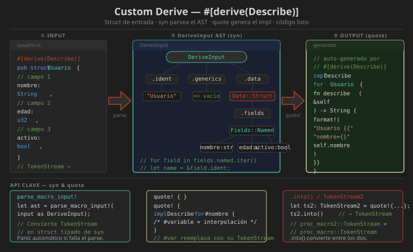

# 📖 Custom Derive Macros con `syn` y `quote`

## Objetivo

Implementar un `#[derive(Describe)]` que genera automáticamente el método `fn describe(&self) -> String` para cualquier struct, listando el nombre del tipo y sus campos.

---

## Anatomía de un Custom Derive

```
  #[derive(Describe)]        ← invoca la proc-macro
  struct Usuario {
      nombre: String,        ← campos que procesará syn
      edad: u32,
  }

  ↓ el compilador genera automáticamente ↓

  impl Describe for Usuario {
      fn describe(&self) -> String {
          format!("Usuario {{ nombre: {:?}, edad: {:?} }}",
                  self.nombre, self.edad)
      }
  }
```

---

## Estructura del Workspace

```
semana-18-derive/
├── Cargo.toml                    ← workspace
├── describe-derive/              ← crate proc-macro
│   ├── Cargo.toml
│   └── src/
│       └── lib.rs
└── describe-app/                 ← crate consumidor
    ├── Cargo.toml
    └── src/
        └── main.rs
```

```toml
# Cargo.toml (workspace raíz)
[workspace]
members = ["describe-derive", "describe-app"]
resolver = "2"
```

---

## Paso 1: El Crate Proc-Macro

```toml
# describe-derive/Cargo.toml
[package]
name    = "describe-derive"
version = "0.1.0"
edition = "2021"

[lib]
proc-macro = true

[dependencies]
syn         = { version = "2.0.101", features = ["full"] }
quote       = "1.0.40"
proc-macro2 = "1.0.95"
```

---

## Paso 2: Implementar el Derive

```rust
// describe-derive/src/lib.rs
use proc_macro::TokenStream;
use proc_macro2::TokenStream as TokenStream2;
use quote::quote;
use syn::{parse_macro_input, Data, DeriveInput, Fields};

/// Punto de entrada de la proc-macro — firma obligatoria
#[proc_macro_derive(Describe)]
pub fn describe_derive(input: TokenStream) -> TokenStream {
    // 1. Parsear el TokenStream en un AST estructurado
    let ast = parse_macro_input!(input as DeriveInput);

    // 2. Delegar la lógica a una función con proc_macro2 (testeable)
    impl_describe(&ast).into()
}

fn impl_describe(ast: &DeriveInput) -> TokenStream2 {
    let nombre = &ast.ident;  // Ident del tipo: "Usuario", "Punto", etc.

    // 3. Extraer los campos según el tipo de data
    let campos = match &ast.data {
        Data::Struct(data_struct) => {
            match &data_struct.fields {
                // Campos con nombre: struct Foo { x: i32, y: i32 }
                Fields::Named(fields) => {
                    let partes: Vec<TokenStream2> = fields
                        .named
                        .iter()
                        .map(|f| {
                            let campo_nombre = f.ident.as_ref().unwrap();
                            let campo_str = campo_nombre.to_string();
                            quote! {
                                format!("{}: {:?}", #campo_str, self.#campo_nombre)
                            }
                        })
                        .collect();

                    quote! {
                        vec![#(#partes),*].join(", ")
                    }
                }

                // Campos posicionales: struct Foo(i32, i32)
                Fields::Unnamed(fields) => {
                    let partes: Vec<TokenStream2> = fields
                        .unnamed
                        .iter()
                        .enumerate()
                        .map(|(i, _)| {
                            let idx = syn::Index::from(i);
                            quote! {
                                format!("{}: {:?}", #i, self.#idx)
                            }
                        })
                        .collect();

                    quote! {
                        vec![#(#partes),*].join(", ")
                    }
                }

                // Sin campos: struct Foo;
                Fields::Unit => quote! { String::new() },
            }
        }

        // Solo soportamos structs en esta práctica
        _ => {
            return syn::Error::new_spanned(
                nombre,
                "Describe solo puede derivarse en structs",
            )
            .to_compile_error();
        }
    };

    let nombre_str = nombre.to_string();

    // 4. Generar el código con quote!
    quote! {
        impl Describe for #nombre {
            fn describe(&self) -> String {
                let campos = #campos;
                if campos.is_empty() {
                    format!("{}", #nombre_str)
                } else {
                    format!("{} {{ {} }}", #nombre_str, campos)
                }
            }
        }
    }
}
```

---

## Diagrama Visual



---

## Paso 3: El Crate Consumidor

```toml
# describe-app/Cargo.toml
[package]
name    = "describe-app"
version = "0.1.0"
edition = "2021"

[dependencies]
describe-derive = { path = "../describe-derive" }
```

```rust
// describe-app/src/main.rs
use describe_derive::Describe;

/// Trait que la macro implementará automáticamente
pub trait Describe {
    fn describe(&self) -> String;
}

#[derive(Describe, Debug)]
struct Usuario {
    nombre: String,
    edad: u32,
    activo: bool,
}

#[derive(Describe, Debug)]
struct Punto(f64, f64);

#[derive(Describe, Debug)]
struct Marcador;

fn main() {
    let u = Usuario {
        nombre: String::from("Ana"),
        edad: 30,
        activo: true,
    };
    println!("{}", u.describe());
    // Usuario { nombre: "Ana", edad: 30, activo: true }

    let p = Punto(3.14, 2.71);
    println!("{}", p.describe());
    // Punto { 0: 3.14, 1: 2.71 }

    let m = Marcador;
    println!("{}", m.describe());
    // Marcador
}
```

---

## Navegar el AST con `syn`

Los tipos más importantes de `syn`:

```rust
// DeriveInput — el struct/enum completo
pub struct DeriveInput {
    pub attrs: Vec<Attribute>,   // #[derive(...)] y otros atributos
    pub vis: Visibility,         // pub, pub(crate), etc.
    pub ident: Ident,            // nombre del tipo
    pub generics: Generics,      // <T>, <'a, T: Clone>, etc.
    pub data: Data,              // el contenido
}

// Data — qué tipo de item es
pub enum Data {
    Struct(DataStruct),   // struct { campos }
    Enum(DataEnum),       // enum { variante1, variante2 }
    Union(DataUnion),     // union (poco común)
}

// Fields — cómo son los campos
pub enum Fields {
    Named(FieldsNamed),       // { x: i32, y: i32 }
    Unnamed(FieldsUnnamed),   // (i32, i32)
    Unit,                     // sin campos
}
```

---

## Manejar Generics

Para que el derive funcione en tipos genéricos:

```rust
// #[derive(Describe)]
// struct Caja<T: Debug> { valor: T }
//
// debe generar:
// impl<T: Debug> Describe for Caja<T> { ... }

fn impl_describe(ast: &DeriveInput) -> TokenStream2 {
    let nombre = &ast.ident;
    let (impl_generics, ty_generics, where_clause) =
        ast.generics.split_for_impl();

    quote! {
        impl #impl_generics Describe for #nombre #ty_generics
        #where_clause
        {
            fn describe(&self) -> String {
                format!("{}", stringify!(#nombre))
            }
        }
    }
}
```

---

## Testing de Proc-Macros con `trybuild`

```toml
# describe-derive/Cargo.toml
[dev-dependencies]
trybuild = "1.0.105"
```

```rust
// describe-derive/tests/derive_test.rs
#[test]
fn test_casos_validos() {
    let t = trybuild::TestCases::new();
    t.pass("tests/ui/pass/*.rs");    // deben compilar
    t.compile_fail("tests/ui/fail/*.rs");  // deben fallar con error
}
```

---

## Convenciones de Nomenclatura

| Crate | Nombre convencional |
|-------|---------------------|
| Crate principal | `mi-crate` |
| Crate proc-macro | `mi-crate-derive` |
| Crate proc-macro (alt.) | `mi-crate-macros` |

---

## Resumen

Un custom derive recibe un `DeriveInput` del que extraemos `ident`, `data` y `generics`. Usamos `syn` para navegar el AST y `quote!` para generar el código de implementación. Las funciones internas deben usar `proc_macro2::TokenStream` para ser testeables.

---

## Siguiente Paso

Continúa con [05-macros-avanzadas.md](05-macros-avanzadas.md) para aprender attribute macros y function-like proc-macros.
