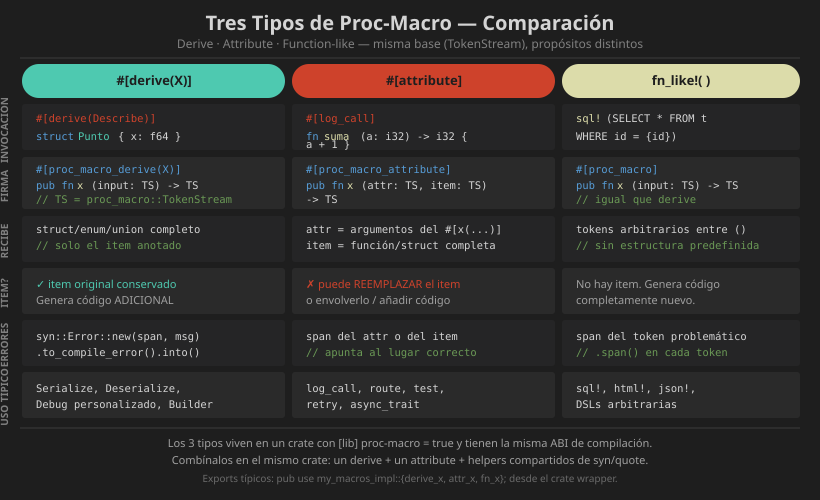

# 📖 Macros Avanzadas: Attribute y Function-like

## Attribute Macros

Las macros de atributo se aplican a cualquier item de Rust (funciones, structs, módulos, impls) y pueden **transformar completamente** el item al que se aplican.

```rust
// El item original...
#[log_call]
fn suma(a: i32, b: i32) -> i32 {
    a + b
}

// ...se transforma en algo como:
fn suma(a: i32, b: i32) -> i32 {
    println!("[LOG] llamando suma(a={:?}, b={:?})", a, b);
    let resultado = { a + b };
    println!("[LOG] suma retorna {:?}", resultado);
    resultado
}
```

---

## Firma de una Attribute Macro

```rust
// La firma tiene DOS TokenStreams de entrada:
// - attr: los argumentos del atributo #[mi_attr(ESTOS ARGUMENTOS)]
// - item: el código del item al que se aplica

#[proc_macro_attribute]
pub fn mi_attr(
    attr: proc_macro::TokenStream,   // argumentos del atributo
    item: proc_macro::TokenStream,   // el item transformado
) -> proc_macro::TokenStream {
    // retorna el item modificado (o completamente nuevo)
    todo!()
}
```

---

## Ejemplo: `#[log_call]`

```rust
// log-macro/src/lib.rs
use proc_macro::TokenStream;
use proc_macro2::TokenStream as TokenStream2;
use quote::quote;
use syn::{parse_macro_input, ItemFn};

#[proc_macro_attribute]
pub fn log_call(
    _attr: TokenStream,   // sin argumentos en esta versión
    item: TokenStream,
) -> TokenStream {
    let funcion = parse_macro_input!(item as ItemFn);
    impl_log_call(funcion).into()
}

fn impl_log_call(mut funcion: ItemFn) -> TokenStream2 {
    let nombre_fn = &funcion.sig.ident;
    let nombre_str = nombre_fn.to_string();

    // Extraer el cuerpo original de la función
    let cuerpo_original = &funcion.block;

    // Construir el nuevo cuerpo con logging
    let nuevo_cuerpo = quote! {
        {
            println!("[LOG] → {}", #nombre_str);
            let __resultado = #cuerpo_original;
            println!("[LOG] ← {} = {:?}", #nombre_str, &__resultado);
            __resultado
        }
    };

    // Reemplazar el bloque de la función
    funcion.block = syn::parse2(nuevo_cuerpo).unwrap();

    quote! { #funcion }
}
```

---

## Attribute Macro con Argumentos

```rust
// Uso: #[retry(times = 3, delay_ms = 100)]
#[proc_macro_attribute]
pub fn retry(attr: TokenStream, item: TokenStream) -> TokenStream {
    // Parsear los argumentos del atributo
    let args = parse_macro_input!(attr as RetryArgs);
    let funcion = parse_macro_input!(item as ItemFn);
    impl_retry(args, funcion).into()
}

// Definir la estructura de argumentos
struct RetryArgs {
    times: u32,
    delay_ms: u64,
}

// Implementar el parsing manual de argumentos
impl syn::parse::Parse for RetryArgs {
    fn parse(input: syn::parse::ParseStream<'_>) -> syn::Result<Self> {
        let mut times = 3u32;
        let mut delay_ms = 0u64;

        while !input.is_empty() {
            let clave: syn::Ident = input.parse()?;
            let _: syn::Token![=] = input.parse()?;

            match clave.to_string().as_str() {
                "times" => {
                    let lit: syn::LitInt = input.parse()?;
                    times = lit.base10_parse()?;
                }
                "delay_ms" => {
                    let lit: syn::LitInt = input.parse()?;
                    delay_ms = lit.base10_parse()?;
                }
                otro => {
                    return Err(syn::Error::new(
                        clave.span(),
                        format!("argumento desconocido: {}", otro),
                    ));
                }
            }

            // Consumir coma separadora si hay más argumentos
            if input.peek(syn::Token![,]) {
                let _: syn::Token![,] = input.parse()?;
            }
        }

        Ok(RetryArgs { times, delay_ms })
    }
}
```

---

## Diagrama Visual



---

## Function-like Proc-Macros

Se invocan con la sintaxis de llamada a macro `nombre!(...)` pero procesan tokens arbitrarios (pueden no ser código Rust válido):

```rust
#[proc_macro]
pub fn sql(input: TokenStream) -> TokenStream {
    // input puede ser: SELECT * FROM users WHERE id = ?
    // que no es código Rust válido pero la macro lo interpreta
    let tokens: Vec<_> = input.into_iter().collect();
    // ... procesar tokens y generar código Rust
    todo!()
}
```

```rust
// Uso en el crate consumidor
let query = sql!(SELECT nombre, edad FROM usuarios WHERE activo = true);
// La macro puede generar código de validación en compilación
// y retornar un objeto Query tipado
```

---

## Attribute Macro en Structs

```rust
// builder-macro/src/lib.rs — genera un Builder pattern automáticamente

#[proc_macro_attribute]
pub fn builder(_attr: TokenStream, item: TokenStream) -> TokenStream {
    let input = parse_macro_input!(item as DeriveInput);
    impl_builder(&input).into()
}

fn impl_builder(ast: &DeriveInput) -> TokenStream2 {
    let nombre = &ast.ident;
    let builder_nombre = format_ident!("{}Builder", nombre);

    let campos = match &ast.data {
        syn::Data::Struct(s) => match &s.fields {
            syn::Fields::Named(f) => &f.named,
            _ => panic!("builder solo soporta structs con campos nombrados"),
        },
        _ => panic!("builder solo soporta structs"),
    };

    // Generar campos Option<T> para el builder
    let campos_builder = campos.iter().map(|f| {
        let nombre = &f.ident;
        let tipo = &f.ty;
        quote! { #nombre: Option<#tipo> }
    });

    // Generar setters
    let setters = campos.iter().map(|f| {
        let nombre = &f.ident;
        let tipo = &f.ty;
        quote! {
            pub fn #nombre(mut self, val: #tipo) -> Self {
                self.#nombre = Some(val);
                self
            }
        }
    });

    // Generar método build()
    let asignaciones = campos.iter().map(|f| {
        let nombre = &f.ident;
        let nombre_str = nombre.as_ref().unwrap().to_string();
        quote! {
            #nombre: self.#nombre.ok_or(format!("campo {} no establecido", #nombre_str))?
        }
    });

    let campos_none = campos.iter().map(|f| {
        let nombre = &f.ident;
        quote! { #nombre: None }
    });

    quote! {
        // Mantener el struct original
        #ast

        // Generar el Builder
        pub struct #builder_nombre {
            #(#campos_builder,)*
        }

        impl #builder_nombre {
            pub fn new() -> Self {
                Self { #(#campos_none,)* }
            }

            #(#setters)*

            pub fn build(self) -> Result<#nombre, String> {
                Ok(#nombre {
                    #(#asignaciones,)*
                })
            }
        }

        impl #nombre {
            pub fn builder() -> #builder_nombre {
                #builder_nombre::new()
            }
        }
    }
}
```

---

## `format_ident!` — Crear Identificadores

```rust
use quote::format_ident;

let nombre = &ast.ident;  // "Usuario"

let getter = format_ident!("get_{}", nombre);  // "get_Usuario"
let builder = format_ident!("{}Builder", nombre);  // "UsuarioBuilder"
let test_fn = format_ident!("test_{}", nombre.to_string().to_lowercase());
```

---

## Comparación: Tres tipos de Proc-Macros

| Característica | Custom Derive | Attribute | Function-like |
|----------------|---------------|-----------|---------------|
| Firma `attr` arg | ❌ No | ✅ Sí | ❌ No |
| Firma `item` arg | ✅ Sí | ✅ Sí | ❌ No |
| Firma `input` arg | ❌ No | ❌ No | ✅ Sí |
| Aplica a | Structs/Enums | Cualquier item | Cualquier tokens |
| Puede reemplazar item | ❌ Solo añade | ✅ Sí | N/A |
| Decorador `#[proc_macro_*]` | `_derive` | `_attribute` | `_` |

---

## Errores y Spans

```rust
use proc_macro2::Span;
use syn::Error;

// Error genérico (apunta al inicio del archivo)
return Error::new(Span::call_site(), "mensaje de error").to_compile_error().into();

// Error con span específico (apunta al token problemático)
return Error::new_spanned(&campo.ident, "este campo no es válido").to_compile_error().into();

// Múltiples errores acumulados (mejor UX)
let mut errores = Vec::new();
// ... recopilar errores ...
if !errores.is_empty() {
    let combined = errores.into_iter()
        .reduce(|mut a, b| { a.combine(b); a })
        .unwrap();
    return combined.to_compile_error().into();
}
```

---

## Buenas Prácticas

```rust
// ✅ Separar la lógica de la firma pública (para tests)
#[proc_macro_attribute]
pub fn mi_attr(attr: TokenStream, item: TokenStream) -> TokenStream {
    let parsed = parse_macro_input!(item as ItemFn);
    impl_mi_attr(attr.into(), parsed)
        .unwrap_or_else(|e| e.to_compile_error())
        .into()
}

fn impl_mi_attr(
    attr: TokenStream2,
    item: ItemFn,
) -> Result<TokenStream2, syn::Error> {
    // lógica testeable aquí
    todo!()
}
```

---

## Resumen

Las macros de atributo reciben dos `TokenStream`: los argumentos del atributo y el item transformado. Las function-like proc-macros procesan tokens arbitrarios. Ambas pueden transformar completamente el código de entrada. Las buenas prácticas incluyen separar la lógica en funciones testeables con `proc_macro2` y emitir errores con spans precisos.

---

## Próximo Nivel

Con estas bases estás listo para explorar:
- [darling](https://docs.rs/darling) — parsing ergonómico de atributos
- [trybuild](https://docs.rs/trybuild) — testing de errores de compilación
- [proc-macro-error](https://docs.rs/proc-macro-error) — manejo de errores mejorado
